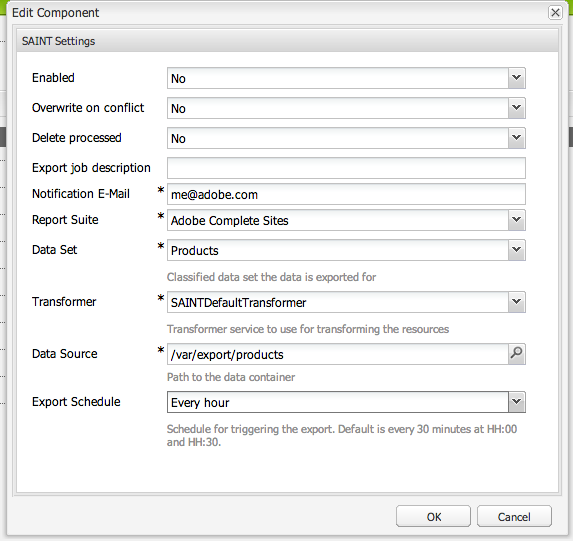

# Adobe-classificaties{#adobe-classifications}

>[!CAUTION]
>
>AEM 6.4 heeft het einde van de uitgebreide ondersteuning bereikt en deze documentatie wordt niet meer bijgewerkt. Raadpleeg voor meer informatie onze [technische ondersteuningsperioden](https://helpx.adobe.com/support/programs/eol-matrix.html). Ondersteunde versies zoeken [hier](https://experienceleague.adobe.com/docs/).

Adobe Classificaties exporteren classificatiegegevens naar [Adobe Analytics](/help/sites-administering/adobeanalytics.md) op een geplande manier. De exporteur is een **com.adobe.cq.scheduled.exporter.Exporter**.

Om dit te vormen:

1. Navigeren via **Gereedschappen, wolkendiensten** aan de **Adobe Analytics** sectie.
1. Voeg een nieuwe configuratie toe. U zult zien dat de **Adobe Analytics-classificaties** De malplaatjevertoningen van de configuratie onder **Adobe Analytics Framework** configuratie. Een **Titel** en **Naam** indien vereist:

   

1. Klikken **Maken** om de instellingen te configureren.

   

   Tot de eigenschappen behoren:

   | **Veld** | **Beschrijving** |
   |---|---|
   | Ingeschakeld | Selecteren **Ja** om de instellingen voor Adobe-classificaties in te schakelen. |
   | Overschrijven bij conflict | Selecteren **Ja** om eventuele gegevensbotsingen te overschrijven. Standaard is deze ingesteld op **Nee**. |
   | Verwerkt verwijderen | Indien ingesteld op **Ja** worden verwerkte knooppunten verwijderd nadat deze zijn geëxporteerd. De standaardwaarde is **Onwaar**. |
   | Taakbeschrijving exporteren | Voer een beschrijving in voor de indelingstaak Adobe. |
   | E-mailbericht | Voer een e-mailadres in voor berichten over Adobe-classificaties. |
   | Rapportsuite | Voer de rapportsuite in waarop de importtaak moet worden uitgevoerd. |
   | Gegevensset | Voer de relatie-id van de gegevensset in om de importtaak uit te voeren waarvoor. |
   | Transformer | Selecteer een transformatorimplementatie in het keuzemenu. |
   | Gegevensbron | Navigeer naar het pad voor de gegevenscontainer. |
   | Export Plan | Selecteer het schema voor het exporteren. De standaardwaarde is elke 30 minuten. |

1. Klikken **OK** om uw instellingen op te slaan.

## Paginaformaat wijzigen {#modifying-page-size}

Records worden op pagina&#39;s verwerkt. Standaard worden met Adobe-classificaties pagina&#39;s gemaakt met een paginaformaat van 1000.

Een pagina kan maximaal 25000 pagina&#39;s groot zijn, per definitie in Adobe-classificaties en kan worden gewijzigd vanaf de Felix-console. Tijdens de uitvoer, vergrendelt de Classificaties van de Adobe de bronknoop om gezamenlijke wijzigingen te verhinderen. Het knooppunt wordt ontgrendeld na exporteren, bij een fout of wanneer de sessie wordt gesloten.

Het paginaformaat wijzigen:

1. Navigeer aan de console OSGI bij **https://&lt;host>:&lt;port>/system/console/configMgr** en selecteert u **Adobe AEM Classificaties Exporteur**.

   

1. Werk de **Paginaformaat exporteren** klikt u vervolgens op **Opslaan**.

## SAINTDefaultTransformer {#saintdefaulttransformer}

>[!NOTE]
>
>Adobe Classificaties stond voorheen bekend als de SAINT Exporter.

Een exporteur kan een Transformer gebruiken om de exportgegevens om te zetten in een specifieke indeling. Voor Adobe classificaties, subinterface `SAINTTransformer<String[]>` het uitvoeren van de interface Transformer is verstrekt. Deze interface wordt gebruikt om het gegevenstype te beperken tot `String[]` die door de SAINT API wordt gebruikt en om een markeringsinterface te hebben om dergelijke diensten voor selectie te vinden.

In de standaardimplementatie SAINTDefaultTransformer, worden de kindmiddelen van de exporterbron behandeld als verslagen met bezitsnamen als sleutels en bezitswaarden als waarden. De **Sleutel** kolom wordt automatisch toegevoegd als eerste kolom - zijn waarde zal de knooppuntnaam zijn. Benoemde eigenschappen (bevattende :) worden genegeerd.

*Nodestructuur:*

* id-classificatie `nt:unstructured`

   * 1 `nt:unstructured`

      * Product = Mijn productnaam (Koord)
      * Price = 120.90 (String)
      * Size = M (String)
      * Color = black (String)
      * Color^Code = 101 (String)

**SAINT-koptekst en -record:**

| **Sleutel** | **Product** | **Prijs** | **Grootte** | **Kleur** | **Kleur^code** |
|---|---|---|---|---|---|
| 1 | Mijn productnaam | 120.90 | M | zwart | 101 |

Tot de eigenschappen behoren:

<table> 
 <tbody> 
  <tr> 
   <td><strong>Eigenschappenpad</strong></td> 
   <td><strong>Beschrijving</strong></td> 
  </tr> 
  <tr> 
   <td>transformator</td> 
   <td>Een klassenaam van een SAINTTransformer-implementatie</td> 
  </tr> 
  <tr> 
   <td>email</td> 
   <td>E-mailadres voor melding.</td> 
  </tr> 
  <tr> 
   <td>reportsuites</td> 
   <td>ID's van suite rapporteren waarin de importtaak moet worden uitgevoerd. </td> 
  </tr> 
  <tr> 
   <td>gegevensset</td> 
   <td>Dataset relatie-id om de importtaak uit te voeren voor. </td> 
  </tr> 
  <tr> 
   <td>beschrijving</td> 
   <td>Taakbeschrijving.   </td> 
  </tr> 
  <tr> 
   <td>overschrijven</td> 
   <td>Markering om gegevensbotsingen te overschrijven. Standaard is <strong>false</strong>.</td> 
  </tr> 
  <tr> 
   <td>controledivisies</td> 
   <td>Markering om te controleren of de rapportsuite compatibel is. Standaard is <strong>true</strong>.</td> 
  </tr> 
  <tr> 
   <td>gereduceerd</td> 
   <td>Markering om de verwerkte knooppunten na het exporteren te verwijderen. Standaard is <strong>false</strong>.</td> 
  </tr> 
 </tbody> 
</table>

## Exporteren van Adobe-classificaties automatiseren {#automating-adobe-classifications-export}

U kunt uw eigen workflow maken, zodat bij nieuwe importbewerkingen de workflow wordt gestart om de juiste en correct gestructureerde gegevens te maken in **/var/export/** zodat het kan worden uitgevoerd naar Adobe-classificaties.
