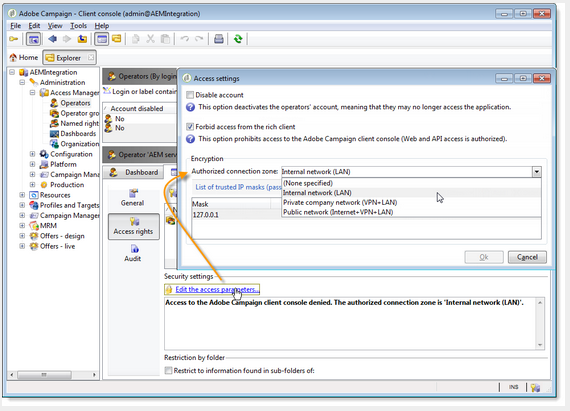
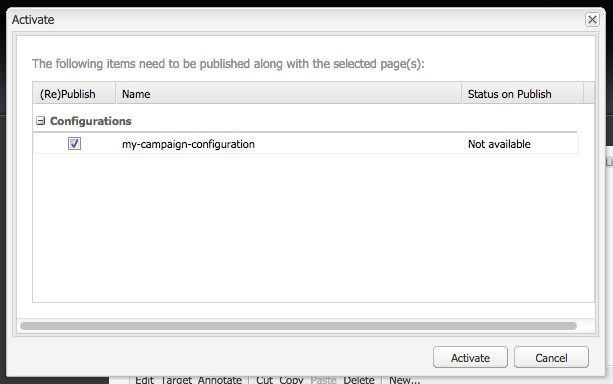
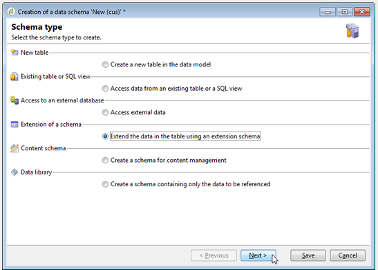

# Integreren met Adobe Campaign Classic{#integrating-with-adobe-campaign-classic}

>[!CAUTION]
>
>AEM 6.4 heeft het einde van de uitgebreide ondersteuning bereikt en deze documentatie wordt niet meer bijgewerkt. Raadpleeg voor meer informatie onze [technische ondersteuningsperioden](https://helpx.adobe.com/support/programs/eol-matrix.html). Ondersteunde versies zoeken [hier](https://experienceleague.adobe.com/docs/).

>[!NOTE]
>
>In deze documentatie wordt beschreven hoe u AEM kunt integreren met Adobe Campaign Classic, de on-premise oplossing. Als u Adobe Campaign Standard gebruikt, zie [Integreren met Adobe Campaign Standard](/help/sites-administering/campaignstandard.md) voor die instructies.

Met Adobe Campaign kunt u inhoud en formulieren voor e-maillevering rechtstreeks in Adobe Experience Manager beheren.

Om beide oplossingen samen tezelfdertijd te gebruiken, moet u hen eerst vormen om met elkaar te verbinden. Dit omvat configuratiestappen in zowel Adobe Campaign als Adobe Experience Manager. Deze stappen worden in dit document uitgebreid beschreven.

Het werken met Adobe Campaign in AEM omvat de mogelijkheid om e-mail via Adobe Campaign te verzenden en wordt beschreven op [Werken met Adobe Campaign](/help/sites-authoring/campaign.md). Dit omvat ook het gebruik van formulieren op AEM pagina&#39;s voor het bewerken van gegevens.

Bovendien kunnen de volgende onderwerpen van belang zijn wanneer het integreren van AEM met [Adobe Campaign](https://helpx.adobe.com/support/campaign/classic.html):

* [Aanbevolen procedures voor e-mailsjablonen](/help/sites-administering/best-practices-for-email-templates.md)
* [Problemen met Adobe Campaign-integratie oplossen](/help/sites-administering/troubleshooting-campaignintegration.md)

Als u uw integratie met Adobe Campaign uitbreidt, wilt u wellicht de volgende pagina&#39;s zien:

* [Aangepaste extensies maken](/help/sites-developing/extending-campaign-extensions.md)
* [Aangepaste formuliertoewijzingen maken](/help/sites-developing/extending-campaign-form-mapping.md)

## Workflow voor AEM en Adobe Campaign-integratie {#aem-and-adobe-campaign-integration-workflow}

In deze sectie wordt een typische workflow beschreven tussen AEM en Adobe Campaign bij het maken van campagnes en het leveren van inhoud.

De typische werkstroom omvat het volgende en wordt in detail beschreven:

1. Begin uw campagne te ontwikkelen (zowel in Adobe Campaign als AEM).
1. Voordat u de inhoud en levering koppelt, past u de inhoud aan in AEM en maakt u een levering in Adobe Campaign.
1. Inhoud en levering koppelen in Adobe Campaign.

### Uw campagne maken {#start-building-your-campaign}

Je begint op elk moment een campagne te ontwikkelen. Voordat u de inhoud met elkaar verbindt, zijn AEM en AC onafhankelijk. Dit betekent dat marketers hun campagnes kunnen beginnen te maken en zich kunnen richten in Adobe Campaign, terwijl makers van inhoud aan het ontwerp werken in AEM.

### Voordat inhoud en levering worden gekoppeld {#before-linking-content-and-delivery}

Voordat u de inhoud koppelt en een leveringsmechanisme maakt, moet u het volgende doen:

**In AEM**

* Personaliseer gebruikend de verpersoonlijkingsgebieden in **Tekst en personalisatie** component

**In Adobe Campaign**

* Een levering van het type maken **aemContent**

### Inhoud koppelen en levering instellen {#linking-content-and-setting-delivery}

Nadat u de inhoud voor het verbinden en levering hebt voorbereid, bepaalt u precies hoe en waar om inhoud te verbinden.

Al deze stappen zijn voltooid in Adobe Campaign.

1. Geef op welke AEM instantie moet worden gebruikt.
1. Synchroniseer de inhoud door op de knop Synchroniseren te klikken.
1. Open de inhoudkiezer om de inhoud te kiezen.

### Als u nog niet eerder hebt AEM {#if-you-are-new-to-aem}

Als u nog niet eerder AEM, zijn de volgende koppelingen wellicht handig voor AEM:

* [AEM starten](/help/sites-deploying/deploy.md)
* [Replicatieagents begrijpen](/help/sites-deploying/replication.md)
* [Logbestanden zoeken en gebruiken](/help/sites-deploying/monitoring-and-maintaining.md#working-with-audit-records-and-log-files)
* [Inleiding tot het AEM Platform](/help/sites-deploying/platform.md)

## Adobe Campaign configureren {#configuring-adobe-campaign}

Bij het configureren van Adobe Campaign gaat het om het volgende:

1. Het integratiepakket voor AEM installeren in Adobe Campaign.
1. Een externe account configureren.
1. Controleren of AEMResourceTypeFilter correct is geconfigureerd.

Bovendien zijn er geavanceerde configuraties die u kunt maken, die omvatten:

* Inhoudsblokken beheren
* Verpersoonlijkingsvelden beheren

Zie [Geavanceerde configuraties](#advanced-configurations).

>[!NOTE]
>
>Als u deze bewerkingen wilt uitvoeren, moet u beschikken over de **administratie** rol in Adobe Campaign.

### Vereisten {#prerequisites}

Zorg ervoor dat u de volgende elementen vooraf hebt:

* [Een AEM-ontwerpinstantie](/help/sites-deploying/deploy.md#getting-started)
* [Een AEM-publicatie-instantie](/help/sites-deploying/deploy.md#author-and-publish-installs)
* [Een Adobe Campaign Classic-instantie](https://helpx.adobe.com/support/campaign/classic.html) - inclusief een client en een server
* Internet Explorer 11

>[!NOTE]
>
>Als u een versie uitvoert die ouder is dan Adobe Campaign Classic versie 8640, raadpleegt u de [upgradedocumentatie](https://docs.campaign.adobe.com/doc/AC6.1/en/PRO_Updating_Adobe_Campaign_Upgrading.html) voor meer informatie . Merk op dat zowel de cliënt als het gegevensbestand aan zelfde bouwstijl moeten worden bevorderd.

>[!CAUTION]
>
>In de [Adobe Campaign configureren](#configuring-adobe-campaign) en [Adobe Experience Manager configureren](#configuring-adobe-experience-manager) -secties zijn nodig om de integratiefuncties tussen AEM en Adobe Campaign correct te laten werken.

### Het AEM integratiepakket installeren {#installing-the-aem-integration-package}

U moet de **AEM integratie** in Adobe Campaign. Dit doet u als volgt:

1. Ga naar de Adobe Campaign-instantie die u wilt koppelen aan AEM.
1. Selecteren *Gereedschappen* > *Geavanceerd* > *Pakket importeren...*.

   

1. Klikken **Een standaardpakket installeren** Selecteer vervolgens de **AEM integratie** pakket.

   

1. Klikken **Volgende** en vervolgens **Start**.

   Dit pakket bevat de **aemserver** -operator die wordt gebruikt om de AEM server aan te sluiten op Adobe Campaign.

   >[!CAUTION]
   >
   >Door gebrek, wordt geen veiligheidsstreek gevormd voor deze exploitant. Als u via AEM verbinding wilt maken met Adobe Campaign, moet u er een selecteren.
   >
   >In de **serverConf.xml** bestand, de **allowUserPassword** moet worden ingesteld op **true** om AEM te autoriseren verbinding te maken met Adobe Campaign via aanmelding/wachtwoord.
   >
   >We raden u ten zeerste aan een beveiligingszone in te stellen die is gewijd aan AEM om beveiligingsproblemen te voorkomen. Raadpleeg voor meer informatie de [Installatiehandleiding](https://docs.campaign.adobe.com/doc/AC/en/INS_Additional_configurations_Configuring_Campaign_server.html).

   

### Een AEM externe account configureren {#configuring-an-aem-external-account}

U moet een externe account configureren waarmee u Adobe Campaign kunt verbinden met uw AEM.

>[!NOTE]
>
>* Wanneer u de **AEM integratie** -pakket wordt een externe AEM gemaakt. U kunt de verbinding met uw AEM instantie van het vormen of nieuwe tot stand brengen.
>* Zorg er AEM voor dat u het wachtwoord voor de externe gebruiker van de campagne instelt. U moet dit wachtwoord instellen om Adobe Campaign te verbinden met AEM. Meld u aan als beheerder en in de beheerconsole van de gebruiker, zoek naar de externe gebruiker van de campagne en klik op **Wachtwoord instellen**.
>


Een externe AEM-account configureren:

1. Ga naar de **Beheer** > **Platform** > **Externe rekeningen** knooppunt.
1. Maak een nieuwe externe account en selecteer de **AEM** type.
1. Voer de toegangsparameters voor de AEM ontwerpinstantie in: het serveradres en de id en het wachtwoord waarmee u verbinding maakt met deze instantie. Het wachtwoord van de campagne-api-gebruikersrekening is het zelfde als de campagne-verre gebruiker die u een wachtwoord voor in AEM plaatst.

   >[!NOTE]
   >
   >Controleer of het serveradres wel **niet** eindigt in een slash. Voer bijvoorbeeld `https://yourserver:4502` in plaats van `https://yourserver:4502/`

    

1. Zorg ervoor dat de **Ingeschakeld** selectievakje is ingeschakeld.

### De optie AEMResourceTypeFilter controleren {#verifying-the-aemresourcetypefilter-option}

De **AEMResourceTypeFilter** wordt gebruikt om typen AEM te filteren die in Adobe Campaign kunnen worden gebruikt. Op deze manier kan Adobe Campaign AEM inhoud ophalen die specifiek is ontworpen voor gebruik in alleen Adobe Campaign.

Deze optie moet vooraf worden geconfigureerd; als u deze optie wijzigt, kan dit echter tot een niet-functionerende integratie leiden.

Om het **AEMResourceTypeFilter** Deze optie is geconfigureerd:

1. Ga naar **Platform** >**Opties**.
1. In de **AEMResourceTypeFilter** controleren of de paden juist zijn. Dit veld moet de waarde bevatten:

   **mcm/campagne/componenten/nieuwsbrief,mcm/campagne/componenten/campagne_newsletterpage,mcm/neolane/components/nieuwsbrief**

   In sommige gevallen is de waarde als volgt:

   **mcm/campagne/componenten/nieuwsbrief**

   

## Adobe Experience Manager configureren {#configuring-adobe-experience-manager}

Om AEM te vormen, moet u het volgende doen:

* Configureer replicatie tussen instanties.
* Verbind AEM met Adobe Campaign via Cloud Services.
* Configureer de externalizer.

### Replicatie tussen AEM instanties configureren {#configuring-replication-between-aem-instances}

Inhoud die is gemaakt van de AEM authoring instantie wordt eerst naar de publishing-instantie verzonden. U moet publiceren zodat de afbeeldingen in de nieuwsbrief beschikbaar zijn op het publicatieexemplaar en aan ontvangers voor de nieuwsbrief. De replicatieagent moet daarom worden gevormd om van de AEM auteursinstantie aan de AEM het publiceren instantie te herhalen.

>[!NOTE]
>
>Als u de replicatie-URL niet wilt gebruiken maar in plaats daarvan de openbare URL, kunt u de instelling **Openbare URL** in de volgende configuratie-instelling in de OSGi (**AEM** >  **Gereedschappen** pictogram >  **Bewerkingen** > **Webconsole** > **OSGi-configuratie** > **AEM Campagne-integratie - Configuratie**):
**Openbare URL:** com.day.cq.mcm.campagne.impl.IntegrationConfigImpl#aem.mcm.campagne.publicUrl

Deze stap is ook nodig om bepaalde configuraties van ontwerpinstanties te repliceren in de publicatieinstantie.

Om replicatie tussen AEM instanties te vormen:

1. Selecteer in de ontwerpinstantie **AEM**> **Gereedschappen** pictogram > **Implementatie** > **Replicatie** > **Medewerkers op auteur** en klik vervolgens op **Standaardagent**.

   

   >[!NOTE]
   Vermijd het gebruik van localhost (een lokale kopie van AEM) bij het configureren van uw integratie met Adobe Campaign, tenzij de publicatie- en auteurinstantie beide op dezelfde computer staan.

1. Tik of klik op **Bewerken** Selecteer vervolgens de **Vervoer** tab.
1. URI configureren door vervangen **localhost** met het IP-adres of het adres van de AEM publicerende instantie.

   

### AEM verbinden met Adobe Campaign {#connecting-aem-to-adobe-campaign}

Voordat u AEM en Adobe Campaign samen kunt gebruiken, moet u het verband tussen beide oplossingen tot stand brengen zodat zij kunnen communiceren.

1. Verbind met uw AEM authoring instantie.
1. Selecteren **AEM** > **Gereedschappen** pictogram > **Implementatie** > **Cloud Services** vervolgens **Nu configureren** in de sectie Adobe Campaign.

   

1. Maak een nieuwe configuratie door een **Titel** en klik op **Maken** of kies de bestaande configuratie die u met uw Adobe Campaign-instantie wilt koppelen.
1. Bewerk de configuratie zodat deze overeenkomt met de parameters van uw Adobe Campaign-instantie.

   * **Gebruikersnaam**: **aemserver**, de Adobe Campaign AEM Integration package operator gebruikt om het verband tussen de twee oplossingen tot stand te brengen.
   * **Wachtwoord**: Wachtwoord Adobe Campaign-beheerder. U moet het wachtwoord voor deze operator mogelijk rechtstreeks in Adobe Campaign opnieuw opgeven.
   * **API-eindpunt**: Adobe Campaign-instantie-URL.

1. Selecteren **Verbinding maken met Adobe Campaign** en klik op **OK**.

   

   >[!NOTE]
   Na u [Maak uw e-mail en publiceer deze](/help/sites-authoring/campaign.md)moet u de configuratie opnieuw publiceren naar uw publicatieexemplaar.

   

>[!NOTE]
Als de verbinding ontbreekt, zorg ervoor u het volgende controleert:
* Er kan een certificaatprobleem optreden wanneer u een beveiligde verbinding met een Adobe Campaign-instantie (https) gebruikt. U moet het Adobe Campaign-instantiecertificaat toevoegen aan het **cacerts** bestand van JDK van uw AEM instantie.
* Een veiligheidsstreek moet voor worden gevormd [aemserveroperator](#connecting-aem-to-adobe-campaign) in Adobe Campaign. Bovendien wordt in de **serverConf.xml** bestand, de **allowUserPassword** kenmerk van de beveiligingszone moet worden ingesteld op **true** om AEM verbinding met Adobe Campaign te autoriseren met de modus voor aanmelding/wachtwoord.
>
Zie ook [Problemen met de integratie van uw AEM/Adobe Campaign oplossen](/help/sites-administering/troubleshooting-campaignintegration.md).

### De externalizer configureren {#configuring-the-externalizer}

U moet [de extern alizer configureren](/help/sites-developing/externalizer.md) in AEM op uw auteurinstantie. ExternalAlizer is de dienst OSGi die u een middelweg in een externe en absolute URL laat omzetten. Deze service biedt een centrale plaats om die externe URL&#39;s te configureren en samen te stellen.

Zie [De externalizer configureren](/help/sites-developing/externalizer.md) voor algemene instructies. Voor de integratie met Adobe Campaign moet u de publicatieserver configureren op `https://<host>:<port>/system/console/configMgr/com.day.cq.commons.impl.ExternalizerImpl`verwijst niet naar `localhost:4503` maar aan een server die door de console van Adobe Campaign bereikbaar is.

Als deze naar `localhost:4503` of een andere server die Adobe Campaign niet kan bereiken, worden uw afbeeldingen niet weergegeven op de Adobe Campaign-console.


## Geavanceerde configuraties {#advanced-configurations}

U kunt ook een aantal geavanceerde configuraties uitvoeren, namelijk:

* U kunt aanpassingsvelden en -blokken beheren.
* Deactiveer een verpersoonlijkingsblok.
* Doelextensiegegevens beheren.

### Verpersoonlijkingsvelden en -blokken beheren {#managing-personalization-fields-and-blocks}

De velden en blokken die beschikbaar zijn om personalisatie aan uw e-mailinhoud in AEM toe te voegen, worden beheerd door Adobe Campaign.

Er is een standaardlijst opgegeven, maar deze kan worden gewijzigd. U kunt ook aanpassingsvelden en blokken toevoegen of verbergen.

#### Een aanpassingsveld toevoegen {#adding-a-personalization-field}

Als u een nieuw veld voor personalisatie wilt toevoegen aan de velden die al beschikbaar zijn, moet u de Adobe Campaign **nms:zaadMember** schema als volgt:

>[!CAUTION]
Het veld dat u moet toevoegen, moet al zijn toegevoegd via een extensie van het ontvangende schema (**nms:ontvanger**). Zie voor meer informatie de [Configuratie](https://docs.campaign.adobe.com/doc/AC6.1/en/CFG_Editing_schemas_Editing_schemas.html) hulplijn.

1. Ga naar de **Beheer** > **Configuratie** > **Gegevensschema&#39;s** in de navigatie van Adobe Campaign.
1. Selecteren **Nieuw**.

   

1. Selecteer in het pop-upvenster de optie **De gegevens in de tabel uitbreiden met een extensieschema** en klik op **Volgende**.

   

1. Voer de verschillende parameters van het uitgebreide schema in:

   * **Schema**: Selecteer de **nms:zaadMember** schema. De overige velden in het venster worden automatisch ingevuld.
   * **Naamruimte**: pas namespace van het uitgebreide schema aan.

1. Bewerk de XML-code van het schema om het veld op te geven dat u daar wilt toevoegen. Voor meer informatie over het uitbreiden van schema&#39;s in Adobe Campaign, verwijs naar [Configuratiegids](https://docs.campaign.adobe.com/doc/AC6.1/en/CFG_Editing_schemas_Extending_a_schema.html).
1. Sla uw schema op en werk de Adobe Campaign-databasestructuur bij via **Gereedschappen** > **Geavanceerd** > **Databasestructuur bijwerken** in de console.
1. Verbinding verbreken en vervolgens opnieuw verbinding maken met de Adobe Campaign-console om uw wijzigingen op te slaan. Het nieuwe veld wordt nu weergegeven in de lijst met aanpassingsvelden die beschikbaar zijn in AEM.

#### Voorbeeld {#example}

Als u een **Registratienummer** moet u de volgende elementen hebben:

* De **nms:ontvanger** schemaversie genaamd **focus:ontvanger** bevat:

```xml
<element desc="Recipient table (profiles)" img="nms:recipient.png" label="Recipients" labelSingular="Recipient" name="recipient">

  <attribute dataPolicy="smartCase" desc="Recipient registration number" 
  label="Registration Number"
  length="50" name="registrationNumber" type="string"/>

</element>
```

De **nms:zaadMember** schemaversie genaamd **focus:seedMember** bevat:

```xml
<element desc="Seed to insert in the export files" img="nms:unknownad.png" label="Seed addresses" labelSingular="Seed" name="seedMember">

  <element name="custom_nms_recipient">
    <attribute name="registrationNumber" 
    template="cus:recipient:recipient/@registrationNumber"/>
  </element>

</element>
```

De **Registratienummer** het veld maakt nu deel uit van de beschikbare verpersoonlijkingsvelden :


#### Een personalisatieveld verbergen {#hiding-a-personalization-field}

Als u een verpersoonlijkingsveld wilt verbergen onder de velden die al beschikbaar zijn, moet u de Adobe Campaign uitbreiden **nms:zaadMember** schema zoals in het [Een aanpassingsveld toevoegen](#adding-a-personalization-field) sectie. Voer de volgende stappen uit:

1. Kopieer het veld dat u uit het **nms:zaadMember** schema in het uitgebreide schema (**focus:seedMember** bijvoorbeeld).
1. Voeg de **advanced=&quot;true&quot;** XML-kenmerk naar het veld. Deze wordt niet meer weergegeven in de lijst met personalisatievelden die beschikbaar zijn in AEM.

   Als u bijvoorbeeld de opdracht **Tweede voornaam** in het veld **cud:seedMember** schema moet het volgende element bevatten:

   ```xml
   <element desc="Seed to insert in the export files" img="nms:unknownad.png" label="Seed addresses" labelSingular="Seed" name="seedMember">
   
     <element name="custom_nms_recipient">
       <attribute advanced="true" name="middleName"/>
     </element>
   
   </element>
   ```

### Een aanpassingsblok deactiveren {#deactivating-a-personalization-block}

Een van de beschikbare personalisatieklokken deactiveren:

1. Ga naar de **Bronnen** > **Campaign Management** > **Aanpassingsblokken** in de navigatie van Adobe Campaign.
1. Selecteer het verpersoonlijkingsblok dat u in AEM wilt deactiveren.
1. Wis de **Zichtbaar in de aanpassingsmenu&#39;s** Schakel het selectievakje in en sla uw wijzigingen op. Het blok wordt niet meer weergegeven in de lijst met aanpassingsblokken die beschikbaar zijn in Adobe Campaign.

   

### Doelextensiegegevens beheren {#managing-target-extension-data}

U kunt de gegevens van de doeluitbreiding voor verpersoonlijking ook opnemen. De gegevens van de uitbreiding van het doel (ook genoemd &quot;Gegevens van het Doel&quot;), komen uit het verrijken van of het toevoegen van gegevens in een vraag in een campagnewerkschema bijvoorbeeld. Raadpleeg voor meer informatie de [Vragen maken](https://docs.campaign.adobe.com/doc/AC/en/PTF_Creating_queries_About_queries_in_Campaign.html) en [Gegevens worden verrijkt](https://docs.campaign.adobe.com/doc/AC/en/WKF_Use_cases_Enriching_data.html) secties.

>[!NOTE]
De gegevens in het doel zijn alleen beschikbaar als de AEM inhoud is gesynchroniseerd met een Adobe Campaign-levering. Zie [In AEM gemaakte inhoud synchroniseren met een levering vanuit Adobe Campaign](/help/sites-authoring/campaign.md#synchronizing-content-created-in-aem-with-a-delivery-from-adobe-campaign-classic).


