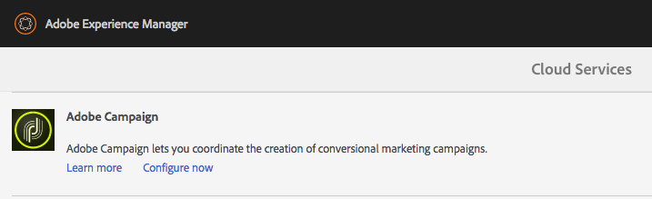

# Integrating with Adobe Campaign Standard{#integrating-with-adobe-campaign-standard}

>[!NOTE]
>
>This documentation describes how to integrate AEM with Adobe Campaign Standard, the subscription-based solution. If you are using Adobe Campaign 6.1, see [Integrating with Adobe Campaign 6.1](/help/sites-administering/campaignonpremise.md) for those instructions.

Adobe Campaign lets you manage email delivery content and forms directly in Adobe Experience Manager.

To use both solutions together at the same, you must first configure them to connect to one another. Dit omvat configuratiestappen in zowel Adobe Campaign als Adobe Experience Manager. Deze stappen worden in dit document uitgebreid beschreven.

Als u met Adobe Campaign werkt in AEM, kunt u e-mail en formulieren verzenden via Adobe Campaign. Dit wordt beschreven in [Werken met Adobe Campaign](/help/sites-authoring/campaign.md).

Bovendien kunnen de volgende onderwerpen van belang zijn bij de integratie van AEM met [Adobe Campaign](https://docs.campaign.adobe.com/doc/standard/en/home.html):

* [Best practices for email templates](/help/sites-administering/best-practices-for-email-templates.md)
* [Problemen met de integratie met Adobe Campaign oplossen](/help/sites-administering/troubleshooting-campaignintegration.md)

Als u uw integratie met Adobe Campaign uitbreidt, wilt u wellicht de volgende pagina&#39;s zien:

* [Aangepaste extensies maken](/help/sites-developing/extending-campaign-extensions.md)
* [Aangepaste formuliertoewijzingen maken](/help/sites-developing/extending-campaign-form-mapping.md)

## Adobe Campaign configureren {#configuring-adobe-campaign}

Bij het configureren van Adobe Campaign gaat het om het volgende:

1. Het vormen van de gebruiker **van de server** .
1. Een speciale externe account maken.
1. De optie AEMResourceTypeFilter controleren.
1. Een toegewezen leveringssjabloon maken.

>[!NOTE]
>
>Als u deze bewerkingen wilt uitvoeren, moet u de **beheerfunctie** in Adobe Campaign hebben.

### Vereisten {#prerequisites}

Zorg ervoor dat u de volgende elementen vooraf hebt:

* [Een AEM-ontwerpinstantie](/help/sites-deploying/deploy.md#getting-started)
* [Een AEM-publicatie-instantie](/help/sites-deploying/deploy.md#author-and-publish-installs)
* [Een Adobe Campaign-instantie](https://docs.adobe.com/content/docs/en/campaign/ACS.html)

>[!CAUTION]
>
>De verrichtingen in het [Vormen Adobe Campaign](#configuring-adobe-campaign) en het [Vormen van de secties van Adobe Experience Manager](#configuring-adobe-experience-manager) worden gedetailleerd zijn noodzakelijk voor de integratiefuncties tussen AEM en Adobe Campaign correct te werken die.

### De servergebruiker configureren {#configuring-the-aemserver-user}

De **mailserver** -gebruiker moet in Adobe Campaign zijn geconfigureerd. De **server** is een technische gebruiker die wordt gebruikt om de AEM server aan Adobe Campaign aan te sluiten.

Ga naar **Beheer** > **Gebruikers en beveiliging** > **Gebruikers** en selecteer de **gewenste** gebruiker. Klik erop om de gebruikersinstellingen te openen.

* U moet een wachtwoord instellen voor deze gebruiker. Dit kan niet via UI worden gedaan. Deze configuratie moet in REST door een technische beheerder worden gedaan.
* U kunt specifieke rollen aan deze gebruiker, zoals **deliveryPrepare** toewijzen, die de gebruiker toestaat om leveringen tot stand te brengen en uit te geven.

### Een externe Adobe Experience Manager-account configureren {#configuring-an-adobe-experience-manager-external-account}

U moet een externe account configureren waarmee u Adobe Campaign kunt verbinden met uw AEM.

>[!NOTE]
>
>Zorg er AEM voor dat u het wachtwoord voor de externe gebruiker van de campagne instelt. U moet dit wachtwoord instellen om Adobe Campaign te verbinden met AEM. Login als beheerder en in de console van het gebruikersbeleid, onderzoek naar de campagne-verre gebruiker en klik **Vastgestelde Wachtwoord**.

Een AEM externe account configureren:

1. Ga naar **Beheer** > **Toepassingsinstellingen** > **Externe accounts**.

   

1. Selecteer de standaard externe **account** nameInstance of maak een nieuwe door op de knop **Maken** te klikken.
1. Selecteer **Adobe Experience** Manager in het veld **Type** en voer de toegangsparameters in die worden gebruikt voor de AEM authoring instantie: serveradres, accountnaam en wachtwoord.

   >[!NOTE]
   >
   >Zorg ervoor dat u geen eindslash **/** aan het einde van de URL toevoegt, anders werkt de verbinding niet.

1. Controleer of het selectievakje **Ingeschakeld** is ingeschakeld en klik vervolgens op **Opslaan** om uw wijzigingen op te slaan.

### De optie AEMResourceTypeFilter controleren {#verifying-the-aemresourcetypefilter-option}

De optie **AEMResourceTypeFilter** wordt gebruikt om typen AEM te filteren die in Adobe Campaign kunnen worden gebruikt. Op deze manier kan Adobe Campaign AEM inhoud ophalen die specifiek is ontworpen voor gebruik in alleen Adobe Campaign.

Deze optie is vooraf geconfigureerd; als u deze optie wijzigt, kan dit echter tot een niet-functionerende integratie leiden.

Om te verifiëren wordt de optie **AEMResourceTypeFilter** gevormd:

1. Ga naar **Beheer** > **Toepassingsinstellingen** > **Opties**.
1. In de lijst kunt u ervoor zorgen dat de optie **AEMResourceTypeFilter** wordt vermeld en dat de paden correct zijn.

### Een AEM specifieke sjabloon voor e-maillevering maken {#creating-an-aem-specific-email-delivery-template}

Standaard is de functie AEM niet ingeschakeld in e-mailsjablonen van Adobe Campaign. U kunt een nieuwe sjabloon voor e-maillevering configureren die wordt gebruikt om e-mails met AEM inhoud te maken.

Een AEM-specifieke sjabloon voor e-maillevering maken:

1. Ga naar **Bronnen** > **Sjablonen** > **Leveringssjablonen**.
1. **Schakel selectie** in door op het vinkje op de actiebalk te klikken en de bestaande standaardsjabloon voor **standaard-e-mail (e-mail)** te selecteren. Dubbelklik vervolgens op het pictogram **Kopiëren** en klik op **Bevestigen**.
1. Schakel de selectiemodus uit door op de **x** te klikken en de zojuist gemaakte sjabloon **Kopiëren van standaard-e-mail (e-mail)** te openen. Selecteer vervolgens Eigenschappen **** bewerken op de actiebalk van het sjabloondashboard.

   U kunt het **Label** van de sjabloon wijzigen.

1. Wijzig in het gedeelte Eigenschappen **Inhoud** de **inhoudsbron** in **Adobe Experience Manager**. Selecteer vervolgens de externe account die eerder is gemaakt en klik op **Bevestigen**.

   Sla uw wijzigingen op door op **Bevestigen** te klikken en op **Opslaan te klikken.**

   De functie AEM inhoud is ingeschakeld voor e-mailleveringen die zijn gemaakt op basis van deze sjabloon.

   

## Adobe Experience Manager configureren {#configuring-adobe-experience-manager}

Om AEM te vormen, moet u het volgende doen:

* Configureer replicatie tussen instanties.
* Sluit AEM aan op Adobe Campaign.
* Configureer de externalizer.

### Replicatie tussen AEM instanties configureren {#configuring-replication-between-aem-instances}

Inhoud die is gemaakt van de AEM authoring instantie wordt eerst naar de publishing-instantie verzonden. Deze publicatie-instantie brengt de inhoud vervolgens over naar Adobe Campaign. De replicatieagent moet daarom worden gevormd om van de AEM auteursinstantie aan de AEM het publiceren instantie te herhalen.

>[!NOTE]
>
>Als u niet replicatie URL wilt gebruiken maar in plaats daarvan publiek-onder ogen ziet URL gebruiken, kunt u **Openbare URL** in de volgende configuratie plaatsen die in OSGi (**Hulpmiddelen** > de Console **van het** Web > Configuratie **OSGi > de Integratie van de Campagne - Configuratie**) plaatst:
**Openbare URL:** com.day.cq.mcm.campagne.impl.IntegrationConfigImpl#aem.mcm.campagne.publicUrl

This step is also necessary to replicate certain authoring instance configurations into the publishing instance.

To configure replication between AEM instances:

1. From the authoring instance, select **AEM logo**> **Tools **icon > **Deployment** > **Replication** > **Agents on author**, then click **Default Agent**.

   

   >[!NOTE]
   Avoid using localhost (that is a local copy of AEM) when configuring your integration with Adobe Campaign unless the publish and author instance are both on the same computer.

1. Click **Edit** then select the **Transport** tab.
1. Configure the URI by replacing **localhost** with the IP address or the address of the AEM publishing instance.

   

### Connecting AEM to Adobe Campaign {#connecting-aem-to-adobe-campaign}

Before you can use AEM and Adobe Campaign together, you must establish the link between both solutions so that they can communicate.

1. Connect to your AEM authoring instance.
1. Selecteer **Gereedschappen** > **Bewerkingen** > **Cloud** > **Cloud Services** en **configureer nu** in de sectie Adobe Campaign.

   

1. Maak een nieuwe configuratie door een **titel** in te voeren en op **Maken** te klikken, of kies de bestaande configuratie die u met uw Adobe Campaign-instantie wilt koppelen.
1. Bewerk de configuratie zodat deze overeenkomt met de parameters van uw Adobe Campaign-instantie.

   * **Gebruikersnaam**: **aemserver**, de Adobe Campaign AEM Integration package operator gebruikt om het verband tussen de twee oplossingen tot stand te brengen.
   * **Wachtwoord**: Wachtwoord Adobe Campaign-beheerder. You may have to re-specify the password for this operator directly in Adobe Campaign.
   * **API End Point**: Adobe Campaign instance URL.

1. Selecteer **Verbinding maken met Adobe Campaign** en klik op **OK**.

   

   >[!NOTE]
   After you [create your email and publish it](/help/sites-authoring/campaign.md), you need to re-publish the configuration onto your publish instance.

   

>[!NOTE]
Als de verbinding ontbreekt, zorg ervoor u het volgende controleert:
* You may encounter a certificate problem when using a secure connection to an Adobe Campaign instance (https). You will have to add the Adobe Campaign instance certificate to the **cacerts **file of your JDK.
* In addition, see [Troubleshooting your AEM/Adobe Campaign Integration](/help/sites-administering/troubleshooting-campaignintegration.md).

### Configuring the externalizer {#configuring-the-externalizer}

You need to [configure the externalizer](/help/sites-developing/externalizer.md) in AEM on your author instance. ExternalAlizer is de dienst OSGi die u een middelweg in een externe en absolute URL laat omzetten. This service provides a central place to configure those external URLs and build them.

See [Configure the externalizer](/help/sites-developing/externalizer.md) for general instructions. For the Adobe Campaign integration, make sure you configure the publish server at `https://<host>:<port>/system/console/configMgr/com.day.cq.commons.impl.ExternalizerImpl` not point to `localhost:4503` but to a server that is reachable by the Adobe Campaign console.

If it points to `localhost:4503` or another server that Adobe Campaign cannot reach, your images will not appear on the Adobe Campaign console.

