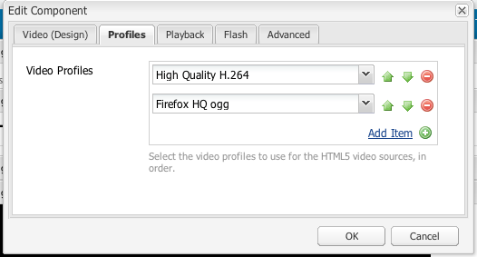

# De videocomponent {#configure-the-video-component} configureren

Met de [Video-component](/help/sites-authoring/default-components-foundation.md#video) kunt u een vooraf gedefinieerd, OOTB-video-element (out-of-the-box) op uw pagina plaatsen.

Voor juiste transcodering moet uw beheerder [Mpeg installeren en AEM](#install-ffmpeg) afzonderlijk configureren. Ze kunnen ook [Uw videoprofielen configureren](#configure-video-profiles) voor gebruik met HTML5-elementen.

>[!CAUTION]
>
>Van deze component wordt niet meer verwacht om buiten-van-de-doos zonder uitgebreide project-vlakke aanpassing te functioneren.

## Videoprofielen {#configure-video-profiles} configureren

U kunt videoprofielen definiëren die voor HTML5-elementen moeten worden gebruikt. De hier gekozen methoden worden op volgorde gebruikt. Als u toegang wilt krijgen, gebruikt u [Ontwerpmodus](/help/sites-authoring/default-components-designmode.md) (alleen klassieke gebruikersinterface) en selecteert u het tabblad **[!UICONTROL Profiles]**:



U kunt ook het ontwerp configureren van de videocomponenten en -parameters voor [!UICONTROL Playback], [!UICONTROL Flash] en [!UICONTROL Advanced].

## Mpeg installeren en AEM {#install-ffmpeg} configureren

De videocomponent is afhankelijk van open-source product Forms van derden voor een correcte transcodering van video&#39;s die kunnen worden gedownload van [https://ffmpeg.org/](https://ffmpeg.org/). Nadat u MPEG hebt geïnstalleerd, moet u AEM configureren voor het gebruik van een specifieke audiocodec en specifieke runtime-opties.

**U installeert als volgt Fmpeg voor uw platform**:

* **In Windows:**

   1. Download het gecompileerde binaire bestand als `ffmpeg.zip`
   1. Pak een map uit.
   1. Stel de omgevingsvariabele `PATH` in op `<*your-ffmpeg-locatio*n>\bin`
   1. Start AEM opnieuw.

* **In Mac OS X:**

   1. Xcode installeren ([https://developer.apple.com/technologies/tools/xcode.html](https://developer.apple.com/technologies/tools/xcode.html))
   1. XQuartz/X11 installeren.
   1. MacPorts installeren ([https://www.macports.org/](https://www.macports.org/))
   1. Voer in de console de volgende opdracht uit en volg de instructies:

      `sudo port install ffmpeg`

      `FFmpeg` moet  `PATH` zo zijn dat AEM het via de opdrachtregel kan ophalen.

* **De vooraf gecompileerde versie voor OS X 10.6 gebruiken:**

   1. Download de vooraf gecompileerde versie.
   1. Extraheer het naar de map `/usr/local`.
   1. Van terminal, voer uit:

      `sudo ln -s /usr/local/Cellar/ffmpeg/0.6/bin/ffmpeg /usr/bin/ffmpeg`

**AEM** configureren:

1. Open [!UICONTROL CRXDE Lite] in uw webbrowser. ([http://localhost:4502/crx/de](http://localhost:4502/crx/de))
1. Selecteer de `/libs/settings/dam/video/format_aac/jcr:content` knoop en zorg ervoor dat de knoopeigenschappen als volgt zijn:

   * audioCodec:

      ```
       aac
      ```

   * customArgs:

      ```
       -flags +loop -me_method umh -g 250 -qcomp 0.6 -qmin 10 -qmax 51 -qdiff 4 -bf 16 -b_strategy 1 -i_qfactor 0.71 -cmp chroma -subq 8 -me_range 16 -coder 1 -sc_threshold 40 -b-pyramid normal -wpredp 2 -mixed-refs 1 -8x8dct 1 -fast-pskip 1 -keyint_min 25 -refs 4 -trellis 1 -direct-pred 3 -partitions i8x8,i4x4,p8x8,b8x8
      ```

1. Als u de configuratie wilt aanpassen, maakt u een overlay in `/apps/settings/`-knooppunt en verplaatst u dezelfde structuur onder `/conf/global/settings/`-knooppunt. Het kan niet in `/libs` knoop worden uitgegeven. Als u bijvoorbeeld een pad `/libs/settings/dam/video/fullhd-bp` wilt bedekken, maakt u het op `/conf/global/settings/dam/video/fullhd-bp`.

   >[!NOTE]
   >
   >Bedek en bewerk het gehele profielknooppunt en niet alleen de eigenschap die moet worden gewijzigd. Dergelijke middelen worden niet opgelost via SlingResourceMerger.

1. Als u een van de eigenschappen hebt gewijzigd, klikt u op **[!UICONTROL Save All]**.

>[!NOTE]
>
>OTB-workflowmodellen blijven niet behouden wanneer u een upgrade uitvoert van uw AEM. Adobe raadt u aan OOTB-workflowmodellen te kopiëren voordat u ze bewerkt. Kopieer bijvoorbeeld het model OOTB DAM Update Asset voordat u de stap MPEG Transcoding in het DAM Update Asset model bewerkt om namen van videoprofielen te kiezen die vóór de upgrade bestonden. Vervolgens kunt u het knooppunt `/apps` bedekken om AEM de aangepaste wijzigingen in het OOTB-model op te halen.
