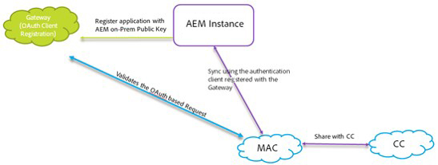
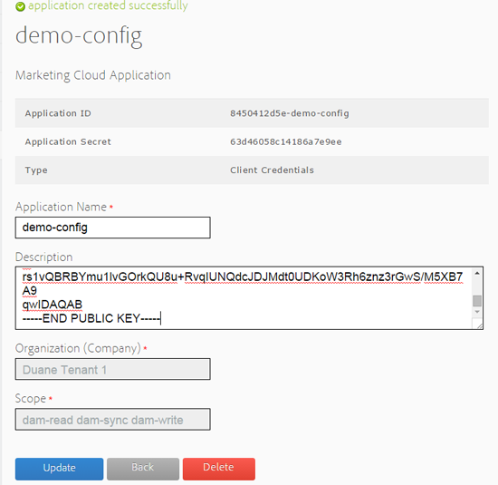

# AEM Assets-integratie configureren met Experience Cloud en Creative Cloud {#configure-aem-assets-integration-with-experience-cloud-and-creative-cloud}

Als u een Adobe Experience Cloud-klant bent, kunt u uw middelen synchroniseren binnen Adobe Experience Manager (AEM) Assets met Adobe Creative Cloud en andersom. U kunt uw elementen ook synchroniseren met Experience Cloud en andersom. U kunt deze synchronisatie instellen via [!DNL Adobe I/O].

De workflow voor het instellen van deze integratie is:

1. Creeer een authentificatie in [!DNL Adobe I/O] gebruikend een openbare gateway en krijg toepassingsidentiteitskaart
1. Maak een profiel op uw AEM Assets-instantie met de toepassings-id.
1. Gebruik deze configuratie om uw elementen in AEM Assets te synchroniseren met Creative Cloud.

Op de achtergrond, verifieert de AEM server uw profiel met de gateway en synchroniseert dan de gegevens tussen AEM Assets en Experience Cloud.

>[!NOTE]
>
>AEM naar Adobe Creative Cloud is vervangen. Leer meer en vind een betere methode in [AEM en de integratie beste praktijken ](../assets/aem-cc-integration-best-practices.md). De configuratie van AEM aan de replicatie van de Marketing Cloud en het ruilen van activa tussen AEM Assets en Marketing Cloud wordt niet afgekeurd.

Gegevensstroom wanneer AEM Assets en Creative Cloud zijn geïntegreerd

>[!NOTE]
>
>Voor het delen van elementen tussen Adobe Experience Cloud en Adobe Creative Cloud zijn beheerdersrechten voor de AEM vereist.

>[!CAUTION]
>
>Adobe Maketing Cloud is omgedoopt tot Adobe Experience Cloud. In de onderstaande procedures wordt nog steeds verwezen naar Marketing Cloud om de huidige interface te weerspiegelen.

## Een toepassing {#create-an-application} maken

1. Heb toegang tot de de gatewayinterface van de Ontwikkelaar van Adobe door het programma te openen bij [https://legacy-oauth.cloud.adobe.io](https://legacy-oauth.cloud.adobe.io/).

   >[!NOTE]
   >
   >U hebt beheerdersrechten nodig om een toepassings-id te maken.

1. Navigeer in het linkervenster naar **[!UICONTROL Developer Tools]** > **[!UICONTROL Applications]** om een lijst met toepassingen weer te geven.
1. Klik **[!UICONTROL Add]**  om een toepassing te maken.
1. Selecteer **[!UICONTROL Service Account (JWT Assertion)]** in de lijst **[!UICONTROL Client Credentials]**. Dit is een server-naar-server communicatieservice voor serververificatie.

   

1. Geef een naam voor de toepassing en een optionele beschrijving op.
1. Selecteer in de lijst **[!UICONTROL Organization]** de organisatie waarvoor u elementen wilt synchroniseren.
1. Selecteer **[!UICONTROL Scope]** in de lijst **[!UICONTROL dam-read]**, **[!UICONTROL dam-sync]**, **[!UICONTROL dam-write]** en **[!UICONTROL cc-share]**.
1. Klik op **[!UICONTROL Create]**. Een bericht meldt dat de toepassing is gemaakt.

   

1. Kopieer **[!UICONTROL Application ID]** die voor de nieuwe toepassing wordt geproduceerd.

   >[!CAUTION]
   >
   >Zorg ervoor dat u niet per ongeluk **[!UICONTROL Application Secret]** in plaats van **[!UICONTROL Application ID]** kopieert.

## Nieuwe configuratie toevoegen aan Marketing Cloud {#add-a-new-configuration-to-marketing-cloud}

1. Klik op het AEM logo in de gebruikersinterface van uw lokale AEM Assets-instantie en navigeer naar **[!UICONTROL Tools]** > **[!UICONTROL Cloud Services]** > **[!UICONTROL Legacy Cloud Services]**.

1. Zoek de **[!UICONTROL Adobe Marketing Cloud]**-service. Als er geen configuraties bestaan, klikt u op **[!UICONTROL Configure Now]**. Als configuraties bestaan, klik **[!UICONTROL Show Configurations]** en klik **[!UICONTROL [+]]** om een nieuwe configuratie toe te voegen.

   >[!NOTE]
   >
   >Gebruik een Adobe ID-account met beheerdersrechten voor de organisatie.

1. Geef in het dialoogvenster **[!UICONTROL Create Configuration]** een titel en naam voor de nieuwe configuratie op en klik op **[!UICONTROL Create]**.

   

1. Geef in het veld **[!UICONTROL Tenant URL]** de URL voor AEM Assets op.

   >[!CAUTION]
   >
   >Als u de URL voor de huurder hebt ingevoerd als **https://&lt;huurder_id>.marketing.adobe.com**, moet u de URL wijzigen in **https://&lt;huurder_id>.ExperienceCloud.adobe.com.** Hiervoor voert u de volgende stappen uit:
   1. Navigeer naar **Gereedschappen > Cloud Services > Oudere Cloud Services**.
   1. Klik onder Adobe Marketing Cloud op **Configuraties tonen**.
   1. Selecteer de configuratie die terwijl vestiging de AEM-MAC-CC synchronisatie werd gecreeerd.
   1. Bewerk de configuratie van cloudservice en vervang **marketing.adobe.com** in het veld Tenant URL naar **ExperienceCloud.adobe.com**.
   1. Sla de configuratie op.
   1. Test de MAC-sync replicatieagenten.

1. Plak in het veld **[!UICONTROL Client ID]** de toepassings-id die u aan het einde van de procedure hebt gekopieerd [Een toepassing maken](/help/sites-administering/configure-assets-cc-integration.md#create-an-application).

   

1. Selecteer **[!UICONTROL Synchronization]** onder **[!UICONTROL Enabled]** om synchronisatie in te schakelen en klik **[!UICONTROL OK]**.

   >[!NOTE]
   Als u **disabled** selecteert, werkt de synchronisatie in één richting.

1. Van de configuratiepagina, klik **[!UICONTROL Display Public Key]** om de openbare sleutel te tonen die voor uw instantie wordt geproduceerd. U kunt ook op **[!UICONTROL Download Public Key for OAuth Gateway]** klikken om het bestand met de openbare sleutel te downloaden. Open vervolgens het bestand om de openbare sleutel weer te geven.

## Synchronisatie {#enable-synchronization} inschakelen

1. Toon de openbare sleutel gebruikend één van de volgende methodes die in de laatste stap van de procedure [een nieuwe configuratie aan Marketing Cloud ](/help/sites-administering/configure-assets-cc-integration.md#add-a-new-configuration-to-marketing-cloud) worden vermeld. Klik op **[!UICONTROL Display Public Key]**.

   

1. Kopieer de openbare sleutel en plak het in het **[!UICONTROL Public Key]** gebied van configuratieinterface van de toepassing u in [creeerde een toepassing ](/help/sites-administering/configure-assets-cc-integration.md#create-an-application).

   

1. Klik op **[!UICONTROL Update]**. Synchroniseer uw elementen nu met de AEM Assets-instantie.

## Synchronisatie {#test-the-synchronization} testen

1. Klik op het AEM-logo in de gebruikersinterface van uw lokale AEM Assets-exemplaar en navigeer naar **[!UICONTROL Tools]** **[!UICONTROL Deployment]** **[!UICONTROL Replication]**om de replicatieprofielen te zoeken die voor synchronisatie zijn gemaakt.
1. Ga naar de pagina **[!UICONTROL Replication]** en klik op **[!UICONTROL Agents on author]**.
1. Klik in de lijst met profielen op het standaard replicatieprofiel voor uw organisatie om dit te openen.
1. Klik in het dialoogvenster op **[!UICONTROL Test Connection]**.

   

1. Wanneer de replicatierest voltooit, controleer een succesbericht aan het eind van de testresultaten.

## Gebruikers toevoegen aan Marketing Cloud {#add-users-to-marketing-cloud}

1. Meld u aan bij de Marketing Cloud met beheerdersreferenties.
1. Ga vanaf de rails naar **[!UICONTROL Administration]**en klik/tik **[!UICONTROL Launch Enterprise Dashboard]**.
1. Klik in de track op **[!UICONTROL Users]** om de pagina **[!UICONTROL User Management]** te openen.
1. Klik/tik **Add**  op de werkbalk.
1. Voeg een of meer gebruikers toe die u de mogelijkheid wilt bieden elementen te delen met Creative Cloud.

   >[!NOTE]
   Alleen de gebruikers die u aan de Marketing Cloud toevoegt, kunnen elementen van AEM Assets naar Creative Cloud delen.

## Wisselmiddelen tussen AEM Assets en Marketing Cloud {#exchange-assets-between-aem-assets-and-marketing-cloud}

1. Meld u aan bij AEM Assets.
1. Maak een map in de middelenconsole en upload enkele bestanden naar deze map. Maak bijvoorbeeld een map **mc-demo** en upload er een element naar.
1. Selecteer de map en klik op **Delen** .
1. Selecteer **[!UICONTROL Adobe Marketing Cloud]** in het menu en klik **[!UICONTROL Share]**. Een bericht meldt dat de map wordt gedeeld met Marketing Cloud.

   

   >[!NOTE]
   Het delen van een map Middelen van het type `sling:OrderedFolder` wordt niet ondersteund in de context van delen in Adobe Marketing Cloud. Als u een map wilt delen, moet u bij het maken ervan in AEM Assets de optie **[!UICONTROL Ordered]** niet selecteren.

1. Vernieuw de AEM Assets-gebruikersinterface. De map die u hebt gemaakt in de middelenconsole van uw lokale AEM Assets-instantie, wordt gekopieerd naar de gebruikersinterface van de Marketing Cloud. Het middel dat u naar de map in AEM Assets uploadt, wordt in de kopie van de map in de Marketing Cloud weergegeven nadat deze door de AEM server is verwerkt.
1. U kunt ook elementen uploaden in de gekopieerde kopie van de map in Marketing Cloud. Nadat het element is verwerkt, wordt het in de gedeelde map in AEM Assets weergegeven.

## Wisselmiddelen tussen AEM Assets en Creative Cloud {#exchange-assets-between-aem-assets-and-creative-cloud}

Met AEM Assets kunt u mappen met elementen delen met Adobe Creative Cloud-gebruikers.

1. Selecteer in de middelenconsole de map die u wilt delen met Creative Cloud.
1. Klik op **[!UICONTROL Share]**  op de werkbalk.
1. Selecteer in de lijst de optie **[!UICONTROL Adobe Creative Cloud]**.

   >[!NOTE]
   De opties zijn beschikbaar voor gebruikers met leesmachtigingen in de hoofdmap. De gebruikers moeten de vereiste toestemming hebben om tot de informatie van de replicatieagent van Marketing Cloud toegang te hebben.

1. Voeg op de pagina **[!UICONTROL Creative Cloud Sharing]** de gebruiker toe om de map te delen met en kies een rol voor de gebruiker. Klik **[!UICONTROL Save]** en klik **[!UICONTROL OK]**.

1. Meld u aan bij Creative Cloud met de gegevens van de gebruiker met wie u de map hebt gedeeld. De gedeelde map is beschikbaar in Creative Cloud.

De synchronisatie tussen AEM Assets en Marketing Cloud is zodanig ontworpen dat de instantie van de gebruikerscomputer van waaruit het element is geüpload het recht behoudt om het element te wijzigen. Alleen deze wijzigingen worden doorgegeven aan de andere instantie.

Als een element bijvoorbeeld wordt geüpload vanuit een AEM Assets-instantie (op locatie), worden de wijzigingen in het element van deze instantie doorgegeven aan de instantie Marketing Cloud. De wijzigingen die zijn doorgevoerd van de instantie Marketing Cloud naar hetzelfde element, worden echter niet doorgegeven aan de instantie AEM en andersom voor elementen die zijn geüpload uit Marketing Cloud.

>[!MORELIKETHIS]
* [Aanbevolen werkwijzen voor AEM en Creative Cloud-integratie](../assets/aem-cc-integration-best-practices.md)
* [Aanbevolen werkwijzen voor het delen van mappen AEM naar Creative Cloud](../assets/aem-cc-folder-sharing-best-practices.md)

