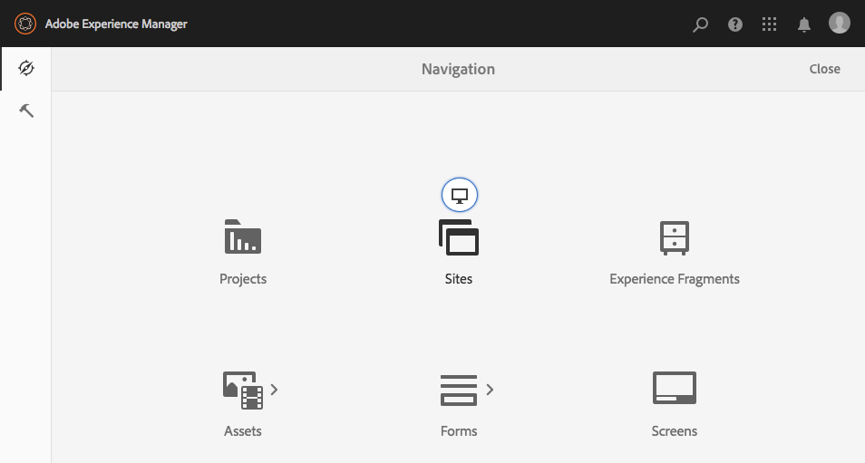

# Admin Consoles{#admin-consoles}

De mogelijkheid om via de beheerconsoles over te schakelen op de klassieke gebruikersinterface is standaard uitgeschakeld. Daarom worden de pop-uppictogrammen die werden gezien toen de muis over bepaalde consolepictogrammen beweegt, die toegang tot klassieke UI toestaan, niet meer getoond.

Elke console die een Klassieke versie UI in `/libs/cq/core/content/nav` heeft kan individueel worden re-toegelaten zodat **Klassieke UI** optie opnieuw over het consolepictogram verschijnt wanneer het over wordt gemouseover.

In dit voorbeeld, zijn wij re-toelatend Klassieke UI voor de console van Plaatsen.

1. Gebruikend CRXDE Lite, vind de knoop die de admin console beantwoordt waarvoor u Klassieke UI wilt re-toelaten. Deze zijn te vinden onder:

   `/libs/cq/core/content/nav`

   Bijvoorbeeld

   [ `http://localhost:4502/crx/de/index.jsp#/libs/cq/core/content/nav`](http://localhost:4502/crx/de/index.jsp#/libs/cq/core/content/nav)

1. Selecteer de knoop die aan de console beantwoordt waarvoor u Klassieke UI wilt re-toelaten. Voor ons voorbeeld, zullen wij klassieke UI voor de console van Plaatsen re-toelaten.

   `/libs/cq/core/content/nav/sites`

1. Maak een overlay met de optie **Overlay Node**; bijvoorbeeld:

   * **Pad**:  `/apps/cq/core/content/nav/sites`
   * **Locatie** bedekking:  `/apps/`
   * **Identieke knooppunttypen**: actief (schakel het selectievakje in)

1. Voeg de volgende booleaanse eigenschap toe aan het bovenliggende knooppunt:

   `enableDesktopOnly = {Boolean}true`

1. De optie **Klassieke UI** is opnieuw beschikbaar als popover optie in de admin console.

   

Herhaal deze stappen voor elke console waarvoor u toegang tot de Klassieke versie van UI wenst opnieuw toe te laten.
