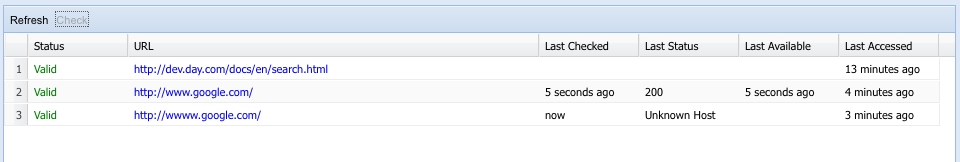

# The External Link Checker{#the-external-link-checker}

Binnen AEM wordt een externe koppelingencontrole aangeboden. De koppelingencontrole:

* scant alle inhoudspagina&#39;s
* genereert een lijst met alle geldige en ongeldige koppelingen
* Hiermee worden ongeldige koppelingen op de afzonderlijke inhoudspagina&#39;s gemarkeerd als verbroken

## Externe koppelingen valideren {#how-to-validate-external-links}

De externe koppelingencontrole gebruiken:

1. Open de **console van Hulpmiddelen** .
1. Dubbelklik op **Externe koppelingencontrole** (in het rechter- of linkerdeelvenster). Er wordt een lijst met alle externe koppelingen gegenereerd.
1. Valideer een specifieke koppeling door deze te selecteren in de lijst en vervolgens te klikken op **Controleren**:

   

   Informatie zoals:

   * status van de koppeling
   * URL
   * tijd sinds de koppeling voor het laatst is gevalideerd
   * tijd sinds de koppeling voor het laatst beschikbaar was
   * tijd sinds de koppeling voor het laatst is geopend

   wordt weergegeven.

1. Ongeldige koppelingen op de afzonderlijke inhoudspagina&#39;s worden weergegeven als verbroken:

   

