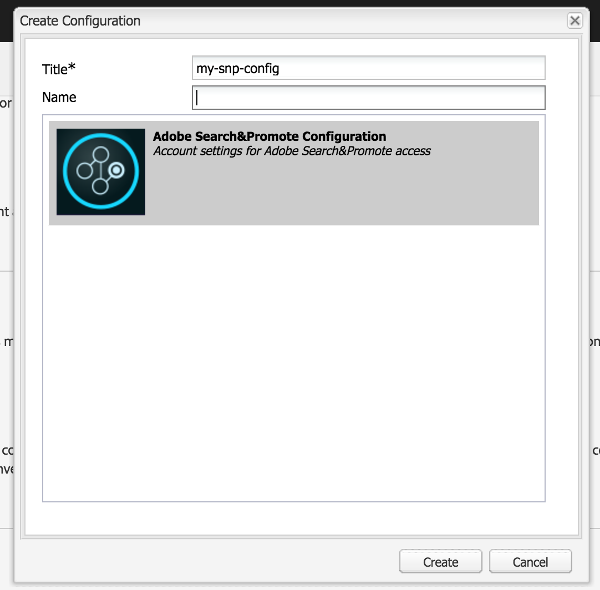

# Integreren met Adobe Search&amp;Promote{#integrating-with-adobe-search-promote}

Voer de volgende taken uit om de Adobe Search&amp;Promote-service van uw website te bellen:

1. Geef de URL van de cloud op.
1. Configureer de verbinding met de service Zoeken en bevorderen.
1. &amp;Onderdelen zoeken bevorderen toevoegen aan [!UICONTROL Sidetrap].
1. Gebruik de componenten om de inhoud te ontwerpen. (Zie [Zoekfuncties &amp;promoveren aan een webpagina](/help/sites-authoring/search-and-promote.md)toevoegen.)
1. Voeg banners toe aan uw pagina&#39;s. Bannerafbeeldingen zijn gevoelig voor gegevens zoeken en bevorderen.
1. Genereer een site-overzicht voor de service Zoeken en promoten die u wilt gebruiken.

>[!NOTE]
>
>Als u Search&amp;Promote met een configuratie van de douanevolmacht gebruikt, moet u zowel de volmachtsconfiguraties van de Cliënt van HTTP vormen aangezien sommige functionaliteiten van AEM 3.x APIs en sommige anderen 4.x APIs gebruiken:
>
>* 3.x is geconfigureerd met [http://localhost:4502/system/console/configMgr/com.day.commons.httpclient](http://localhost:4502/system/console/configMgr/com.day.commons.httpclient)
>* 4.x is geconfigureerd met [http://localhost:4502/system/console/configMgr/org.apache.http.proxyconfigurator](http://localhost:4502/system/console/configMgr/org.apache.http.proxyconfigurator)
>

## De service-URL voor zoeken en promoten wijzigen {#changing-the-search-promote-service-url}

De standaard-URL die is geconfigureerd voor de service Zoeken en bevorderen is `https://searchandpromote.omniture.com/px/`. Om de verschillende dienst te gebruiken, gebruik de console OSGi om een verschillende URL te specificeren.

**De service-URL** Zoeken en promoten wijzigen:

1. Open de [!UICONTROL console OSGi] en tik op het tabblad **[!UICONTROL Configuratie]** . ([http://localhost:4502/system/console/configMgr.](http://localhost:4502/system/console/configMgr))

1. Klik op het item **[!UICONTROL Day CQ Search&amp;Promote configuratie]** .
1. Voer in het tekstveld **[!UICONTROL Externe server-URI]** de URL in en tik op **[!UICONTROL Opslaan]**.

## De verbinding met Zoeken&amp;bevorderen configureren {#configuring-the-connection-to-search-promote}

Configureer een of meer verbindingen met de functie Zoeken en bevorderen, zodat uw webpagina&#39;s kunnen communiceren met de service. Als u verbinding wilt maken, hebt u de lididentificatie en het accountnummer van uw zoek&amp;Promote account nodig.

**Om de verbinding aan Onderzoek&amp;Bevorderen** te vormen:

1. Selecteer **[!UICONTROL Cloud Services]** in het pictogram Extra **[!UICONTROL >]** Implementatie ****.

   Hiermee gaat u naar het dashboard voor cloudservices. Als de URL van het dashboard op een lokale machine er ongeveer als volgt uitziet:

   [http://localhost:4502/libs/cq/core/content/tools/cloudservices.html](http://localhost:4502/libs/cq/core/content/tools/cloudservices.html)

1. Tik op de pagina [!UICONTROL Cloud Services] op de koppeling **[!UICONTROL Adobe Search&amp;Promote]** of het pictogram **[!UICONTROL Zoeken&amp;Promote]** .

1. Als dit de eerste keer is dat u Adobe Search&amp;Promote configureert, tikt u op Nu **** configureren om het deelvenster [!UICONTROL Configuratie] maken te openen.

   Klik op Meer **[!UICONTROL weten]** als je meer wilt weten over Zoeken en promoten.

   

1. Voer een **[!UICONTROL titel]** in die herkenbaar is voor auteurs van pagina&#39;s en voer een unieke **[!UICONTROL naam]** in. Tik vervolgens op **[!UICONTROL Maken]**.

   De nieuwe configuratie wordt ook weergegeven onder **[!UICONTROL Beschikbare configuraties]** op het dashboard **[!UICONTROL Adobe Search&amp;Promote-lijstitem]** Cloud Services.

   

1. Voeg in het dialoogvenster Component  bewerken het volgende toe aan de velden:

   * **[!UICONTROL Lid-id]**
   * **[!UICONTROL Rekeningnummer]**
   >[!NOTE]
   >
   >Meld u aan bij het volgende om deze informatie zelf op te halen:
   >
   >[https://searchandpromote.omniture.com/center/](https://searchandpromote.omniture.com/center/)
   >
   >met uw geldige e-mail&amp;Promote referenties (e-mail/wachtwoord).
   >
   >Let op de URL in de adresbalk van de browser. Het zou iets gelijkaardig aan het volgende moeten kijken:
   >
   >
   >
   >[https://searchandpromote.omniture.com/px/home/?sp_id=XXXXXXXX-spYYYYYYYY](https://searchandpromote.omniture.com/px/home/?sp_id=XXXXXXXX-spYYYYYYYY)
   >
   >Waar **XXXXXXXX** overeenkomt met je **[!UICONTROL gebruikersnaam]** en **[!UICONTROL spYYYYY]** komt overeen met je rekeningnummer.

1. Tik op **[!UICONTROL Verbinden met zoeken en bevorderen]**.

   Tik op **[!UICONTROL OK]** wanneer het bericht met het succes van de verbinding wordt weergegeven.

   (Na verbinding wordt de knoptekst gewijzigd in **[!UICONTROL Opnieuw verbinden met zoeken en bevorderen]**.)

1. Tik op **[!UICONTROL OK]**. De pagina Instellingen zoeken en bevorderen wordt weergegeven voor de configuratie die u zojuist hebt gemaakt.

## Het datacenter configureren {#configuring-the-data-center}

Als uw zoek&amp;promotieaccount zich in Azië of Europa bevindt, moet u het standaarddatacenter zodanig wijzigen dat het naar het juiste datacenter wijst (het standaarddatacenter is voor Noord-Amerikaanse accounts).

**Het datacenter** configureren:

1. Navigeer naar de webconsole op `http://localhost:4502/system/console/configMgr/com.day.cq.searchpromote.impl.SearchPromoteServiceImpl`

   

1. Wijzig afhankelijk van de locatie van de server de URI in een van de volgende:

   * Noord-Amerika: [https://center.atomz.com/px/](https://center.atomz.com/px/)
   * EMEA: [https://center.lon5.atomz.com/px/](https://center.lon5.atomz.com/px/)
   * APAC: [https://center.sin2.atomz.com/px/](https://center.sin2.atomz.com/px/)

1. Tik op **[!UICONTROL Opslaan]**.

## &amp;Onderdelen zoeken en promoten aan Sidetrap toevoegen {#adding-search-promote-components-to-sidekick}

Bewerk in de modus [!UICONTROL Ontwerpen] een **[!UICONTROL onderdeel]** om de componenten Zoeken en bevorderen in [!UICONTROL Sidetrap]mogelijk te maken. (Raadpleeg de documentatie bij [Componenten](/help/sites-developing/components.md) voor meer informatie.)

Voor informatie over het gebruiken van de componenten, zie het [Toevoegen van zoek&amp;promotieeigenschappen aan een Web-pagina](/help/sites-authoring/search-and-promote.md).

## De service Zoeken en promoten opgeven die uw pagina&#39;s gebruiken {#specifying-the-search-promote-service-that-your-pages-use}

Webpagina&#39;s zodanig configureren dat deze een specifieke service Zoeken en bevorderen gebruiken. Componenten zoeken en promoten gebruiken automatisch de service van hun hostpagina.

Wanneer u de eigenschappen Zoeken&amp;Promoteren voor een pagina configureert, nemen alle onderliggende pagina&#39;s de instellingen over. Indien nodig, kunt u kindpagina&#39;s vormen om de geërfte montages met voeten te treden.

>[!NOTE]
>
>De de dienstverbinding moet reeds worden gevormd. Zie De verbinding [configureren voor zoeken en bevorderen](#configuring-the-connection-to-search-promote).

1. Open het dialoogvenster **[!UICONTROL Pagina-eigenschappen]** . Klik bijvoorbeeld met de rechtermuisknop op de pagina **[!UICONTROL Websites]** en klik op **[!UICONTROL Eigenschappen]**.

1. Klik op het tabblad **[!UICONTROL Cloud Services]** .

1. Als u de overerving van configuraties van cloudservices van een bovenliggende pagina wilt uitschakelen, klikt u op het hangslotpictogram naast het overervingspad.

   

1. Klik op Service **** toevoegen, selecteer **[!UICONTROL Adobe Search&amp;Promote]** en klik vervolgens op **[!UICONTROL OK]**.

1. Selecteer de verbindingsconfiguratie voor uw zoek&amp;Promote account en klik op **[!UICONTROL OK]**.

## Productfeed {#product-feed}

Met de integratie Zoeken en bevorderen kunt u het volgende doen:

* Gebruik de [!UICONTROL eCommerce] -API, onafhankelijk van de onderliggende repository structuur en het handelsplatform.
* Gebruik de functie [!UICONTROL Indexconnector] van Zoeken&amp;Promoten om een productfeed in XML-indeling te leveren.
* Gebruik de functie [!UICONTROL Afstandsbediening] van Zoeken&amp;Promoten om op aanvraag of geplande aanvragen van de productfeed uit te voeren.
* Feed genereren voor verschillende zoek&amp;Promote accounts, geconfigureerd als configuraties met cloudservices.

Zie [Productfeed](/help/sites-administering/product-feed.md)voor meer informatie.
