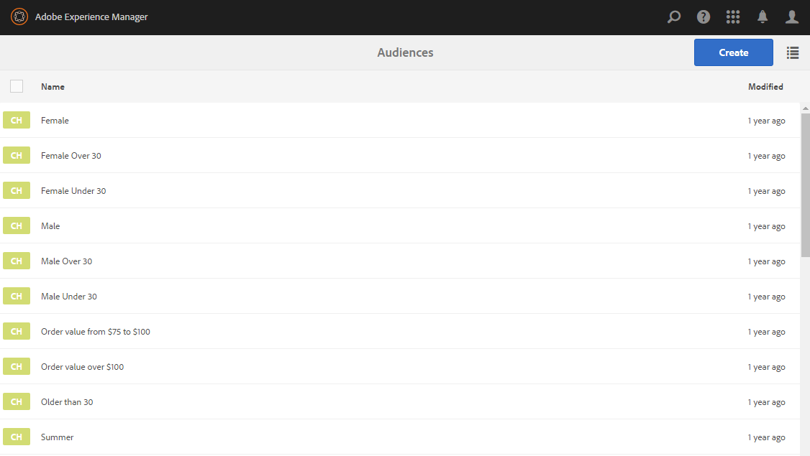

# Het vormen Segmentatie met ContextHub{#configuring-segmentation-with-contexthub}

>[!CAUTION]
>
>AEM 6.4 heeft het einde van de uitgebreide ondersteuning bereikt en deze documentatie wordt niet meer bijgewerkt. Raadpleeg voor meer informatie onze [technische ondersteuningsperioden](https://helpx.adobe.com/support/programs/eol-matrix.html). Ondersteunde versies zoeken [hier](https://experienceleague.adobe.com/docs/).

>[!NOTE]
>
>Deze sectie beschrijft het vormen segmentatie wanneer het gebruiken van ContextHub. Raadpleeg de relevante documentatie voor [segmentatie configureren voor clientcontext](/help/sites-administering/campaign-segmentation.md).

Segmentering is een belangrijke overweging bij het maken van een campagne. Zie [Soorten publiek beheren](/help/sites-authoring/managing-audiences.md) voor informatie over hoe de segmentatie werkt en zeer belangrijke termijnen.

Afhankelijk van de informatie die u reeds over uw plaatsbezoekers en de doelstellingen hebt verzameld u wilt bereiken, zult u de segmenten en de strategieën nodig voor uw gerichte inhoud moeten bepalen.

Deze segmenten worden vervolgens gebruikt om een bezoeker specifieke inhoud te bieden. Deze inhoud blijft behouden in het dialoogvenster [Personalisatie](/help/sites-authoring/personalization.md) van de website. [Activiteiten](/help/sites-authoring/activitylib.md) Hier gedefinieerd kan op elke pagina worden opgenomen en definiëren voor welk bezoekerssegment de gespecialiseerde inhoud van toepassing is.

AEM kunt u de gebruikerservaring eenvoudig aanpassen. Het staat u ook toe om de resultaten van uw segmentdefinities te verifiëren.

## Segmenten openen {#accessing-segments}

De [Soorten publiek](/help/sites-authoring/managing-audiences.md) De console wordt gebruikt om segmenten voor ContextHub of de Context van de Cliënt evenals publiek voor uw rekening van Adobe Target te beheren. Deze documentatie behandelt het beheren van segmenten voor ContextHub. Voor [Clientcontextsegmenten](/help/sites-administering/campaign-segmentation.md) en Adobe Target-segmenten, zie de desbetreffende documentatie.

Om tot uw segmenten toegang te hebben, in globale navigatie selecteer **Navigation > Personalisatie > Soorten publiek**.



## Segmenteditor {#segment-editor}

De **Segmenteditor** kunt u een segment gemakkelijk wijzigen. Als u een segment wilt bewerken, selecteert u een segment in het dialoogvenster [lijst van segmenten](/help/sites-administering/segmentation.md#accessing-segments) en klik op de knop **Bewerken** knop.


Met de componentenbrowser kunt u toevoegen **EN** en **OF** containers om de segmentlogica te bepalen, dan voeg extra componenten toe om eigenschappen en waarden of verwijzingsmanuscripten en andere segmenten te vergelijken om de selectiecriteria te bepalen (zie [Een nieuw segment maken](#creating-a-new-segment)) om het exacte scenario voor het selecteren van het segment te bepalen.

Wanneer de volledige verklaring aan waar evalueert dan heeft het segment opgelost. Wanneer meerdere segmenten van toepassing zijn, dan **Verhogen** wordt ook gebruikt. Zie [Een nieuw segment maken](#creating-a-new-segment) voor meer informatie over de [stimulerende factor.](/help/sites-administering/campaign-segmentation.md#boost-factor)

>[!CAUTION]
>
>De segmentredacteur controleert geen cirkelverwijzingen. Zo verwijst segment A bijvoorbeeld naar een ander segment B, dat op zijn beurt weer naar segment A verwijst. U moet ervoor zorgen dat de segmenten geen cirkelverwijzingen bevatten.

### Containers {#containers}

De volgende containers zijn beschikbaar uit-van-de-doos en staan u toe om vergelijkingen en verwijzingen samen te groeperen voor booleaanse evaluatie. U kunt deze vanuit de componentbrowser naar de editor slepen. Zie de volgende sectie [AND en OR-containers gebruiken](/help/sites-administering/segmentation.md#using-and-and-or-containers) voor meer informatie .

<table> 
 <tbody> 
  <tr> 
   <td>Container en<br /> </td> 
   <td>De operator Boolean AND<br /> </td> 
  </tr> 
  <tr> 
   <td>Container OF<br /> </td> 
   <td>De operator Boolean OR</td> 
  </tr> 
 </tbody> 
</table>

### Vergelijkingen {#comparisons}

De volgende segmentvergelijkingen zijn beschikbaar uit-van-de-doos om segmenteigenschappen te evalueren. U kunt deze vanuit de componentbrowser naar de editor slepen.

<table> 
 <tbody> 
  <tr> 
   <td>Eigenschap-waarde<br /> </td> 
   <td>Vergelijkt een bezit van een opslag met een bepaalde waarde<br /> </td> 
  </tr> 
  <tr> 
   <td>Eigenschap-eigenschap</td> 
   <td>Vergelijkt één bezit van een opslag aan een ander bezit<br /> </td> 
  </tr> 
  <tr> 
   <td>Eigenschap-segmentverwijzing</td> 
   <td>Vergelijkt een bezit van een opslag aan een ander referenced segment<br /> </td> 
  </tr> 
  <tr> 
   <td>Eigenschapverwijzing</td> 
   <td>Vergelijkt een bezit van een opslag met de resultaten van een manuscript<br /> </td> 
  </tr> 
  <tr> 
   <td>Referentie-script voor segment</td> 
   <td>Vergelijkt een segment waarnaar wordt verwezen met de resultaten van een script<br /> </td> 
  </tr> 
 </tbody> 
</table>

>[!NOTE]
>
>Wanneer het vergelijken van waarden, als het gegevenstype van de vergelijking niet (d.w.z. wordt geplaatst om auto te ontdekken) wordt geplaatst, zal de segmenteringsmotor van ContextHub eenvoudig de waarden zoals javascript vergelijken. Er worden geen waarden naar de verwachte typen gecast, wat tot misleidende resultaten kan leiden. Bijvoorbeeld:
>
>`null < 30 // will return true`
>
>Daarom [een segment maken](/help/sites-administering/segmentation.md#creating-a-new-segment)selecteert u een **gegevenstype** wanneer de typen van de vergeleken waarden bekend zijn. Bijvoorbeeld:
>
>Bij vergelijking van de eigenschap `profile/age`, weet u reeds dat het vergeleken type zal zijn **getal**, zelfs als `profile/age` is niet ingesteld, een vergelijking `profile/age` minder dan 30 wordt geretourneerd **false**, zoals u zou verwachten.

### Verwijzingen {#references}

De volgende verwijzingen zijn beschikbaar uit-van-de-doos om rechtstreeks met een manuscript of een ander segment te verbinden. U kunt deze vanuit de componentbrowser naar de editor slepen.

<table> 
 <tbody> 
  <tr> 
   <td>Segmentverwijzing<br /> </td> 
   <td>Evalueer het referenced segment</td> 
  </tr> 
  <tr> 
   <td>Scriptreferentie</td> 
   <td>Evalueer het referenced manuscript. Zie de volgende sectie <a href="/help/sites-administering/segmentation.md#using-script-references">Scriptverwijzingen gebruiken</a> voor meer informatie .</td> 
  </tr> 
 </tbody> 
</table>

## Een nieuw segment maken {#creating-a-new-segment}

Het nieuwe segment definiëren:

1. Na [toegang krijgen tot de segmenten](/help/sites-administering/segmentation.md#accessing-segments), klikt of tikt op de knop Maken en selecteert u **ContextHub-segment maken**.

   

1. In de **Nieuw ContextHub-segment** Voer een titel voor het segment in en geef indien nodig een ophaalwaarde op en tik of klik op **Maken**.

   

   Elk segment heeft een verhogingsparameter die als weegfactor wordt gebruikt. Een hoger getal geeft aan dat het segment bij voorkeur wordt geselecteerd boven een segment met een lager getal in gevallen waarin meerdere segmenten geldig zijn.

   * Minimumwaarde: `0`
   * Maximumwaarde: `1000000`

1. Sleep een vergelijking of een verwijzing naar de segmentredacteur het in het gebrek EN container zal verschijnen.
1. Dubbelklik op of tik op de configureoptie van de nieuwe verwijzing of het nieuwe segment om de specifieke parameters te bewerken. In dit voorbeeld testen we op mensen in San Jose.

   

   Altijd een **Gegevenstype** indien mogelijk om ervoor te zorgen dat uw vergelijkingen correct worden geëvalueerd. Zie [Vergelijkingen](/help/sites-administering/segmentation.md#comparisons) voor meer informatie .

1. Klikken **OK** om uw definitie op te slaan:
1. Voeg desgewenst meer componenten toe. U kunt booleaanse expressies formuleren met behulp van de containercomponenten voor AND en OR vergelijkingen (zie [en/of containers gebruiken](/help/sites-administering/segmentation.md#using-and-and-or-containers) hieronder). Met de segmentredacteur kunt u componenten schrappen niet meer nodig, of hen slepen aan nieuwe posities binnen de verklaring.

### AND en OR-containers gebruiken {#using-and-and-or-containers}

Gebruikend EN en OF containercomponenten, kunt u complexe segmenten in AEM construeren. Hierbij is het nuttig om op een aantal basispunten te letten:

* Het hoogste niveau van de definitie is altijd de EN container die aanvankelijk wordt gecreeerd. Dit kan niet worden veranderd, maar heeft geen effect op de rest van uw segmentdefinitie.
* Zorg ervoor dat het nesten van de container zinvol is. De containers kunnen als steunen van uw booleaanse uitdrukking worden bekeken.

In het volgende voorbeeld worden bezoekers geselecteerd die in onze primaire leeftijdsgroep worden beschouwd:

Mannelijk en tussen 30 en 59 jaar

OF

Vrouwen tussen 30 en 59 jaar

U begint door een OF containercomponent binnen het gebrek EN container te plaatsen. Binnen de container OR, kunt u twee EN containers en binnen allebei toevoegen u het bezit of de verwijzingscomponenten.


### Scriptverwijzingen gebruiken {#using-script-references}

Door de component van de Verwijzing van het Manuscript te gebruiken, kan de evaluatie van een segmentbezit aan een extern manuscript worden afgevaardigd. Zodra het manuscript behoorlijk wordt gevormd, kan het als een andere component van een segmentvoorwaarde worden gebruikt.

#### Een script definiëren als naslaggids {#defining-a-script-to-reference}

1. Bestand toevoegen aan `contexthub.segment-engine.scripts` clientlib.
1. Voer een functie uit die een waarde terugkeert. Bijvoorbeeld:

   ```
   ContextHub.console.log(ContextHub.Shared.timestamp(), '[loading] contexthub.segment-engine.scripts - script.profile-info.js');
   
   (function() {
       'use strict';
   
       /**
        * Sample script returning profile information. Returns user info if data is available, false otherwise.
        *
        * @returns {Boolean}
        */
       var getProfileInfo = function() {
           /* let the SegmentEngine know when script should be re-run */
           this.dependOn(ContextHub.SegmentEngine.Property('profile/age'));
           this.dependOn(ContextHub.SegmentEngine.Property('profile/givenName'));
   
           /* variables */
           var name = ContextHub.get('profile/givenName');
           var age = ContextHub.get('profile/age');
   
           return name === 'Joe' && age === 123;
       };
   
       /* register function */
       ContextHub.SegmentEngine.ScriptManager.register('getProfileInfo', getProfileInfo);
   
   })();
   ```

1. Script registreren met `ContextHub.SegmentEngine.ScriptManager.register`.

Als het script afhankelijk is van aanvullende eigenschappen, moet het script `this.dependOn()`. Als het script bijvoorbeeld afhankelijk is van `profile/age`:

```
this.dependOn(ContextHub.SegmentEngine.Property('profile/age'));
```

#### Naar een script verwijzen {#referencing-a-script}

1. Maak een ContextHub-segment.
1. Toevoegen **Scriptreferentie** op de gewenste plaats van het segment.
1. Het dialoogvenster Bewerken van het dialoogvenster **Scriptreferentie** component. Indien [correct geconfigureerd](/help/sites-administering/segmentation.md#defining-a-script-to-reference), moet het script beschikbaar zijn in het dialoogvenster **Scriptnaam** vervolgkeuzelijst.

## De toepassing van een segment testen {#testing-the-application-of-a-segment}

Zodra het segment is bepaald, kunnen de potentiële resultaten met de hulp van worden getest **[ContextHub](/help/sites-authoring/ch-previewing.md).**

1. Een voorvertoning van een pagina weergeven
1. Klik het pictogram ContextHub om de toolbar te openbaren ContextHub
1. Selecteer een persoon die overeenkomt met het segment dat u hebt gemaakt
1. ContextHub zal de toepasselijke segmenten voor de geselecteerde persoon oplossen

Bijvoorbeeld, is onze eenvoudige segmentdefinitie om gebruikers in onze primaire leeftijdsgroep te identificeren een eenvoudige segmentdefinitie gebaseerd op de leeftijd en het geslacht van de gebruiker. Als u een specifieke persoon laadt die overeenkomt met die criteria, wordt getoond of het segment is opgelost:


Of indien deze niet is opgelost:


>[!NOTE]
>
>Alle kenmerken worden onmiddellijk opgelost, maar de meeste wijzigingen worden alleen toegepast wanneer de pagina opnieuw wordt geladen.

Dergelijke tests kunnen ook worden uitgevoerd op inhoudspagina&#39;s en in combinatie met gerichte inhoud en verwante **Activiteiten** en **Ervaringen**.

Als u opstelling een activiteit en ervaring het gebruiken van het hierboven voorbeeld van het groepssegment van de eerste pagina hebt, kunt u uw segment met de activiteit gemakkelijk testen. Voor meer informatie over het instellen van een activiteit raadpleegt u de verwante [documentatie over het ontwerpen van gerichte inhoud](/help/sites-authoring/content-targeting-touch.md).

1. In de bewerkingsmodus van een pagina waarop u doelinhoud hebt ingesteld, ziet u dat de inhoud als doel is ingesteld via het pijlpictogram op de inhoud.

   

1. De schakelaar aan voorproefwijze en het gebruiken van de contexthub, schakelaar aan een persoon die niet de segmentatie aanpast die voor de ervaring wordt gevormd.

   

1. De schakelaar aan een persoon die de segmentatie aanpast die voor de ervaring wordt gevormd en ziet dat de ervaring dienovereenkomstig verandert.

   

## Uw segment gebruiken {#using-your-segment}

De segmenten worden gebruikt om de daadwerkelijke inhoud te sturen die door specifiek doelpubliek wordt gezien. Zie [Soorten publiek beheren](/help/sites-authoring/managing-audiences.md) voor meer informatie over doelgroepen en segmenten en [Doelinhoud ontwerpen](/help/sites-authoring/content-targeting-touch.md) over het gebruik van soorten publiek en segmenten om inhoud als doel in te stellen.
