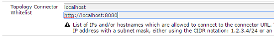

# Offloader voor werkstroom van middelen{#assets-workflow-offloader}

Met de Offloader van de workflow Middelen kunt u meerdere instanties van Adobe Experience Manager (AEM) Assets inschakelen om de verwerkingsbelasting van de primaire instantie (leader) te verminderen. De verwerkingsbelasting wordt verdeeld over de instantie leader en de verschillende instanties offloader (worker) die u eraan toevoegt. Door de verwerkingsbelasting van elementen te verdelen, verhoogt u de efficiëntie en snelheid waarmee AEM Assets elementen verwerkt. Daarnaast kunt u speciale bronnen toewijzen om elementen van een bepaald MIME-type te verwerken. Bijvoorbeeld, kunt u een specifieke knoop in uw topologie toewijzen om de activa van InDesign slechts te verwerken.

## Offloader-topologie {#configure-offloader-topology} configureren

Gebruik Configuration Manager om de URL voor de instantie leader en de hostnamen van instanties van offloader toe te voegen voor verbindingsaanvragen voor de instantie leader.

1. Tik/klik op het AEM en kies **Gereedschappen** > **Bewerkingen** > **Webconsole** om Configuratiebeheer te openen.
1. Selecteer **Sling** > **Topologiebeheer** in de webconsole.

   

1. Tik/klik op de koppeling **Discovery.Oak Service** configureren op de pagina Topology Management.

   

1. Op de pagina van de Configuratie van de Dienst van de Ontdekking, specificeer de schakelaar URL voor de leaderinstantie in **de Schakelaar URLs van de Topologie** gebied.

   

1. Geef in het veld **Whitelist voor topologieconnector** IP-adres of hostnamen op van offloader-instanties die mogen worden verbonden met de leaderinstantie. Tik/klik **Opslaan**.

   

1. Als u de offloader-instanties wilt zien die zijn aangesloten op de leader-instantie, gaat u naar **Tools** > **Implementatie** > **Topology** en tikt/klikt u op de clusterweergave.

## Offloading {#disable-offloading} uitschakelen

1. Tik/klik op het AEM en kies **Extra** > **Implementatie** > **Offloaden**. Op de pagina **Offloading Browser** worden onderwerpen en de serverinstanties weergegeven die de onderwerpen kunnen gebruiken.

   

1. Schakel het *com/adobe/granite/workflow/offloading*-onderwerp op de leaderinstanties uit waarmee gebruikers communiceren om AEM middelen te uploaden of te wijzigen.

   

## Workflowdraagraketten configureren op de leaderinstantie {#configure-workflow-launchers-on-the-leader-instance}

Configureer workflowdraagprogramma&#39;s om de **DAM Update Asset Offloading**-workflow op de leaderinstantie te gebruiken in plaats van de **Dam Update Asset**-workflow.

1. Tik/klik op het AEM en kies **Tools** > **Workflow** > **Launchers** om de **Workflow Launchers**-console te openen.

   

1. Zoek de twee configuraties van Launcher met het gebeurtenistype **Gemaakt knooppunt** en **Gewijzigd knooppunt**, die de **DAM Update Asset**-workflow uitvoeren.
1. Voor elke configuratie, selecteer checkbox vóór het en tik/klik het **pictogram van Eigenschappen van de Mening** van de toolbar om **de Eigenschappen van de Lanceerinrichting** te tonen.

   

1. Kies in de lijst **Workflow** de optie **DAM-update Asset Offloading** en tik/klik op **Save**.

   

1. Tik/klik op het AEM en kies **Tools** > **Workflow** > **Modellen** om de pagina **Workflowmodellen** te openen.
1. Selecteer de **DAM Update Asset Offloading**-workflow en tik/klik **Edit** op de werkbalk om de details weer te geven.

   

1. Geef het contextmenu weer voor de stap **DAM Workflow Offloading** en kies **Edit**. Verifieer de ingang in **Taakonderwerp** gebied van **Algemene Argumenten** lusje van de configuratiedialoog.

   

## Schakel de draagraketten voor de workflow op offloader-instanties {#disable-the-workflow-launchers-on-the-offloader-instances} uit

Schakel de workflowdraagprogramma&#39;s uit die de **DAM Update Asset**-workflow op de leaderinstantie uitvoeren.

1. Tik/klik op het AEM en kies **Tools** > **Workflow** > **Launchers** om de **Workflow Launchers**-console te openen.

   

1. Zoek de twee configuraties van Launcher met het gebeurtenistype **Gemaakt knooppunt** en **Gewijzigd knooppunt**, die de **DAM Update Asset**-workflow uitvoeren.
1. Voor elke configuratie, selecteer checkbox vóór het en tik/klik het **pictogram van Eigenschappen van de Mening** van de toolbar om **de Eigenschappen van de Lanceerinrichting** te tonen.

   

1. In **Activeer **sectie, sleep de schuif om de werkschemalancerer onbruikbaar te maken en te tikken/klik **sparen** om het onbruikbaar te maken.

   

1. Upload elk element van het type afbeelding bij de instantie leader. Verifieer de duimnagels die voor de activa door de geverschuiven instantie worden geproduceerd en worden teruggevoerd.

