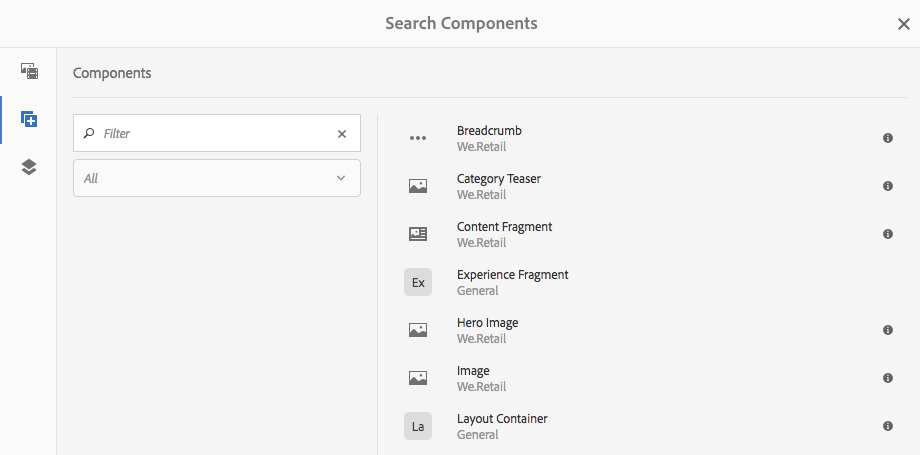
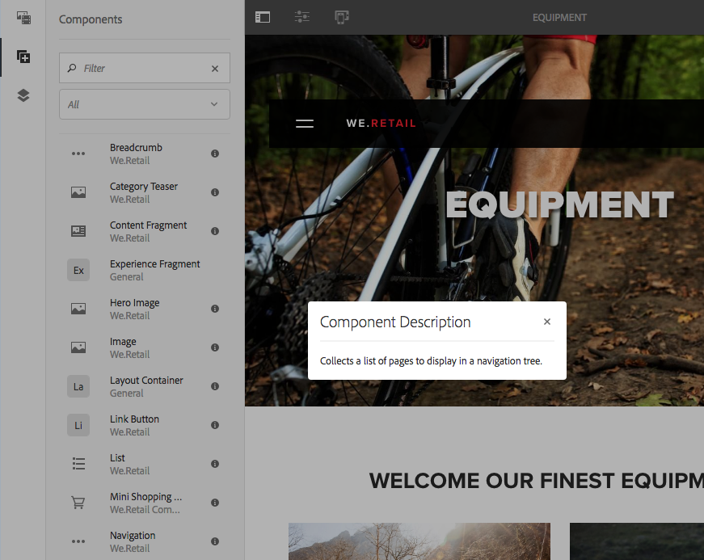
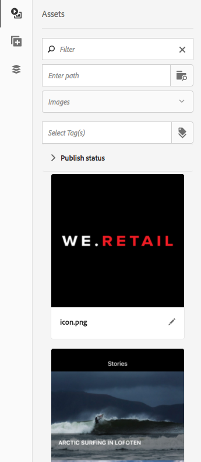
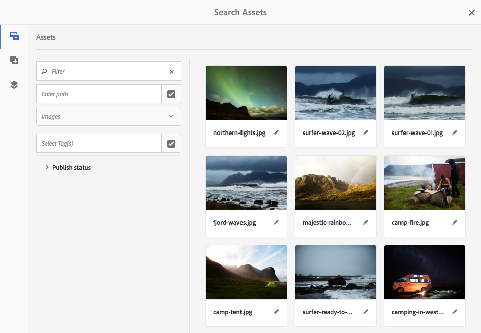
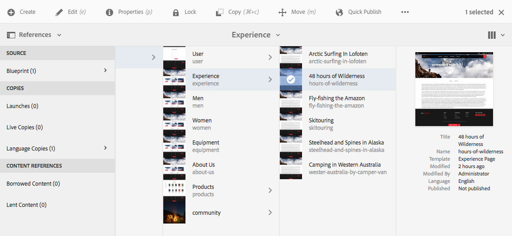
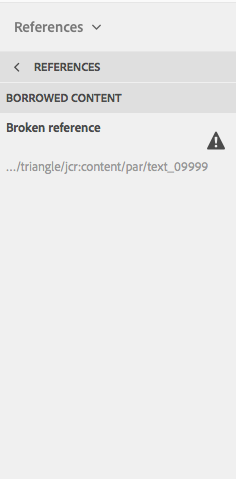
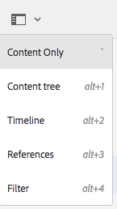
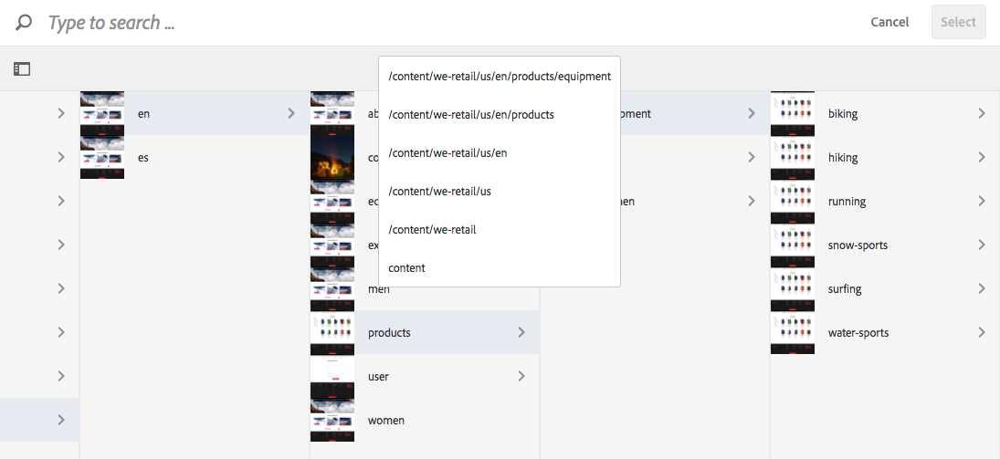
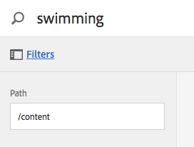

# Ontwerpomgeving en -gereedschappen{#authoring-the-environment-and-tools}

>[!CAUTION]
>
>AEM 6.4 heeft het einde van de uitgebreide ondersteuning bereikt en deze documentatie wordt niet meer bijgewerkt. Raadpleeg voor meer informatie onze [technische ondersteuningsperioden](https://helpx.adobe.com/support/programs/eol-matrix.html). Ondersteunde versies zoeken [hier](https://experienceleague.adobe.com/docs/).

De ontwerpomgeving van AEM biedt verschillende mechanismen voor het organiseren en bewerken van uw inhoud. De beschikbare gereedschappen zijn toegankelijk via de verschillende consoles en pagina-editors.

## Uw site beheren {#managing-your-site}

De **Sites** Met de console kunt u door uw website navigeren en deze beheren met de kopbalk, werkbalk, actiepictogrammen (van toepassing op de geselecteerde bron), broodkruimels en, indien geselecteerd, secundaire rails (bijvoorbeeld tijdlijn en verwijzingen).

Bijvoorbeeld de kaartweergave:

## Paginacontent bewerken {#editing-page-content}

U kunt een pagina bewerken met de pagina-editor. Bijvoorbeeld:

`http://localhost:4502/editor.html/content/we-retail/us/en/equipment.html`

>[!NOTE]
>
>De eerste keer dat u een pagina opent om te bewerken, wordt in een reeks dia&#39;s een overzicht van de functies weergegeven.
>
>U kunt de tour desgewenst overslaan en deze op elk gewenst moment herhalen door een keuze te maken in het menu **Pagina-informatie** -menu.

## Toegang tot Help {#accessing-help}

Bij het bewerken van een pagina **Help** kan worden benaderd via:

* de [**Pagina-informatie**](/help/sites-authoring/editing-page-properties.md#page-properties) kiezer; dit zal de inleidende dia&#39;s (zoals getoond de eerste keer u tot de redacteur toegang hebt) tonen.
* de [configuratie](/help/sites-authoring/editing-content.md#edit-configure-copy-cut-delete-paste) dialoog voor specifieke componenten (gebruiken ? pictogram in de dialoogwerkbalk); dit zal contextgevoelige hulp tonen .

Verdere [Help-gerelateerde bronnen zijn beschikbaar op consoles](/help/sites-authoring/basic-handling.md#accessing-help).

## Browser voor componenten {#components-browser}

De componentenbrowser toont alle componenten die voor gebruik op uw huidige pagina beschikbaar zijn. U kunt deze naar de juiste locatie slepen en vervolgens bewerken om uw inhoud toe te voegen.

De componentenbrowser is een tabblad in het zijpaneel (samen met de [assetbrowser](/help/sites-authoring/author-environment-tools.md#assets-browser) en de [contentstructuur](/help/sites-authoring/author-environment-tools.md#content-tree)). Als u het zijpaneel wilt openen (of sluiten), gebruikt u het pictogram linksboven op de werkbalk:

Als u het zijpaneel opent, wordt het van de linkerkant geopend (selecteer **Componenten** indien nodig). Wanneer u deze optie opent, kunt u door alle componenten bladeren die beschikbaar zijn voor de pagina.

De daadwerkelijke verschijning en behandeling zijn afhankelijk van het apparatentype u gebruikt:

>[!NOTE]
>
>Een mobiel apparaat wordt gedetecteerd wanneer de breedte minder dan 1024 px is. Dit kan ook het geval zijn voor een klein bureaubladvenster.

* **Mobiel apparaat (bijvoorbeeld iPad)**

   De componentenbrowser behandelt volledig de pagina die wordt uitgegeven.

   Als u componenten aan de pagina wilt toevoegen, houdt u de vereiste component ingedrukt en verplaatst u deze naar rechts (de componentenbrowser wordt dan gesloten om de pagina weer te geven). Hier kunt u de component plaatsen.

   

* **Bureaubladapparaat**

   De componentenbrowser wordt geopend bij de linkerkant van het venster.

   Als u een component aan de pagina wilt toevoegen, klikt u op de gewenste component en sleept u deze naar de gewenste locatie.

   

   Componenten worden vertegenwoordigd door

   * Componentnaam
   * Componentgroep (grijs)
   * Pictogram of afkorting

      * De standaardcomponentpictogrammen zijn monochroom.
      * Afkortingen zijn altijd de eerste twee tekens van de componentnaam.

   Van de hoogste toolbar in browser van Componenten kunt u:

   * Componenten filteren op naam.
   * Beperk de weergave tot een specifieke groep met behulp van de keuzelijst.

   Voor een meer gedetailleerde beschrijving van de component kunt u op het informatiepictogram naast de component in de Componentbrowser klikken of tikken (indien beschikbaar).

   

   Voor nog meer informatie over de componenten waarover u beschikt, ziet u de [Component Console](/help/sites-authoring/default-components-console.md).

## Browser voor middelen {#assets-browser}

In de middelenbrowser worden alle elementen weergegeven die beschikbaar zijn voor rechtstreeks gebruik op de huidige pagina.

De middelenbrowser is een tab in het zijpaneel samen met de [browse componenten](/help/sites-authoring/author-environment-tools.md#components-browser)r en [inhoudsstructuur](/help/sites-authoring/author-environment-tools.md#content-tree). Als u het zijpaneel wilt openen of sluiten, gebruikt u het pictogram linksboven op de werkbalk:

Wanneer u het zijpaneel opent, schuift het van de linkerkant open. Selecteer **Activa** indien nodig.

Wanneer de middelenbrowser is geopend, kunt u door alle elementen bladeren die beschikbaar zijn voor uw pagina. Met oneindig schuiven wordt de lijst indien nodig uitgevouwen.

Als u een element aan de pagina wilt toevoegen, selecteert u het element en sleept u het naar de gewenste locatie. Dit kan zijn:

* Een bestaand onderdeel van het desbetreffende type.

   * U kunt bijvoorbeeld een element van het type afbeelding naar een afbeeldingscomponent slepen.

* A [plaatsaanduiding](/help/sites-authoring/editing-content.md#component-placeholder) in het alineasysteem om een nieuw onderdeel van het juiste type te maken.

   * U kunt bijvoorbeeld een element van het type afbeelding naar het alineasysteem slepen om een component Image te maken.

>[!NOTE]
>
>Dit is beschikbaar voor specifieke elementen en componenttypen. Zie [Een component invoegen met de middelenbrowser](/help/sites-authoring/editing-content.md#inserting-a-component-using-the-assets-browser) voor meer informatie .

Vanuit de bovenste werkbalk van de middelenbrowser kunt u de elementen filteren op:

* Naam
* Pad
* Elementtype zoals afbeeldingen, manuscripten, documenten, video&#39;s, pagina&#39;s, alinea&#39;s en producten
* Kenmerken van middelen, zoals oriëntatie (staand, liggend, vierkant) en stijl (kleur, monochroom, grijswaarden)

   * Alleen beschikbaar voor bepaalde typen elementen

De daadwerkelijke verschijning en behandeling zijn afhankelijk van het apparatentype u gebruikt:

>[!NOTE]
>
>Een mobiel apparaat wordt ontdekt wanneer de breedte minder dan 1024px is; dat wil zeggen ook in een klein bureaubladvenster.

* **Mobiel apparaat zoals iPad**

   De elementenbrowser beslaat volledig de pagina die wordt bewerkt.

   Als u een element aan uw pagina wilt toevoegen, houdt u het vereiste element ingedrukt en verplaatst u het naar rechts. De elementenbrowser wordt dan gesloten en geeft de pagina weer, waar u het element aan de vereiste component kunt toevoegen.

   

* **Bureaubladapparaat**

   De middelenbrowser wordt links in het venster geopend.

   Als u een element aan de pagina wilt toevoegen, klikt u op het gewenste element en sleept u het naar de gewenste component of locatie.

   

Als u snel een wijziging in een element moet aanbrengen, kunt u de opdracht [middeleneditor](/help/assets/managing-assets-touch-ui.md) rechtstreeks vanuit de elementenbrowser door op het bewerkingspictogram naast de naam van het element te klikken.

## Inhoudsstructuur {#content-tree}

De **Inhoudsstructuur** geeft een overzicht van alle componenten op de pagina in een hiërarchie zodat u in een oogopslag kunt zien hoe de pagina is samengesteld.

De inhoudsstructuur is een tabblad in het zijpaneel (samen met de browser met componenten en elementen). Als u het zijpaneel wilt openen (of sluiten), gebruikt u het pictogram linksboven op de werkbalk:

Als u het zijpaneel opent, wordt het geopend (van de linkerkant). Selecteer **Inhoudsstructuur** indien nodig. Wanneer open kunt u een vertegenwoordiging van de boommening van uw pagina of malplaatje zien, zodat het gemakkelijker is om te begrijpen hoe zijn inhoud hiërarchisch gestructureerd is. Bovendien wordt het op een complexe pagina gemakkelijker om tussen componenten van de pagina te springen.

Een pagina kan gemakkelijk uit veel van hetzelfde type componenten bestaan, zodat in de componentstructuur beschrijvende tekst (grijs) achter de naam van het componenttype (in zwart) wordt weergegeven. De beschrijvende tekst is afkomstig uit gemeenschappelijke eigenschappen van de component, zoals titel of tekst.

Componenttypen worden weergegeven in de taal van de gebruiker, terwijl de tekst van de componentbeschrijving uit de paginataal komt.

Als u klikt op het chevron naast een component, wordt dat niveau samengevouwen of uitgevouwen.

Wanneer u op de component klikt, wordt de component in de pagina-editor gemarkeerd.

Als de component waarop u klikt in de structuur bewerkbaar is, wordt er een moersleutelpictogram rechts van de naam weergegeven. Als u op dit pictogram klikt, wordt het dialoogvenster Bewerken voor de component direct gestart.

>[!NOTE]
>
>De inhoudsstructuur is niet beschikbaar als u een pagina bewerkt op een mobiel apparaat (als de breedte van de browser minder dan 1024 px is).

## Fragmenten - gekoppelde inhoudsbrowser {#fragments-associated-content-browser}

Als uw pagina inhoudsfragmenten bevat, hebt u ook toegang tot de [browser voor gekoppelde inhoud](/help/sites-authoring/content-fragments.md#using-associated-content).

## Verwijzingen {#references}

**Verwijzingen** Hiermee geeft u verbindingen met de geselecteerde pagina weer:

* Blauwdrukken
* Lanceringen
* Live kopieën
* Taalkopieën
* Gebruik van de referentiecomponent
* Verwijzingen naar productpagina&#39;s (vanaf de console Handel - Producten)

Open de vereiste console, navigeer dan aan het vereiste middel en open **Verwijzingen** gebruiken:

[Selecteer uw vereiste bron](/help/sites-authoring/basic-handling.md#viewing-and-selecting-resources) om een lijst van verwijzingstypes te tonen relevant voor die bron:

Selecteer het juiste referentietype voor meer informatie. In bepaalde situaties zijn aanvullende acties beschikbaar wanneer u een specifieke verwijzing selecteert, zoals:

* Instanties van de component Reference (bijvoorbeeld navigeren naar de pagina waarnaar wordt verwezen of ernaar verwijst)
* [Verwijzingen naar productpagina&#39;s](/help/sites-administering/generic.md#showing-product-references) (beschikbaar bij de console Handel-Producten)
* [Lanceringen](/help/sites-authoring/launches.md)
* [Actieve kopieën](/help/sites-administering/msm.md) Hiermee geeft u de paden weer van alle live kopieën die op de geselecteerde bron zijn gebaseerd.
* [Blauwdruk](/help/sites-administering/msm-best-practices.md)
* [Kopieën van talen](/help/sites-administering/tc-manage.md#creating-translation-projects-using-the-references-panel)

U kunt bijvoorbeeld een verbroken verwijzing herstellen in een component Reference:

## Gebeurtenissen - tijdlijn {#events-timeline}

Voor de juiste bronnen (bv. pagina&#39;s van de **Sites** console, of middelen van de **Activa** console) de [tijdlijn kan worden gebruikt om de recente activiteit op om het even welke geselecteerde punten te tonen](/help/sites-authoring/basic-handling.md#timeline).

Open de vereiste console, navigeer dan aan het vereiste middel en open **Tijdlijn**, met:

[Selecteer uw vereiste bron](/help/sites-authoring/basic-handling.md#viewing-and-selecting-resources), dan ofwel **Alles tonen** of **Activiteiten** om recente acties op de geselecteerde middelen te vermelden:

## Pagina-informatie {#page-information}

Met het pictogram Pagina-informatie (equalizer) opent u een menu dat ook informatie bevat over de laatste bewerking en de laatste publicatie. Afhankelijk van de kenmerken van de pagina (en de bijbehorende site) zijn mogelijk meer of minder opties beschikbaar:

* [Eigenschappen openen](/help/sites-authoring/editing-page-properties.md)
* [Uitrolpagina](/help/sites-administering/msm.md#msm-from-the-ui)
* [Workflow starten](/help/sites-authoring/workflows-applying.md#starting-a-workflow-from-the-page-editor)
* [Pagina vergrendelen](/help/sites-authoring/editing-content.md#locking-a-page)
* [Pagina publiceren](/help/sites-authoring/publishing-pages.md#publishing-pages)
* [Publicatie van pagina ongedaan maken](/help/sites-authoring/publishing-pages.md#unpublishing-pages)
* [Weergeven als gepubliceerd](/help/sites-authoring/editing-content.md#view-as-published)
* [Weergeven in beheerder](/help/sites-authoring/basic-handling.md#viewing-and-selecting-resources)
* [Help](/help/sites-authoring/basic-handling.md#accessing-help)

Zo, indien van toepassing, **Pagina-informatie** heeft ook de volgende opties:

* [Starten bevorderen](/help/sites-authoring/launches-promoting.md) als de pagina een opstart is.
* [Sjabloon bewerken](/help/sites-authoring/templates.md) als de pagina is gebaseerd op een [bewerkbare sjabloon](/help/sites-authoring/templates.md#editable-and-static-templates)

* [Openen in klassieke gebruikersinterface](/help/sites-authoring/select-ui.md#switching-to-classic-ui-when-editing-a-page) als deze opties [ingeschakeld door een beheerder](/help/sites-administering/enable-classic-ui-editor.md)

Daarnaast **Pagina-informatie** waar nodig toegang kunnen verlenen tot analyses en aanbevelingen.

## Paginamodi {#page-modes}

Er zijn verschillende modi voor het bewerken van een pagina die verschillende handelingen mogelijk maken:

* [Bewerken](/help/sites-authoring/editing-content.md) - de modus die moet worden gebruikt bij het bewerken van de pagina-inhoud.
* [Layout](/help/sites-authoring/responsive-layout.md) - kunt u de responsieve lay-out afhankelijk van het apparaat maken en bewerken (als de pagina is gebaseerd op een lay-outcontainer)

* [Basisstructuur](/help/sites-authoring/scaffolding.md) - Help u een grote set pagina&#39;s te maken die dezelfde structuur hebben maar verschillende inhoud hebben.
* [Ontwikkelaar](/help/sites-developing/developer-mode.md) - kunt u verschillende handelingen uitvoeren (hiervoor zijn privileges vereist). Deze omvatten het inspecteren van de technische details van een pagina en de onderdelen ervan.

* [Ontwerp](/help/sites-authoring/default-components-designmode.md) - kunt u componenten voor gebruik op een pagina in- en uitschakelen en het ontwerp van de component configureren (als de pagina is gebaseerd op een [statische sjabloon](/help/sites-authoring/templates.md#editable-and-static-templates)).

* [Doelstelling](/help/sites-authoring/content-targeting-touch.md) - de relevantie van inhoud vergroten door de inhoud op alle kanalen te richten en te meten.
* [Activity Map](/help/sites-authoring/pa-using.md) - toont Analytische gegevens voor de pagina.

* [Timewarp](/help/sites-authoring/working-with-page-versions.md#timewarp) - kunt u een paginastaat op een bepaald tijdstip bekijken.
* [Status van live kopiëren](/help/sites-authoring/editing-content.md#live-copy-status) - maakt een snel overzicht mogelijk van de status van de live kopie en van de componenten die worden/worden overgeërfd.
* [Voorvertoning](/help/sites-authoring/editing-content.md#previewing-pages) - wordt gebruikt om de pagina weer te geven zoals deze wordt weergegeven in de publicatieomgeving; of om te navigeren met koppelingen in de inhoud.

* [Annoteren](/help/sites-authoring/annotations.md) - wordt gebruikt om annotaties op de pagina toe te voegen of weer te geven.

U kunt deze openen met de pictogrammen in de rechterbovenhoek. Het werkelijke pictogram verandert in de modus die u momenteel gebruikt:

>[!NOTE]
>
>* Afhankelijk van de kenmerken van de pagina zijn sommige modi mogelijk niet beschikbaar.
>* Voor toegang tot bepaalde modi zijn de juiste machtigingen/bevoegdheden vereist.
>* De modus Ontwikkelaar is niet beschikbaar op mobiele apparaten vanwege ruimtebeperkingen.
>* Er is een [sneltoets](/help/sites-authoring/page-authoring-keyboard-shortcuts.md) ( `Ctrl-Shift-M`) om te schakelen tussen **Voorvertoning** en de momenteel geselecteerde modus (bijvoorbeeld **Bewerken**, **Lay-out**, enz.).
>

## Padselectie {#path-selection}

Vaak is het tijdens het ontwerpen nodig een andere bron te selecteren, bijvoorbeeld wanneer u een koppeling naar een andere pagina of bron definieert of een afbeelding selecteert. Om een pad gemakkelijk te selecteren, [padvelden](/help/sites-authoring/author-environment-tools.md#path-fields) aanbieden en [padbrowser](/help/sites-authoring/author-environment-tools.md#path-browser) maakt een robuustere selectie mogelijk.

### Padvelden {#path-fields}

Het voorbeeld dat hier wordt gebruikt om te illustreren is de afbeeldingscomponent. Zie voor meer informatie over het gebruik en bewerken van componenten [Componenten voor paginaontwerp](/help/sites-authoring/default-components.md).

De gebieden van de weg hebben auto-volledige en blik-vooruit functionaliteit nu om het vinden van een middel gemakkelijker te maken. U begint gewoon te typen in het padveld en de AEM biedt overeenkomende paden terwijl u typt.

Klik op de knop **Dialoogvenster Selectie openen** in het veld Pad wordt de knop [padbrowser](/help/sites-authoring/author-environment-tools.md#path-browser) voor gedetailleerdere selectieopties.

### Padbrowser {#path-browser}

De padbrowser is geordend als de [kolomweergave](/help/sites-authoring/basic-handling.md#column-view) van de plaatsenconsole, die voor meer gedetailleerde selectie van middelen toestaat.

Wanneer een bron is geselecteerd, wordt de **Selecteren** in de rechterbovenhoek van het dialoogvenster wordt geactiveerd. Klik of tik om de selectie te bevestigen of **Annuleren** om af te breken.

Als de selectie van meerdere assets is toegestaan binnen de context, activeert het selecteren van een resource ook de knop Selecteren, maar wordt er ook een telling van het aantal geselecteerde resources in de rechterbovenhoek van het venster toegevoegd. Klik op de X naast het getal om de selectie op te heffen.

De broodkruimels kunnen worden gebruikt om snel binnen de middelhiërarchie te springen.

U kunt op elk gewenst moment het zoekveld boven in het dialoogvenster gebruiken.

Klik op de X in het zoekveld om de zoekopdracht te wissen.

Als u uw zoekopdracht wilt beperken, kunt u de filteropties zichtbaar maken en de resultaten filteren op basis van een bepaald pad.

## Sneltoetsen {#keyboard-shortcuts}

Diversen [sneltoetsen](/help/sites-authoring/page-authoring-keyboard-shortcuts.md) zijn beschikbaar.
