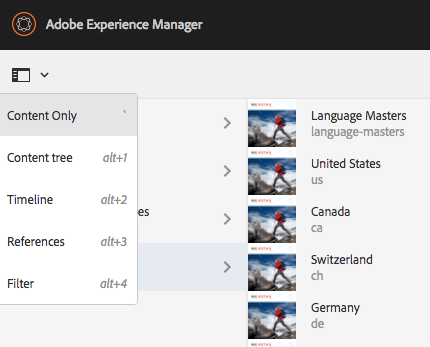
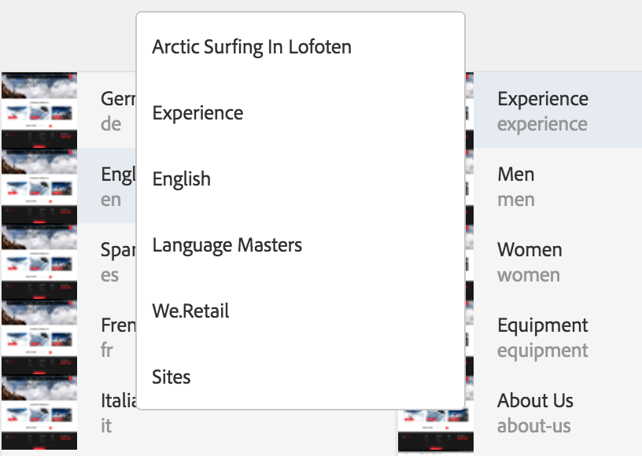
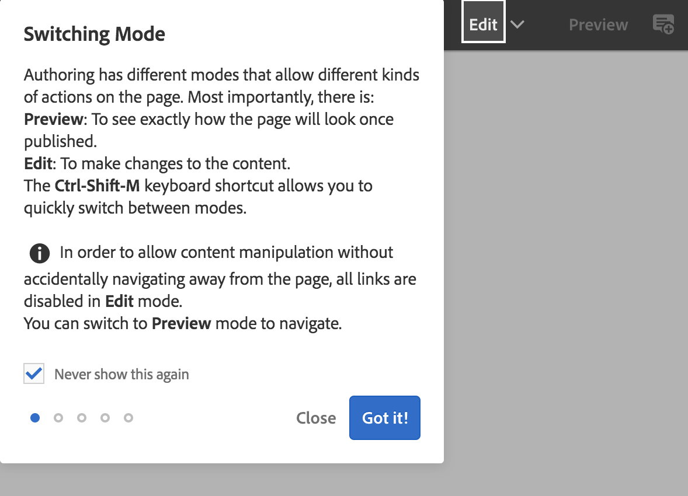
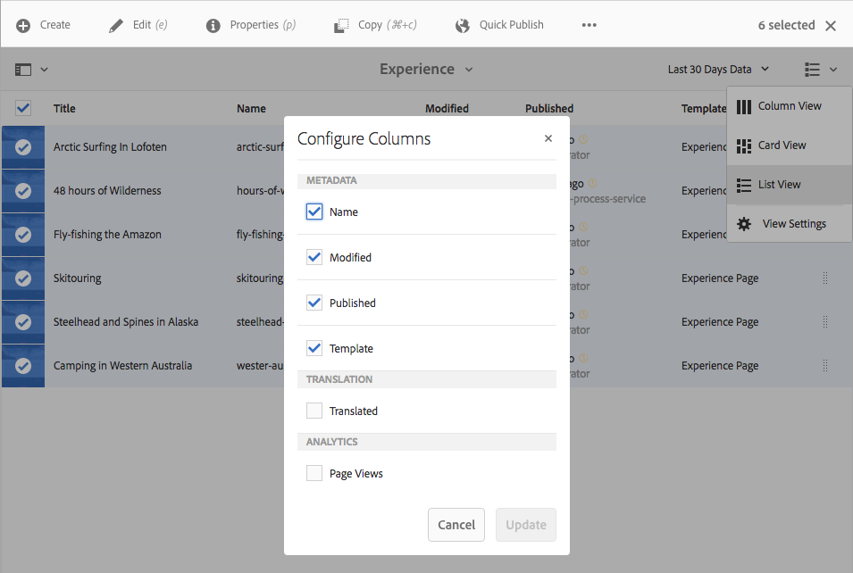
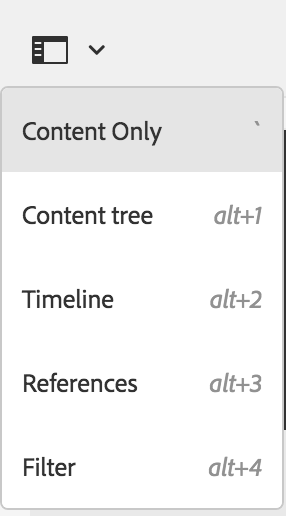

# Basisbewerkingen {#basic-handling}

>[!NOTE]
>
>* Deze pagina wordt ontworpen om een overzicht van basisbehandeling te geven wanneer het gebruiken van het AEM auteursmilieu. Het gebruikt de console van **Plaatsen** als basis.
   >
   >
* Sommige functionaliteit is niet beschikbaar in alle consoles en de extra functionaliteit kan in sommige consoles beschikbaar zijn. Specifieke informatie over de afzonderlijke consoles en de bijbehorende functionaliteit wordt op andere pagina&#39;s meer in detail behandeld.
>* De kortere weg van het toetsenbord is beschikbaar door AEM. Met name wanneer [consoles](/help/sites-authoring/keyboard-shortcuts.md) en [bewerkingspagina&#39;s](/help/sites-authoring/page-authoring-keyboard-shortcuts.md)worden gebruikt.
>

## Aan de slag {#getting-started}

### Een UI met aanraakfunctionaliteit {#a-touch-enabled-ui}

De gebruikersinterface van AEM is toegelaten voor aanraking. Met een aanraakinterface kunt u aanraking gebruiken om met de software te communiceren via gebaren zoals tikken, aanraken en vasthouden en zwemmen. Dit is in tegenstelling tot hoe een traditionele Desktopinterface met muisacties zoals klik, tweemaal klikken, met de rechtermuisknop aanklikken, en mouseover werkt. Omdat slechts gebaren worden vereist, is de aanraking-toegelaten UI volledig operationeel op mobiele tabletapparaten en heeft nog volledige functionaliteit op de Desktop eveneens.

### Eerste stappen {#first-steps}

Onmiddellijk na het programma openen komt u op het paneel van de [Navigatie](/help/sites-authoring/basic-handling.md#global-navigation)aan. Dit zal meer in detail in een volgende sectie worden besproken.

Het klikken op één van de opties opent de respectieve console. Om een goed inzicht in het basisgebruik van AEM te krijgen, is dit document gebaseerd op de console van **Plaatsen** .

Klik of tik op **Plaatsen** om begonnen te worden.

### Productnavigatie {#product-navigation}

Wanneer een gebruiker eerst tot een console toegang heeft, is een leerprogramma van de productnavigatie begonnen. Neem een minuut om te klikken of door te tikken om een goed overzicht van de basisbehandeling van AEM te krijgen.

Klik of tik **heb het!** om aan de volgende pagina van het overzicht vooruit te gaan. Klik of tik op **Sluiten** of klik of tik buiten het overzichtsvenster om te sluiten.

Het overzicht zal de volgende tijd opnieuw beginnen u tot een console toegang hebt tenzij u de optie controleert **nooit toont dit opnieuw**.

## Mondiale navigatie {#global-navigation}

U kunt tussen de consoles navigeren gebruikend het globale navigatiepaneel. Dit wordt teweeggebracht als het volledig-schermdaling neer wanneer u klikt of de verbinding van de Manager van de Ervaring van Adobe bij de top-linkervan het scherm tikt.

U kunt het globale navigatiepaneel sluiten door te klikken of **dicht** te tikken om aan uw vorige plaats terug te keren.

>[!NOTE]
>
>Wanneer u eerst login u met het paneel van de **Navigatie** voorlegde.

De globale navigatie heeft twee panelen, die door pictogrammen bij de linkermarge van het scherm worden vertegenwoordigd:

* **Navigatie** - vertegenwoordigd door een kompas
* **Gereedschap** - Weergegeven door een hamer

De opties beschikbaar op deze panelen worden hieronder beschreven.

1. Het deelvenster Navigatie:

   

   Van navigatie zijn de beschikbare consoles:

<table> 
 <tbody>
  <tr>
   <td><strong>Console</strong></td> 
   <td><strong>Doel</strong></td> 
  </tr>
  <tr>
   <td>Assets  </td> 
   <td>Deze consoles laten u digitale activa <a href="/help/assets/assets.md">zoals beelden, video's, documenten en audiodossiers invoeren en</a> beheren. Deze activa kunnen dan door om het even welke website worden gebruikt die op de zelfde AEM instantie loopt. </td> 
  </tr>
  <tr>
   <td>Gemeenschappen</td> 
   <td>Deze console staat u toe om <a href="/help/communities/sites-console.md">communautaire plaatsen</a> voor <a href="/help/communities/overview.md#engagement-community">overeenkomst</a> en <a href="/help/communities/overview.md#enablement-community">enablement</a>tot stand te brengen en te beheren.</td> 
  </tr>
  <tr>
   <td>Handel</td> 
   <td>Dit staat u toe om producten, productcatalogi en orden te beheren met betrekking tot uw plaatsen van de <a href="/help/sites-administering/ecommerce.md">Handel</a> .</td> 
  </tr>
  <tr>
   <td>Ervaringsfragmenten</td> 
   <td>Een <a href="/help/sites-authoring/experience-fragments.md">ervaringsfragment</a> is een stand-alone ervaring die kan over kanalen opnieuw worden gebruikt en variaties hebben, die het probleem besparen van herhaaldelijk het kopiëren van en het kleven van ervaringen of delen van ervaringen.</td> 
  </tr>
  <tr>
   <td>Formulieren</td> 
   <td>Met deze console kunt u uw <a href="/help/forms/using/introduction-aem-forms.md">formulieren en documenten</a>&gt; maken, beheren en verwerken.</td> 
  </tr>
  <tr>
   <td>Personalisatie</td> 
   <td>Deze console verstrekt een <a href="/help/sites-authoring/personalization.md">kader van hulpmiddelen om gerichte inhoud te ontwerpen en gepersonaliseerde ervaringen</a>voor te stellen.</td> 
  </tr>
  <tr>
   <td>Projecten</td> 
   <td>De console van <a href="/help/sites-authoring/touch-ui-managing-projects.md">Projecten geeft u directe toegang tot uw projecten</a>. De projecten zijn virtuele dashboards. Zij kunnen worden gebruikt om een team te bouwen, dan dat teamtoegang tot middelen, werkschema's en taken te geven, die mensen toestaan om aan een gemeenschappelijk doel te werken.   </td> 
  </tr>
  <tr>
   <td>Sites</td> 
   <td>Met de Sites-consoles kunt u websites  maken, bekijken en beheren die op uw AEM-instantie worden uitgevoerd. Door deze consoles kunt u websitepagina's creëren, uitgeven, kopiëren, bewegen en schrappen, werkschema's beginnen, en pagina's publiceren.  </td> 
  </tr>
 </tbody>
</table>

1. In het paneel van Hulpmiddelen, bevat elke optie in het zijpaneel een waaier van sub-menu&#39;s. De hier beschikbare consoles [van](/help/sites-administering/tools-consoles.md) Hulpmiddelen verlenen toegang tot een aantal gespecialiseerde hulpmiddelen en consoles die u helpen uw websites, digitale activa en andere aspecten van uw inhoudsbewaarplaats beheren.

   

## De Kopbal {#the-header}

De kopbal is altijd aanwezig bij de bovenkant van het scherm. Terwijl de meeste opties in de kopbal het zelfde blijven geen kwestie waar u in het systeem bent, zijn sommigen context-specifiek.

* [Mondiale navigatie](#global-navigation)

   Selecteer de verbinding van de Manager **van de Ervaring van** Adobe om tussen consoles te navigeren.

   

* [Zoeken](/help/sites-authoring/search.md)

   

   U kunt de [kortere wegsleutel](/help/sites-authoring/keyboard-shortcuts.md) `/` (voorwaartse schuine streep) ook gebruiken om onderzoek van om het even welke console aan te halen.

* [Help](#accessing-help)

   

* [Oplossingen voor marketingclouds](https://www.adobe.com/marketing-cloud.html)

   

* [Kennisgevingen](/help/sites-authoring/inbox.md)

   

   Dit pictogram zal met het aantal momenteel toegewezen onvolledige berichten worden gemerkt.

   >[!NOTE]
   >
   >De uit-van-de-doos AEM komt pre-geladen met administratieve taken die aan de groep van de beheerdergebruiker worden toegewezen. Zie [Uw Inbox - uit-van-de-doos Administratieve Taken](/help/sites-authoring/inbox.md#out-of-the-box-administrative-tasks) voor details.

* [Gebruikerseigenschappen](/help/sites-authoring/user-properties.md)

   

* [Spoorwegkeuzeschakelaar](/help/sites-authoring/basic-handling.md#rail-selector)

   

   De voorgestelde opties hangen van uw huidige console af. Bijvoorbeeld, in **Plaatsen** kunt u inhoud slechts selecteren (het gebrek), de chronologie, de verwijzingen of het paneel van de filterkant.

   

* Breadcrumbs

   

   In het midden van de spoorstaaf, en altijd tonend de beschrijving van het momenteel geselecteerde punt, staan de broodkruimels u toe om binnen een specifieke console te navigeren. In de console van Plaatsen, kunt u door de niveaus van uw website navigeren.

   Klik eenvoudig op de broodkruimeltekst om een drop-down lijst te tonen van de niveaus van de hiërarchie van het momenteel geselecteerde punt. Klik op een ingang om aan die plaats te springen.

   

* Selectie van de analyseperiode

   

   Dit is beschikbaar in lijstmening slechts. Zie [lijstweergave](#list-view) voor meer informatie.

* **Knop** maken

   

   Zodra geklikt, zijn de getoonde opties aangewezen aan de console/context.

* [Weergaven](/help/sites-authoring/basic-handling.md#viewing-and-selecting-resources)

   

   U kunt tussen kolommening, kaartmening, lijstmening en de meningsmontages schakelen.

   

## Toegang tot Hulp {#accessing-help}

Er zijn diverse beschikbare hulpmiddelen:

* **Console-werkbalk**

   Afhankelijk van uw plaats zal het pictogram van de **Hulp** de aangewezen middelen openen:

   

* **Navigatie**

   De eerste keer dat u door het systeem navigeert, introduceert [een reeks dia&#39;s navigatie](/help/sites-authoring/basic-handling.md#product-navigation)AEM.

* **Paginaeditor**

   De eerste keer u uitgeeft een pagina een reeks dia&#39;s introduceert de paginaledacteur.

   

   Navigeer dit overzicht aangezien u het overzicht [van de](/help/sites-authoring/basic-handling.md#product-navigation) productnavigatie wanneer eerst het toegang hebben tot van om het even welke console zou.

   Van het menu van de Informatie [**van de **Pagina kunt u** Hulp **](/help/sites-authoring/author-environment-tools.md#accessing-help)selecteren om dit op elk ogenblik opnieuw te tonen.

* **Tools Console**

   Van de console van **Hulpmiddelen** kunt u tot de externe **Middelen** ook toegang hebben:

   * **Documentatie** Bekijk de documentatie van het Beheer van de Ervaring van het Web

   * **De middelen van de Ontwikkelaar van de Middelen** en de downloads van de Ontwikkelaar
   >[!NOTE]
   >
   >U kunt tot een overzicht van kortere wegsleutels toegang hebben beschikbaar op elk ogenblik gebruikend hotkey `?` (vraagteken) wanneer in een console.
   >
   >Voor een overzicht van alle toetsenbordkortere weg zie de volgende documentatie:
   >
   >* [Sneltoetsen voor het bewerken van pagina&#39;s](/help/sites-authoring/page-authoring-keyboard-shortcuts.md)
   >* [Sneltoetsen voor consoles](/help/sites-authoring/keyboard-shortcuts.md)

## Werkbalk Handelingen {#actions-toolbar}

Wanneer een bron wordt geselecteerd (bijvoorbeeld een pagina of een element), worden verschillende acties aangegeven met pictogrammen met een verklarende tekst op de werkbalk. Deze acties zijn afhankelijk van:

* De huidige console.
* De huidige context.
* Of u op [selectiewijze](#viewing-and-selecting-resources)bent.

De actie beschikbaar in de toolbarverandering om op de acties te wijzen u de specifieke geselecteerde punten kunt nemen.

Hoe u een middel  selecteert hangt van de mening af.

Wegens de ruimtebeperkingen in sommige vensters, kan de toolbar snel langer worden dan de beschikbare ruimte. Wanneer dit gebeurt, worden extra opties weergegeven. Het klikken of het tikken op de ellips (de drie punten of **...**) opent een daling onderaan selecteur die alle resterende acties houdt. Bijvoorbeeld, na het selecteren van een pagina in de console van **Plaatsen** :

>[!NOTE]
>
>De individuele beschikbare pictogrammen zijn gedocumenteerd met betrekking tot de aangewezen console/de eigenschap/het scenario.

## Snelle acties {#quick-actions}

In de Mening [van de](#quick-actions) Kaart zijn bepaalde acties beschikbaar als snelle actiepictogrammen evenals het zijn op de toolbar. De snelle actiepictogrammen zijn beschikbaar voor één enkel punt tegelijkertijd en elimineren de behoefte aan u om te selecteren.

De snelle acties zijn zichtbaar wanneer u over (Desktopapparaat) een middelkaart spreekt. De snelle beschikbare acties kunnen van de console en de context afhangen. Bijvoorbeeld, hier zijn de snelle acties voor een pagina in de console van **Plaatsen** :

## Bronnen bekijken en selecteren {#viewing-and-selecting-resources}

Het bekijken, het navigeren, en het selecteren zijn elk conceptueel het zelfde over alle meningen, maar hebben kleine variaties in behandeling, afhankelijk van de mening u gebruikt.

U kunt bekijken, door navigeren, en selecteren (voor verdere actie) uw middelen met om het even welke beschikbare meningen, elk waarvan door het pictogram bij het hoogste recht kan worden geselecteerd:

* [Kolomweergave](#column-view)
* [Kaartweergave](#card-view)

* [Lijstweergave](#list-view)

>[!NOTE]
>
>Door gebrek, tonen de Activa AEM niet de originele rendities van activa in UI als duimnagels in om het even welke meningen. Als u een beheerder bent, kunt u bekledingen gebruiken om activa te vormen AEM om originele vertolkingen als duimnagels te tonen.

### Bronnen selecteren {#selecting-resources}

Het selecteren van een specifiek middel is afhankelijk van een combinatie van de mening en het apparaat:

<table> 
 <tbody>
  <tr>
   <td> </td> 
   <td>Selecteer</td> 
   <td>Selectie ongedaan maken</td> 
  </tr>
  <tr>
   <td>Kolomweergave  </td> 
   <td>
    <ul> 
     <li>Desktop:  Klik op de miniatuur</li> 
     <li>Mobiel apparaat:  Tik op de miniatuur</li> 
    </ul> </td> 
   <td>
    <ul> 
     <li>Desktop:  Klik op de miniatuur</li> 
     <li>Mobiel apparaat:  Tik op de miniatuur</li> 
    </ul> </td> 
  </tr>
  <tr>
   <td>Kaartweergave  </td> 
   <td>
    <ul> 
     <li>Desktop:  Mouseover, dan gebruik het vinkje snelle actie</li> 
     <li>Mobiel apparaat:  Tik en houd de kaart ingedrukt</li> 
    </ul> </td> 
   <td>
    <ul> 
     <li>Desktop:  Klik op de kaart</li> 
     <li>Mobiel apparaat:  Tik op de kaart</li> 
    </ul> </td> 
  </tr>
  <tr>
   <td>Lijstweergave</td> 
   <td>
    <ul> 
     <li>Desktop:  Klik op de miniatuur</li> 
     <li>Mobiel apparaat:  Tik op de miniatuur</li> 
    </ul> </td> 
   <td>
    <ul> 
     <li>Desktop:  Klik op de miniatuur</li> 
     <li>Mobiel apparaat:  Tik op de miniatuur</li> 
    </ul> </td> 
  </tr>
 </tbody>
</table>

#### Alles verwijderen {#deselecting-all}

In alle gevallen zoals u punten selecteert, wordt de telling van de geselecteerde punten getoond bij het hoogste recht van de toolbar.

U kunt alle punten schrappen en de wijze van de uitgangsselectie door X naast de telling te klikken of te tikken.

In alle meningen, kunnen alle punten worden weerspiegeld door vlucht op het toetsenbord te tikken als u een Desktopapparaat gebruikt.

#### Voorbeeld selecteren {#selecting-example}

1. Bijvoorbeeld in kaartweergave:

   

1. Zodra u een middel hebt geselecteerd, wordt de hoogste kopbal behandeld door de [actiestoolbar](#actions-toolbar) die toegang tot acties verleent die momenteel op het geselecteerde middel van toepassing zijn.

   Om selectiewijze weg te gaan selecteer **X** aan het hoogste recht.

### Kolomweergave {#column-view}

De kolommening staat voor een visuele navigatie van een inhoudsboom door een reeks draperende kolommen toe. Deze mening staat u toe om de boomstructuur van uw website te visualiseren en over te steken.

Het selecteren van een middel in de uiterst linkse kolom zal de kindmiddelen in een kolom aan het recht tonen. Het selecteren van een middel in de juiste kolom zal dan de kindmiddelen in een andere kolom aan het recht tonen etc.

* U kunt naar boven en naar onder in de boom navigeren door op de middelnaam of de chevron rechts van de middelnaam te tikken of te klikken.

   * De middelnaam en chevron zullen worden benadrukt wanneer geplapt of geklikt.
   

   * De kinderen van het geklikte/geplakte middel worden getoond in de kolom rechts van het geklikte/geplakte middel.
   * Als u tikt of op een middelnaam klikt die geen kinderen heeft, zullen zijn details in de definitieve kolom worden getoond.

* Het aftappen of het klikken op de duimnagel selecteert het middel.

   * Wanneer geselecteerd, zal een controleteken op de duimnagel worden beschreven en de middelnaam zal eveneens worden benadrukt.
   * De details van het geselecteerde middel zullen in de definitieve kolom worden getoond.
   

   Wanneer een pagina in kolommening wordt geselecteerd, wordt de geselecteerde pagina getoond in de definitieve kolom samen met de volgende details:

   * Paginatitel
   * Paginanaam (deel van URL van de pagina)
   * Template waarop de pagina is gebaseerd
   * Laatst gewijzigde datum
   * Laatste gebruiker om pagina te wijzigen
   * Paginataal
   * Publicatiestatus

### Kaartweergave {#card-view}

* De de meningsvertoningeninformatiekaarten van de kaart voor elk punt op het huidige niveau. Deze bevatten informatie zoals:

   * Een visuele vertegenwoordiging van de paginainhoud.
   * De paginatitel.
   * Belangrijke data (zoals laatst bewerkt, laatst gepubliceerd).
   * Als de pagina gesloten, verborgen of een deel van een livecopy is.
   * Indien nodig, wanneer u actie als deel van een werkschema moet ondernemen.

      * De tellers die op vereiste acties wijzen kunnen met ingangen in uw [Postbus](/help/sites-authoring/inbox.md)worden verwant.

* [De snelle acties](#quick-actions) zijn ook beschikbaar in deze mening zoals selectie en gemeenschappelijke acties zoals uitgeven.

   

* U kunt onderaan de boom navigeren door te tikken/op kaarten te klikken (die zorg nemen om de snelle acties te vermijden) of omhoog opnieuw door de [broodkruimels in de kopbal](/help/sites-authoring/basic-handling.md#the-header)te gebruiken.

### Lijstweergave {#list-view}

* De lijstmening maakt een lijst van informatie voor elk middel op het huidige niveau.
* U kunt onderaan door de boom navigeren door te tikken/op de middelnaam en file te klikken door de [broodkruimels in de kopbal](/help/sites-authoring/basic-handling.md#the-header)te gebruiken.

* Om alle punten in de lijst gemakkelijk te selecteren, gebruik checkbox bij de bovenkant-linkerzijde van de lijst.

   

   * Wanneer alle items in de lijst zijn geselecteerd, wordt dit selectievakje ingeschakeld weergegeven.

      * Klik of tik checkbox om allen te schrappen.
   * Wanneer slechts sommige punten worden geselecteerd, verschijnt het met een minteken.

      * Klik of tik checkbox om allen te selecteren.
      * Klik of tik opnieuw checkbox om allen te schrappen.

* Selecteer de kolommen die moeten worden getoond gebruikend **de Montages van de Mening **optie die onder de knoop van Meningen wordt gevestigd. De volgende kolommen zijn beschikbaar voor vertoning:

   * **Naam** - De naam van de pagina, die in een meertalige auteursmilieu nuttig kan zijn aangezien het deel van URL van de pagina uitmaakt en ongeacht taal niet verandert
   * **Gewijzigd** - Laatste gewijzigde datum en het laatst gewijzigd door gebruiker
   * **Gepubliceerd** - Status publicatie
   * **Template** - Sjabloon waarop de pagina is gebaseerd
   * **Paginaanalyse**
   * **Unieke bezoekers**
   * **Tijd op pagina**
   

   Door gebrek wordt de kolom van de **Naam** getoond, die omhoog een deel van URL voor de pagina maakt. In sommige gevallen zou de auteur tot pagina&#39;s kunnen moeten toegang hebben die in een verschillende taal zijn en het zien van de naam van de pagina (die gewoonlijk onveranderlijk is) kan van grote hulp zijn als de auteur niet de taal van de pagina kent.

* Verander de orde van punten gebruikend de gestippelde verticale bar uiterst rechts van elk punt in de lijst.

>[!NOTE]
>
>Het veranderen van de orde werkt slechts binnen een bevolen omslag die waarde als `jcr:primaryType` `sling:OrderedFolder`heeft.

Klik of tik op de verticale selectiebar en sleep het punt in een nieuwe positie in de lijst.

* U kunt de Gegevens van de Analyse tonen door de aangewezen kolommen te tonen gebruikend de dialoog van de Montages van de Mening.

   U kunt de Gegevens van de Anyltiek voor de afgelopen 30, 90, of 365 dagen filtreren gebruikend de filteropties op de rechterkant van de kopbal.

   

## Spoorwegkiezer {#rail-selector}

De **railkiezer** is beschikbaar linksboven in het venster en geeft opties weer, afhankelijk van uw huidige consoles.

Bijvoorbeeld, in Plaatsen kunt u inhoud slechts selecteren (het gebrek), inhoudsboom, de chronologie, de verwijzingen, of het paneel van de filterkant.

Als de inhoud slechts wordt geselecteerd, dan slechts verschijnt het spoorpictogram. Wanneer een andere optie wordt geselecteerd, verschijnt de optienaam naast het spoorpictogram.

>[!NOTE]
>
>[De kortere weg](/help/sites-authoring/keyboard-shortcuts.md) van het toetsenbord is beschikbaar om tussen de opties van de spoorvertoning snel te schakelen.

### Inhoudsstructuur {#content-tree}

De inhoudsboom kan worden gebruikt om de plaatshiërarchie binnen het zijpaneel snel te navigeren en veel informatie over de pagina&#39;s in de huidige omslag te bekijken.

Gebruikend het de zijpaneel van de inhoudsboom samen met een lijstmening of kaartmening, kunnen de gebruikers de hiërarchische structuur van het project gemakkelijk zien en gemakkelijk over de inhoudsstructuur met het zijpaneel van de inhoudsboom navigeren, evenals mening gedetailleerde paginamedia in de lijstmening.

>[!NOTE]
>
>Zodra een ingang in de hiërarchiemening wordt geselecteerd, kunnen de pijlsleutels worden gebruikt om de hiërarchie snel te navigeren.
>
>Raadpleeg de [sneltoetsen](/help/sites-authoring/keyboard-shortcuts.md) voor meer informatie.

### Tijdschema {#timeline}

De chronologie kan worden gebruikt om gebeurtenissen te bekijken en/of in werking te stellen die op het geselecteerde middel zijn voorgekomen. Om de chronologiekolom te openen gebruik de spoorselecteur:

De chronologiekolom staat u toe om:

* Diverse gebeurtenissen weergeven die betrekking hebben op een geselecteerd item.

   * De gebeurtenistypes kunnen uit de drop-down lijst worden geselecteerd:

      * [Opmerkingen](#TimelineAddingandViewingComments)
      * Annotaties
      * Activiteiten
      * [Lanceringen](/help/sites-authoring/launches.md)
      * [Versies](/help/sites-authoring/working-with-page-versions.md)
      * [Workflows](/help/sites-authoring/workflows-applying.md)

         * met uitzondering van [voorbijgaande werkschema&#39;s](/help/sites-developing/workflows.md#transient-workflows) aangezien geen geschiedenisinformatie voor deze wordt bewaard
      * en Alle weergeven

* [Voeg/bekijk commentaren](#TimelineAddingandViewingComments) over het geselecteerde punt toe. Het **vakje van de Commentaar** wordt getoond bij de bodem van de lijst van gebeurtenissen. Als u een opmerking typt die wordt gevolgd door Terugkeer, wordt de opmerking geregistreerd. Het wordt getoond wanneer de **Commentaren** of **tonen allen** worden geselecteerd.

* Specifieke consoles hebben extra functionaliteit. Bijvoorbeeld, in de console van Plaatsen kunt u:

   * [Sla een versie](/help/sites-authoring/working-with-page-versions.md)op.
   * [Start een werkstroom](/help/sites-authoring/workflows-applying.md).

Deze opties zijn toegankelijk via de chevron naast het veld **Comment** .

### Referenties {#references}

**De verwijzingen** tonen om het even welke verbindingen aan het geselecteerde middel. Bijvoorbeeld, in de de **consoleverwijzingen** van Plaatsen  voor pagina&#39;s toont:

* [Lanceringen](/help/sites-authoring/launches.md#launches-in-references-sites-console)
* [Live kopieën](/help/sites-administering/msm-livecopy-overview.md)
* [Taalkopieën](/help/sites-administering/tc-prep.md#seeing-the-status-of-language-roots)
* Verwijzingen naar inhoud (bv. door de referentiecomponent geleende en/of geleende inhoud)

### Filter {#filter}

Dit zal een paneel openen gelijkend op [onderzoek](/help/sites-authoring/search.md) met de aangewezen reeds geplaatste plaatsfilters, toestaand u om de inhoud verder te filtreren u wenst te bekijken.

