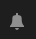
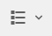
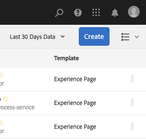
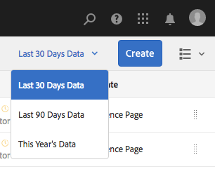

# Basisbewerkingen {#basic-handling}

>[!NOTE]
>
>* Deze pagina is ontworpen om een overzicht van basisbehandeling te geven wanneer het gebruiken van het AEM auteursmilieu. Het gebruikt de **Sites** console als basis.
   >
   >
* Bepaalde functionaliteit is niet in alle consoles beschikbaar en in sommige consoles is mogelijk aanvullende functionaliteit beschikbaar. Specifieke informatie over de afzonderlijke consoles en de bijbehorende functionaliteit zal op andere pagina&#39;s nader worden besproken.
>* Sneltoetsen zijn beschikbaar in alle AEM. Met name wanneer [consoles](/help/sites-authoring/keyboard-shortcuts.md) en [pagina&#39;s bewerken](/help/sites-authoring/page-authoring-keyboard-shortcuts.md).

>

## Aan de slag {#getting-started}

### Een interface met aanraakbediening {#a-touch-enabled-ui}

AEM gebruikersinterface is ingeschakeld voor aanraking. Met een interface met aanraakbediening kunt u aanrakingen gebruiken om met de software te communiceren via bewegingen zoals tikken, aanraken en vasthouden en vegen. Dit staat in contrast met de manier waarop een traditionele bureaubladinterface werkt met muishandelingen zoals klikken, dubbelklikken, met de rechtermuisknop klikken en mouseover. Omdat alleen gebaren vereist zijn, is de interface met aanraakbediening volledig operationeel op mobiele tablets en heeft deze ook nog volledige functionaliteit op het bureaublad.

### Eerste stappen {#first-steps}

Vlak nadat u zich hebt aangemeld, gaat u naar het [Navigatievenster](/help/sites-authoring/basic-handling.md#global-navigation). Dit zal meer in detail in een volgende sectie worden besproken.

Als u op een van de opties klikt, wordt de bijbehorende console geopend. Voor een goed inzicht in het basisgebruik van AEM is dit document gebaseerd op de console **Sites**.

Klik of tik op **Sites** om aan de slag te gaan.

### Productnavigatie {#product-navigation}

Wanneer een gebruiker eerst tot een console toegang heeft, wordt een zelfstudie over productnavigatie gestart. Neem een minuut om te klikken of door te tikken voor een goed overzicht van de basisbehandeling van AEM.

Klik of tik **Ik heb het!** om naar de volgende pagina van het overzicht te gaan. Klik of tik **Close** of klik of tik buiten het overzichtsdialoogvenster om te sluiten.

Het overzicht zal de volgende keer opnieuw beginnen u tot een console toegang hebt tenzij u de optie **nooit toont dit opnieuw**.

## Algemene navigatie {#global-navigation}

U kunt tussen de consoles navigeren met het algemene navigatievenster. Dit wordt geactiveerd als een vervolgkeuzelijst met volledig scherm wanneer u op de Adobe Experience Manager-koppeling klikt of tikt linksboven in het scherm.

U kunt het globale navigatievenster sluiten door **Close** te klikken of te tikken om naar uw vorige plaats terug te keren.

>[!NOTE]
>
>Wanneer u zich voor het eerst aanmeldt, hebt u het deelvenster **Navigatie** weergegeven.

Globale navigatie heeft twee deelvensters, die door pictogrammen bij de linkermarge van het scherm worden vertegenwoordigd:

* **Navigation**  - Vertegenwoordigd door een kompas
* **Gereedschappen**  - voorgesteld door een hamer

De opties in deze deelvensters worden hieronder beschreven.

1. Het navigatievenster:

   

   Vanuit Navigatie zijn de beschikbare consoles:

<table> 
 <tbody>
  <tr>
   <td><strong>Console</strong></td> 
   <td><strong>Doel</strong></td> 
  </tr>
  <tr>
   <td>Assets  </td> 
   <td>Met deze consoles kunt u digitale elementen, zoals afbeeldingen, video's, documenten en audiobestanden, importeren en <a href="/help/assets/assets.md">beheren. </a> Deze elementen kunnen vervolgens worden gebruikt door elke website die op hetzelfde AEM wordt uitgevoerd. </td> 
  </tr>
  <tr>
   <td>Gemeenschappen</td> 
   <td>Met deze console kunt u <a href="/help/communities/sites-console.md">communitysites</a> maken en beheren voor <a href="/help/communities/overview.md#engagement-community">engagement</a> en <a href="/help/communities/overview.md#enablement-community">enablement</a>.</td> 
  </tr>
  <tr>
   <td>Handel</td> 
   <td>Hierdoor kunt u producten, productcatalogi en bestellingen beheren die verwant zijn aan uw <a href="/help/sites-administering/ecommerce.md">Commerciële</a>-sites.</td> 
  </tr>
  <tr>
   <td>Ervaringsfragmenten</td> 
   <td>Een <a href="/help/sites-authoring/experience-fragments.md">ervaringsfragment</a> is een stand-alone ervaring die over kanalen kan worden hergebruikt en variaties kan hebben, die het probleem van herhaaldelijk het kopiëren en het kleven ervaringen of delen van ervaringen bespaart.</td> 
  </tr>
  <tr>
   <td>Forms</td> 
   <td>Met deze console kunt u uw <a href="/help/forms/using/introduction-aem-forms.md">formulieren en documenten</a>&gt; maken, beheren en verwerken.</td> 
  </tr>
  <tr>
   <td>Personalisatie</td> 
   <td>Deze console biedt een <a href="/help/sites-authoring/personalization.md">framework van gereedschappen voor het ontwerpen van gerichte inhoud en het presenteren van gepersonaliseerde ervaringen</a>.</td> 
  </tr>
  <tr>
   <td>Projecten</td> 
   <td>De <a href="/help/sites-authoring/touch-ui-managing-projects.md">Projectconsole geeft u directe toegang tot uw projecten</a>. Projecten zijn virtuele dashboards. Zij kunnen worden gebruikt om een team te bouwen, dan dat teamtoegang tot middelen, werkschema's en taken te geven, die mensen toestaan om aan een gemeenschappelijk doel te werken.   </td> 
  </tr>
  <tr>
   <td>Sites</td> 
   <td>Met de Sites-consoles kunt u <a href="/help/sites-authoring/author-environment-tools.md">websites maken, weergeven en beheren</a> die op uw AEM-instantie worden uitgevoerd. Via deze consoles kunt u websitepagina's maken, bewerken, kopiëren, verplaatsen en verwijderen, workflows starten en pagina's publiceren.  </td> 
  </tr>
 </tbody>
</table>

1. In het deelvenster Gereedschappen bevat elke optie in het zijpaneel een reeks submenu&#39;s. Met de [Tools consoles](/help/sites-administering/tools-consoles.md) die hier beschikbaar zijn, hebt u toegang tot een aantal gespecialiseerde gereedschappen en consoles die u helpen uw websites, digitale middelen en andere aspecten van uw opslagplaats voor inhoud te beheren.

   

## De koptekst {#the-header}

De koptekst staat altijd boven aan het scherm. Hoewel de meeste opties in de koptekst ongewijzigd blijven, ongeacht waar u zich in het systeem bevindt, zijn sommige contextspecifiek.

* [Algemene navigatie](#global-navigation)

   Selecteer de koppeling **Adobe Experience Manager** om tussen consoles te navigeren.

   

* [Zoeken](/help/sites-authoring/search.md)

   

   U kunt de [kortere wegsleutel ](/help/sites-authoring/keyboard-shortcuts.md) `/` (voorwaartse schuine streep) ook gebruiken om onderzoek van om het even welke console aan te halen.

* [Help](#accessing-help)

   

* [Marketing Cloud-oplossingen](https://www.adobe.com/marketing-cloud.html)

   

* [Meldingen](/help/sites-authoring/inbox.md)

   

   Dit pictogram wordt gemarkeerd met het aantal momenteel toegewezen onvolledige meldingen.

   >[!NOTE]
   >
   >Uit-van-de-doos AEM wordt voorgeladen met administratieve taken die aan de groep van de beheerdergebruiker worden toegewezen. Zie [Uw Postvak In - uit-van-de-Doos Administratieve Taken](/help/sites-authoring/inbox.md#out-of-the-box-administrative-tasks) voor details.

* [Gebruikerseigenschappen](/help/sites-authoring/user-properties.md)

   

* [Spoorwegkiezer](/help/sites-authoring/basic-handling.md#rail-selector)

   

   Welke opties worden weergegeven, is afhankelijk van uw huidige console. In **Sites** kunt u bijvoorbeeld alleen inhoud selecteren (de standaardinstelling), de tijdlijn, verwijzingen of het filterzijpaneel.

   

* Broodkruimels

   

   In het midden van de spoorstaaf, en altijd tonend de beschrijving van het momenteel geselecteerde punt, staan de broodkruimels u toe om binnen een specifieke console te navigeren. In de console van Plaatsen, kunt u door de niveaus van uw website navigeren.

   Klik gewoon op de tekst van de broodkruimel om een vervolgkeuzelijst weer te geven met de niveaus van de hiërarchie van het momenteel geselecteerde item. Klik op een bericht om naar die locatie te gaan.

   

* Selectie van analysetijdsperiode

   

   Dit is alleen beschikbaar in de lijstweergave. Zie [lijstweergave](#list-view) voor meer informatie.

* **** CreateButton

   

   Zodra geklikt, zijn de getoonde opties aangewezen aan de console/de context.

* [Weergaven](/help/sites-authoring/basic-handling.md#viewing-and-selecting-resources)

   

   U kunt schakelen tussen de kolomweergave, de kaartweergave, de lijstweergave en de weergave-instellingen.

   

## Toegang tot Help {#accessing-help}

Er zijn verschillende beschikbare Help-bronnen:

* **Console, werkbalk**

   Afhankelijk van uw locatie worden met het pictogram **Help** de juiste bronnen geopend:

   

* **Navigatie**

   De eerste keer u navigeert het systeem, [een reeks dia&#39;s introduceert AEM navigatie](/help/sites-authoring/basic-handling.md#product-navigation).

* **Pagina-editor**

   De eerste keer dat u een pagina bewerkt, introduceert een reeks dia&#39;s de pagina-editor.

   

   Navigeer dit overzicht zoals u [productnavigatie overzicht](/help/sites-authoring/basic-handling.md#product-navigation) wanneer eerst het openen van om het even welke console.

   In het menu [**Pagina-informatie** kunt u **Help**](/help/sites-authoring/author-environment-tools.md#accessing-help) selecteren om dit op elk gewenst moment weer te tonen.

* **Tools Console**

   Via de **Tools**-console hebt u ook toegang tot de externe **Bronnen**:

   * ****
DocumentationView de documentatie van het Beheer van de Ervaring van het Web

   * **Bronnen en downloads voor ontwikkelaars**
ResourcesDeveloper
   >[!NOTE]
   >
   >U kunt tot een overzicht van kortere wegsleutels toegang hebben beschikbaar op elk ogenblik gebruikend hotkey `?` (vraagteken) wanneer in een console.
   >
   >Raadpleeg de volgende documentatie voor een overzicht van alle sneltoetsen:
   >
   >* [Sneltoetsen voor het bewerken van pagina&#39;s](/help/sites-authoring/page-authoring-keyboard-shortcuts.md)
   >* [Sneltoetsen voor consoles](/help/sites-authoring/keyboard-shortcuts.md)

## Werkbalk Handelingen {#actions-toolbar}

Wanneer een bron wordt geselecteerd (bijvoorbeeld een pagina of een element), worden verschillende handelingen aangegeven met pictogrammen met een verklarende tekst op de werkbalk. Deze acties zijn afhankelijk van:

* De huidige console.
* De huidige context.
* Of u zich in [selectiemodus](#viewing-and-selecting-resources) bevindt.

De actie die beschikbaar is op de werkbalk, wijzigt in de richting van de acties die u kunt uitvoeren op de specifieke geselecteerde items.

Hoe u [een middel ](/help/sites-authoring/basic-handling.md#viewing-and-selecting-resources) afhankelijk van de mening selecteert.

Vanwege de ruimtebeperkingen in sommige vensters kan de werkbalk snel langer worden dan de beschikbare ruimte. Als dit gebeurt, worden er extra opties weergegeven. Als u op het beletselteken (de drie stippen of **...**) klikt of tikt, wordt een vervolgkeuzelijst geopend met alle resterende acties. Nadat u bijvoorbeeld een pagina hebt geselecteerd in de **Sites**-console:

>[!NOTE]
>
>De afzonderlijke beschikbare pictogrammen worden gedocumenteerd met betrekking tot de juiste console/functie/scenario.

## Snelle handelingen {#quick-actions}

In [Kaartweergave](#quick-actions) zijn bepaalde handelingen beschikbaar als snelactiepictogrammen en bevinden deze zich op de werkbalk. Er zijn snelactiepictogrammen beschikbaar voor één item tegelijk, zodat u geen voorselectie hoeft te maken.

De snelle acties zijn zichtbaar wanneer u de muis boven een resourcepard (bureaubladapparaat) houdt. De snelle beschikbare acties kunnen van de console en de context afhangen. Hier ziet u bijvoorbeeld de snelle acties voor een pagina in de console **Sites**:

## Bronnen {#viewing-and-selecting-resources} weergeven en selecteren

Het bekijken, navigeren, en het selecteren zijn elk conceptueel het zelfde over alle meningen, maar hebben kleine variaties in behandeling, afhankelijk van de mening u gebruikt.

U kunt uw bronnen weergeven, doorbladeren en selecteren (voor verdere actie) met een van de beschikbare weergaven. Elk van deze weergaven kan worden geselecteerd met het pictogram rechtsboven:

* [Kolomweergave](#column-view)
* [Kaartweergave](#card-view)

* [Lijstweergave](#list-view)

>[!NOTE]
>
>Standaard worden in AEM Assets de oorspronkelijke uitvoeringen van elementen in de gebruikersinterface niet als miniaturen weergegeven in een van de weergaven. Beheerders kunnen met overlays de oorspronkelijke uitvoeringen als miniaturen weergeven.

### Bronnen selecteren {#selecting-resources}

Het selecteren van een specifieke bron is afhankelijk van een combinatie van de weergave en het apparaat:

<table> 
 <tbody>
  <tr>
   <td> </td> 
   <td>Selecteer</td> 
   <td>Selectie opheffen</td> 
  </tr>
  <tr>
   <td>Kolomweergave  </td> 
   <td>
    <ul> 
     <li>Desktop:  Klik op de miniatuur</li> 
     <li>Mobiel apparaat:  Tik op de miniatuur</li> 
    </ul> </td> 
   <td>
    <ul> 
     <li>Desktop:  Klik op de miniatuur</li> 
     <li>Mobiel apparaat:  Tik op de miniatuur</li> 
    </ul> </td> 
  </tr>
  <tr>
   <td>Kaartweergave  </td> 
   <td>
    <ul> 
     <li>Desktop:  MouseOver, dan gebruik het controleteken snelle actie</li> 
     <li>Mobiel apparaat:  Tik en houd de kaart vast</li> 
    </ul> </td> 
   <td>
    <ul> 
     <li>Desktop:  Klik op de kaart</li> 
     <li>Mobiel apparaat:  Tik op de kaart</li> 
    </ul> </td> 
  </tr>
  <tr>
   <td>Lijstweergave</td> 
   <td>
    <ul> 
     <li>Desktop:  Klik op de miniatuur</li> 
     <li>Mobiel apparaat:  Tik op de miniatuur</li> 
    </ul> </td> 
   <td>
    <ul> 
     <li>Desktop:  Klik op de miniatuur</li> 
     <li>Mobiel apparaat:  Tik op de miniatuur</li> 
    </ul> </td> 
  </tr>
 </tbody>
</table>

#### Alle {#deselecting-all} uitschakelen

In alle gevallen waarin u items selecteert, wordt het aantal geselecteerde items rechtsboven op de werkbalk weergegeven.

U kunt de selectie van alle items opheffen en de selectiemodus afsluiten door op de X naast de telling te klikken of te tikken.

In alle weergaven kan de selectie van alle items worden opgeheven door op escape op het toetsenbord te tikken als u een desktopapparaat gebruikt.

#### Voorbeeld {#selecting-example} selecteren

1. Bijvoorbeeld in de kaartweergave:

   

1. Nadat u een bron hebt geselecteerd, wordt de bovenste koptekst bedekt door de werkbalk [Handelingen](#actions-toolbar) die toegang biedt tot handelingen die momenteel van toepassing zijn op de geselecteerde bron.

   Als u de selectiemodus wilt afsluiten, selecteert u **X** rechtsboven.

### Kolomweergave {#column-view}

In de kolomweergave kunt u een visuele navigatie van een inhoudsstructuur uitvoeren door een reeks trapsgewijze kolommen. In deze weergave kunt u de boomstructuur van uw website visualiseren en doorlopen.

Als u een bron in de kolom uiterst links selecteert, worden de onderliggende bronnen in een kolom rechts weergegeven. Als u een bron in de rechterkolom selecteert, worden de onderliggende bronnen in een andere kolom rechts weergegeven, enzovoort.

* U kunt omhoog en omlaag in de boom navigeren door op de middelnaam of chevron rechts van de middelnaam te tikken of te klikken.

   * De naam en het chevron van de bron worden gemarkeerd wanneer hierop wordt getikt of erop wordt geklikt.

   

   * De kinderen van het geklikte/geplakte middel worden getoond in de kolom rechts van het aangeklikte/geplakte middel.
   * Als u op een middelnaam tikt of klikt die geen kinderen heeft, zullen zijn details in de definitieve kolom worden getoond.

* Als u op de miniatuur tikt of erop klikt, wordt de bron geselecteerd.

   * Als deze optie is geselecteerd, wordt een vinkje op de miniatuur geplaatst en wordt de naam van de bron ook gemarkeerd.
   * De details van de geselecteerde bron worden weergegeven in de laatste kolom.

   

   Wanneer een pagina in kolomweergave is geselecteerd, wordt de geselecteerde pagina samen met de volgende details weergegeven in de definitieve kolom:

   * Paginatitel
   * Paginanaam (onderdeel van de URL van de pagina)
   * Sjabloon waarop de pagina is gebaseerd
   * Laatst gewijzigd
   * Laatste gebruiker die de pagina heeft gewijzigd
   * Paginataal
   * Status van publicatie

### Kaartweergave {#card-view}

* In de kaartweergave worden voor elk item op het huidige niveau informatiekaarten weergegeven. Deze bevatten informatie zoals:

   * Een visuele weergave van de pagina-inhoud.
   * De paginatitel.
   * Belangrijke datums (zoals laatst bewerkt, laatst gepubliceerd).
   * Als de pagina is vergrendeld, verborgen of deel uitmaakt van een livecopy.
   * Indien van toepassing, wanneer u actie moet ondernemen als onderdeel van een workflow.

      * Markeertekens die de vereiste handelingen aangeven, kunnen betrekking hebben op vermeldingen in het [Postvak IN](/help/sites-authoring/inbox.md).

* [Snelle ](#quick-actions) acties zijn ook beschikbaar in deze weergave, zoals selectie en algemene acties zoals bewerken.

   

* U kunt de boom omlaag navigeren door op kaarten te tikken of te klikken (zorg dat u de snelle acties vermijdt) of weer omhoog door de [broodkruimels in header](/help/sites-authoring/basic-handling.md#the-header) te gebruiken.

### Lijstweergave {#list-view}

* De lijstmening maakt een lijst van informatie voor elke middel op het huidige niveau.
* U kunt omlaag door de boom navigeren door op de middelnaam te tikken of te klikken en file door [breadcrumbs in kopbal](/help/sites-authoring/basic-handling.md#the-header) te gebruiken.

* Als u alle items in de lijst gemakkelijk wilt selecteren, gebruikt u het selectievakje linksboven in de lijst.

   

   * Wanneer alle items in de lijst zijn geselecteerd, wordt dit selectievakje ingeschakeld.

      * Klik of tik checkbox om allen te schrappen.
   * Wanneer slechts enkele punten worden geselecteerd, verschijnt het met een minteken.

      * Klik of tik checkbox om allen te selecteren.
      * Klik of tik opnieuw checkbox om allen te schrappen.

* Selecteer de kolommen die u wilt weergeven met de optie **Weergave-instellingen **onder de knop Weergaven. De volgende kolommen zijn beschikbaar voor weergave:

   * **Naam**  - Paginanaam, die nuttig kan zijn in een meertalige ontwerpomgeving omdat deze deel uitmaakt van de URL van de pagina en niet wordt gewijzigd ongeacht de taal
   * **Gewijzigd**  - Datum van laatste wijziging en laatst gewijzigd door gebruiker
   * **Gepubliceerd**  - Status van publicatie
   * **Sjabloon**  - Sjabloon waarop de pagina is gebaseerd
   * **Paginaanalyse**
   * **Unieke bezoekers**
   * **Tijd op pagina**

   

   Standaard wordt de kolom **Naam** weergegeven, die deel uitmaakt van de URL voor de pagina. In sommige gevallen moet de auteur pagina&#39;s openen die in een andere taal zijn en kan het nuttig zijn de naam van de pagina (die gewoonlijk onveranderlijk is) te zien als de auteur de taal van de pagina niet kent.

* Wijzig de volgorde van de items met de gestippelde verticale balk helemaal rechts van elk item in de lijst.

>[!NOTE]
>
>Het wijzigen van de volgorde werkt alleen in een geordende map die `jcr:primaryType` als waarde `sling:OrderedFolder` heeft.

Klik of tik op de verticale selectiebalk en sleep het item naar een nieuwe positie in de lijst.

* U kunt analysegegevens tonen door de aangewezen kolommen te tonen gebruikend de dialoog van de Montages van de Mening.

   Met de filteropties aan de rechterkant van de koptekst kunt u de afgelopen 30, 90 of 365 dagen de Anyltische gegevens filteren.

   

## Spoorkiezer {#rail-selector}

De **Spoorkiezer** is beschikbaar linksboven in het venster en geeft opties weer, afhankelijk van de huidige consoles.

U kunt bijvoorbeeld in Sites alleen inhoud (de standaardinstelling), de inhoudsstructuur, de tijdlijn, verwijzingen of het filterzijpaneel selecteren.

Als alleen inhoud wordt geselecteerd, wordt alleen het pictogram van de spoorstaaf weergegeven. Als er een andere optie is geselecteerd, wordt de naam van de optie weergegeven naast het pictogram van de track.

>[!NOTE]
>
>[Er zijn ](/help/sites-authoring/keyboard-shortcuts.md) sneltoetsen beschikbaar waarmee u snel kunt schakelen tussen de weergaveopties voor rails.

### Inhoudsstructuur {#content-tree}

Met de inhoudsstructuur kunt u snel door de sitehiërarchie in het zijpaneel navigeren en veel informatie over de pagina&#39;s in de huidige map bekijken.

Met behulp van het zijpaneel van de inhoudsstructuur in combinatie met een lijstmening of kaartmening, kunnen de gebruikers gemakkelijk de hiërarchische structuur van het project zien en gemakkelijk over de inhoudsstructuur met de kant-paneel van de inhoudsboom navigeren, evenals gedetailleerde paginainformatie in de lijstmening.

>[!NOTE]
>
>Wanneer een item in de hiërarchische weergave is geselecteerd, kunt u met de pijltoetsen snel door de hiërarchie navigeren.
>
>Raadpleeg de [sneltoetsen](/help/sites-authoring/keyboard-shortcuts.md) voor meer informatie.

### Tijdlijn {#timeline}

De tijdlijn kan worden gebruikt om gebeurtenissen weer te geven en/of te initiëren die zich op de geselecteerde bron hebben voorgedaan. U opent de tijdlijnkolom met de railkiezer:

In de tijdlijnkolom kunt u:

* Verschillende gebeurtenissen weergeven die betrekking hebben op een geselecteerd item.

   * U kunt de gebeurtenistypen selecteren in de vervolgkeuzelijst:

      * [Opmerkingen](#TimelineAddingandViewingComments)
      * Annotaties
      * Activiteiten
      * [Lanceringen](/help/sites-authoring/launches.md)
      * [Versies](/help/sites-authoring/working-with-page-versions.md)
      * [Workflows](/help/sites-authoring/workflows-applying.md)

         * met uitzondering van [transient workflows](/help/sites-developing/workflows.md#transient-workflows) omdat er voor deze workflows geen historische gegevens worden opgeslagen
      * en Alles tonen

* [Opmerkingen over het geselecteerde item toevoegen/weergeven. ](#TimelineAddingandViewingComments) Het vak **Opmerking** wordt onder aan de lijst met gebeurtenissen weergegeven. Als u een opmerking typt die wordt gevolgd door Return, wordt de opmerking geregistreerd. Deze wordt weergegeven wanneer **Opmerkingen** of **Alles weergeven** is geselecteerd.

* Specifieke consoles hebben extra functionaliteit. In de Sites-console kunt u bijvoorbeeld:

   * [Sla een versie](/help/sites-authoring/working-with-page-versions.md) op.
   * [Start een workflow](/help/sites-authoring/workflows-applying.md).

Deze opties zijn toegankelijk via het chevron naast het veld **Opmerking**.

### Verwijzingen {#references}

**Met** verwijzingen worden verbindingen met de geselecteerde bron weergegeven. In de **Sites**-console [references](/help/sites-authoring/author-environment-tools.md#references) voor pagina&#39;s ziet u bijvoorbeeld:

* [Lanceringen](/help/sites-authoring/launches.md#launches-in-references-sites-console)
* [Live kopieën](/help/sites-administering/msm-livecopy-overview.md)
* [Taalkopieën](/help/sites-administering/tc-prep.md#seeing-the-status-of-language-roots)
* Inhoudsreferenties (bv. inhoud die door de referentiecomponent is geleend en/of geleend)

### Filter {#filter}

Hiermee wordt een deelvenster geopend dat lijkt op [search](/help/sites-authoring/search.md), waarbij de juiste locatiefilters al zijn ingesteld, zodat u de inhoud die u wilt weergeven verder kunt filteren.

