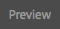

# Pagina&#39;s voorvertonen met ContextHub-gegevens{#previewing-pages-using-contexthub-data}

>[!CAUTION]
>
>AEM 6.4 heeft het einde van de uitgebreide ondersteuning bereikt en deze documentatie wordt niet meer bijgewerkt. Raadpleeg voor meer informatie onze [technische ondersteuningsperioden](https://helpx.adobe.com/support/programs/eol-matrix.html). Ondersteunde versies zoeken [hier](https://experienceleague.adobe.com/docs/).

De [ContextHub](/help/sites-developing/contexthub.md) de toolbarvertoningen gegevens van opslag ContextHub en laat u toe om opslaggegevens te veranderen. De toolbar ContextHub is nuttig om inhoud te previewing die door gegevens in een opslag ContextHub wordt bepaald.

De werkbalk bestaat uit een reeks UI-modi die een of meer UI-modules bevatten.

* UI-modi zijn pictogrammen die aan de linkerkant van de werkbalk worden weergegeven. Als u op een pictogram klikt of erop tikt, worden op de werkbalk de UI-modules weergegeven die erin staan.
* UI de modules tonen gegevens van één of meerdere opslag ContextHub. Sommige modules UI laten u ook toe om opslaggegevens te manipuleren.

ContextHub installeert verscheidene wijzen UI en modules UI. Mogelijk heeft uw beheerder [geconfigureerde ContextHub](/help/sites-administering/contexthub-config.md) om verschillende weer te geven.

## De werkbalk ContextHub weergeven {#revealing-the-contexthub-toolbar}

De toolbar ContextHub is beschikbaar op de wijze van de Voorproef. De werkbalk is alleen beschikbaar voor auteur-exemplaren en alleen als uw beheerder deze heeft ingeschakeld.

1. Open de pagina om te bewerken en klik op Voorvertoning op de werkbalk.

   

1. Klik of tik op het pictogram ContextHub om de werkbalk weer te geven.

   

## Functies van de UI-module {#ui-module-features}

Elke UI-module biedt verschillende functies, maar de volgende typen functies zijn gebruikelijk. Omdat de modules UI verlengbaar zijn, kan uw ontwikkelaar andere eigenschappen uitvoeren zoals vereist.

### Werkbalkinhoud {#toolbar-content}

UI de modules kunnen gegevens van één of meerdere opslag ContextHub in de toolbar tonen. UI-modules gebruiken een pictogram en een titel om zichzelf te identificeren.

### Inhoud pop-up {#popup-content}

Sommige modules UI tonen popup bekleed wanneer geklikt of getikt. Het pop-upmenu bevat doorgaans aanvullende informatie dan die op de werkbalk wordt weergegeven.

### Popup-Forms {#popup-forms}

De popup bekleding van een module kan vormelementen omvatten die u toelaten om de gegevens in de opslag te veranderen ContextHub. Als de pagina-inhoud wordt bepaald door de opslaggegevens, kunt u het formulier gebruiken en de wijzigingen in de pagina-inhoud observeren.

### Modus Volledig scherm {#fullscreen-mode}

Popup overlays kunnen een pictogram omvatten dat u klikt of tikt om popup inhoud uit te breiden om het volledige browser venster of het scherm te behandelen.

