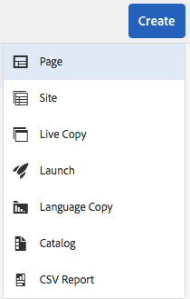

# Exporteren naar CSV{#export-to-csv}

**Maak CSV-** exportfuncties waarmee u informatie over uw pagina&#39;s kunt exporteren naar een CSV-bestand op uw lokale systeem.

* Het gedownloade bestand wordt `export.csv`
* De inhoud is afhankelijk van de eigenschappen die u selecteert.
* U kunt het pad samen met de diepte van het exporteren definiëren.

>[!NOTE]
>
>De downloadfunctie en de standaardbestemming van uw browser worden gebruikt.

Met de wizard CSV-export maken kunt u het volgende selecteren:

* Te exporteren eigenschappen

   * Metagegevens

      * Gewijzigd
      * Gepubliceerd
   * Analyse

      * Paginaweergaven
      * Unieke bezoekers
      * Tijd op pagina

* Diepte

   * Bovenliggend pad
   * Alleen directe kinderen
   * Aanvullende niveaus voor kinderen
   * Niveaus

Het resulterende `export.csv` dossier kan in Excel of een andere compatibele toepassing worden geopend.

De optie **CSV-export** is beschikbaar wanneer u in de **Sites**-console bladert (in de lijstweergave): het is een optie van **Create** drop-down menu:

Een CSV-export maken:

1. Open de **Sites**-console en ga indien nodig naar de gewenste locatie.
1. Selecteer op de werkbalk **Maken** en **CSV-export** om de wizard te openen:

   

1. Selecteer de eigenschappen die u wilt exporteren.
1. Selecteer **Maken**.

