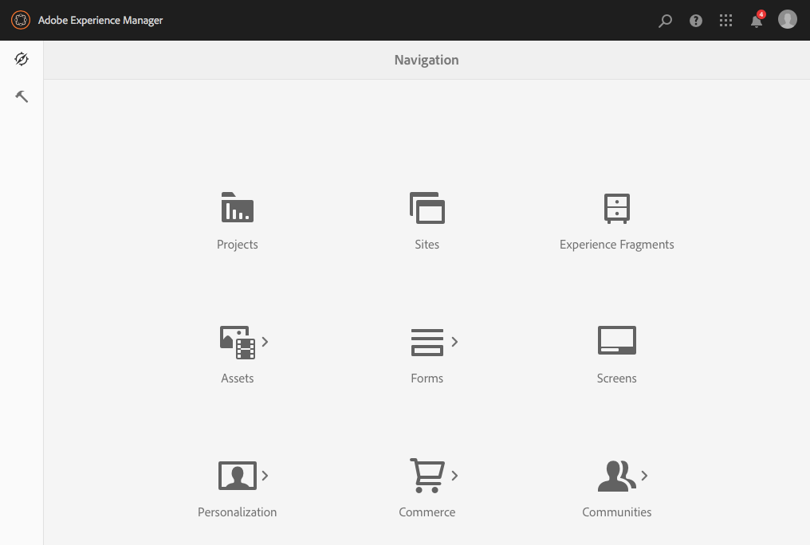
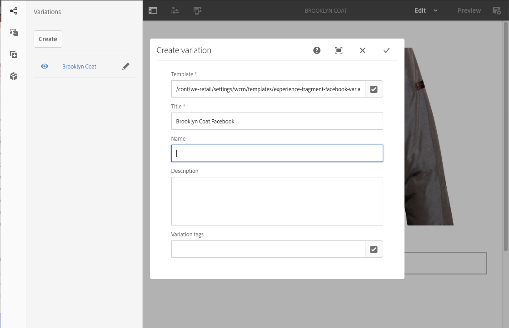
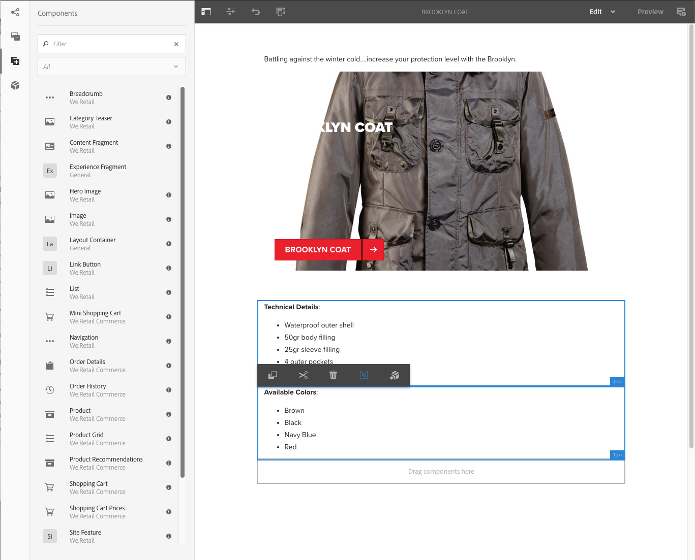

# Ervaringsfragmenten{#experience-fragments}

Een ervaringsfragment is een groep van een of meer componenten, inclusief inhoud en lay-out, waarnaar op pagina&#39;s kan worden verwezen. Ze kunnen elke gewenste component bevatten.

Een ervaringsfragment:

* Maakt deel uit van een ervaring (pagina).
* Kan op meerdere pagina&#39;s worden gebruikt.
* Is gebaseerd op een malplaatje (editable slechts) om structuur en componenten te bepalen.
* Bestaat uit een of meer componenten, met layout, in een alineasysteem.
* Kan andere ervaringsfragmenten bevatten.
* Kan worden gecombineerd met andere componenten (waaronder andere Experience Fragments) om een volledige pagina (ervaring) te vormen.
* Kan verschillende variaties hebben, die inhoud en/of componenten kunnen delen.
* Kan worden opgedeeld in bouwstenen die kunnen worden gebruikt voor meerdere variaties van het fragment.

U kunt Experience Fragments gebruiken:

* Als een auteur onderdelen (een fragment van een ervaring) van een pagina opnieuw wil gebruiken, moet hij of zij dat fragment kopiëren en plakken. Het maken en onderhouden van deze kopiëren/plakken-ervaringen kost veel tijd en is vaak het gevolg van gebruikersfouten. De Fragmenten van de ervaring elimineren de behoefte aan exemplaar/deeg.
* Om het hoofdloze gebruik-geval CMS te steunen. Auteurs willen AEM alleen gebruiken voor ontwerpen, maar niet voor levering aan de klant. Een systeem/aanraakpunt van derden zou deze ervaring gebruiken en vervolgens leveren aan de eindgebruiker.

>[!NOTE]
>
>Schrijf toegang voor ervaringsfragmenten vereist dat de gebruikersaccount in de groep wordt geregistreerd:
>
>`experience-fragments-editors`
>
>Neem contact op met de systeembeheerder als er problemen optreden.

## Wanneer moet u ervaringsfragmenten gebruiken? {#when-should-you-use-experience-fragments}

Er moeten ervaringsfragmenten worden gebruikt:

* Wanneer u ervaringen wilt hergebruiken.

   * Ervaringen die opnieuw worden gebruikt met dezelfde of vergelijkbare inhoud

* Wanneer u AEM gebruikt als platform voor het leveren van inhoud voor derden.

   * Om het even welke oplossing die AEM als platform van de inhoudslevering wil gebruiken
   * Inhoud insluiten in aanraakpunten van derden

* Als u ervaring hebt met verschillende variaties of uitvoeringen.

   * Kanaal- of contextspecifieke variaties
   * Ervaringen die zinvol zijn om te groeperen (bijvoorbeeld een campagne met verschillende ervaringen over kanalen)

* Wanneer u Omnichannel Commerce gebruikt.

   * Commerciële inhoud op schaal delen op sociale media
   * Transactie aanraakpunten maken

## Uw ervaringsfragmenten ordenen {#organizing-your-experience-fragments}

Het wordt aanbevolen:
* mappen gebruiken om uw fragmenten van de ervaring te ordenen,

* [configureer de toegestane sjablonen voor deze mappen](#configure-allowed-templates-folder).

Door mappen te maken kunt u:

* een zinvolle structuur voor uw ervaringsfragmenten maken; bijvoorbeeld volgens classificatie

   >[!NOTE]
   >
   >U hoeft de structuur van uw ervaringsfragmenten niet uit te lijnen met de paginastructuur van uw site.

* [de toegestane sjablonen toewijzen op mapniveau](#configure-allowed-templates-folder)

   >[!NOTE]
   >
   >U kunt [malplaatjeredacteur](/help/sites-authoring/templates.md) gebruiken om uw eigen malplaatje te creëren.

In het volgende voorbeeld ziet u de ervaringsfragmenten die zijn gestructureerd volgens `Contributors`. De gebruikte structuur illustreert ook hoe andere functies, zoals beheer voor meerdere sites (inclusief taalkopieën), kunnen worden gebruikt.

>[!CAUTION]
>
>De volgende schermafbeelding is als Cloud Service van de WKND-site genomen met Adobe Experience Manager.

## Het creëren van en het Vormen van een Omslag voor uw Fragmenten {#creating-and-configuring-a-folder-for-your-experience-fragments} van de Ervaring

Om een omslag voor uw Fragments van de Ervaring tot stand te brengen en te vormen wordt het geadviseerd:

1. [Maak een map](/help/sites-authoring/managing-pages.md#creating-a-new-folder).

1. [Configureer de toegestane sjablonen voor ervaringsfragmenten voor die map](#configure-allowed-templates-folder).

>[!NOTE]
>
>Het is ook mogelijk om [Toegestane Malplaatjes voor uw instantie ](#configure-allowed-templates-instance) te vormen, maar deze methode is **niet** geadviseerd aangezien de waarden bij verbetering kunnen worden beschreven.

### Vorm de Toegestane Malplaatjes voor uw Omslag {#configure-allowed-templates-folder}

>[!NOTE]
>
>Dit is de geadviseerde methode om **[!UICONTROL Allowed Templates]** te specificeren, aangezien de waarden niet bij verbetering zullen worden beschreven.

1. Navigeer naar de vereiste **[!UICONTROL Experience Fragments]**-map.

1. Selecteer de map en **[!UICONTROL Properties]**.

1. Geef de reguliere expressie op voor het ophalen van de vereiste sjablonen in het veld **[!UICONTROL Allowed Templates]**.

   Bijvoorbeeld:
   `/conf/(.*)/settings/wcm/templates/experience-fragment(.*)?`

   

1. Selecteer **[!UICONTROL Save and Close]**.

### Vorm de Toegestane Malplaatjes voor uw Instantie {#configure-allowed-templates-instance}

>[!CAUTION]
>
>Het wordt afgeraden de **[!UICONTROL Allowed Templates]** met deze methode te wijzigen, omdat de opgegeven sjablonen tijdens de upgrade kunnen worden overschreven.
>
>Gebruik dit dialoogvenster alleen ter informatie.

1. Navigeer naar de vereiste **[!UICONTROL Experience Fragments]** console.

1. Selecteer **[!UICONTROL Configuration options]**:

   

1. Geef de vereiste sjablonen op in het dialoogvenster **[!UICONTROL Configure Experience Fragments]**:

   

1. Selecteer **[!UICONTROL Save]**.

## Een ervaringsfragment maken {#creating-an-experience-fragment}

Een ervaringsfragment maken:

1. Selecteer **[!UICONTROL Experience Fragments]** van de Globale Navigatie.

   

1. Navigeer naar de vereiste map en selecteer **[!UICONTROL Create]**.

1. Selecteer **[!UICONTROL Experience Fragment]** om de wizard **[!UICONTROL Create Experience Fragment]** te openen.

   Selecteer de gewenste **[!UICONTROL Template]** en **[!UICONTROL Next]**:

   

1. Voer **[!UICONTROL Properties]** in voor het fragment van uw ervaring.

   Een **[!UICONTROL Title]** is verplicht. Als **[!UICONTROL Name]** leeg wordt gelaten, wordt deze afgeleid van **[!UICONTROL Title]**.

   

1. Klik op **[!UICONTROL Create]**.

   Er wordt een bericht weergegeven. Selecteer:

   * **[!UICONTROL Done]** om naar de console terug te keren
   * **[!UICONTROL Open]** om de fragmenteditor te openen

## Uw ervaringsfragment {#editing-your-experience-fragment} bewerken

De Experience Fragment Editor biedt u vergelijkbare mogelijkheden als de normale pagina-editor. Zie [Pagina-inhoud bewerken](/help/sites-authoring/editing-content.md) voor meer informatie over het gebruik ervan.

De volgende voorbeeldprocedure laat zien hoe u een gummetje voor een product kunt maken:

1. Sleep een **[!UICONTROL Category Teaser]** vanuit de [Componentbrowser](/help/sites-authoring/author-environment-tools.md#components-browser).

   

1. Selecteer **[[!UICONTROL Configure]](/help/sites-authoring/editing-content.md#edit-configure-copy-cut-delete-paste)** van de componententoolbar.
1. Voeg **[!UICONTROL Asset]** toe en definieer **[!UICONTROL Properties]** zoals vereist.
1. Bevestig de definities met **[!UICONTROL Done]** (tik pictogram).
1. Voeg desgewenst meer componenten toe.

## Een ervaringsfragmentvariatie {#creating-an-experience-fragment-variation} maken

U kunt variaties van uw Fragment van de Ervaring tot stand brengen, afhankelijk van uw behoeften:

1. Open het fragment voor [bewerken](/help/sites-authoring/experience-fragments.md#editing-your-experience-fragment).
1. Open het tabblad **[!UICONTROL Variations]**.

   

1. **Met** Create kunt u het volgende maken:

   * **[!UICONTROL Variation]**
   * **[!UICONTROL Variation as live-copy]**.

1. Definieer de vereiste eigenschappen:

   * **[!UICONTROL Template]**
   * **[!UICONTROL Title]**
   * **[!UICONTROL Name]**; indien niet ingevuld, wordt het afgeleid van de titel
   * **[!UICONTROL Description]**
   * **[!UICONTROL Variation tags]**

   

1. Bevestig met **[!UICONTROL Done]** (tik pictogram), de nieuwe variatie zal in het paneel worden getoond:

   

## Het gebruiken van uw Fragment van de Ervaring {#using-your-experience-fragment}

U kunt het fragment van de Ervaring nu gebruiken wanneer het ontwerpen van uw pagina&#39;s:

1. Open een pagina om te bewerken.

   Bijvoorbeeld: [http://localhost:4502/editor.html/content/we-retail/language-masters/en/products/men.html](http://localhost:4502/editor.html/content/we-retail/language-masters/en/products/men.html)

1. Maak een instantie van de component Experience Fragment door de component van de browser Components naar het alineasysteem van de pagina te slepen:

   

1. Voeg het daadwerkelijke fragment van de Ervaring aan de componenteninstantie toe; ofwel:

   * Sleep het vereiste fragment vanuit de middelenbrowser en zet het neer op de component
   * Selecteer **[!UICONTROL Configure]** in de componentwerkbalk en geef het te gebruiken fragment op. Bevestig dit met **Done** (tik)

   

   >[!NOTE]
   >
   >Bewerken werkt op de werkbalk van de component als een sneltoets waarmee het fragment in de fragmenteditor wordt geopend.

## Bouwstenen {#building-blocks}

U kunt een of meer componenten selecteren om een bouwsteen voor recycling binnen uw fragment te maken:

### Een bouwsteen maken {#creating-a-building-block}

Een nieuw bouwblok maken:

1. In de redacteur van het Fragment van de Ervaring, selecteer de componenten u wilt hergebruiken:

   

1. Selecteer **[!UICONTROL Convert to building block]** op de werkbalk Componenten:

   

   Bijvoorbeeld:

   

1. Voer de naam van de **[!UICONTROL Building Block]** in en bevestig deze met **[!UICONTROL Convert]**:

   

1. De **bouwsteen** wordt weergegeven op het tabblad en kan worden geselecteerd in het alineasysteem:

   

### Een bouwblok beheren {#managing-a-building-block}

Uw bouwsteen is zichtbaar in **[!UICONTROL Building Blocks]** tabel. Voor elk blok zijn de volgende acties beschikbaar:

* Ga naar master: open de mastervariatie op een nieuw tabblad
* Naam wijzigen
* Verwijderen

### Een bouwsteen gebruiken {#using-a-building-block}

U kunt de bouwsteen naar het alineasysteem van om het even welk fragment slepen, zoals met om het even welke component.

## De normale HTML-uitvoering {#the-plain-html-rendition}

Met de kiezer `.plain.` in de URL hebt u toegang tot de normale HTML-uitvoering.

Dit is beschikbaar in de browser, maar het primaire doel is om andere toepassingen (bijvoorbeeld webapps van derden, aangepaste mobiele implementaties) rechtstreeks toegang te geven tot de inhoud van het Experience Fragment door alleen de URL te gebruiken.

De normale HTML-uitvoering voegt het protocol-, host- en contextpad toe aan paden die:

* van het type: `src`, `href` of `action`

* of eindigen met: `-src`, of `-href`

Bijvoorbeeld:

`.../brooklyn-coat/master.plain.html`

>[!NOTE]
>
>Koppelingen verwijzen altijd naar de publicatie-instantie. Ze zijn bedoeld om door derden te worden gebruikt, dus de koppeling wordt altijd aangeroepen vanuit het publicatieexemplaar, niet vanuit de auteur.

## Fragmenten {#exporting-experience-fragments} exporteren

Experience Fragments worden standaard geleverd in de HTML-indeling. Dit kan zowel door AEM als derdekanalen worden gebruikt.

Voor exporteren naar Adobe Target wordt HTML gebruikt. Zie [Doelintegratie met ervaringsfragmenten](/help/sites-administering/experience-fragments-target.md) voor volledige informatie.

