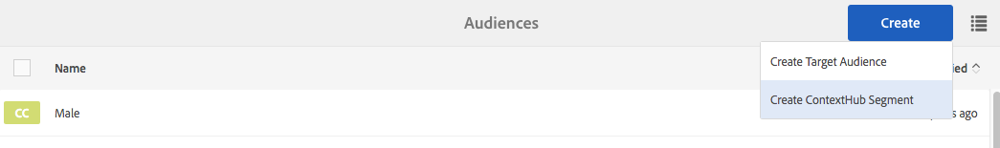
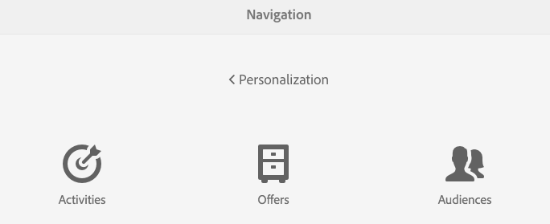

# Audiences beheren{#managing-audiences}

Met de console Soorten publiek kunt u soorten publiek voor uw Adobe Target-account maken, organiseren en beheren of segmenten voor ContextHub- of Client-context beheren:

* Voeg Soorten publiek toe - of Adobe Target publiek of segmenten ContextHub.
* Het publiek beheren.

Een publiek, genoemd *segment* in ContextHub en de Context van de Cliënt, is een klasse bezoekers die door specifieke criteria worden bepaald, die dan bepaalt wie een gerichte activiteit ziet. Wanneer u een activiteit richt, kunt u of publiek direct in het Doelproces selecteren of nieuwe degenen in de console van het Publiek creëren.

In de console van het publiek, worden de soorten publiek georganiseerd door merk.

De soorten publiek zijn beschikbaar op Doelwijze voor het [ontwerpen van gerichte inhoud](/help/sites-authoring/content-targeting-touch.md), waar u publiek kunt ook tot stand brengen (maar u moet Adobe Target publiek in de console van het Publiek tot stand brengen). De soorten publiek dat u op het richten wijze creeert verschijnen in de console van het Soorten publiek.

Het publiek wordt weergegeven met een label waarin wordt beschreven welk soort publiek wordt gedefinieerd:

* CH - ContextHub-segment
* CC - Clientcontextsegment
* AT - Adobe Target-publiek

## Het creëren van een Segment ContextHub in de Console van het publiek {#creating-a-contexthub-segment-in-the-audiences-console}

U kunt een segment ContextHub of in de console van het publiek of tijdens het het richten proces tot stand brengen.

Om een segment ContextHub in de console van het publiek tot stand te brengen:

1. In the Navigation console, click or tap **Personalization**. Klik of tik **Soorten publiek**.
1. Tik of klik op **ContextHub-segment** maken.

   

1. In het **Nieuwe de dialoogvakje van het Segment** ContextHub, ga een titel in en pas de verhoging aan en klik **creëren**. Uw nieuw segment ContextHub verschijnt in de publiekslijst.

   >[!NOTE]
   >
   >U kunt de gewijzigde lijst sorteren door op **Gewijzigd** te tikken of te klikken om in aflopende volgorde te sorteren om de nieuwe doelgroep te zien.

Voor meer detail over het creëren van segmenten die ContextHub gebruiken, gelieve te zien de [Vormende Segmentatie met documentatie ContextHub](/help/sites-administering/segmentation.md) .

## Een Adobe Target-publiek maken met de Audience Console {#creating-an-adobe-target-audience-using-the-audience-console}

U kunt een Adobe Target-publiek rechtstreeks in AEM maken met behulp van de console Soorten publiek.

Het publiek wordt bepaald door regels die bepalen wie in een doelactiviteit inbegrepen is. Een publieksdefinitie kan veelvoudige regels omvatten en elke regel kan veelvoudige parameters omvatten.

Wanneer u meer dan één regel gebruikt, worden deze regels gecombineerd door de exploitant van Boole EN, wat betekent dat om het even welk potentieel publiekslid aan alle bepaalde voorwaarden moet voldoen om in de activiteit worden omvat. Als u bijvoorbeeld een OS-regel EN een browserregel definieert, worden alleen bezoekers die zowel het gedefinieerde besturingssysteem ALS de gedefinieerde browser gebruiken, opgenomen in de activiteit.

>[!NOTE]
>
>Als u **Doelgroep maken** niet ziet in het menu **Maken**, hebt u niet de benodigde machtigingen om een doelgroep te maken. You need write permissions under **/etc/segmentation** to be able to create audiences. De makers van groepscontent hebben standaard schrijfmachtigingen.

Een Adobe Target-publiek maken:

1. In the Navigation console, click or tap **Personalization**. Klik of tik **Soorten publiek**.

   

1. Tik in de console Soorten publiek op **Maken** of klik op **Doelpubliek** maken.

   

1. Selecteer de doelconfiguratie in het dialoogvenster **Adobe Target Configuration** en tik of klik op **OK**.
1. Tik of klik in het gebied Rule#1 op het kenmerktype en voer in de velden die beschikbaar zijn kenmerkgegevens in. Als u klaar bent, selecteert u het vinkje rechts van het kenmerk om het op te slaan. Zie [Kenmerken en de bijbehorende opties](#attributes-and-their-options) voor informatie over alle kenmerken.
1. Klik op **Regel toevoegen** om nog een regel toe te voegen. Voer zoveel regels in als nodig is. De regels worden gecombineerd met de booleaanse operator AND, wat betekent dat de doelgroep aan alle vereisten van elke regel moet voldoen om voor een activiteit in aanmerking te komen.
1. Tik of klik op **Volgende**.
1. Voer een naam voor de doelgroep in en tik of klik op **Opslaan**.
1. Tik of klik op **Opslaan**. Uw publiek wordt vermeld in de lijst van het Publiek.

### Kenmerken en hun opties {#attributes-and-their-options}

U kunt het richten regels voor elk van de volgende attributen tot stand brengen:

| **Kenmerk** | **Beschrijving** | **Voor meer informatie** |
|---|---|---|
| **Mobiel** | Het doel mobiele apparaten die op parameters zoals mobiel apparaat, type van apparaat, apparatenverkoper, het schermafmetingen (door pixel) worden gebaseerd, en meer. | Zie [Mobiele documentatie](https://docs.adobe.com/content/help/en/target/using/audiences/create-audiences/categories-audiences/mobile.html) op Adobe Target. |
| **Aangepast** | Aangepaste parameters zijn parameters mbox. Als u om het even welke mbox parameters tot dozen, of de targetPageParams functie doorgeeft, verschijnen die parameters hier voor gebruik in publiek. | Zie documentatie over [aangepaste parameters](https://docs.adobe.com/content/help/en/target/using/audiences/create-audiences/categories-audiences/custom-parameters.html) op Adobe Target. |
| **OS** | U kunt zich richten op bezoekers die een bepaald besturingssysteem gebruiken. | Doelgebruikers die Linux, Macintosh of Windows gebruiken. |
| **Sitepagina&#39;s** | Doelbezoekers die zich op een specifieke pagina bevinden of een specifieke parameter mbox hebben. | Zie documentatie [over](https://docs.adobe.com/content/help/en/target/using/audiences/create-audiences/categories-audiences/site-pages.html) sitepagina&#39;s op Adobe Target. |
| **Browser** | U kunt zich richten op gebruikers die een specifieke browser of specifieke browseropties gebruiken wanneer zij uw pagina bezoeken. | Zie documentatie met [browseropties](https://docs.adobe.com/content/help/en/target/using/audiences/create-audiences/categories-audiences/browser.html)op Adobe Target. |
| **Bezoekerprofiel** | Doelbezoekers die voldoen aan specifieke profielparameters. | Raadpleeg de documentatie bij [Bezoekersprofiel](https://docs.adobe.com/content/help/en/target/using/audiences/visitor-profiles/visitor-profile.html) in Adobe Target. |
| **Verkeersbronnen** | Doelbezoekers op basis van het zoekprogramma of de bestemmingspagina die hen naar uw site verwijst. | Zie [de documentatie](https://docs.adobe.com/content/help/en/target/using/audiences/create-audiences/categories-audiences/traffic-sources.html) van de Bronnen van het Verkeer bij Adobe Target. |

## Een publiek wijzigen in de console Soorten publiek {#modifying-an-audience-in-the-audiences-console}

>[!NOTE]
>
>U kunt alleen Adobe Target-soorten publiek bewerken die zijn gemaakt in hetzelfde AEM waarin u bewerkt. Doelpubliek dat in verschillende AEM is gemaakt, kan niet worden bewerkt.

U kunt om het even welk Contextpubliek van ContextHub of van de Cliënt van de console van het publiek uitgeven. U kunt het Adobe Target-publiek altijd bewerken, maar alleen het publiek dat is gemaakt in AEM:

1. In the Navigation console, click or tap **Personalization**. Klik of tik **Soorten publiek**.
1. Tik of klik op het pictogram naast het ContextHub- of Client-contextsegment dat u wilt bewerken, en tik of klik op **Bewerken**.
1. Breng desgewenst wijzigingen aan in de segmenteditor. Zie [Clientcontext](/help/sites-administering/campaign-segmentation.md) of [ContextHub](/help/sites-administering/contexthub-config.md) -documentatie.

