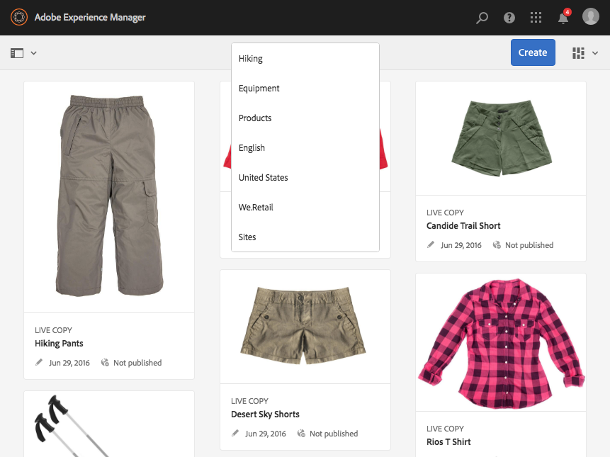
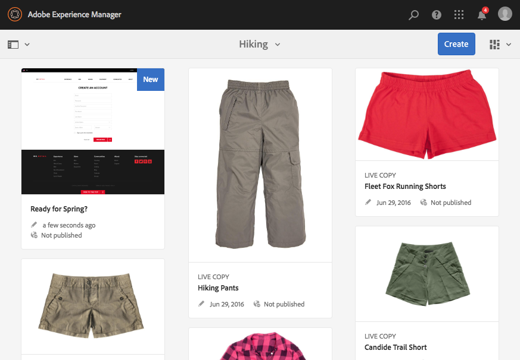
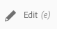
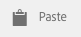
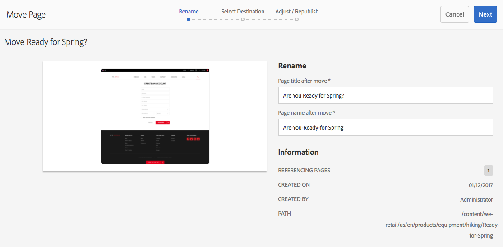
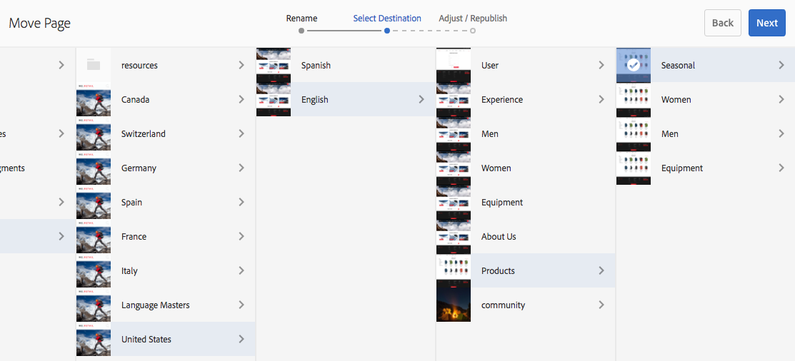

# Pagina&#39;s maken en indelen{#creating-and-organizing-pages}

>[!CAUTION]
>
>AEM 6.4 heeft het einde van de uitgebreide ondersteuning bereikt en deze documentatie wordt niet meer bijgewerkt. Raadpleeg voor meer informatie onze [technische ondersteuningsperioden](https://helpx.adobe.com/support/programs/eol-matrix.html). Ondersteunde versies zoeken [hier](https://experienceleague.adobe.com/docs/).

In deze sectie wordt beschreven hoe u pagina&#39;s kunt maken en beheren met Adobe Experience Manager (AEM), zodat u vervolgens [inhoud maken](/help/sites-authoring/editing-content.md) op die pagina&#39;s.

>[!NOTE]
>
>Uw account heeft [passende toegangsrechten](/help/sites-administering/security.md) en [machtigingen](/help/sites-administering/security.md#permissions) om actie te ondernemen op pagina&#39;s zoals maken, kopiëren, verplaatsen, bewerken en verwijderen.
>
>Als u om het even welke problemen ontmoet wij adviseren u uw systeembeheerder contacteert.

>[!NOTE]
>
>Er zijn een aantal [sneltoetsen](/help/sites-authoring/keyboard-shortcuts.md) die u kunt gebruiken vanuit de websiteconsole om uw pagina&#39;s efficiënter te ordenen.

## Uw website ordenen {#organizing-your-website}

Als auteur moet u uw website binnen AEM organiseren. Dit betekent dat u inhoudspagina&#39;s maakt en een naam geeft, zodat:

* U kunt deze gemakkelijk vinden in de ontwerpomgeving
* Bezoekers naar uw site kunnen deze gemakkelijk in de publicatieomgeving bekijken

U kunt ook [mappen](#creating-a-new-folder) om uw inhoud beter in te delen.

De structuur van een website kan worden beschouwd als een boomstructuur die uw inhoudspagina&#39;s bevat. De namen van deze inhoudspagina&#39;s worden gebruikt om URLs te vormen, terwijl de titel wordt getoond wanneer de paginainhoud wordt bekeken.

Het volgende toont een voorbeeld van de plaats Web.Retail, waar een het hakken pagina ( `desert-sky-shorts`) is geopend:

* Auteursomgeving: `http://localhost:4502/editor.html/content/we-retail/us/en/products/equipment/hiking/desert-sky-shorts.html`

* Publicatie-omgeving: `http://localhost:4503/content/we-retail/us/en/products/equipment/hiking/desert-sky-shorts.html`

Afhankelijk van de configuratie van uw instantie, gebruik van `/content` kan optioneel zijn in de publicatieomgeving.

```xml
 /content
 /we-retail
  /us
   /en
    /products
     /equipment
      /hiking
       /desert-sky-shorts
       /hiking-poles
       /... 
      /running...
      /surfing...
      /...
     /seasonal...
     /...
    /about-us
    /experience
    /...
   /es...
  /de...
  /fr...
  /...
 /...
```

Deze structuur kan worden weergegeven vanuit de **Sites** console, waar u kunt [door de pagina&#39;s van uw website navigeren](/help/sites-authoring/basic-handling.md#product-navigation) en voert handelingen uit op de pagina&#39;s. U kunt ook nieuwe sites maken en [nieuwe pagina&#39;s](#creating-a-new-page).

Vanuit elk punt kunt u de vertakking naar boven zien vanuit de broodkruimels in de kopbalk:



### Naamgevingsconventies voor pagina&#39;s {#page-naming-conventions}

Bij het maken van een nieuwe pagina zijn er twee sleutelvelden:

* **[Titel](#title)**:

   * Dit wordt aan de gebruiker getoond in de console en bij het uitgeven bij de bovenkant van de paginainhoud getoond.
   * Dit veld is verplicht.

* **[Naam](#name)**:

   * Hiermee wordt de URI gegenereerd.
   * Gebruikersinvoer voor dit veld is optioneel. Indien niet opgegeven, wordt de naam afgeleid van de titel. Zie de volgende sectie [Beperkingen en aanbevolen procedures voor paginanamen](/help/sites-authoring/managing-pages.md#page-name-restrictions-and-best-practices) voor meer informatie.

#### Beperkingen en aanbevolen procedures voor paginanamen {#page-name-restrictions-and-best-practices}

De **titel** en **naam** van de pagina kunnen afzonderlijk worden gemaakt, maar zijn aan elkaar gerelateerd:

* Bij het maken van een pagina worden alleen de **Titel** is vereist. Indien niet **Naam** wordt opgegeven bij het maken van de pagina. AEM genereert een naam uit de eerste 64 tekens van de titel (met inachtneming van de onderstaande validatie). Alleen de eerste 64 tekens worden gebruikt ter ondersteuning van de beste praktijken voor namen van korte pagina&#39;s.

* Als een paginanaam handmatig door de auteur wordt opgegeven, geldt de limiet van 64 tekens niet, maar kunnen andere technische beperkingen op de lengte van de paginanaam wel van toepassing zijn.

>[!NOTE]
>
>Wanneer u een paginanaam definieert, is het verstandig de paginanaam zo kort maar expressief en zo gedenkwaardig mogelijk te houden, zodat de lezer deze goed begrijpt. Zie de [W3C-stijlhulplijn](https://www.w3.org/Provider/Style/TITLE.html) voor de `title` voor meer informatie.
>
>Houd er ook rekening mee dat sommige browsers (bijvoorbeeld oudere versies van IE) URL&#39;s tot een bepaalde lengte alleen kunnen accepteren, dus er is ook een technische reden om paginanamen kort te houden.

Wanneer u een nieuwe pagina maakt, AEM [De paginanaam valideren volgens de conventies](/help/sites-developing/naming-conventions.md) opgelegd door AEM en het GCO.

De minimaal toegestane tekens zijn:

* &#39;a&#39; tot en met &#39;z&#39;
* &#39;A&#39; tot en met &#39;Z&#39;
* 0 tot en met 9
* _ (onderstrepingsteken)
* `-` (afbreekstreepje/minteken)

Alle tekens die zijn toegestaan, kunt u vinden in [de naamgevingsconventies](/help/sites-developing/naming-conventions.md).

>[!NOTE]
>
>Als AEM wordt uitgevoerd op een [Implementatie van MongoMK persistence Manager](/help/sites-deploying/recommended-deploys.md)paginanamen zijn beperkt tot 150 tekens.

#### Titel {#title}

Als u bij het maken van een nieuwe pagina alleen een **paginatitel** opgeeft, leidt AEM de **naam**[ van de pagina af van deze tekenreeks en valideert het de naam volgens de conventies die door AEM en JCR worden opgelegd. ](/help/sites-developing/naming-conventions.md) A **Titel** het veld met ongeldige tekens wordt geaccepteerd, maar voor de afgeleide naam worden de ongeldige tekens vervangen. Bijvoorbeeld:

| Titel | Afgeleide naam |
|---|---|
| Schön | schoen.html |
| SC%&amp;&amp;ast;ç+ | sc---c-.html |

#### Naam {#name}

Wanneer u een pagina opgeeft **Naam** bij het maken van een nieuwe pagina AEM [De naam valideren volgens de conventies](/help/sites-developing/naming-conventions.md) opgelegd door AEM en JCR. U kunt geen ongeldige tekens verzenden in het dialoogvenster **Naam** veld. Wanneer AEM ongeldige tekens detecteert, wordt het veld gemarkeerd met een verklarende melding.


>[!NOTE]
>
>Gebruik geen code van twee letters, zoals gedefinieerd door ISO-639-1, als paginanaam, tenzij dit een hoofdtaalcode is.
>
>Zie [Inhoud voorbereiden voor vertaling](/help/sites-administering/tc-prep.md) voor meer informatie .

### Sjablonen {#templates}

In AEM geeft een sjabloon een speciaal type pagina op. Een sjabloon wordt gebruikt als basis voor elke nieuwe pagina die wordt gemaakt.

De sjabloon definieert de structuur van een pagina, inclusief een miniatuurafbeelding en andere eigenschappen. U hebt bijvoorbeeld aparte sjablonen voor productpagina&#39;s, sitemaps en contactgegevens. Sjablonen bestaan uit [componenten](#components).

AEM wordt geleverd met verschillende sjablonen die buiten de box zijn geplaatst. Welke sjablonen beschikbaar zijn, is afhankelijk van de afzonderlijke website. De belangrijkste velden zijn:

* **Titel**
De titel die op de resulterende webpagina wordt weergegeven.

* **Naam**
Wordt gebruikt bij de naamgeving van de pagina.

* **Sjabloon**
Een lijst met sjablonen die u kunt gebruiken bij het genereren van de nieuwe pagina.

>[!NOTE]
>
>Indien gevormd op uw instantie, [sjabloonauteurs kunnen sjablonen maken met de Sjablooneditor](/help/sites-authoring/templates.md).

### Onderdelen {#components}

Componenten zijn de elementen die worden verschaft door AEM, zodat u specifieke typen inhoud kunt toevoegen. AEM wordt geleverd met een reeks [out-of-the-box componenten](/help/sites-authoring/default-components-console.md) die uitgebreide functionaliteit bieden. Deze omvatten:

* Tekst
* Afbeelding
* Presentatie
* Video
* En nog veel meer

Nadat u een pagina hebt gemaakt en geopend, kunt u [inhoud toevoegen met de componenten](/help/sites-authoring/editing-content.md#inserting-a-component), die beschikbaar zijn op [componentbrowser](/help/sites-authoring/author-environment-tools.md#components-browser).

>[!NOTE]
>
>De [Componentenconsole](/help/sites-authoring/default-components-console.md) geef een overzicht van de componenten op uw instantie.

## Pagina&#39;s beheren {#managing-pages}

### Een nieuwe pagina maken {#creating-a-new-page}

Tenzij alle pagina&#39;s vooraf voor u zijn gemaakt, moet u een pagina maken voordat u inhoud kunt gaan maken:

1. Open de Sites-console (bijvoorbeeld [http://localhost:4502/sites.html/content](http://localhost:4502/sites.html/content)).
1. Navigeer naar de locatie waar u de nieuwe pagina wilt maken.
1. Open de vervolgkeuzelijst met **Maken** op de werkbalk en selecteer vervolgens **Pagina** in de lijst:

   

1. Vanaf de eerste fase van de wizard kunt u:

   * Selecteer de sjabloon die u wilt gebruiken om de nieuwe pagina te maken en klik/tik **Volgende** om verder te gaan.
   * **Annuleren** om het proces af te breken.

   

1. Vanaf het laatste werkgebied van de wizard kunt u:

   * Gebruik de drie tabbladen om de [pagina-eigenschappen](/help/sites-authoring/editing-page-properties.md) u wilt toewijzen aan de nieuwe pagina en klikt/tikt u vervolgens op **Maken** om de pagina te maken.
   * Gebruiken **Vorige** om terug te keren naar de sjabloonselectie.

   Hoofdvelden zijn:

   * **Titel**:

      * Dit wordt aan de gebruiker getoond en is verplicht.
   * **Naam**:

      * Hiermee wordt de URI gegenereerd. Indien niet opgegeven, wordt de naam afgeleid van de titel.
      * Als u een pagina opgeeft **Naam** bij het maken van een nieuwe pagina AEM [De naam valideren volgens de conventies](/help/sites-developing/naming-conventions.md) opgelegd door AEM en JCR.
      * U **kan geen ongeldige tekens verzenden** in de **Naam** veld. Wanneer AEM ongeldige tekens detecteert, wordt het veld gemarkeerd en wordt een verklarende melding weergegeven om aan te geven welke tekens moeten worden verwijderd/vervangen.

   >[!NOTE]
   >
   >Zie [Naamgevingsconventies voor pagina&#39;s](#page-naming-conventions).

   De minimale informatie die nodig is om een nieuwe pagina te maken, is de **Titel**.

   

1. Gebruiken **Maken** om het proces te voltooien en uw nieuwe pagina te maken. In het bevestigingsvenster wordt u gevraagd of u **Openen** de pagina direct of terug naar de console (**Gereed**):

   

   >[!NOTE]
   >
   >Als u een pagina maakt met een naam die al op die locatie bestaat, genereert het systeem automatisch een variatie in de naam door een getal toe te voegen. Bijvoorbeeld: `winter` bestaat al `winter0`.

1. Als u terugkeert naar de console, zult u uw nieuwe pagina zien:

   

>[!CAUTION]
>
>Nadat een pagina is gemaakt, kan de sjabloon ervan niet worden gewijzigd - tenzij u [een lancering met een nieuw malplaatje creëren](/help/sites-authoring/launches-creating.md#create-launch-with-new-template), hoewel de bestaande inhoud hierdoor verloren gaat.

### Een pagina openen voor bewerken {#opening-a-page-for-editing}

Nadat u een pagina hebt gemaakt of naar een bestaande pagina (in de console) hebt genavigeerd, kunt u deze openen voor bewerking:

1. Open de **Sites** console.
1. Navigeer totdat u de pagina vindt die u wilt bewerken.
1. Selecteer de pagina door een van de volgende twee handelingen uit te voeren:

   * [Snelle acties](/help/sites-authoring/basic-handling.md#quick-actions)
   * [Selectiemodus](/help/sites-authoring/basic-handling.md#product-navigation) en de werkbalk

   Selecteer vervolgens de **Bewerken** pictogram:

   

1. De pagina wordt geopend en u kunt [de pagina bewerken](/help/sites-authoring/editing-content.md) zoals vereist.

>[!NOTE]
>
>U kunt vanuit de pagina-editor alleen naar andere pagina&#39;s navigeren in de modus Voorbeeld, omdat koppelingen niet actief zijn in de modus Bewerken.

### Pagina&#39;s kopiëren en plakken {#copying-and-pasting-a-page}

U kunt een pagina en alle bijbehorende subpagina&#39;s naar een nieuwe locatie kopiëren:

1. In de **Sites** navigeren totdat u de pagina hebt gevonden die u wilt kopiëren.
1. Selecteer de pagina met behulp van:

   * [Snelle acties](/help/sites-authoring/basic-handling.md#quick-actions)
   * [Selectiemodus](/help/sites-authoring/basic-handling.md#product-navigation) en de werkbalk

   En dan de **Kopiëren** paginapictogram:

   

   >[!NOTE]
   >
   >Als u in de selectiemodus werkt, wordt dit automatisch verlaten zodra de pagina wordt gekopieerd.

1. Navigeer naar de locatie voor de nieuwe kopie van de pagina.
1. Gebruik de **Plakken** paginapictogram:

   

   Op deze locatie worden een kopie van de originele pagina en eventuele subpagina&#39;s gemaakt.

   >[!NOTE]
   >
   >Als u de pagina kopieert naar een locatie waar al een pagina met dezelfde naam als het origineel bestaat, genereert het systeem automatisch een variatie in de naam door een nummer toe te voegen. Bijvoorbeeld: `winter` bestaat al `winter` wordt `winter1`.

### Een pagina verplaatsen of de naam ervan wijzigen {#moving-or-renaming-a-page}

>[!NOTE]
>
>De naam van een pagina wijzigen is ook afhankelijk van de instelling [Naamgevingsconventies voor pagina&#39;s](#page-naming-conventions) wanneer u de nieuwe paginanaam opgeeft.

>[!NOTE]
>
>Een pagina kan alleen worden verplaatst naar een locatie waar de sjabloon waarop de pagina is gebaseerd, is toegestaan. Zie [Beschikbaarheid sjabloon](/help/sites-developing/templates.md#template-availability) voor meer informatie .

De procedure om een pagina te verplaatsen of anders te noemen is in wezen het zelfde en door de zelfde tovenaar behandeld. Met deze wizard kunt u:

* Wijzig de naam van een pagina zonder deze te verplaatsen.
* Verplaats de pagina zonder de naam ervan te wijzigen.
* Tegelijkertijd verplaatsen en hernoemen.

AEM biedt u de functionaliteit om interne koppelingen bij te werken die verwijzen naar de pagina waarvan de naam wordt gewijzigd of die wordt verplaatst. Dit kan per pagina worden gedaan om volledige flexibiliteit te bieden.

1. Navigeer totdat u de pagina vindt die u wilt verplaatsen.
1. Selecteer de pagina met behulp van:

   * [Snelle acties](/help/sites-authoring/basic-handling.md#quick-actions)
   * [Selectiemodus](/help/sites-authoring/basic-handling.md#product-navigation) en de werkbalk

   Selecteer vervolgens de **Verplaatsen** paginapictogram:

   

   Hiermee wordt de wizard Verplaatsen van de pagina geopend.

1. Van de **Naam wijzigen** het werkgebied van de wizard dat u kunt instellen:

   * Geef de naam op die de pagina moet hebben nadat deze is verplaatst en klik/tik op **Volgende** om verder te gaan.
   * **Annuleren** om het proces af te breken.

   

   De paginanaam kan hetzelfde blijven als u alleen de pagina verplaatst.

   >[!NOTE]
   >
   >Als u een pagina verplaatst naar een locatie waar al een pagina met dezelfde naam bestaat, genereert het systeem automatisch een variatie in de naam door een getal toe te voegen. Bijvoorbeeld: `winter` bestaat al `winter` wordt `winter1`.

1. Van de **Doel selecteren** het werkgebied van de wizard dat u kunt instellen:

   * Gebruik de [kolomweergave](/help/sites-authoring/basic-handling.md#column-view) om naar de nieuwe locatie voor de pagina te navigeren:

      * Selecteer de bestemming door de duimnagel van de bestemming te klikken.
      * Klikken **Volgende** om door te gaan.
   * Gebruiken **Vorige** om terug te keren naar de specificatie van de paginanaam.

   

   >[!NOTE]
   >
   >Als u een pagina verplaatst naar een locatie waar al een pagina met dezelfde naam bestaat, genereert het systeem automatisch een variatie in de naam door een getal toe te voegen. Bijvoorbeeld: `winter` bestaat al `winter` wordt `winter1`.

1. Als de pagina is gekoppeld aan of wordt verwezen naar, worden deze verwijzingen weergegeven in het dialoogvenster **Aanpassen/Opnieuw publiceren** stap. U kunt aangeven welke gegevens moeten worden aangepast en opnieuw moeten worden gepubliceerd.

   

1. Selecteren **Verplaatsen** zal het proces voltooien en de pagina naar wens verplaatsen/hernoemen.

>[!NOTE]
>
>Als de pagina al is gepubliceerd, wordt de publicatie ervan automatisch ongedaan gemaakt wanneer u de pagina verplaatst. Standaard wordt de animatie opnieuw gepubliceerd wanneer de bewerking is voltooid, maar dit kan veranderen door de optie **Opnieuw publiceren** in het **Aanpassen/Opnieuw publiceren** stap.

>[!NOTE]
>
>Als er op geen enkele manier naar de pagina wordt verwezen, wordt de **Aanpassen/Opnieuw publiceren** stap wordt overgeslagen.

### Een pagina verwijderen {#deleting-a-page}

1. Navigeer totdat u de pagina ziet die u wilt verwijderen.
1. Gebruiken [selectiemodus](/help/sites-authoring/basic-handling.md#viewing-and-selecting-resources) om de vereiste pagina te selecteren, dan gebruik **Verwijderen** op de werkbalk:

   

   >[!NOTE]
   >
   >Uit veiligheidsoverwegingen is het pictogram op de pagina **Verwijderen** niet beschikbaar als een snelle actie.

1. Een dialoogvenster zal om bevestiging vragen.

   * **Wilt u de pagina&#39;s archiveren voordat u ze verwijdert?** - Als deze optie is ingeschakeld, worden bij het verwijderen versies gemaakt van de pagina&#39;s die voor verwijdering zijn geselecteerd.
      * [Versies kunnen later worden hersteld.](/help/sites-authoring/working-with-page-versions.md)
      * Pagina&#39;s die zonder vorige versies zijn verwijderd, kunnen niet worden hersteld.
      * Deze optie is alleen beschikbaar in AEM versie 6.4.7.0.
   * **Annuleren** om de handeling af te breken
   * **Verwijderen** ter bevestiging van de actie :

      * Als de pagina geen verwijzingen heeft, wordt de pagina verwijderd.
      * Als de pagina verwijzingen heeft, zal een berichtvakje u meedelen dat **Naar een of meer pagina&#39;s wordt verwezen.** U kunt **Verwijderen forceren** of **Annuleren**.

>[!NOTE]
>
>Als een pagina al is gepubliceerd, wordt deze automatisch gepubliceerd voordat deze wordt verwijderd.

### Een pagina vergrendelen {#locking-a-page}

U kunt [Een pagina vergrendelen/ontgrendelen](/help/sites-authoring/editing-content.md#locking-a-page) vanuit een console of wanneer u een afzonderlijke pagina bewerkt. Informatie over het feit of een pagina is vergrendeld, wordt ook op beide locaties weergegeven.

 

### Nieuwe map maken {#creating-a-new-folder}

U kunt mappen maken waarmee u uw bestanden en pagina&#39;s kunt ordenen.

>[!NOTE]
>
>Mappen zijn ook onderworpen aan de [Naamgevingsconventies voor pagina&#39;s](#page-naming-conventions) wanneer u de nieuwe mapnaam opgeeft.

>[!CAUTION]
>
>* Mappen kunnen alleen direct onder **Sites** of onder andere mappen. Ze kunnen niet onder een pagina worden gemaakt.
>* Met de standaardhandelingen kunt u eigenschappen verplaatsen, kopiëren, plakken, verwijderen, publiceren, verwijderen en weergeven/bewerken uitvoeren op een map.
>* Mappen zijn niet beschikbaar voor selectie in een live kopie.
>


1. Open de **Sites** en navigeer naar de gewenste locatie.
1. Selecteer **Maken** van de werkbalk
1. Selecteren **Map** om het dialoogvenster te openen. Hier kunt u de **Naam** en **Titel**:

   

1. Selecteren **Maken** om de map te maken.
