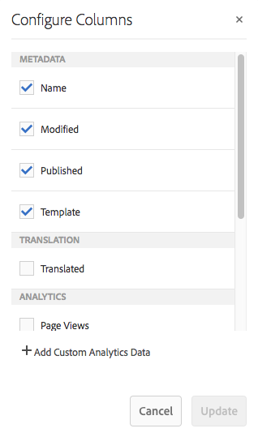

# Gegevens van paginaanalyse bekijken{#seeing-page-analytics-data}

Gebruik pagina-analysegegevens om de doeltreffendheid van de pagina-inhoud te meten.

## Analyse zichtbaar vanuit de console {#analytics-visible-from-the-console}

De analysegegevens van de pagina worden getoond in de Mening [van de](/help/sites-authoring/basic-handling.md#list-view) Lijst van de console van Plaatsen. Wanneer de pagina&#39;s in lijstformaat worden getoond, zijn de volgende kolommen beschikbaar door gebrek:

* Paginaweergaven
* Unieke bezoekers
* Tijd op pagina

In elke kolom wordt een waarde voor de lopende rapportageperiode weergegeven en wordt ook aangegeven of de waarde sinds de vorige rapportageperiode is gestegen of gedaald. De gegevens die u ziet, worden elke 12 uur bijgewerkt.

>[!NOTE]
>
>Om de updateperiode te veranderen, [vorm het de invoerinterval](/help/sites-administering/adobeanalytics-connect.md#configuring-the-import-interval).

1. Open de **Sites** -console; bijvoorbeeld [http://localhost:4502/sites.html/content](http://localhost:4502/sites.html/content)
1. Rechtsboven op de werkbalk (in de rechterbovenhoek) klikt of tikt u op het pictogram om **Lijstweergave** te selecteren (het weergegeven pictogram is afhankelijk van de [huidige weergave](/help/sites-authoring/basic-handling.md#viewing-and-selecting-resources)).

1. Klik of tik nogmaals in de rechterbovenhoek van de werkbalk op het pictogram en selecteer **Weergave-instellingen**. Het dialoogvenster Kolommen **** configureren wordt geopend. Breng de vereiste wijzigingen aan en bevestig deze met **Bijwerken**.

   

### De rapportageperiode selecteren {#selecting-the-reporting-period}

Selecteer de rapportperiode waarvoor de gegevens van Analytics op de console van Plaatsen verschijnen:

* Gegevens laatste 30 dagen
* Gegevens van afgelopen 90 dagen
* Gegevens van dit jaar

De huidige rapportageperiode wordt weergegeven op de werkbalk van de Sites-console (rechts van de bovenste werkbalk). Gebruik de vervolgkeuzelijst om de vereiste rapportageperiode te selecteren.\

### Beschikbare gegevenskolommen configureren {#configuring-available-data-columns}

Leden van de analytische-beheerders gebruikersgroep kunnen de console van Plaatsen vormen om auteurs toe te laten om extra kolommen van Analytics te zien.

>[!NOTE]
>
>Wanneer een boomstructuur met pagina&#39;s onderliggende elementen bevat die zijn gekoppeld aan verschillende Adobe Analytics-wolkenconfiguraties, kunt u de beschikbare gegevenskolommen voor de pagina&#39;s niet configureren.

1. In de Lijstweergave gebruikt u de weergavekiezers (rechts van de werkbalk), selecteert u Instellingen **** weergeven en vervolgens Aangepaste analysegegevens **** toevoegen.

   

1. Selecteer de metriek die u aan auteurs in de console van Plaatsen wilt blootstellen, en dan klikken **toevoegt**.

   De kolommen die worden weergegeven, worden opgehaald uit Adobe Analytics.

   

### Inhoudsgegevens van sites openen {#opening-content-insights-from-sites}

Open Inzicht [van de](/help/sites-authoring/content-insights.md) Inhoud van de console van Plaatsen om paginadoeltreffendheid verder te onderzoeken.

1. Selecteer in de Sites-console de pagina waarvoor u Inhoudsgegevens wilt weergeven.
1. Klik op het pictogram Analytics en Recommendations op de werkbalk.

   

## Analyses zichtbaar in de Pagina-editor (Activity Map) {#analytics-visible-from-the-page-editor-activity-map}

>[!CAUTION]
>
>Vanwege beveiligingswijzigingen in de Adobe Analytics API is het niet langer mogelijk om de versie van de Activity Map te gebruiken die in AEM is opgenomen.
>
>De [ActivityMap-plug-in van Adobe Analytics](https://docs.adobe.com/content/help/en/analytics/analyze/activity-map/getting-started/get-started-users/activitymap-install.html) moet nu worden gebruikt.
