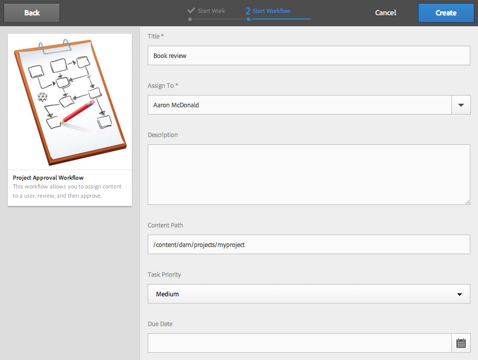

# Werken met projectworkflows{#working-with-project-workflows}

>[!CAUTION]
>
>AEM 6.4 heeft het einde van de uitgebreide ondersteuning bereikt en deze documentatie wordt niet meer bijgewerkt. Raadpleeg voor meer informatie onze [technische ondersteuningsperioden](https://helpx.adobe.com/support/programs/eol-matrix.html). Ondersteunde versies zoeken [hier](https://experienceleague.adobe.com/docs/).

De projectworkflows die beschikbaar zijn uit het vak zijn onder andere:

* **Workflow voor projectgoedkeuring** - Met deze workflow kunt u inhoud toewijzen aan een gebruiker, deze controleren en vervolgens goedkeuren.
* **Verzoek starten** - Een workflow waarvoor de toepassing wordt gestart.
* **Openingspagina aanvragen** - Voor deze workflow is een bestemmingspagina vereist.
* **E-mail aanvragen** - Workflow voor het aanvragen van een e-mail.
* **Fotofoto en foto van product (handel)** - Elementen toewijzen aan producten
* **DAM maken en vertalen kopie en DAM maken taalkopie** - Hiermee maakt u vertaalde binaire bestanden, metagegevens en tags voor elementen en mappen.

Afhankelijk van het projectsjabloon dat u selecteert, zijn bepaalde workflows beschikbaar:

|  | **Eenvoudig project** | **Mediaproject** | **Fotoproject van product** | **Omzettingsproject** |
|---|:-:|:-:|:-:|:-:|
| Verzoek om kopie |  | x |  |  |
| Fotofoto van product |  | x | x |  |
| Fotofoto van product (handel) |  |  | x |  |
| Projectgoedkeuring | x |  |  |  |
| Verzoek starten | x |  |  |  |
| Openingspagina aanvragen | x |  |  |  |
| E-mail aanvragen | x |  |  |  |
| DAM Create Language Copy&amp;ast; |  |  |  | x |
| DAM &amp;Create and Translate Language Copy |  |  |  | x |

>[!NOTE]
>
>&amp;asteren; Deze workflows worden niet gestart vanuit de **Workflow** tegel in projecten. Zie [Taalkopieën voor middelen maken.](/help/sites-administering/tc-manage.md)

De stappen voor het starten en voltooien van workflows zijn hetzelfde, ongeacht de workflow die u kiest. Alleen de stappen worden gewijzigd.

U start een workflow rechtstreeks in Projecten (behalve voor DAM Create Language Copy of DAM Create and Translate Language Copy). Informatie over openstaande taken in een project wordt vermeld in de **Taken** tegel. Meldingen voor taken die moeten worden voltooid, verschijnen naast het gebruikerspictogram.

Raadpleeg de volgende bronnen voor meer informatie over het werken met workflows in AEM:

* [Deelnemen aan workflows](/help/sites-authoring/workflows-participating.md)
* [Workflows toepassen op pagina&#39;s](/help/sites-authoring/workflows-applying.md)
* [Workflows configureren](/help/sites-administering/workflows.md)

Deze sectie beschrijft de werkschema&#39;s beschikbaar voor Projecten.

## Workflow voor kopiëren aanvragen {#request-copy-workflow}

Met deze workflow kunt u een gebruiker om een manuscript vragen en het vervolgens goedkeuren. De workflow voor het kopiëren van aanvragen starten:

1. Selecteer in uw Media-project het **+**-teken in de tegel **Workflows** en selecteer **Workflow voor kopiëren aanvragen**.
1. Voer een eigenschapstitel in en een korte samenvatting van wat u vraagt. Voer, indien van toepassing, een doelwoordtelling, taakprioriteit en een vervaldatum in.

   

1. Klikken **Maken**. De workflow wordt gestart. De taak wordt weergegeven in het dialoogvenster **Taken** tegel.

   

## Workflow voor foto&#39;s van producten {#product-photo-shoot-workflow}

De werkstromen van de Foto van het Product van de Opname (zowel handel als zonder handel) zijn in detail behandeld [Creatief project](/help/sites-authoring/managing-product-information.md).

## Workflow voor projectgoedkeuring {#project-approval-workflow}

In het werkschema van de Goedkeuring van het Project, wijst u inhoud aan een gebruiker toe, herziet, en keurt dan de inhoud goed.

1. Selecteer in uw Eenvoudig project de ****+** aanmelden **Workflows** tegel en selecteer **Workflow voor projectgoedkeuring**.
1. Ga een titel in en selecteer aan wie om het van de lijst van het Team toe te wijzen. Voer, indien van toepassing, een beschrijving, een inhoudspad, een taakprioriteit en een vervaldatum in.

   

1. Klikken **Maken**. De workflow wordt gestart. De taak wordt weergegeven in het dialoogvenster **Taken** tegel.

   

## Verzoek indienen om workflow te starten {#request-launch-workflow}

Met deze workflow kunt u een verzoek indienen om de toepassing te starten.

1. Selecteer in uw Simple-project het **+**-teken in de tegel **Workflows** en selecteer **Workflow voor lancering aanvragen**.
1. Voer een titel in voor de opstart en geef het bronpad voor de opstart op. U kunt ook een beschrijving en live datum toevoegen, indien van toepassing. Selecteer Live-gegevens van bronpagina overnemen of subpagina&#39;s uitsluiten, afhankelijk van de manier waarop u de opstart wilt laten uitvoeren.

   

1. Klikken **Maken**. De workflow wordt gestart. De workflow wordt weergegeven in het dialoogvenster **Workflows** lijst (klik op ovalen) **...** op de **Workflows** tegel voor toegang tot deze lijst).

## Workflow voor aanvragen van bestemmingspagina {#request-landing-page-workflow}

Met deze workflow kunt u een bestemmingspagina aanvragen.

1. In uw Eenvoudig project, selecteer **+** aanmelden **Workflows** tegel en selecteer Request Landing Page Workflow.
1. Voer een titel in voor de openingspagina en het bovenliggende pad. Voer, indien van toepassing, een live datum in of kies een bestand voor de bestemmingspagina.

   

1. Klikken **Maken**. De workflow wordt gestart. De taak wordt weergegeven in het dialoogvenster **Taken** tegel.

## E-mailworkflow aanvragen {#request-email-workflow}

Met deze workflow kunt u een e-mail aanvragen. Het is dezelfde workflow die wordt weergegeven in **E-mails** tegel.

1. In uw Media of Eenvoudig project, selecteer **+** aanmelden **Workflows** tegel en selecteer **E-mailworkflow aanvragen**.
1. Voer een e-mailtitel in, evenals de campagne- en sjabloonpaden. Daarnaast kunt u een naam, beschrijving en actieve datum opgeven.

   

1. Klikken **Maken**. De workflow wordt gestart. De taak wordt weergegeven in het dialoogvenster **Taken** tegel.

   

## Workflow voor taalkopieën maken (en vertalen) voor middelen {#create-and-translate-language-copy-workflow-for-assets}

De **Taalkopie maken** en de **Taalkopie maken en vertalen** workflows worden uitvoerig behandeld [Taalkopieën voor middelen maken.](/help/assets/translation-projects.md)
