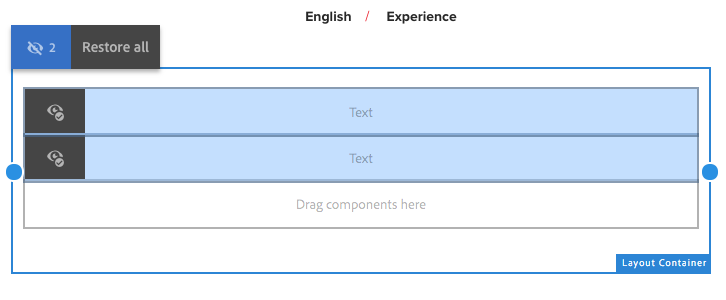

# Responsieve lay-out{#responsive-layout}

AEM kunt u een responsieve indeling voor uw pagina&#39;s gebruiken met de **component Layout Container** .

Dit biedt een alineasysteem waarmee u componenten binnen een responsief raster kunt plaatsen. Met dit raster kunt u de lay-out opnieuw rangschikken op basis van de grootte en de indeling van het apparaat/venster. De component wordt gebruikt in combinatie met de modus [**Lay-out **](/help/sites-authoring/responsive-layout.md#defining-layouts-layout-mode), waarmee u uw responsieve lay-out afhankelijk van het apparaat kunt maken en bewerken.

De container layout:

* Biedt een horizontale uitlijning op het raster, samen met de mogelijkheid om componenten naast elkaar in het raster te plaatsen en te bepalen wanneer ze moeten samenvouwen/opnieuw plaatsen.
* Gebruikt vooraf gedefinieerde onderbrekingspunten (bijvoorbeeld voor telefoon, tablet, enz.) waarmee u het vereiste gedrag van inhoud voor verwante apparaten/oriëntatie kunt definiëren.

   * U kunt bijvoorbeeld de grootte van de component aanpassen of de component zichtbaar is op bepaalde apparaten.

* Kan worden genest om kolombesturing toe te staan.

De gebruiker kan dan zien hoe de inhoud wordt gerenderd voor specifieke apparaten met behulp van de emulator.

>[!CAUTION]
>
>Although the Layout Container component is available in the classic UI, its full functionality is only available and supported in the touch-enabled UI.

AEM realizes responsive layout for your pages using a combination of mechanisms:

* [**Layout Container **](#adding-a-layout-container-and-its-content-edit-mode)component

   Deze component is beschikbaar in de [componentenbrowser](/help/sites-authoring/author-environment-tools.md#components-browser) en verstrekt een net-paragraaf systeem om u toe te staan om componenten binnen een ontvankelijk net toe te voegen en te plaatsen. Deze kan ook als het standaardalineasysteem op de pagina worden ingesteld.

* [**Lay-outmodus **](/help/sites-authoring/responsive-layout.md#defining-layouts-layout-mode)

   Zodra de lay-outcontainer op de pagina wordt geplaatst, kunt u de wijze van de **Lay-out** gebruiken om inhoud binnen het ontvankelijke net te plaatsen.

* [**Emulator **](#selecting-a-device-to-emulate)This allows you to create and edit responsive websites that rearrange the layout according to device/window size by resizing components interactively. The user can then see how the content will be rendered using the emulator.

Met deze responsieve rastermechanismen kunt u:

* Use breakpoints to define differing content layouts based on device width (related to device type and orientation).
* Use these same breakpoints and content layouts to ensure that your content is responsive to the size of the browser window on the desktop.
* Use horizontal snap to grid allowing you to place components in the grid, resize as required, and define when they should collapse/reflow to be side-by-side or above/below.
* Hide components for specific device layouts.
* Kolombesturingselement realiseren.

Depending on your project, the Layout Container might be used as the default paragraph system for your pages or as a component available to be added to your page via the component browser (or both).

>[!NOTE]
>
>Adobe verstrekt [documentatie](https://adobe-marketing-cloud.github.io/aem-responsivegrid/) GitHub van de ontvankelijke lay-out als verwijzing die aan front-end ontwikkelaars kan worden gegeven die hen toestaan om het AEM net buiten AEM te gebruiken, bijvoorbeeld wanneer het creëren van statische mock-ups van HTML voor een toekomstige AEM plaats.

>[!NOTE]
>
>Het gebruik van de bovenstaande mechanismen wordt ingeschakeld door configuratie op de sjabloon. Zie Responsieve lay-out  configureren voor meer informatie.

## Lay-outdefinities, Apparaatemulatie en Onderbrekingspunten {#layout-definitions-device-emulation-and-breakpoints}

Wanneer u uw website-inhoud maakt, moet u ervoor zorgen dat uw inhoud correct wordt weergegeven voor het apparaat dat wordt gebruikt om de inhoud weer te geven.

AEM kunt u lay-outs definiëren die afhankelijk zijn van de breedte van het apparaat:

* Met de emulator kunt u deze lay-outs emuleren op een reeks apparaten. Naast het apparaattype kan de richting, geselecteerd met de optie **Apparaat** roteren, invloed hebben op het geselecteerde onderbrekingspunt wanneer de breedte verandert.
* Onderbrekingspunten zijn de punten die de layoutdefinities scheiden.

   * Ze definiëren in feite de maximale breedte (in pixels) van elk apparaat met een specifieke lay-out.
   * De onderbrekingspunten zijn gewoonlijk geldig voor een selectie van apparaten, afhankelijk van de breedte van hun vertoningen.
   * Het bereik van een onderbrekingspunt loopt door tot het volgende onderbrekingspunt.
   * U kunt het onderbrekingspunt niet specifiek selecteren, zal selecteren een apparaat en de richtlijn automatisch het aangewezen breekpunt selecteren.

Het apparaat **Desktop**, dat geen specifieke breedte heeft, heeft betrekking op het standaardbreekpunt (d.w.z. alles boven het laatst gevormde breekpunt).

>[!NOTE]
>
>Het zou mogelijk zijn om breekpunten voor elk individueel apparaat te bepalen, maar dit zou drastisch de inspanning die voor lay-outdefinitie en onderhoud wordt vereist verhogen.

Wanneer u de emulator gebruikt, selecteert u een specifiek apparaat voor de definitie van emulatie en layout en wordt het desbetreffende onderbrekingspunt ook gemarkeerd. Alle layoutwijzigingen die u aanbrengt, zijn van toepassing op andere apparaten waarop het onderbrekingspunt van toepassing is, dat wil zeggen apparaten die links van de actieve onderbrekingspuntmarkering zijn geplaatst, maar vóór de volgende onderbrekingspuntmarkering.

Wanneer u bijvoorbeeld de **iPhone 6 Plus** van het apparaat (gedefinieerd met een breedte van 540 pixels) selecteert voor emulatie en lay-out, wordt ook de **telefoon** met onderbrekingspunten (gedefinieerd als 768 pixels) geactiveerd. Alle layoutwijzigingen die u aanbrengt voor de **iPhone 6** , zijn van toepassing op andere apparaten onder het onderbrekingspunt **Telefoons** , zoals **iPhone 5** (gedefinieerd als 320 pixels).

## Een apparaat selecteren om te emuleren {#selecting-a-device-to-emulate}

1. Open de vereiste pagina om te bewerken. Bijvoorbeeld:

   `http://localhost:4502/editor.html/content/we-retail/us/en/experience.html`

1. Selecteer het pictogram **Emulator** op de bovenste werkbalk:

   

1. De emulatorwerkbalk wordt geopend.

   

   Op de emulatorwerkbalk worden extra layoutopties weergegeven:

   * **Apparaat** roteren - Hiermee kunt u een apparaat roteren van verticale (staande) richting naar horizontale (liggende) richting en andersom.

    

   * **Selecteer Apparaat** - Definieer een specifiek apparaat dat u wilt emuleren in een lijst (zie de volgende stap voor meer informatie)

   

1. Als u een specifiek apparaat wilt selecteren om te emuleren, kunt u:

   * Gebruik het pictogram Apparaat selecteren en selecteer een keuze in een vervolgkeuzelijst.
   * Tik/klik op de apparaatindicator op de emulatorwerkbalk.

   

1. Nadat een specifiek apparaat is geselecteerd, kunt u:

   * Zie de actieve markering voor het geselecteerde apparaat, zoals **iPad.**
   * Zie de actieve markering voor het juiste [breekpunt](/help/sites-authoring/responsive-layout.md#layout-definitions-device-emulation-and-breakpoints) , zoals **Tablet.**

   

   * De blauwe stippellijn geeft de *voud* voor het geselecteerde apparaat aan (hier een **iPhone 6**).

   

   * De vouwlijn kan ook worden beschouwd als het pagina-regeleinde (niet te verwarren met de [onderbrekingspunten](/help/sites-authoring/responsive-layout.md#layout-definitions-device-emulation-and-breakpoints)) voor de inhoud. This is displayed for convenience to show what part of the content the user will see on the device before scrolling.
   * De lijn voor de vouwlijn wordt niet weergegeven als de hoogte van het geëmuleerde apparaat groter is dan de schermgrootte.
   * De vouw wordt getoond voor het gemak van de auteur en niet op de gepubliceerde pagina getoond.

## Een lay-outcontainer en de bijbehorende content toevoegen (modus Bewerken) {#adding-a-layout-container-and-its-content-edit-mode}

A **Layout Container** is a paragraph system that:

* Contains other components.
* Definieert de lay-out.
* Responds to changes.

>[!NOTE]
>
>If not already available, the **Layout Container** must be explicitly [activated for a paragraph system/page](/help/sites-administering/configuring-responsive-layout.md) (for example, by using [**Design **mode](/help/sites-authoring/default-components-designmode.md)).

1. De **lay-outcontainer** is beschikbaar als standaardcomponent in de [componentbrowser](/help/sites-authoring/author-environment-tools.md#components-browser). Van hieruit kunt u het naar de vereiste locatie op de pagina slepen waarna u de tijdelijke aanduiding **Componenten hierheen slepen** zult zien.
1. You can then add components to the layout container. Deze componenten bevatten de werkelijke inhoud:

   

## Selecting and Taking Action on a Layout Container (Edit mode) {#selecting-and-taking-action-on-a-layout-container-edit-mode}

Net als bij andere componenten kunt u een container van de layout selecteren en vervolgens actie ondernemen (knippen, kopiëren, verwijderen) (in de modus **Bewerken** ):

>[!CAUTION]
>
>As a layout container is a paragraph system, deleting the component will delete both the layout grid and all the components (and their content) held within the container.

1. If you mouseover or tap the grid placeholder, the action menu is displayed.

   

   U moet de optie **Bovenliggend** selecteren.

   

1. Als de lay-outcomponent genest is, stelt het selecteren van de optie **Bovenliggend** een drop-down selectie voor, die u toestaat om de genestelde lay-outcontainer of zijn ouder(s) te selecteren.

   Wanneer u de muis boven de containernamen in de vervolgkeuzelijst plaatst, wordt de omtrek van de namen op de pagina weergegeven.

   * De laagste geneste lay-outcontainer wordt omgeven door zwarte omtrekken.
   * De op één na laagste geneste lay-outcontainer zal in donkergrijs zijn.
   * Elke volgende container zal een lichtere grijstint hebben.

   

1. Hierdoor wordt het volledige raster met de inhoud gemarkeerd. De actiewerkbalk wordt weergegeven, waar u een handeling zoals **Verwijderen kunt selecteren.**

   

## Indelingen definiëren (modus Indeling) {#defining-layouts-layout-mode}

>[!NOTE]
>
>U kunt een afzonderlijke indeling definiëren voor elk [onderbrekingspunt](#layout-definitions-device-emulation-and-breakpoints) (zoals wordt bepaald door het geëmuleerde apparaattype en de stand).

Als u de lay-out wilt configureren van een responsief raster dat met de container voor lay-out is geïmplementeerd, moet u de modus **Lay-out** gebruiken.

**De lay-outmodus** kan op twee manieren worden gestart.

* Gebruik het [modusmenu op de werkbalk](/help/sites-authoring/author-environment-tools.md#page-modes) en kies de modus **Lay-out**

   * Selecteer de modus **Lay-out** op dezelfde manier als wanneer u schakelt naar de modus **Bewerken** of de modus **Targeting**.
   * De modus **Lay-out** is permanent en u verlaat de modus **Lay-out** pas wanneer u een andere modus selecteert via de moduskiezer.

* Wanneer u een afzonderlijke component [bewerkt.](/help/sites-authoring/editing-content.md#edit-component-layout)

   * Met de optie **Lay-out** in het snelmenu van de component kunt u overschakelen naar de modus **Lay-out** .
   * **De modus Lay-out** blijft bestaan tijdens het bewerken van de component en keert terug naar de modus **Bewerken** als de focus naar een andere component is gewijzigd.

In de lay-outmodus kunt u verschillende handelingen op een raster uitvoeren:

* Wijzig de grootte van de inhoudcomponenten met de blauwe stippen. Het resizing zal altijd breken-aan-net. Wanneer u het formaat van het achtergrondraster wijzigt, wordt dit weergegeven als hulp bij het uitlijnen:

   

   >[!NOTE]
   >
   >Verhoudingen en verhoudingen blijven behouden wanneer de grootte van componenten zoals **afbeeldingen** wordt gewijzigd.

* Klik/tik op een inhoudscomponent, op de werkbalk kunt u:

   * **Bovenliggend**

      Hiermee kunt u de volledige containercomponent voor de lay-out selecteren om actie te ondernemen voor het geheel.

   * **Zweven naar nieuwe regel**

      De component wordt naar een nieuwe regel verplaatst, afhankelijk van de ruimte die beschikbaar is in het raster.

   * **Component verbergen**

      De component wordt onzichtbaar gemaakt (u kunt deze herstellen vanaf de werkbalk van de container voor lay-outs).
   

* In de modus **Lay-out** kunt u op de componenten voor **slepen hier** tikken of klikken om de volledige component te selecteren. De werkbalk voor deze modus wordt dan weergegeven.

   De werkbalk heeft verschillende opties, afhankelijk van de status van de lay-outcomponent en de onderdelen ervan. Bijvoorbeeld:

   * **Bovenliggend element** - selecteer de bovenliggende component.

   

   * **Verborgen componenten** tonen - Alle of afzonderlijke componenten zichtbaar maken. Het getal geeft aan hoeveel verborgen componenten er momenteel zijn. De teller toont hoeveel componenten verborgen zijn.

   

   * **Vorige layout** van onderbrekingspunten - De standaardlayout herstellen. Dit betekent dat er geen aangepaste indeling wordt opgelegd.

   

   * **Zweven naar nieuwe regel** - De component omhoog verplaatsen als de afstand dit toestaat.

   

   * **Component** verbergen - De huidige component verbergen.

   

   >[!NOTE]
   >
   >In het bovenstaande voorbeeld zijn de acties voor zweven en verbergen beschikbaar omdat deze container van de layout is genest in een bovenliggende container van de layout.

   * **De verbergen van componenten** opheffen Selecteer de bovenliggende componenten om de actiewerkbalk weer te geven met de opdracht 
**Verborgen componenten** tonen, optie. In dit voorbeeld zijn twee componenten verborgen.
   

   Als u de optie **Verborgen componenten weergeven** selecteert, worden de componenten die momenteel op hun oorspronkelijke positie zijn verborgen, blauw weergegeven.

   

   Als u Alle **verborgen componenten** herstellen selecteert, worden alle verborgen componenten zichtbaar.

