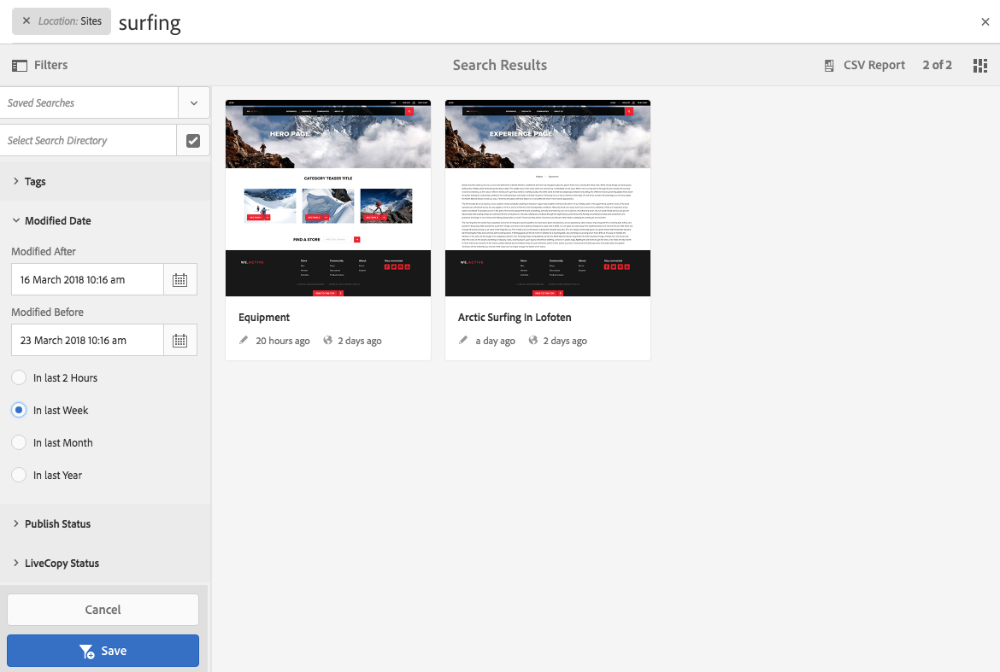
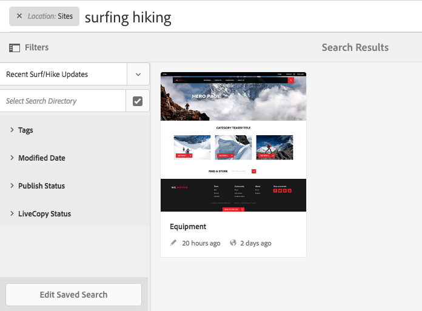

# Zoeken{#search-features}

De auteursomgeving van AEM verstrekt diverse mechanismen om naar inhoud te zoeken, afhankelijk van het middeltype.

>[!NOTE]
>
>Buiten de auteursomgeving zijn andere mechanismen ook beschikbaar voor het zoeken, zoals [Query Builder](/help/sites-developing/querybuilder-api.md) en [CRXDE Lite](/help/sites-developing/developing-with-crxde-lite.md).

## Basisinformatie zoeken {#search-basics}

Zoeken is beschikbaar op de bovenste werkbalk:

Met de zoekrail kunt u:

* Zoeken naar een specifiek trefwoord, pad of tag.
* Filter volgens bronspecifieke criteria, zoals gewijzigde datums, paginastatus, bestandsgrootte, enzovoort.
* Definieer en gebruik een [opgeslagen zoekopdracht](#saved-searches) - op basis van de bovenstaande criteria.

>[!NOTE]
>
>De zoekopdracht kan ook worden aangeroepen door de sneltoets `/` (forward slash) te gebruiken wanneer de zoekrail zichtbaar is.

## {#search-and-filter} zoeken en filteren

U kunt als volgt uw bronnen zoeken en filteren:

1. Open **Zoeken** (met het vergrootglas in de werkbalk) en voer uw zoekterm in. Er worden voorstellen gedaan die kunnen worden geselecteerd:

   

   Standaard worden de zoekresultaten beperkt tot uw huidige locatie (dat wil zeggen console en het gerelateerde type resource):

   

1. Indien nodig, kunt u de locatiefilter verwijderen (selecteer **X** op de filter u wilt verwijderen) over alle consoles/middeltypes te zoeken.
1. De resultaten zullen worden getoond, gegroepeerd volgens console en verwant middeltype.

   U kunt of een specifieke middel selecteren (voor verdere actie), of boren neer door het vereiste middeltype te selecteren; bijvoorbeeld **Alle sites weergeven**:

   

1. Als u verder omlaag wilt boren, selecteert u het symbool Rail (linksboven) om het zijpaneel te openen **Filters &amp; Opties**.

   

   Volgens het middeltypeOnderzoek zal een vooraf bepaalde selectie van onderzoek/filtercriteria tonen.

   In het zijpaneel kunt u het volgende selecteren:

   * Opgeslagen zoekopdrachten
   * Zoekdirectory
   * Tags
   * Zoekcriteria; bijvoorbeeld Gewijzigde datums, Publish Status, LiveCopy Status.

   >[!NOTE]
   >
   >De zoekcriteria kunnen variëren:
   >
   >* Afhankelijk van het type resource dat u hebt geselecteerd; Zo zijn bijvoorbeeld de activa- en Gemeenschapscriteria begrijpelijkerwijs gespecialiseerd.
   >* Uw exemplaar als [Onderzoek Forms](/help/sites-administering/search-forms.md) kan worden aangepast (aangewezen aan de plaats binnen AEM).

   

1. U kunt ook extra zoektermen toevoegen:

   

1. Sluit **Zoeken** met de **X** (rechtsboven).

>[!NOTE]
>
>Zoekcriteria blijven bestaan wanneer u een item in de zoekresultaten selecteert.
>
>Wanneer u een item op de pagina met zoekresultaten selecteert en vervolgens terugkeert naar de zoekpagina nadat u de knop Terug in de browser hebt gebruikt, blijven de zoekcriteria behouden.

## Opgeslagen zoekopdrachten {#saved-searches}

Naast het zoeken op basis van een groot aantal facetten kunt u ook een bepaalde zoekconfiguratie opslaan, zodat deze later kan worden opgehaald en gebruikt:

1. Definieer uw zoekcriteria en selecteer **Opslaan**.

   

1. Wijs een naam toe, dan gebruik **sparen** om te bevestigen:

   

1. De volgende keer dat u het deelvenster Zoeken opent, kunt u de opgeslagen zoekopdracht vanuit de kiezer openen:

   

1. Nadat u het bestand hebt opgeslagen, kunt u:

   * Gebruik **x** (tegen de naam van de opgeslagen zoekopdracht) om een nieuwe query te starten (de opgeslagen zoekopdracht zelf wordt niet verwijderd).
   * **Bewerk Opgeslagen zoekopdracht**, wijzig de zoekvoorwaarden en  **** sla de zoekopdracht nogmaals op.

Opgeslagen zoekopdrachten kunnen worden gewijzigd door de opgeslagen zoekopdracht te selecteren en onder aan het zoekvenster op **Opgeslagen zoekopdracht bewerken** te klikken.

