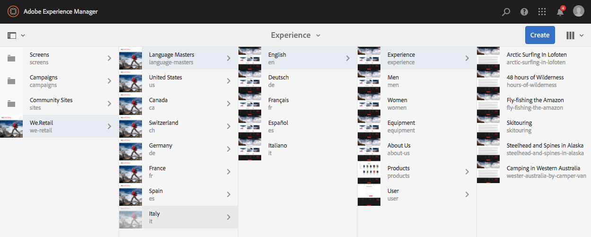

# Uw interface selecteren{#selecting-your-ui}

## De gebruikersinterface

In de ontwerpomgeving is het volgende mogelijk:

* [Authoring](/help/sites-authoring/author.md)  (inclusief  [paginaontwerp](/help/sites-authoring/author-environment-tools.md),  [beheer van middelen](/help/assets/home.md),  [gemeenschappen](/help/communities/author-communities.md))

* [Taken ](/help/sites-administering/home.md) beheren die u nodig hebt voor het genereren en onderhouden van de inhoud van uw website

Hiervoor zijn twee grafische gebruikersinterfaces beschikbaar. Deze zijn toegankelijk via elke moderne browser.

1. Interface met aanraakbediening

   * Dit is de moderne, standaard AEM UI.
   * Het is overwegend grijs, met een schone, vlakke interface.
   * De vormgeving is op alle apparaten hetzelfde en is ontworpen voor gebruik op zowel touch- als desktopapparaten, maar [het weergeven en selecteren van uw bronnen](/help/sites-authoring/basic-handling.md#viewing-and-selecting-resources) verschilt enigszins (tikken versus klikken).

      * Desktop:

   

   * Tabletapparaten (of desktops met een breedte van minder dan 1024 pixels):

   

1. Klassieke interface

   * Dit is de oudere gebruikersinterface en is al vele jaren in AEM beschikbaar.
   * Het is voornamelijk groen.
   * Het is ontworpen voor gebruik op desktopapparaten.
   * De volgende documentatie concentreert zich op moderne UI. Voor informatie over creatie in klassieke UI, zie [Authoring documentatie voor Klassieke UI](/help/sites-classic-ui-authoring/classicui.md).

   

## Wisselende UIs

Hoewel de interface met aanraakbediening nu de standaardinterface is en [pariteit van functies](../release-notes/touch-ui-features-status.md) bijna is bereikt met het beheer en bewerken van sites, kan het gebeuren dat de gebruiker wil overschakelen op [klassieke UI](/help/sites-classic-ui-authoring/classicui.md). Hiervoor zijn verschillende opties beschikbaar.

>[!NOTE]
>
>Voor details over de status van eigenschappariteit met klassieke UI, zie [Aanraakeigenschappen pariteit UI](../release-notes/touch-ui-features-status.md) document.

Er zijn verschillende locaties waar u kunt definiëren welke interface moet worden gebruikt:

* [Het vormen van het gebrek UI voor uw instantie](#configuring-the-default-ui-for-your-instance)  - dit zal het gebrek UI plaatsen om bij gebruikerslogin te worden getoond, hoewel de gebruiker dit kan kunnen kunnen met voeten treden en een verschillende UI voor hun rekening of huidige zitting selecteren.

* [Instellen van Klassieke UI-authoring voor uw account](/help/sites-authoring/select-ui.md#setting-classic-ui-authoring-for-your-account)  - Hiermee wordt ingesteld dat de gebruikersinterface standaard wordt gebruikt bij het bewerken van pagina&#39;s, hoewel de gebruiker dit kan overschrijven en een andere gebruikersinterface kan selecteren voor hun account of huidige sessie.

* [Het schakelen naar klassieke UI voor de huidige zitting](#switching-to-classic-ui-for-the-current-session)  - Dit schakelt naar klassieke UI voor de huidige zitting.

* Bij het ontwerpen van [pagina&#39;s maakt het systeem bepaalde overschrijvingen met betrekking tot de interface](#ui-overrides-for-the-editor).

>[!CAUTION]
>
>Diverse opties voor het schakelen naar klassieke UI zijn niet onmiddellijk beschikbaar uit-van-de-doos, zij moeten specifiek voor uw instantie worden gevormd.
>
>Zie [Toegang tot klassieke UI inschakelen](/help/sites-administering/enable-classic-ui.md) voor meer informatie.

>[!NOTE]
>
>Instanties die zijn bijgewerkt vanaf een vorige versie behouden de klassieke interface voor het ontwerpen van pagina&#39;s.
>
>Na upgrade wordt het ontwerpen van pagina&#39;s niet automatisch overgeschakeld op de interface met aanraakbediening, maar u kunt dit configureren met de [OSGi-configuratie](/help/sites-deploying/configuring-osgi.md) van de **WCM Authoring UI Mode Service** ( `AuthoringUIMode` service). Zie [UI-overschrijvingen voor de Editor](#ui-overrides-for-the-editor).

## Standaardinterface configureren voor uw instantie {#configuring-the-default-ui-for-your-instance}

Een systeembeheerder kan UI vormen die bij opstarten en login door [Toewijzing van de Wortel](/help/sites-deploying/osgi-configuration-settings.md) te gebruiken wordt gezien.

Dit kan door gebruikersgebreken of zittingsmontages worden met voeten getreden.

## Klassieke UI-authoring instellen voor uw account {#setting-classic-ui-authoring-for-your-account}

Elke gebruiker kan tot zijn/haar [gebruikersvoorkeur](/help/sites-authoring/user-properties.md) toegang hebben om te bepalen als hij/zij klassieke UI voor paginaontwerp (in plaats van het gebrek UI) wenst te gebruiken.

Dit kan door zittingsmontages worden met voeten getreden.

## Overschakelen naar klassieke UI voor de Huidige Zitting {#switching-to-classic-ui-for-the-current-session}

Als gebruikers de interface met aanraakbediening gebruiken, kunnen ze terugkeren naar de klassieke interface (alleen bureaublad). Er zijn verscheidene methodes om op klassieke UI voor de huidige zitting over te schakelen:

* **Navigatiekoppelingen**

   >[!CAUTION]
   >
   >Deze optie voor het schakelen naar klassieke UI is niet onmiddellijk beschikbaar uit-van-de-doos, moet het specifiek voor uw instantie worden gevormd.
   >
   >
   >Zie [Toegang tot klassieke UI inschakelen](/help/sites-administering/enable-classic-ui.md) voor meer informatie.

   Als dit wordt toegelaten, wanneer u muis over een toepasselijke console, een pictogram (symbool van een monitor) verschijnt, zal het tikken van/het klikken dit de aangewezen plaats in klassieke UI openen.

   Bijvoorbeeld, de verbindingen van **Sites** aan **plaatadmin**:

   

* **URL**

   De klassieke UI kan worden betreden gebruikend URL voor het welkomstscherm bij `welcome.html`. Bijvoorbeeld:

   `http://localhost:4502/welcome.html`

   >[!NOTE]
   >
   >De interface met aanraakbediening is toegankelijk via `sites.html`. Bijvoorbeeld:
   >
   >
   >`http://localhost:4502/sites.html`

### Overschakelen naar klassieke interface bij het bewerken van een pagina {#switching-to-classic-ui-when-editing-a-page}

>[!CAUTION]
>
>Deze optie voor het schakelen naar klassieke UI is niet onmiddellijk beschikbaar uit-van-de-doos, moet het specifiek voor uw instantie worden gevormd.
>
>Zie [Toegang tot klassieke UI inschakelen](/help/sites-administering/enable-classic-ui.md) voor meer informatie.

Indien ingeschakeld is **Open de klassieke UI** beschikbaar in het dialoogvenster **Paginagegevens**:

### UI-overschrijvingen voor de Editor {#ui-overrides-for-the-editor}

De instellingen die door een gebruiker of systeembeheerder zijn gedefinieerd, kunnen door het systeem worden overschreven bij het ontwerpen van pagina&#39;s.

* Bij het ontwerpen van pagina&#39;s:

   * Het gebruik van de klassieke editor wordt geforceerd wanneer de pagina wordt geopend met `cf#` in de URL. Bijvoorbeeld:

      `http://localhost:4502/cf#/content/geometrixx/en/products/triangle.html`

   * Het gebruik van de aanraakeditor wordt geforceerd wanneer u `/editor.html` in de URL gebruikt of wanneer u een aanraakapparaat gebruikt. Bijvoorbeeld:

      `http://localhost:4502/editor.html/content/geometrixx/en/products/triangle.html`

* Elke forcering is tijdelijk en is alleen geldig voor de browsersessie

   * Een cookieset wordt ingesteld afhankelijk van het feit of touch-enabled ( `editor.html`) of classic ( `cf#`) wordt gebruikt.

* Bij het openen van pagina&#39;s via `siteadmin` wordt gecontroleerd of:

   * Het cookie
   * Een gebruikersvoorkeur
   * Als geen van beide bestaan, zal het aan de definities in [OSGi configuratie](/help/sites-deploying/configuring-osgi.md) van **WCM Authoring UI Mode Service** ( `AuthoringUIMode` dienst) in gebreke blijven.

>[!NOTE]
>
>Als [een gebruiker reeds een voorkeur voor pagina creatie](#setting-classic-ui-authoring-for-your-account) heeft bepaald, zal dat niet worden met voeten getreden door het bezit te veranderen OSGi.

>[!CAUTION]
>
>Vanwege het gebruik van cookies, zoals hierboven beschreven, wordt het niet aanbevolen om:
>
>* Handmatig de URL bewerken - Een niet-standaard URL kan leiden tot een onbekende situatie en een gebrek aan functionaliteit.
>* Beide editors tegelijk openen, bijvoorbeeld in afzonderlijke vensters.

>

