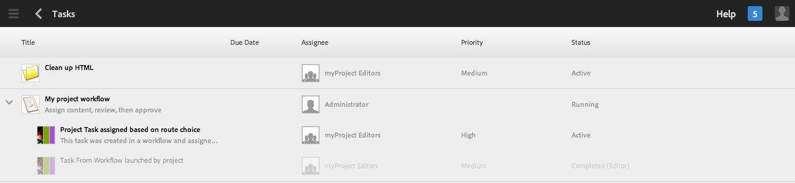

# Werken met taken{#working-with-tasks}

Taken zijn de onderdelen van het werk dat op de inhoud moet worden uitgevoerd. Wanneer u een taak krijgt toegewezen, wordt deze weergegeven in het Postvak IN van de workflow. De punten van de taak hebben een waarde van taak in de kolom van het Type.

De taken worden ook gebruikt in projecten om het niveau van volledigheid van huidige taken, met inbegrip van werkschemataken te bepalen.

## Voortgang van project bijhouden {#tracking-project-progress}

U kunt projectvooruitgang volgen door de actieve/voltooide taken binnen een project te bekijken dat door de **tegel** wordt vertegenwoordigd. De voortgang van het project kan worden bepaald door:

* **Taaktegel:** Een algemene vooruitgang van het project wordt getoond in Taaktegel op de pagina met projectdetails.

* **Taaklijst:** Wanneer u op de Taaktegel klikt, wordt een lijst met taken weergegeven. Deze lijst bevat gedetailleerde informatie over alle taken met betrekking tot het project.

Zowel de taken van het lijstwerkschema als taken u direct in **Taken** tegel creeert.

### Taaktegel {#task-tile}

Als een project om het even welke verwante taken heeft, wordt een Tegel van de Taak getoond binnen het project. De Taaktegel toont het huidige statuut van het project. Dit is gebaseerd op bestaande taken binnen de workflow en bevat geen taken die in de toekomst worden gegenereerd wanneer de workflow doorgaat. De volgende informatie is zichtbaar in de taaktegel:

* Percentage voltooide taken
* Percentage actieve taken
* Percentage achterstallige taken

### Het bekijken of het Wijzigen van de Taken in een Project {#viewing-or-modifying-the-tasks-in-a-project}

Naast het volgen van vooruitgang, kunt u meer informatie over het project willen bekijken of het wijzigen.

#### Taaklijst {#task-list}

Klik de ellips (...) in de tegel van de Taak om de lijst van de taken met betrekking tot het project te tonen. De taken worden gedeeld door bovenliggende workflows. De taakdetails worden getoond samen met meta-gegevens zoals vervaldatum, ontvanger, prioriteit, en status.

#### Taakdetails {#task-details}

Voor meer informatie over een bepaalde taak, in de Lijst van de Taak, tik/klik de taak en **de Details van de Taak **open.

### Taakopmerkingen weergeven en wijzigen {#viewing-and-modifying-task-comments}

In Taakdetails kunt u opmerkingen bewerken of toevoegen. Bovendien zijn alle opmerkingen in een project zichtbaar in het gebied Opmerkingen.

### Taken {#adding-tasks} toevoegen

U kunt nieuwe taken aan projecten toevoegen. Deze taken verschijnen dan in de tegel van Taken en zijn beschikbaar in Berichten inbox om acties uit te voeren op.

Een taak toevoegen:

1. Tik of klik in het project in de tegel **Taken** op het +-pictogram. Het venster **Taak toevoegen** wordt geopend.
1. Voer informatie in over de taak. De titel van de taak en de groep waaraan deze is toegewezen, zijn verplicht. Aanvullende informatie zoals het inhoudspad, de beschrijving, de taakprioriteit en de vervaldatum zijn optioneel. Daarnaast kunt u het tabblad **Geavanceerd** selecteren om de naam van de taak in te voeren. Dit wordt gebruikt om de URL een naam te geven.

   

1. Tik/klik **Maken**.

## Werken met taken in het Postvak IN {#working-with-tasks-in-the-inbox}

Een andere manier om tot taken toegang te hebben is van Inbox. Vanuit het Postvak IN kunt u de inhoud openen om de vereiste wijzigingen te implementeren. Als u klaar bent, stelt u de taakstatus in op Voltooid. De taken verschijnen ook in uw inbox wanneer zij aan een gebruikersgroep worden toegewezen die u tot behoort. In dat geval kan elk lid van de groep het werk uitvoeren en de taak voltooien.

Als u een taak wilt voltooien, selecteert u de taak en klikt u op **Voltooien**. Voeg informatie aan de taak toe en klik dan **Done**. Zie [Uw Postvak IN](/help/sites-authoring/inbox.md) voor meer informatie.

