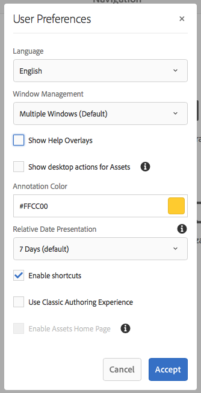

# Uw accountomgeving configureren{#configuring-your-account-environment}

>[!CAUTION]
>
>AEM 6.4 heeft het einde van de uitgebreide ondersteuning bereikt en deze documentatie wordt niet meer bijgewerkt. Raadpleeg voor meer informatie onze [technische ondersteuningsperioden](https://helpx.adobe.com/support/programs/eol-matrix.html). Ondersteunde versies zoeken [hier](https://experienceleague.adobe.com/docs/).

AEM biedt u de mogelijkheid om uw account en bepaalde aspecten van de auteursomgeving te configureren.

Met de [Gebruiker](/help/sites-authoring/user-properties.md#user-settings) in de [header](/help/sites-authoring/basic-handling.md#the-header) en de bijbehorende [Mijn voorkeuren](#my-preferences) kunt u de gebruikersopties wijzigen.

## Gebruikersinstellingen {#user-settings}

De **Gebruiker** In het dialoogvenster Instellingen hebt u toegang tot:

* Imiteren als

   * Met de [Imiteren als](/help/sites-administering/security.md#impersonating-another-user) een gebruiker namens een andere gebruiker kan werken.

* Profiel

   * Biedt een handige koppeling naar uw [gebruikersinstellingen](/help/sites-administering/security.md))

* [Mijn voorkeuren](/help/sites-authoring/user-properties.md#my-preferences)

   * Verschillende voorkeursinstellingen opgeven die uniek zijn voor uw gebruiker

## Mijn voorkeuren {#my-preferences}

De **Mijn voorkeuren** dialoogvenster is toegankelijk via de [Gebruiker](/help/sites-authoring/user-properties.md#user-settings) in de koptekst.

Elke gebruiker kan bepaalde eigenschappen voor zichzelf instellen.

* **Taal**

   Dit bepaalt de taal voor UI van het auteursmilieu te gebruiken. Selecteer de gewenste taal in de beschikbare lijst.

   Deze configuratie wordt ook gebruikt voor klassieke UI.

* **Vensterbeheer**

   Hiermee definieert u het gedrag voor het openen van vensters. Selecteer een van de volgende opties:

   * **Meerdere vensters** (Standaard)

      * Pagina&#39;s worden in een nieuw venster geopend.
   * **Eén venster**

      * Pagina&#39;s worden geopend in het huidige venster.

* **Bureaubladhandelingen voor elementen weergeven**

   Voor deze optie moet AEM bureaubladtoepassing worden gebruikt.

* **Annotatiekleur**

   Hiermee definieert u de standaardkleur die wordt gebruikt bij het maken van annotaties.

   * Klik op het kleurblok om de staalkiezer te openen en een kleur te selecteren.
   * U kunt ook de hexadecimale code voor de gewenste kleur in het veld invoeren.

* **Relatieve datumpresentatie**

   Om de leesbaarheid te verbeteren, worden AEM datums in de laatste zeven dagen weergegeven als relatieve datums (bijvoorbeeld drie dagen geleden) en oudere datums als exacte datums (bijvoorbeeld 20 maart 2017).

   Met deze optie bepaalt u hoe datums in het systeem worden weergegeven. De volgende opties zijn beschikbaar:

   * **Altijd exacte datum weergeven**: De exacte datum wordt altijd weergegeven (nooit een relatieve datum).
   * **1 dag**: De relatieve datum wordt weergegeven voor datums binnen één dag, anders wordt een exacte datum weergegeven.
   * **7 dagen (standaard)**: De relatieve datum wordt weergegeven voor datums binnen zeven dagen, anders wordt een exacte datum weergegeven.
   * **1 maand**: De relatieve datum wordt weergegeven voor datums binnen een maand, anders wordt een exacte datum weergegeven.
   * **1 jaar**: De relatieve datum wordt weergegeven voor data binnen een jaar, anders wordt een exacte datum vermeld.
   * **Relatieve datum altijd weergeven**: Exacte datums worden nooit weergegeven en alleen relatieve datums worden weergegeven.

* **Sneltoetsen inschakelen**

   AEM ondersteunt een aantal sneltoetsen die het ontwerpen efficiënter maken.

   * [Sneltoetsen voor het bewerken van pagina&#39;s](/help/sites-authoring/page-authoring-keyboard-shortcuts.md)
   * [Sneltoetsen voor consoles](/help/sites-authoring/keyboard-shortcuts.md)

   Met deze optie schakelt u sneltoetsen in. Deze worden standaard ingeschakeld, maar kunnen worden uitgeschakeld, bijvoorbeeld als een gebruiker bepaalde toegankelijkheidsvereisten heeft.

* **Klassieke ontwerpervaring gebruiken**

   Deze optie schakelt [klassieke gebruikersinterface](/help/sites-classic-ui-authoring/home.md)-based page authoring. Standaard wordt de standaardinterface gebruikt.

* **Introductiepagina van middelen inschakelen**

   Deze optie is alleen beschikbaar als uw systeembeheerder de functie voor het introductiepagina van middelen heeft ingeschakeld voor de hele organisatie.
