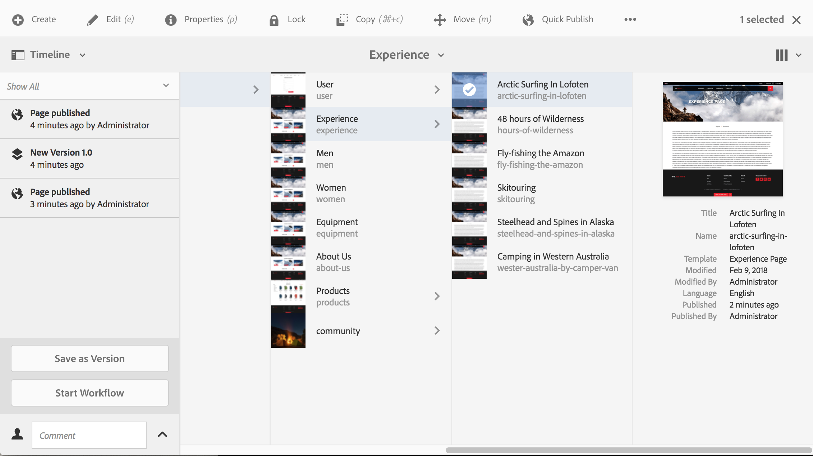

# Workflows toepassen op pagina&#39;s{#applying-workflows-to-pages}

Tijdens het ontwerpen kunt u workflows aanroepen om actie te ondernemen op uw pagina&#39;s. het is ook mogelijk meerdere werkstromen toe te passen .

Wanneer u de workflow toepast, geeft u de volgende informatie op:

* De workflow die moet worden toegepast.

   U kunt elke workflow toepassen (waartoe u toegang hebt, zoals is toegewezen door uw AEM-beheerder).

* Naar keuze, een titel die helpt de werkschemainstantie in Inbox van een gebruiker identificeren.
* de workflow-lading; dit kan een of meer pagina&#39;s zijn.

Workflows kunnen worden gestart vanaf:

* de **[Sites](#starting-a-workflow-from-the-sites-console)** console.
* bij het bewerken van een pagina, van **[Pagina-informatie](#starting-a-workflow-from-the-page-editor)**.

>[!NOTE]
>
>Zie ook:
>
>* [Workflows toepassen op DAM-elementen](/help/assets/assets-workflow.md).
>* [Werken met projectworkflows](/help/sites-authoring/projects-with-workflows.md).
>

>[!NOTE]
>
>AEM beheerders kunnen [workflows starten met verschillende andere methoden](/help/sites-administering/workflows-starting.md).

## Een workflow starten vanuit de siteconsole {#starting-a-workflow-from-the-sites-console}

U kunt een workflow starten vanuit:

* de **[Maken](#starting-a-workflow-from-the-sites-toolbar)** van de werkbalk Sites.
* de **[Tijdlijn](#starting-a-workflow-from-the-timeline)** spoorstaaf van de Sites-console.

In beide gevallen moet u:

* [Geef de workflowdetails op in de wizard Workflow maken](#specifying-workflow-details-in-the-create-workflow-wizard).

### Een workflow starten op de werkbalk Sites {#starting-a-workflow-from-the-sites-toolbar}

U kunt een workflow starten op de werkbalk van het dialoogvenster **Sites** console:

1. Navigeer naar de gewenste pagina en selecteer deze.

1. Van de **Maken** in de werkbalk die u nu kunt selecteren **Workflow**.

   

1. De **Workflow maken** wizard helpt u [de workflowdetails opgeven](#specifying-workflow-details-in-the-create-workflow-wizard).

### Een workflow starten vanuit de tijdlijn {#starting-a-workflow-from-the-timeline}

Van de **Tijdlijn** u kunt een workflow starten die op de geselecteerde bron moet worden toegepast.

1. [Selecteer de bron](/help/sites-authoring/basic-handling.md#viewing-and-selecting-resources) en open [Tijdlijn](/help/sites-authoring/basic-handling.md#timeline) (U kunt Tijdlijn openen en vervolgens de bron selecteren).
1. De pijlpunt op het veld Opmerking kan worden gebruikt om **Workflow starten**:

   

1. De **Workflow maken** wizard helpt u [de workflowdetails opgeven](#specifying-workflow-details-in-the-create-workflow-wizard).

### Workflowdetails opgeven in de wizard Workflow maken {#specifying-workflow-details-in-the-create-workflow-wizard}

De **Workflow maken** De wizard helpt u de workflow te selecteren en de vereiste details op te geven.

Na het openen van het dialoogvenster **Workflow maken** wizard van:

* de **[Maken](#starting-a-workflow-from-the-sites-toolbar)** van de werkbalk Sites.
* de **[Tijdlijn](#starting-a-workflow-from-the-timeline)** spoorstaaf van de Sites-console.

U kunt details opgeven:

1. In de **Eigenschappen** De basisopties van de workflow worden nu gedefinieerd:

   * **Workflowmodel**
   * **Titel werkstroom**

      * U kunt een titel voor dit exemplaar specificeren, om u te helpen het in een later stadium identificeren.

   Afhankelijk van het workflowmodel zijn ook de volgende opties beschikbaar. Hierdoor kan het pakket dat als lading is gemaakt, worden bewaard nadat de workflow is voltooid.

   * **Workflowpakket behouden**
   * **Pakkettitel**

      * U kunt een titel voor het pakket opgeven om het te identificeren.
   >[!NOTE]
   >
   >De optie **Workflowpakket bijhouden** is beschikbaar wanneer de workflow is geconfigureerd voor ondersteuning van meerdere resources en er meerdere resources zijn geselecteerd.

   Na voltooiing gebruiken **Volgende** om verder te gaan.

   

1. In de **Toepassingsgebied** stap die u kunt selecteren:

   * **Inhoud toevoegen** om de [padbrowser](/help/sites-authoring/author-environment-tools.md#path-browser) en selecteer aanvullende middelen; wanneer u in de browser klikt of tikt **Selecteren** om de inhoud aan de werkstroominstantie toe te voegen.
   * Een bestaande bron voor het weergeven van extra handelingen:

      * **Inclusief kinderen** om te specificeren dat de kinderen van die bron in het werkschema zullen worden omvat.

         Er wordt een dialoogvenster geopend waarin u de selectie kunt verfijnen op basis van:

         * Alleen directe kinderen opnemen.
         * Alleen gewijzigde pagina&#39;s opnemen.
         * Alleen al gepubliceerde pagina&#39;s opnemen.

         Alle opgegeven onderliggende items worden toegevoegd aan de lijst met bronnen waarop de workflow van toepassing is.

      * **Selectie verwijderen** om die bron uit de workflow te verwijderen.

   

   >[!NOTE]
   >
   >Als u aanvullende resources toevoegt, kunt u **Terug** gebruiken om de instelling voor **Workflowpakket behouden** aan te passen in de stap **Eigenschappen**.

1. Gebruiken **Maken** om de wizard te sluiten en de instantie van de workflow te maken. Een bericht wordt getoond in de console van Plaatsen.

## Een workflow starten vanuit de Pagina-editor {#starting-a-workflow-from-the-page-editor}

Als u een pagina bewerkt, kunt u **Pagina-informatie** op de werkbalk. Het vervolgkeuzemenu heeft de optie **Starten in workflow**. Hiermee wordt een dialoogvenster geopend waarin u de vereiste workflow kunt opgeven, en desgewenst een titel:

