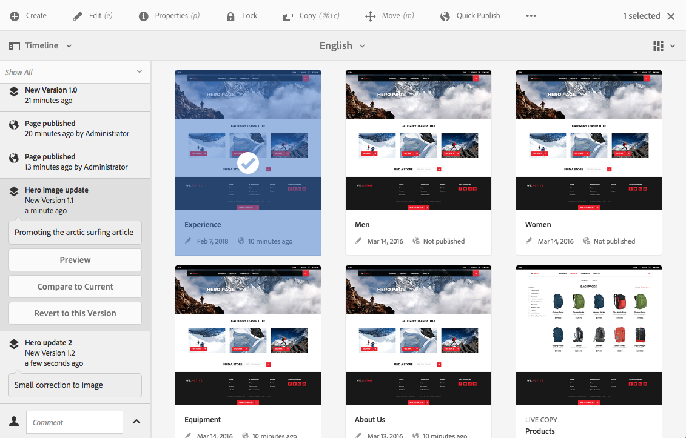
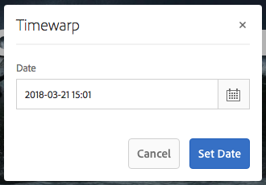

# Werken met paginaversies{#working-with-page-versions}

>[!CAUTION]
>
>AEM 6.4 heeft het einde van de uitgebreide ondersteuning bereikt en deze documentatie wordt niet meer bijgewerkt. Raadpleeg voor meer informatie onze [technische ondersteuningsperioden](https://helpx.adobe.com/support/programs/eol-matrix.html). Ondersteunde versies zoeken [hier](https://experienceleague.adobe.com/docs/).

Met Versioning maakt u een &quot;momentopname&quot; van een pagina op een bepaald tijdstip. Met versioning kunt u de volgende handelingen uitvoeren:

* Maak een versie van een pagina.
* Herstel een pagina naar een vorige versie om bijvoorbeeld een wijziging in een pagina ongedaan te maken.
* Vergelijk de huidige versie van een pagina met een vorige versie met verschillen in de gemarkeerde tekst en afbeeldingen.

## Een nieuwe versie maken {#creating-a-new-version}

U kunt een versie van uw bron maken op basis van:

* de [Tijdlijnrail](#creating-a-new-version-timeline)
* de [Maken](#creating-a-new-version-create-with-a-selected-resource) (wanneer een bron is geselecteerd)

### Nieuwe versie maken - tijdlijn {#creating-a-new-version-timeline}

1. Navigeer naar de pagina waarvoor u een versie wilt maken.
1. Selecteer de pagina in [selectiemodus](/help/sites-authoring/basic-handling.md#viewing-and-selecting-resources).
1. Open de **Tijdlijn** kolom.
1. Klik op de pijlpunt of tik op het veld Opmerking om de opties weer te geven:

   

1. Selecteren **Opslaan als versie**.
1. Voer een **Label** en **Opmerking** indien nodig.

   

1. De nieuwe versie bevestigen met **Maken**.

   De informatie in de tijdlijn wordt bijgewerkt om de nieuwe versie aan te geven.

### Een nieuwe versie maken - Maken met een geselecteerde bron {#creating-a-new-version-create-with-a-selected-resource}

1. Navigeer naar de pagina waarvoor u een versie wilt maken.
1. Selecteer de pagina in [selectiemodus](/help/sites-authoring/basic-handling.md#viewing-and-selecting-resources).
1. Selecteer **Maken** van de werkbalk.
1. Het dialoogvenster wordt geopend. U kunt een **Label** en **Opmerking** indien vereist:

   

1. De nieuwe versie bevestigen met **Maken**.

   De tijdlijn wordt geopend met de informatie die wordt bijgewerkt om de nieuwe versie aan te geven.

## Terugkeren naar een paginaversie {#reverting-to-a-page-version}

Als er eenmaal een versie is gemaakt, kunt u desgewenst terugkeren naar die versie.

>[!NOTE]
>
>Bij het herstellen van een pagina wordt de gemaakte versie onderdeel van een nieuwe vertakking.
>
>Ter illustratie:
>
>* Maak versies van een willekeurige pagina.
>* De initiële labels en namen van versieknooppunten zijn 1.0, 1.1, 1.2 enzovoort.
>* Herstel de eerste versie; d.w.z. 1.0.
>* Maak opnieuw nieuwe versies.
>* De gegenereerde labels en knooppuntnamen zijn nu 1.0.0, 1.0.1, 1.0.2 enzovoort.
>

Een vorige versie herstellen:

1. Navigeer om de pagina weer te geven die u naar een vorige versie wilt terugkeren.
1. Selecteer de pagina in [selectiemodus](/help/sites-authoring/basic-handling.md#viewing-and-selecting-resources).
1. Open de kolom **Tijdlijn** en selecteer **Alles weergeven** of **Versies**. De paginaversies voor de geselecteerde pagina worden weergegeven.
1. Selecteer de versie waarnaar u wilt terugkeren. De mogelijke opties worden weergegeven:

   

1. Selecteren **Deze versie herstellen**. De geselecteerde versie wordt hersteld en de informatie in de tijdlijn wordt bijgewerkt.

## Een voorbeeld van een versie bekijken {#previewing-a-version}

U kunt een voorvertoning van een specifieke versie weergeven:

1. Navigeer om de pagina weer te geven die u wilt vergelijken.
1. Selecteer de pagina in [selectiemodus](/help/sites-authoring/basic-handling.md#viewing-and-selecting-resources).
1. Open de kolom **Tijdlijn** en selecteer **Alles weergeven** of **Versies**.
1. De paginaversies worden weergegeven. Selecteer de versie die u wilt voorvertonen:

   

1. Selecteren **Voorvertoning**. De pagina wordt weergegeven op een nieuw tabblad.

   >[!CAUTION]
   >
   >Als een pagina is verplaatst, kunt u geen voorvertoning meer weergeven van versies die vóór de verplaatsing zijn gemaakt.
   >
   >Als u problemen ondervindt met een voorvertoning, controleert u de [Tijdlijn](/help/sites-authoring/basic-handling.md#timeline) om te zien of de pagina is verplaatst.

## Een versie vergelijken met de huidige pagina {#comparing-a-version-with-current-page}

Een vorige versie vergelijken met de huidige pagina:

1. Navigeer om de pagina weer te geven die u wilt vergelijken.
1. Selecteer de pagina in [selectiemodus](/help/sites-authoring/basic-handling.md#viewing-and-selecting-resources).
1. Open de kolom **Tijdlijn** en selecteer **Alles weergeven** of **Versies**.
1. De paginaversies worden weergegeven. Selecteer de versie die u wilt vergelijken:

   

1. Selecteren **Vergelijken met huidige**. De [pagina diff](/help/sites-authoring/page-diff.md) opent en toont de verschillen.

## Timewarp {#timewarp}

Timewarp is een eigenschap die wordt ontworpen om het *gepubliceerd* staat van een pagina op specifieke tijden in het verleden.

Het doel is om u toe te staan om de gepubliceerde website op het geselecteerde punt in tijd te volgen. Hierbij wordt gebruikgemaakt van de paginaversies om de status van de publicatieomgeving te bepalen.

Dit doet u als volgt:

* Het systeem zoekt naar de paginaversie die op het geselecteerde tijdstip actief was.
* Dit betekent dat de weergegeven versie is gemaakt/geactiveerd *voor* het punt in tijd dat in Timewarp wordt geselecteerd.
* Wanneer u naar een pagina navigeert die is verwijderd, wordt dit ook weergegeven, zolang de oude versies van de pagina nog beschikbaar zijn in de opslagplaats.
* Als geen gepubliceerde versie wordt gevonden, dan zal Timewarp aan de huidige staat van de pagina op het auteursmilieu terugkeren (dit is om een fout/404 pagina te verhinderen, die het doorbladeren zou verhinderen).

### Tijdverdraaiing gebruiken {#using-timewarp}

Timewaring is een [mode](/help/sites-authoring/author-environment-tools.md#page-modes) van de pagina-editor. Om het te beginnen, eenvoudig schakelaar het zoals u een andere wijze.

1. Start de editor voor de pagina waarop u Tijdverdraaiing wilt starten en selecteer vervolgens **Timewarp** in de modusselectie.

   

1. Stel in het dialoogvenster een doeldatum en -tijd in en klik of tik op **Datum instellen**. Als u geen tijd selecteert, wordt de huidige tijd standaard ingesteld.

   

1. De pagina wordt weergegeven op basis van de datumset. De modus Tijdlijn verdraaien wordt aangegeven via de blauwe statusbalk boven in het venster. Gebruik de koppelingen op de statusbalk om een nieuwe doeldatum of einddatum voor de tijdverdraaiingsmodus te selecteren.

   

### Beperkingen voor tijdverdraaiing

Met Timewarp wordt het best geprobeerd een pagina op een geselecteerd punt in de tijd te reproduceren. Vanwege de complexiteit van het voortdurend ontwerpen van inhoud in AEM is dit echter niet altijd mogelijk. Deze beperkingen moeten in gedachten worden gehouden wanneer u Tijdverdraaiing gebruikt.

* **Tijdlijn verdraaien werkt op basis van gepubliceerde pagina&#39;s** - Tijdlijn-verdraaiing werkt alleen volledig als u de pagina eerder hebt gepubliceerd. Als dat niet het geval is, wordt de huidige pagina in de auteursomgeving weergegeven.
* **Timewaring gebruikt paginaversies** - Als u navigeert naar een pagina die is verwijderd of verwijderd uit de opslagplaats, wordt deze correct weergegeven als de oude versies van de pagina nog steeds beschikbaar zijn in de opslagplaats.
* **Verwijderde versies beïnvloeden Timewarp** - Als versies uit de opslagplaats worden verwijderd, kan Timewarp niet de juiste weergave tonen.
* **Timewarp is read-only** - U kunt de oude versie van de pagina niet bewerken. Deze kan alleen worden weergegeven. Als u de oudere versie wilt herstellen, moet u dat handmatig doen met terugzetten.
* **Tijdlijn verdraaien is alleen gebaseerd op pagina-inhoud** - Als elementen (zoals code, css, assets/images, enz.) voor het renderen van de website zijn gewijzigd, zal de weergave afwijken van wat oorspronkelijk het geval was, aangezien deze items niet zijn geversieerd in de opslagplaats.

>[!CAUTION]
>
>Timewarp is ontworpen als een hulpmiddel om auteurs te helpen bij het begrijpen en creëren van hun inhoud. Het is niet bedoeld als controlelogboek of voor juridische doeleinden.
