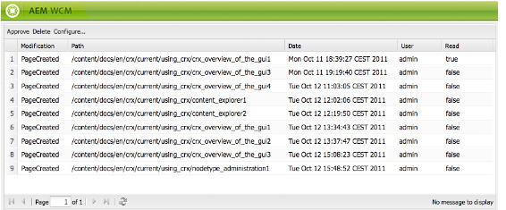

# Uw inbox{#your-inbox}

>[!CAUTION]
>
>AEM 6.4 heeft het einde van de uitgebreide ondersteuning bereikt en deze documentatie wordt niet meer bijgewerkt. Raadpleeg voor meer informatie onze [technische ondersteuningsperioden](https://helpx.adobe.com/support/programs/eol-matrix.html). Ondersteunde versies zoeken [hier](https://experienceleague.adobe.com/docs/).

U kunt meldingen ontvangen van verschillende AEM, zoals meldingen over werkitems of taken die acties vertegenwoordigen die u op pagina-inhoud moet uitvoeren.

U ontvangt deze meldingen in twee Postvakken, die worden gescheiden door het type meldingen:

* In de volgende sectie wordt een postvak weergegeven waarin de meldingen worden weergegeven die u ontvangt als gevolg van abonnementen.
* Een speciaal postvak voor workflowitems wordt beschreven in het dialoogvenster [Deelnemen aan workflows](/help/sites-classic-ui-authoring/classic-workflows-participating.md) document.

## Je meldingen bekijken {#viewing-your-notifications}

Om uw meldingen weer te geven:

1. Open het inbox van de melding: in de **Websites** -console, klikt u op de gebruikerknop in de rechterbovenhoek en selecteert u **Melding in vak**.

   

   >[!NOTE]
   >
   >U kunt tot de console ook direct in uw browser toegang hebben; bijvoorbeeld:
   >
   >` https://<host>:<port>/libs/wcm/core/content/inbox.html`

1. Je meldingen worden weergegeven. U kunt desgewenst actie ondernemen:

   * [Abonneren op meldingen](#subscribing-to-notifications)
   * [Je meldingen verwerken](#processing-your-notifications)

   

## Abonneren op meldingen {#subscribing-to-notifications}

Abonneren op meldingen:

1. Open het inbox van de melding: in de **Websites** -console, klikt u op de gebruikerknop in de rechterbovenhoek en selecteert u **Melding in vak**.

   

   >[!NOTE]
   >
   >U kunt tot de console ook direct in uw browser toegang hebben; bijvoorbeeld:
   >
   >`https://<host>:<port>/libs/wcm/core/content/inbox.html`

1. Klikken **Configureren...** in de linkerbovenhoek om het configuratiedialoogvenster te openen.

   

1. Selecteer het berichtkanaal:

   * **Inbox**: meldingen worden weergegeven in uw AEM Postvak IN.
   * **E-mail**: meldingen worden per e-mail verzonden naar het e-mailadres dat is gedefinieerd in uw gebruikersprofiel.

   >[!NOTE]
   >
   >U dient enkele instellingen te configureren om via e-mail op de hoogte te worden gesteld. Het is ook mogelijk om de e-mailsjabloon aan te passen of een e-mailsjabloon voor een nieuwe taal toe te voegen. Zie [E-mailmelding configureren](/help/sites-administering/notification.md#configuringemailnotification) om e-mailberichten in AEM te configureren.

1. Selecteer de paginahandelingen waarvan u een melding wilt ontvangen:

   * Geactiveerd: wanneer een pagina is geactiveerd.
   * gedeactiveerd: wanneer een pagina is gedeactiveerd.
   * Verwijderd (syndicatie): wanneer een pagina is verwijderd, dat wil zeggen wanneer een verwijderhandeling die op een pagina is uitgevoerd, wordt gerepliceerd.

      Wanneer een pagina wordt verwijderd of verplaatst, wordt automatisch een verwijderactie gerepliceerd: de pagina wordt geschrapt op de broninstantie waar de schrappingsactie werd uitgevoerd en op de bestemmingsinstantie die door de replicatieagenten wordt bepaald.

   * Gewijzigd: wanneer een pagina is gewijzigd.
   * Gemaakt: wanneer een pagina is gemaakt.
   * Verwijderd: wanneer een pagina is verwijderd via de paginaverwijderactie.
   * Uitgelijnd: wanneer een pagina is uitgerold.

1. Definieer de paden van de pagina&#39;s waarvoor u een melding krijgt:

   * Klikken **Toevoegen** om een nieuwe rij aan de tabel toe te voegen.
   * Klik op de knop **Pad** tabelcel en voer het pad in, bijvoorbeeld `/content/docs`.
   * Op de hoogte worden gesteld van alle pagina&#39;s die tot de subboomstructuur behoren **Precies?** tot **Nee**.

      Alleen een melding ontvangen voor acties op de pagina die door het pad wordt gedefinieerd, stelt u **Precies?** tot **Ja**.

   * Als u de regel wilt toestaan, stelt u **Regel** tot **Toestaan**. Indien ingesteld op **Weigeren**, wordt de regel geweigerd maar niet verwijderd en kan later worden toegestaan.

   Als u een definitie wilt verwijderen, selecteert u de rij door op een tabelcel te klikken en klikt u op **Verwijderen**.

1. Klikken **OK** om de configuratie op te slaan.

## Je meldingen verwerken {#processing-your-notifications}

Als u ervoor hebt gekozen om meldingen in uw AEM-postvak te ontvangen, vult uw postvak in met meldingen. U kunt [uw meldingen weergeven](#viewing-your-notifications) Selecteer vervolgens de vereiste melding(en) aan:

* Goedkeuren door op **Goedkeuren**: de waarde in de **Lezen** kolom is ingesteld op **true**.

* Verwijderen door erop te klikken **Verwijderen**.

