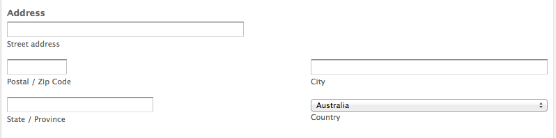
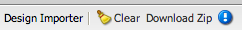

# Openingspagina&#39;s{#landing-pages}

Met de functie voor het plaatsen van pagina&#39;s kunt u snel en eenvoudig een ontwerp en inhoud rechtstreeks in een AEM pagina importeren. Een webontwikkelaar kan de HTML en aanvullende elementen voorbereiden die als een volledige pagina of als een deel van een pagina kunnen worden geïmporteerd. De functionaliteit is nuttig om bestemmingspagina&#39;s tot stand te brengen die slechts voor een beperkte tijd actief zijn en snel moeten worden gecreeerd.

Deze pagina beschrijft het volgende:

* welke landingspagina&#39;s er uitzien in AEM met beschikbare onderdelen
* hoe u een openingspagina maakt en hoe u een ontwerppakket importeert
* hoe te met het landen van pagina&#39;s in AEM werken
* mobiele bestemmingspagina&#39;s instellen

Het voorbereiden van het ontwerppakket voor het invoeren wordt behandeld in [Uitbreiding en het Vormen van de Importeur van het Ontwerp](/help/sites-administering/extending-the-design-importer-for-landingpages.md). Integratie met Adobe Analytics is opgenomen in [Landing Pages integreren met Adobe Analytics.](/help/sites-administering/integrating-landing-pages-with-adobe-analytics.md)

## Wat zijn bestemmingspagina&#39;s? {#what-are-landing-pages}

Landingspagina&#39;s zijn sites met één of meerdere pagina&#39;s die het &#39;eindpunt&#39; zijn van een marketingstrategie, bijvoorbeeld met e-mail, adwords/banners, sociale media. Een landingspagina kan verschillende doelen dienen, maar heeft allemaal één ding gemeen: de bezoeker moet een taak uitvoeren en dat bepaalt het succes van een landingspagina.

Met de functie Landing Pages in AEM kunnen marketers samenwerken met webontwerpers bij agentschappen of interne creatieve teams om paginaontwerpen te maken die gemakkelijk kunnen worden geïmporteerd in AEM en nog steeds bewerkbaar zijn door de marketers en die worden gepubliceerd onder hetzelfde bestuur als de rest van de AEM sites.

In AEM maakt u bestemmingspagina&#39;s door de volgende stappen uit te voeren:

1. Maak een pagina in AEM die het canvas van de bestemmingspagina&#39;s bevat. AEM wordt geleverd met een voorbeeld met de naam **Importer Page**.

1. [Bereid de HTML en de activa voor.](/help/sites-administering/extending-the-design-importer-for-landingpages.md)
1. Verpak de middelen in een dossier van het PIT dat hier als het Pakket van het Ontwerp wordt bedoeld.
1. Importeer het ontwerppakket op de pagina Importeren.
1. Wijzig en publiceer de pagina.

### Openingspagina&#39;s bureaublad {#desktop-landing-pages}

Een voorbeeldlandingspagina in AEM ziet er als volgt uit:

### Mobiele bestemmingspagina&#39;s {#mobile-landing-pages}

Een openingspagina kan ook een mobiele versie van de pagina hebben. Voor een aparte mobiele versie van de bestemmingspagina moet het importontwerp twee HTML-bestanden hebben: *index.htm(l)* en *mobile.index.htm(l)*.

De invoerprocedure voor de landingspagina is dezelfde als die van een normale openingspagina. Het ontwerp van de bestemmingspagina heeft een extra HTML-bestand dat overeenkomt met de bestemmingspagina. Dit HTML-bestand moet ook een canvas `div` met `id=cqcanvas` hebben, net als de bestemmingspagina html van het bureaublad en het ondersteunt alle bewerkbare componenten die worden beschreven voor de bestemmingspagina.

De mobiele openingspagina wordt gemaakt als een onderliggende pagina van de openingspagina van het bureaublad. Navigeer naar de openingspagina in Websites en open de onderliggende pagina om deze te openen.

>[!NOTE]
>
>De landingspagina voor mobiele apparaten wordt samen met de bestemmingspagina verwijderd of gedeactiveerd als de bestemmingspagina van het bureaublad wordt verwijderd of gedeactiveerd.

## Onderdelen {#landing-page-components} van bestemmingspagina

Als u delen van de HTML die worden geïmporteerd, bewerkbaar wilt maken binnen AEM, kunt u inhoud binnen de HTML-landingspagina&#39;s rechtstreeks toewijzen aan AEM componenten. De ontwerpimporteur begrijpt standaard de volgende componenten:

* Tekst, voor alle tekst
* Titel, voor inhoud in H1-6-tags
* Afbeelding, voor afbeeldingen die uitwisselbaar moeten worden gemaakt
* Oproep aan acties:

   * Koppeling doorklikken
   * Grafische koppeling

* CTA leiden-Vorm, om gebruikersinformatie te vangen
* Het Systeem van de paragraaf (Parsys), om het even welke component toe te staan om worden toegevoegd, of de bovengenoemde component om te zetten

Bovendien is het mogelijk om dit uit te breiden en douanecomponenten te steunen. In deze sectie worden de componenten gedetailleerd beschreven.

### Tekst {#text}

Met de component Text kunt u een tekstblok invoeren met een WYSIWYG-editor. Zie [Tekstcomponent](/help/sites-authoring/default-components.md#text) voor meer informatie.

Hieronder ziet u een voorbeeld van een tekstcomponent op een bestemmingspagina:

### Titel {#title}

Met de titelcomponent kunt u een titel weergeven en de grootte configureren (h1-6). Zie [Titelcomponent](/help/sites-authoring/default-components.md#title) voor meer informatie.

Hieronder ziet u een voorbeeld van een titelcomponent op een landingspagina:

### Afbeelding {#image}

De afbeeldingscomponent toont een afbeelding die u kunt slepen en neerzetten vanuit de Inhoudszoeker of waarop u kunt klikken om te uploaden. Zie [afbeeldingscomponent](/help/sites-authoring/default-components.md) voor meer informatie.

Hieronder ziet u een voorbeeld van een afbeeldingscomponent op een landingspagina:

### Oproep tot actie (CTA) {#call-to-action-cta}

Een landingspagina-ontwerp kan verscheidene verbindingen hebben - sommige kunnen als &quot;Vraag aan actie&quot;worden bedoeld.

De oproep tot actie (CTA) wordt gebruikt om de bezoeker te krijgen onmiddellijk actie op de landende pagina zoals &quot;Abonneren nu,&quot;Bekijk deze video,&quot;Beperkte Tijd slechts&quot;etc.

* Klik via koppeling - Hiermee kunt u een tekstkoppeling toevoegen die de bezoeker naar een doel-URL stuurt wanneer erop wordt geklikt.
* Grafische koppeling - Hiermee kunt u een afbeelding toevoegen die de bezoeker naar een doel-URL stuurt wanneer erop wordt geklikt.

Beide componenten CTA hebben gelijkaardige opties. De optie Doorklikken via koppeling heeft extra tekstopties. De componenten worden in de volgende alinea&#39;s uitgebreid beschreven.

### Klikken door koppeling {#click-through-link}

Deze component CTA kan worden gebruikt om een tekstverbinding op de het landen pagina toe te voegen. Op die koppeling kan worden geklikt om de gebruiker naar de doel-URL te brengen die in de componenteigenschappen is opgegeven. Het maakt deel uit van de &quot;Vraag aan Actie&quot;groep.

**** LabelDe tekst die gebruikers zien. U kunt opmaak wijzigen met de RTF-editor.

**Geef de URI op** die gebruikers moeten bezoeken als ze op de tekst klikken.

**Rendering** OptionsBeschrijft renderopties. U kunt een van de volgende opties selecteren:

* Pagina laden in een nieuw browservenster
* Pagina in huidig venster laden
* Pagina in het bovenliggende frame laden
* Alle frames annuleren en pagina in volledig browservenster laden

**Voer op het tabblad Stijl een pad** in naar uw CSS-stijlpagina.

**** IDOn het lusje van de Stijl, ga een identiteitskaart voor de component in om het uniek te identificeren.

Hieronder ziet u een voorbeeld van een klik door een koppeling:

### Grafische koppeling {#graphical-link}

Deze component CTA kan worden gebruikt om het even welk grafisch beeld met verbinding op de het landen pagina toe te voegen. De afbeelding kan een eenvoudige knop zijn of een grafische afbeelding als achtergrond. Wanneer op de afbeelding wordt geklikt, gaat de gebruiker naar de doel-URL die in de componenteigenschappen is opgegeven. Het is een deel van de **Vraag aan Action** groep.

**** LabelDe tekst die gebruikers zien in de afbeelding. U kunt opmaak wijzigen met de RTF-editor.

**Geef de URI op** die gebruikers moeten bezoeken als ze op de afbeelding klikken.

**Rendering** OptionsBeschrijft renderopties. U kunt een van de volgende opties selecteren:

* Pagina laden in een nieuw browservenster
* Pagina in huidig venster laden
* Pagina in het bovenliggende frame laden
* Alle frames annuleren en pagina in volledig browservenster laden

**Voer op het tabblad Stijl een pad** in naar uw CSS-stijlpagina.

**** IDOn het lusje van de Stijl, ga een identiteitskaart voor de component in om het uniek te identificeren.

Hier volgt een voorbeeld van een grafische koppeling:

## Oproep tot actie (CTA) Lead Form {#call-to-action-cta-lead-form}

Een formulier voor leads is een formulier dat wordt gebruikt om de profielgegevens van een bezoeker/lead te verzamelen. Deze informatie kan later worden opgeslagen en gebruikt om een efficiënte marketing te doen die op de informatie wordt gebaseerd. Deze informatie omvat gewoonlijk titel, naam, e-mail, geboortedatum, adres, rente, enzovoort. Het is een deel van de **CTA Leidingsvorm** groep.

Een voorbeeld van een CTA-loodformulier ziet er als volgt uit:

CTA-loodformulieren worden samengesteld uit verschillende onderdelen:

* **Formulier**
LeadDe voorbeeldformuliercomponent definieert het begin en einde van een nieuw formulier voor lead op een pagina. Andere componenten kunnen vervolgens tussen deze elementen worden geplaatst, zoals E-mailadres, Voornaam, enzovoort.

* **Formuliervelden en -**
elementenFormuliervelden en -elementen kunnen tekstvakken, keuzerondjes, afbeeldingen enzovoort bevatten. De gebruiker voert vaak een handeling uit in een formulierveld, zoals het typen van tekst. Zie de afzonderlijke formulierelementen voor meer informatie.

* **ProfielcomponentenProfielcomponenten hebben betrekking op bezoekersprofielen die worden gebruikt voor sociale samenwerking en andere gebieden waar personalisatie van bezoekers is vereist.**

In het voorgaande voorbeeld wordt een voorbeeldformulier weergegeven; het bestaat uit de **Lead Form** component (start en end), met **Voornaam** en **Email Id** velden gebruikt voor invoer en een **Submit** veld

Van sidekick, zijn de volgende componenten beschikbaar voor de CTA Lood Vorm:

### Gemeenschappelijke instellingen voor veel belangrijke formuliercomponenten {#settings-common-to-many-lead-form-components}

Hoewel elk van de componenten van het hoofdformulier een ander doel heeft, bestaan veel van deze componenten uit vergelijkbare opties en parameters.

Wanneer u een van de formuliercomponenten configureert, zijn de volgende tabbladen beschikbaar in het dialoogvenster:

* **Titel en**
TextHere moet u de basisinformatie, zoals de titel van de component en om het even welke begeleidende tekst specificeren. In voorkomend geval kunt u ook andere belangrijke informatie definiëren, zoals of het veld meerdere selecties kan bevatten en of items kunnen worden geselecteerd.

* **Initiële**
waardenHiermee kunt u een standaardwaarde opgeven.

* ****
RestrictiesThis u kunt specificeren of een gebied wordt vereist en plaatsbeperkingen zijn op dat gebied (bijvoorbeeld, moet numeriek zijn, etc.).

* ****
StileerGeeft de grootte en opmaak van de velden aan.

>[!NOTE]
>
>Welke velden u ziet, is afhankelijk van de afzonderlijke component.
>
>Niet alle opties zijn beschikbaar voor alle onderdelen van het loodformulier. Zie Forms voor meer informatie over deze [algemene instellingen](/help/sites-authoring/default-components.md#formsgroup).

#### Formulieronderdelen {#lead-form-components}

De volgende sectie beschrijft de componenten beschikbaar aan vraag-aan-actie leiden vormen.

**Gebruikers** kunnen informatie over informatie toevoegen.

**Adres** FieldAllows gebruikers om adresinformatie in te gaan. Wanneer u deze component configureert, moet u de elementnaam in het dialoogvenster invoeren. De elementnaam is de naam van het formulierelement. Dit geeft aan waar in de gegevensopslagruimte de gegevens worden opgeslagen.

**Geboortedatum** Gebruikers kunnen geboortedatum invoeren.

**E-** mailadresHiermee kunnen gebruikers een e-mailadres (identificatie) invoeren.

**First** NameHiermee wordt een veld weergegeven waarin gebruikers hun voornaam kunnen invoeren.

**** GenderUsers kunnen hun geslacht selecteren in een vervolgkeuzelijst.

**Last** NameUsers kan informatie over achternaam invoeren.

**Lead** FormAdd this component to add a lead form to your landing page. Een lead-formulier bevat automatisch het veld Start of Lead Form en End of Lead Form. Hierna voegt u de in deze sectie beschreven componenten Formulier lead toe.

De component Formulier lead definieert zowel het begin als het einde van een formulier met de elementen **Begin van formulier** en **Einde van formulier**. Deze worden altijd gekoppeld om ervoor te zorgen dat het formulier correct is gedefinieerd.

Nadat u het hoofdformulier hebt toegevoegd, kunt u het begin of einde van het formulier configureren door op **Bewerken** op de bijbehorende balk te klikken.

**Begin van Lead-formulier**

Er zijn twee tabbladen beschikbaar voor de configuratie **Form** en **Advanced**:

**Hartelijk dank,** paginaDe pagina waarnaar wordt verwezen, is bedoeld om bezoekers te bedanken voor hun invoer. Als het formulier leeg blijft, wordt het na verzending opnieuw weergegeven.

**Start** WorkflowHiermee bepaalt u welke workflow wordt geactiveerd wanneer een hoofdformulier wordt verzonden.

**Post** OptionsDe volgende opties zijn beschikbaar:

* Lead maken
* E-mailservice: Abonnee maken en toevoegen aan lijst - Gebruik deze optie als u een e-mailserviceprovider gebruikt, zoals ExactTarget.
* E-mailservice: E-mail met automatische reactie verzenden - Gebruik deze functie als u een e-mailserviceprovider gebruikt, zoals ExactTarget.
* E-mailservice: Abonnement voor gebruiker opzeggen uit lijst - Gebruik deze optie als u een e-mailserviceprovider gebruikt, zoals ExactTarget.
* Abonnement op gebruiker opzeggen

**Formulier-** id De formulierid identificeert het hoofdformulier op unieke wijze. Gebruik de formulier-id als u meerdere formulieren op één pagina hebt; zorg ervoor zij verschillende herkenningstekens hebben.

**Load** PathIs het pad naar knoopeigenschappen die worden gebruikt om vooraf gedefinieerde waarden te laden in de hoofdformuliervelden.

Dit is een optioneel veld dat het pad naar een knooppunt in de repository aangeeft. Als dit knooppunt eigenschappen heeft die overeenkomen met de veldnamen, worden de desbetreffende velden op het formulier vooraf geladen met de waarde van die eigenschappen. Als er geen overeenkomst bestaat, bevat het veld de standaardwaarde.

**ClientvalidatieHiermee wordt aangegeven of clientvalidatie is vereist voor dit formulier (servervalidatie vindt altijd plaats).** Dit kan in combinatie met de Forms Captcha-component worden bereikt.

**Resourcetype** voor validatie definieert het type resource voor formuliervalidatie als u het volledige hoofdformulier wilt valideren (in plaats van afzonderlijke velden).

Als u het volledige formulier valideert, voert u ook een van de volgende handelingen uit:

* Een script voor clientvalidatie:

   ` /apps/<myApp>/form/<myValidation>/formclientvalidation.jsp`

* Een script voor validatie aan de serverzijde:

   ` /apps/<myApp>/form/<myValidation>/formservervalidation.jsp`

**De** Configuratie van de actieAfhankelijk van de selectie in PostOpties, verandert de Configuratie van de Actie. Als u bijvoorbeeld Lead maken selecteert, kunt u instellen aan welke lijst de lead wordt toegevoegd.

* **Toon Verzenden**
ButtonGeeft aan of een knop Verzenden moet worden weergegeven.

* **Verstuur**
NaamEen id als u meerdere verzendknoppen in een formulier gebruikt.

* **Verzend**
TitelDe naam die op de knoop verschijnt, zoals voorleggen of verzenden.

* **Knop**
Herstellen tonenSelectievakje om de knop Herstellen zichtbaar te maken.

* **Herstel**
TitelDe naam die wordt weergegeven op de knop Herstellen.

* ****
DescriptionInformation die onder de knoop verschijnt.

## Een openingspagina {#creating-a-landing-page} maken

Wanneer u een landingspagina maakt, moet u drie stappen uitvoeren:

1. Maak een importerpagina.
1. [Maak de HTML gereed voor importeren.](/help/sites-administering/extending-the-design-importer-for-landingpages.md)
1. Importeer het ontwerppakket.

### Een importpagina {#creating-an-importer-page} maken

Voordat u het ontwerp van de bestemmingspagina kunt importeren, moet u een importerpagina maken, bijvoorbeeld in het kader van een campagne. Met de sjabloon Pagina importeren kunt u de volledige HTML-openingspagina importeren. De pagina bevat een neerzetvak waarin het ontwerppakket van de bestemmingspagina kan worden geïmporteerd door slepen en neerzetten te gebruiken.

>[!NOTE]
>
>Standaard kan een pagina Importer alleen worden gemaakt onder campagnes, maar u kunt deze sjabloon ook bedekken om een bestemmingspagina te maken onder `/content/mysite.`

Een nieuwe openingspagina maken:

1. Ga naar **Websites** console.
1. Selecteer de campagne in het linkerdeelvenster.
1. Klik op **Nieuw** om het venster** Pagina maken **te openen.
1. Selecteer de sjabloon **Importer Page** en voeg een titel en optioneel een naam toe en klik op **Maken**.

   

   De nieuwe importpagina wordt weergegeven.

### HTML voorbereiden voor importeren {#preparing-the-html-for-import}

Voordat u het ontwerppakket kunt importeren, moet de HTML worden voorbereid. Zie [De Invoer van het Ontwerp uitbreiden en Vormen](/help/sites-administering/extending-the-design-importer-for-landingpages.md) voor meer informatie.

### Het ontwerppakket {#importing-the-design-package} importeren

Nadat een importerpagina is gemaakt, kunt u een ontwerppakket op deze pagina importeren. Details over het maken van het ontwerppakket en de aanbevolen structuur worden uitgelegd in [De ontwerpimport uitbreiden en configureren](/help/sites-administering/extending-the-design-importer-for-landingpages.md).

Ervan uitgaande dat u het ontwerppakket klaar hebt, wordt in de volgende stappen beschreven hoe u het ontwerppakket op een importerpagina kunt importeren.

1. Open de importerpagina die u [eerder hebt gemaakt](#creatingablankcanvaspage). U ziet een dropbox met tekst die **Zip** zegt.

   

1. Sleep het ontwerppakket naar de dropbox. De pijl verandert van richting wanneer een pakket eroverheen wordt gesleept.
1. Als gevolg van slepen en neerzetten wordt de openingspagina weergegeven in plaats van de pagina Importer. De HTML-openingspagina is geïmporteerd.

   

>[!NOTE]
>
>Als u problemen hebt met het importeren van het ontwerppakket, raadpleegt u [Problemen oplossen](/help/sites-administering/extending-the-design-importer-for-landingpages.md#troubleshooting).

## Werken met bestemmingspagina&#39;s {#working-with-landing-pages}

Het ontwerp en de elementen voor een bestemmingspagina worden gewoonlijk gecreeerd door een ontwerper misschien bij een agentschap in hulpmiddelen die zij aan zoals Adobe Photoshop of Adobe Dreamweaver worden gebruikt. Wanneer het ontwerp is voltooid, stuurt de ontwerper een zip-bestand met alle elementen naar marketing. De contactpersoon bij marketing is dan verantwoordelijk voor het neerzetten van het ZIP-bestand in AEM en het publiceren van de inhoud.

Bovendien kan de ontwerper wijzigingen in de het landen pagina moeten aanbrengen nadat het door inhoud uit te geven of te schrappen en de vraag-aan-actie componenten te vormen wordt ingevoerd. Ten slotte wil de marketeer de bestemmingspagina voorvertonen en vervolgens de campagne activeren om ervoor te zorgen dat de bestemmingspagina wordt gepubliceerd.

In deze sectie wordt beschreven hoe u het volgende kunt doen:

* Een openingspagina verwijderen
* Download het ontwerppakket
* Informatie over importeren weergeven
* Een openingspagina opnieuw instellen
* [Vorm de componenten CTA en voeg inhoud aan de pagina toe](#call-to-action-cta)
* Voorvertoning van de openingspagina weergeven
* Een openingspagina activeren/publiceren

Wanneer u het ontwerppakket importeert, is de volgende werkbalk beschikbaar boven aan de bestemmingspagina:

### Het geïmporteerde ontwerppakket {#downloading-the-imported-design-package} downloaden

Door het ZIP-bestand te downloaden, kunt u opnemen welk ZIP-bestand met een bepaalde bestemmingspagina is geïmporteerd. Wijzigingen die op een pagina zijn aangebracht, worden niet toegevoegd aan het postvak.

Als u het geïmporteerde ontwerppakket wilt downloaden, klikt u op **ZIP** downloaden op de werkbalk Landingspagina.

### Informatie over importeren weergeven {#viewing-import-information}

U kunt op elk gewenst moment informatie over de laatste importbewerking weergeven door op het blauwe uitroepteken boven aan de bestemmingspagina in de klassieke gebruikersinterface te klikken.

Als het geïmporteerde ontwerppakket enkele problemen heeft, bijvoorbeeld als het verwijst naar afbeeldingen/scripts die niet in het pakket voorkomen, enzovoort, geeft de ontwerpimportmodule deze problemen weer in de vorm van een lijst. Als u de lijst met problemen wilt weergeven, klikt u in de klassieke gebruikersinterface op de koppeling voor problemen op de werkbalk Openingspagina. Als u in de volgende afbeelding op **Issues**-koppeling klikt, wordt het venster Problemen importeren geopend.

### Een openingspagina {#resetting-a-landing-page} opnieuw instellen

Als u het ontwerppakket van de bestemmingspagina opnieuw wilt importeren nadat u er enkele wijzigingen in hebt aangebracht, kunt u de openingspagina &quot;wissen&quot; door op **Wissen** boven aan de bestemmingspagina in de klassieke gebruikersinterface te klikken of op Wissen in het instellingenmenu in de gebruikersinterface met geoptimaliseerde aanrakingen te klikken. Hiermee verwijdert u de geïmporteerde bestemmingspagina en maakt u een lege importpagina.

Tijdens het wissen van de openingspagina kunt u de wijzigingen in de inhoud verwijderen. Als u **Nee** klikt, blijven de wijzigingen in de inhoud behouden. De structuur onder `jcr:content/importer`blijft dus behouden en worden alleen de component Importer Page en de bronnen in `etc/design` verwijderd. Als u **Yes** klikt, wordt `jcr:content/importer` ook verwijderd.

>[!NOTE]
>
>Als u besluit om de inhoudsveranderingen te verwijderen, dan worden alle veranderingen die u op de ingevoerde landende pagina evenals alle paginaeigenschappen aanbracht verloren wanneer u **Duidelijk** klikt.

### Componenten wijzigen en toevoegen op een bestemmingspagina {#modifying-and-adding-components-on-a-landing-page}

Als u componenten op de openingspagina wilt wijzigen, dubbelklikt u erop om ze te openen en te bewerken zoals u dat met andere componenten doet.

Als u componenten aan de bestemmingspagina wilt toevoegen, sleept u componenten naar de bestemmingspagina (van het hulpapparaat in de klassieke gebruikersinterface of vanuit het deelvenster Componenten in de gebruikersinterface met geoptimaliseerde aanrakingen) en bewerkt u de onderdelen naar wens.

>[!NOTE]
>
>Als een component op de landingspagina niet kan worden bewerkt, moet u het ZIP-bestand opnieuw importeren nadat u het HTML-bestand [hebt gewijzigd.](/help/sites-administering/extending-the-design-importer-for-landingpages.md) Dit betekent dat de niet-bewerkbare onderdelen tijdens het importeren niet zijn omgezet in AEM componenten.

### Een openingspagina {#deleting-a-landing-page} verwijderen

Het verwijderen van een openingspagina is vergelijkbaar met het verwijderen van een normale AEM.

De enige uitzondering is dat wanneer u een bestemmingspagina verwijdert, deze ook de bijbehorende bestemmingspagina voor mobiele apparaten verwijdert (indien aanwezig), maar niet andersom.

### Een openingspagina {#publishing-a-landing-page} publiceren

U kunt de openingspagina en alle bijbehorende afhankelijkheden publiceren op dezelfde manier als een normale pagina publiceren.

>[!NOTE]
>
>Wanneer u de bestemmingspagina publiceert, wordt ook de bijbehorende mobiele versie (indien van toepassing) gepubliceerd. Bij het publiceren van een bestemmingspagina voor mobiele apparaten wordt de bureaubladversie echter niet gepubliceerd.

