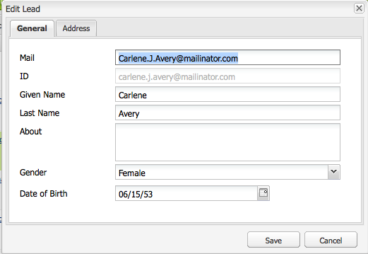
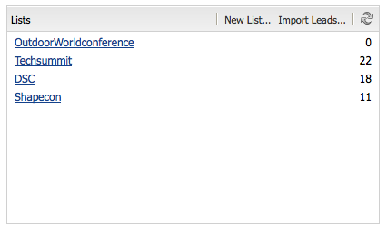
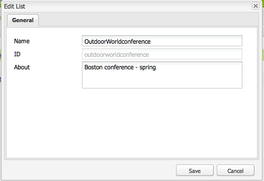

# Uw campagne instellen{#setting-up-your-campaign}

Het opzetten van een nieuwe campagne omvat de volgende (generische) stappen:

1. [Maak een merk](#creating-a-new-brand) voor uw campagnes.
1. Indien nodig kunt u de eigenschappen [definiëren voor uw nieuwe merk](#defining-the-properties-for-your-new-brand).
1. [Een campagne](#creating-a-new-campaign) opzetten om ervaringen op te doen; bijvoorbeeld laserpagina&#39;s of een nieuwsbrief.
1. Indien nodig kunt u de eigenschappen [definiëren voor uw nieuwe campagne](#defining-the-properties-for-your-new-campaign).

Afhankelijk van het type ervaring dat u maakt, moet u een [ervaring](#creating-a-new-experience)maken. De details van de ervaring en de acties die volgen op de creatie zijn afhankelijk van het type ervaring dat u wilt maken:

* Als u een taser maakt:

   1. [Maak een gummetje](/help/sites-classic-ui-authoring/classic-personalization-campaigns.md#creatingateaserexperience).
   1. [Voeg inhoud toe aan uw taser](/help/sites-classic-ui-authoring/classic-personalization-campaigns.md#addingcontenttoyourteaser).
   1. [Maak een aanraakpunt voor uw taser](/help/sites-classic-ui-authoring/classic-personalization-campaigns.md#creatingatouchpointforyourteaser) (voeg uw taser toe aan een inhoudspagina).

* Als u een nieuwsbrief maakt:

   1. [Maak een nieuwsbrief](/help/sites-classic-ui-authoring/classic-personalization-campaigns.md#creatinganewsletterexperience).
   1. [Voeg inhoud toe aan de nieuwsbrief.](/help/sites-classic-ui-authoring/classic-personalization-campaigns.md#addingcontenttonewsletters)
   1. [Pas de nieuwsbrief aan.](/help/sites-classic-ui-authoring/classic-personalization-campaigns.md#personalizingnewsletters)
   1. [Maak een aantrekkelijke openingspagina](/help/sites-classic-ui-authoring/classic-personalization-campaigns.md#settingupanewsletterlandingpage)voor nieuwsbrieven.
   1. [Stuur de nieuwsbrief](/help/sites-classic-ui-authoring/classic-personalization-campaigns.md#sendingnewsletters) naar abonnees of leads.

* Bij het maken van een Adobe Target-aanbieding (voorheen Test&amp;Target):

   1. [Maak een Adobe Target-aanbiedingservaring](/help/sites-classic-ui-authoring/classic-personalization-campaigns.md#creatingatesttargetofferexperience).
   1. [Integreren met Adobe Target](/help/sites-classic-ui-authoring/classic-personalization-campaigns.md#integratewithadobetesttarget)

>[!NOTE]
>
>Zie [Segmentatie](/help/sites-administering/campaign-segmentation.md) voor gedetailleerde instructies bij het bepalen van uw segmenten.

## Een nieuw merk maken {#creating-a-new-brand}

Een nieuw merk maken:

1. Open **MCM** en selecteer **Campagnes** in de linkerruit.

1. Selecteer **Nieuw...** om de **titel** en de **naam** en template in te voeren die voor uw nieuwe merk moeten worden gebruikt:

   

1. Klik op **Maken**. Uw nieuwe merk wordt weergegeven in de MCM (met een standaardpictogram).

### Eigenschappen voor uw nieuwe merk definiëren {#defining-the-properties-for-your-new-brand}

1. Selecteer in **Campagnes** in het linkerdeelvenster het pictogram van het nieuwe merk in het rechterdeelvenster en klik op **Eigenschappen...**

   U kunt een **titel**, een **beschrijving** en een afbeelding invoeren die u als pictogram wilt gebruiken.

   

1. Klik op **OK** om op te slaan.

## Nieuwe campagne maken {#creating-a-new-campaign}

Een nieuwe campagne maken:

1. Selecteer in **Campagnes** het nieuwe merk in het linkervenster of dubbelklik op het pictogram in het rechtervenster.

   Het overzicht wordt weergegeven (leeg als het merk nieuw is).

1. Klik op **Nieuw...** en geeft u de **titel**, **naam** en sjabloon op die voor uw nieuwe campagne moeten worden gebruikt.

   

1. Klik op **Maken**. Uw nieuwe campagne zal in MCM worden getoond.

### Eigenschappen voor uw nieuwe campagne definiëren {#defining-the-properties-for-your-new-campaign}

Campagneeigenschappen configureren die het gedrag bepalen:

* **Prioriteit:** De prioriteit van deze campagne ten opzichte van andere campagnes. Wanneer de veelvoudige campagnes gelijktijdig zijn, controleert de campagne die de hoogste prioriteit heeft de bezoekerservaring.
* **Aan- en uittijd:** Deze eigenschappen bepalen de periode waarin de campagne de ervaring van de bezoeker bepaalt. Het bezit op Tijd controleert de tijd wanneer de campagne begint de ervaring te controleren. De eigenschap Uit-tijd bepaalt wanneer de campagnes de ervaring niet meer besturen.
* **Afbeelding:** De afbeelding die de campagne in AEM vertegenwoordigt.
* **Cloud Services:** De configuraties van de Cloud Service waarmee de campagne wordt geïntegreerd. (Zie [Integreren met Adobe Marketing Cloud](/help/sites-administering/marketing-cloud.md).)

* **Adobe Target:** Eigenschappen die campagnes vormen die met Adobe Target worden geïntegreerd. (See [Integrating with Adobe Target](/help/sites-administering/target.md).)

1. Kies uw merk in **Campagnes**. Selecteer uw campagne in het rechterdeelvenster en klik op **Eigenschappen**.

   U kunt verschillende eigenschappen invoeren, zoals een **titel**, een **beschrijving** en alle gewenste **Cloud Services** .

   

1. Klik op **OK** om op te slaan.

## Nieuwe ervaring maken {#creating-a-new-experience}

De procedure voor het creëren van een nieuwe ervaring is afhankelijk van het type ervaring:

* [Een taser maken](/help/sites-classic-ui-authoring/classic-personalization-campaigns.md#creatingateaser)
* [Een nieuwsbrief maken](/help/sites-classic-ui-authoring/classic-personalization-campaigns.md#creatinganewsletter)
* [Een Adobe Target-aanbieding maken](/help/sites-classic-ui-authoring/classic-personalization-campaigns.md#creatingatesttargetoffer)

>[!NOTE]
>
>Net als bij vorige releases is het nog steeds mogelijk om de ervaring als een pagina te maken in de **websiteconsole** (en alle pagina&#39;s die in vorige releases zijn gemaakt, worden nog steeds volledig ondersteund).
>
>Het wordt nu aanbevolen om de MCM te gebruiken voor het maken van ervaringen.

## Uw nieuwe ervaring configureren {#configuring-your-new-experience}

Nu u het basisskelet voor uw ervaring hebt gecreeerd, moet u met de volgende acties verdergaan, afhankelijk van het type ervaring:

* [Taser](/help/sites-classic-ui-authoring/classic-personalization-campaigns.md#teasers):

   * [Verbind de teaspagina met bezoekerssegmenten.](/help/sites-classic-ui-authoring/classic-personalization-campaigns.md#applyingasegmenttoyourteaser)
   * [Maak een aanraakpunt voor uw taser](/help/sites-classic-ui-authoring/classic-personalization-campaigns.md#creatingatouchpointforyourteaser) (voeg uw taser toe aan een inhoudspagina).

* [Nieuwsbrief](/help/sites-classic-ui-authoring/classic-personalization-campaigns.md#newsletters):

   * [Voeg inhoud toe aan de nieuwsbrief.](/help/sites-classic-ui-authoring/classic-personalization-campaigns.md#addingcontenttonewsletters)
   * [Pas de nieuwsbrief aan.](/help/sites-classic-ui-authoring/classic-personalization-campaigns.md#personalizingnewsletters)
   * [Stuur de nieuwsbrief](/help/sites-classic-ui-authoring/classic-personalization-campaigns.md#sendingnewsletters) naar abonnees of leads.
   * [Maak een aantrekkelijke openingspagina](/help/sites-classic-ui-authoring/classic-personalization-campaigns.md#settingupanewsletterlandingpage)voor nieuwsbrieven.

* [Adobe Target-voorstel](/help/sites-classic-ui-authoring/classic-personalization-campaigns.md#testtargetoffers):

   * [Integreren met Adobe Target](/help/sites-administering/target.md)

### Een nieuw aanraakpunt toevoegen {#adding-a-new-touchpoint}

Als u bestaande ervaringen hebt, kunt u een aanraakpunt rechtstreeks vanuit de kalenderweergave van MCM toevoegen:

1. Selecteer de kalenderweergave voor uw campagne.

1. Klik op Aanraakpunt **toevoegen...** om het dialoogvenster te openen. Geef de ervaring op die u wilt toevoegen:

   

1. Klik op **OK** om op te slaan.

## Werken met leads {#working-with-leads}

>[!NOTE]
>
>Adobe is niet van plan deze mogelijkheid verder te verbeteren (Leads beheren).\
>De aanbeveling is om Adobe Campaign en de integratie naar AEM [te](/help/sites-administering/campaign.md)benutten.

In AEM MCM kunt u verbindingen organiseren en toevoegen door ze handmatig in te voeren of door een lijst met door komma&#39;s gescheiden waarden te importeren, bijvoorbeeld een mailinglijst. Aanvullende manieren om leads te genereren zijn afkomstig van nieuwsbrief-ups of community-aanmeldingen (als deze zijn geconfigureerd, kunnen ze een workflow activeren die leads vult).

Regeleinden worden doorgaans gecategoriseerd en in een lijst geplaatst, zodat u later handelingen kunt uitvoeren in de hele lijst, bijvoorbeeld door een aangepaste e-mail naar een bepaalde lijst te verzenden.

In het dashboard, hebt u toegang tot alle lood door **Leidingen** van de linkerruit te klikken. Via het deelvenster **Lijsten** hebt u ook toegang tot leads.

>[!NOTE]
>
>Als u avatars van gebruikers wilt toevoegen of wijzigen, opent u de clickstream-cloud (Ctrl+Alt+c), laadt u het profiel en klikt u op **Bewerken**.

### Nieuwe leads maken {#creating-new-leads}

Nadat u nieuwe leads hebt gemaakt, moet u deze [activeren](#activating-or-deactivating-leads) , zodat u hun activiteiten op de publicatieinstantie kunt bijhouden en de beleving kunt aanpassen.

Een nieuwe lead handmatig maken:

1. Navigeer in AEM naar de MCM. Klik in het dashboard op **Leads**.
1. Klik op **Nieuw**. Het venster **Nieuw** maken wordt geopend.

   

1. Voer de gewenste gegevens in de velden in. Klik op het tabblad **Adres** .

   

1. Voer eventueel de adresgegevens in. Klik op **Opslaan** om de lead op te slaan. Als u extra leads wilt toevoegen, klikt u op** Opslaan en Nieuw**.

   De nieuwe lead wordt weergegeven in het deelvenster Leads. Wanneer u op het item klikt, worden alle ingevoerde gegevens in het rechterdeelvenster weergegeven. Nadat u een lead hebt gemaakt, kunt u deze aan een lijst toevoegen.

   

### Inleiding activeren of deactiveren {#activating-or-deactivating-leads}

Door leads te activeren kunt u hun activiteiten bijhouden op het publicatieexemplaar en kunt u hun ervaring aanpassen. Wanneer u hun activiteit niet meer wilt volgen, kunt u ze deactiveren.

Aan actieve of deactieve leads:

1. Navigeer in AEM naar de MCM en klik op **Leads**.

1. Selecteer de leads die u wilt activeren of deactiveren en klik op **Activeren** of **Deactiveren**.

   

   Net als bij AEM pagina&#39;s wordt de publicatiestatus aangegeven in de kolom **Gepubliceerd** .

   

### Nieuwe leads importeren {#importing-new-leads}

Wanneer u nieuwe leads importeert, kunt u deze automatisch toevoegen aan een bestaande lijst of een nieuwe lijst maken waarin deze leads worden opgenomen.

Om lood van een komma-gescheiden lijst te importeren:

1. Navigeer in AEM naar de MCM en klik op **Leads**.

   >[!NOTE]
   >
   >U kunt ook leads importeren door een van de volgende handelingen uit te voeren:
   >
   >* Klik in het dashboard op Leads **** importeren in het deelvenster **Lijsten** .
   >* Klik op **Lijsten** en selecteer Leads **** importeren in het menu **Gereedschappen**.

1. Selecteer Leads **** importeren in het menu **Gereedschappen**.
1. Voer de informatie in zoals wordt beschreven in Voorbeeldgegevens. De volgende velden kunnen worden geïmporteerd: email,familyName,givenName,gender,aboutMe,city,country,phoneNumber,postalCode,region,streetAddress

   >[!NOTE]
   >
   >De eerste rij in de CSV-lijst is vooraf gedefinieerde labels die precies zo moeten worden geschreven als in het voorbeeld:
   >
   >`email,givenName,familyName` - indien geschreven als `givenname`, bijvoorbeeld, zal het systeem het niet erkennen.

   

1. Klik op **Next**. Hier kunt u de leads bekijken om te controleren of deze correct zijn.

   

1. Klik op **Next**. Selecteer de lijst waartoe de leads moeten behoren. Als u niet wilt dat ze tot een lijst behoren, verwijdert u de gegevens in het veld. AEM maakt standaard een lijstnaam die de datum en tijd bevat. Klik op **Importeren**.

   

   De nieuwe lead wordt weergegeven in het deelvenster Leads. Als u op de vermelding klikt, wordt alle ingevoerde informatie weergegeven in het rechterdeelvenster. Nadat u een lead hebt gemaakt, kunt u deze aan een lijst toevoegen.

### Leads toevoegen aan lijsten {#adding-leads-to-lists}

Om lood aan reeds bestaande lijsten toe te voegen:

1. Klik in de MCM op **Leads** om alle beschikbare leads weer te geven.

1. Selecteer de leads die u aan een lijst wilt toevoegen door het selectievakje naast de lead in te schakelen. U kunt zoveel leads toevoegen als u wilt.

   

1. Selecteer in het menu **Gereedschappen** de optie **Toevoegen aan lijst....** Het venster **Toevoegen aan lijst **wordt geopend.

   

1. Selecteer de lijst waaraan u de leads wilt toevoegen en klik op **OK**. De leads worden toegevoegd aan de desbetreffende lijsten.

### Informatie over leads weergeven {#viewing-lead-information}

Als u informatie over leads wilt weergeven, klikt u in de MCM op het selectievakje naast de lead en wordt een rechtervenster geopend met alle informatie over de lead, inclusief de koppeling aan de lijst.

### Bestaande leads wijzigen {#modifying-existing-leads}

Bestaande lead-informatie wijzigen:

1. Klik in de MCM op **Leads**. Selecteer in de lijst met leads het selectievakje naast de lead die u wilt bewerken. Alle informatie over de lead wordt weergegeven in het rechterdeelvenster.

   

   >[!NOTE]
   >
   >U kunt slechts één lead tegelijk bewerken. Als u regels moet wijzigen die deel uitmaken van dezelfde lijst, kunt u de lijst wijzigen.

1. Click **Edit**. Het venster **Lead** bewerken wordt geopend.

   

1. Breng de gewenste wijzigingen aan en klik op **Opslaan** om de wijzigingen op te slaan.

   >[!NOTE]
   >
   >Ga naar het gebruikersprofiel als u de lead avatar wilt wijzigen. U kunt het profiel laden in de clickstream-cloud door op CTRL+ALT+c te drukken, op **Laden** te klikken en vervolgens het profiel te selecteren.

### Bestaande leads verwijderen {#deleting-existing-leads}

Als u bestaande leads in de MCM wilt verwijderen, schakelt u het selectievakje naast de lead in en klikt u op **Verwijderen**. De lead wordt verwijderd uit de lijst met leads en alle bijbehorende lijsten.

>[!NOTE]
>
>Voordat u gaat verwijderen, bevestigt AEM dat u de bestaande lead wilt verwijderen. Nadat het wordt geschrapt, kan het niet worden teruggewonnen.

## Werken met lijsten {#working-with-lists}

>[!NOTE]
>
>Adobe is niet van plan deze mogelijkheid verder te verbeteren (lijsten beheren).\
>De aanbeveling is om Adobe Campaign en de integratie naar AEM [te](/help/sites-administering/campaign.md)benutten.

Met lijsten kunt u uw leads ordenen in groepen. Met lijsten kunt u uw marketingcampagnes richten op een bepaalde groep personen. U kunt bijvoorbeeld een doelnieuwsbrief naar een lijst sturen. Lijsten zijn zichtbaar in MCM, of in het Dashboard of door **Lijsten** te klikken. Beide verstrekken u de naam van de lijst en het aantal leden.

Als u op **Lijsten** klikt, kunt u ook bekijken of de lijst lid is van een andere lijst en een beschrijving zien.

### Nieuwe lijsten maken {#creating-new-lists}

Een nieuwe lijst (groep) maken:

1. Klik in het MCM-dashboard op **Nieuwe lijst...** of in **Lijsten**, klik **Nieuw** ... Het venster Lijst maken wordt geopend.

   

1. Voer desgewenst een naam in en geef een beschrijving op en klik op **Opslaan**. De lijst wordt weergegeven in het deelvenster **Lijsten** .

   

### Bestaande lijsten wijzigen {#modifying-existing-lists}

Een bestaande lijst wijzigen:

1. Klik in de MCM op **Lijsten**.

1. Selecteer in de lijst het selectievakje naast de lijst die u wilt bewerken en klik op **Bewerken**. Het venster Lijst **** bewerken wordt geopend.

   

   >[!NOTE]
   >
   >U kunt slechts één lijst tegelijk bewerken.

1. Breng desgewenst wijzigingen aan en klik op **Opslaan** om de wijzigingen op te slaan.

### Bestaande lijsten verwijderen {#deleting-existing-lists}

Als u bestaande lijsten wilt verwijderen, schakelt u in de MCM het selectievakje naast de lijst in en klikt u op **Verwijderen**. De lijst wordt verwijderd. Leads die aan de lijst zijn gekoppeld, worden niet verwijderd. Alleen de koppeling met de lijst wordt verwijderd.

>[!NOTE]
>
>AEM bevestigt vóór het verwijderen dat u de bestaande lijsten wilt verwijderen. Nadat het wordt geschrapt, kan het niet worden teruggewonnen.

### Lijsten samenvoegen {#merging-lists}

U kunt een bestaande lijst samenvoegen met een andere lijst. Wanneer u dit doet, wordt de lijst u samenvoegt een lid van de andere lijst. Het bestaat nog steeds als een afzonderlijke entiteit en mag niet worden geschrapt.

U kunt lijsten samenvoegen als u dezelfde conferentie op twee verschillende locaties hebt en u deze wilt samenvoegen in een lijst met deelnemers voor alle conferenties.

Bestaande lijsten samenvoegen:

1. Klik in de MCM op **Lijsten**.

1. Selecteer de lijst waarmee u een andere lijst wilt samenvoegen door het selectievakje naast de lijst in te schakelen.

1. Selecteer Lijst **samenvoegen in het menu** Gereedschappen ****.

   >[!NOTE]
   >
   >U kunt slechts één lijst tegelijk samenvoegen.

1. Selecteer in het venster **Lijst** samenvoegen de lijst waarmee u wilt samenvoegen en klik op **OK**.

   

   De lijst die u hebt samengevoegd, wordt met één lid verhoogd. Als u wilt zien dat uw lijst is samengevoegd, selecteert u de lijst die u hebt samengevoegd en selecteert u in het menu **Gereedschappen** de optie **Leads** tonen.

1. Herhaal de stap totdat u alle gewenste lijsten hebt samengevoegd.

   

>[!NOTE]
>
>Het verwijderen van een samengevoegde lijst van zijn lidmaatschap is identiek aan het verwijderen van een lood uit een lijst. Open het tabblad **Lijsten** , selecteer de lijst die de samengevoegde lijst bevat en verwijder het lidmaatschap door op de rode cirkel naast de lijst te klikken.

### Regeleinden weergeven in lijsten {#viewing-leads-in-lists}

U kunt op elk gewenst moment bekijken welke leads tot een specifieke lijst behoren door te bladeren of te zoeken naar leden.

U kunt als volgt de leads weergeven die bij een lijst horen:

1. Klik in de MCM op **Lijsten**.

1. Schakel het selectievakje in naast de lijst waarvoor u de leden wilt weergeven.

1. Selecteer in het menu **Gereedschappen** de optie **Leads** tonen. AEM geeft de leads weer die lid zijn van die lijst. U kunt door de lijst bladeren of naar leden zoeken.

   >[!NOTE]
   >
   >Daarnaast kunt u leads uit een lijst verwijderen door deze te selecteren en vervolgens te klikken op Lidmaatschap **verwijderen**.

   

1. Klik op **Sluiten** om terug te keren naar de MCM.

