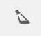

# 3D-elementen renderen{#rendering-d-assets}

U kunt 3D-elementen renderen die u hebt gemanipuleerd en opgeslagen in AEM om 2D-afbeeldingen te maken voor gebruik op webinhoudpagina&#39;s.

Zie [De pagina-inhoud bewerken](/help/sites-authoring/qg-page-authoring.md#editing-your-page-content).

## Prestatieaspecten bij het renderen van 3D-elementen {#performance-considerations-when-rendering-d-assets}

Het renderen van 3D-inhoud verbruikt aanzienlijke serverbronnen, zoals de CPU en het geheugen. Als zodanig kan rendering vaak veel tijd in beslag nemen. Rendertijden variëren aanzienlijk afhankelijk van verschillende factoren, naast de duidelijke modelgrootte en serverhardware:

* **Rendererselectie**.

   De standaard Rapid Refine™-renderer in AEM 3D leidt tot kwaliteitsverlies voor snellere rendertijden. Toch levert dit voor veel toepassingen hoogwaardige resultaten op. Renderers die worden geleverd door middel van toepassingen van derden (bijvoorbeeld V-Ray™ of NVIDIA® Mental Ray® die worden geïmplementeerd in Autodesk® Maya® of Autodesk® 3ds Max®) zijn globaal configureerbaar en de prestaties en kwaliteit worden getransformeerd wanneer het werkgebied wordt ontworpen.

* **IBL versus traditionele belichting**.

   Hoewel deze factor minder gevolgen heeft voor de standaard renderer voor snelle verfijnen, zijn renderers van derden, zoals Mental Ray, aanzienlijk langzamer om te renderen met IBL-fasen dan bij gebruik van traditionele punt- of spotlichten.

De rendermodule Snel verfijnen neemt meestal enkele minuten in beslag om grotere afbeeldingen te renderen. Nochtans, nemen de derderenderers vaak vele notulen, zelfs uren wanneer gevormd voor maximumkwaliteit.

Conversie-, verwerkings- en rendertaken worden zo nodig op de server in de wachtrij geplaatst om overbelasting van de server te voorkomen. Het bericht &quot;Wachten op renderen...&quot; wordt weergegeven bij recent geüploade elementen in [!UICONTROL Card View]. Deze status geeft aan dat andere verwerkings- of rendertaken moeten zijn voltooid voordat de huidige rendertaak kan worden gestart.

>[!NOTE]
>
>Een 3D-element wordt altijd gerenderd met de originele materialen, ongeacht welke materialen worden weergegeven in de interactieve AEM 3D-weergave. Deze functionaliteit is van toepassing op zowel de ingebouwde rendermodule Snel verfijnen als alle native renderers.

**3D-elementen** renderen:

1. Open een 3D-element voor weergave.

   Zie [3D-elementen weergeven](/help/sites-classic-ui-authoring/classicui-view-3d-assets.md).

1. Tik **Adobe Experience Manager** op de **[!UICONTROL Navigation]**-pagina op **[!UICONTROL Assets]**.
1. Tik in de rechterbovenhoek van de pagina in de vervolgkeuzelijst **[!UICONTROL View]** op **[!UICONTROL Card View]**.
1. Navigeer naar een 3D-object dat u wilt renderen.

1. Tik op de kaart van het 3D-object om dit te openen op de pagina met elementdetails.
1. Tik in de linkerbovenhoek van de pagina op de vervolgkeuzelijst en selecteer **[!UICONTROL Render]**.

   

1. Tik in de rechterbovenhoek van de pagina met elementdetails op het pictogram **[!UICONTROL Stage Selector]** (spotlight) en selecteer vervolgens een werkgebiednaam met de achtergrond en de belichting die u op het 3D-object wilt toepassen.

   Zie [Informatie over het gebruik van fasen in AEM 3D](/help/sites-classic-ui-authoring/classicui-stages-aem3d.md).

   

   [!UICONTROL Stage Selector] pictogram

1. Selecteer een renderer in de vervolgkeuzelijst **[!UICONTROL Render]** aan de linkerkant van de pagina met elementdetails.

   De standaardrenderer **[!UICONTROL Rapid Refine]** is altijd beschikbaar. Als het geselecteerde werkgebied een native indeling is, wordt de overeenkomstige renderer van derden ook beschikbaar gesteld in de lijst die u kunt selecteren.

   Zie [Informatie over het gebruik van fasen in AEM 3D](/help/sites-classic-ui-authoring/classicui-stages-aem3d.md).

1. Ga als volgt te werk:

   * Voer in de velden **[!UICONTROL Width and Height]** de pixelbreedte en -hoogte in die u de afbeelding wilt renderen.
   * Voer in het veld **[!UICONTROL Image Name]** de naam van de gerenderde afbeelding in.
   * Typ in het veld **[!UICONTROL Export Path]** het pad waar u de gerenderde afbeelding wilt opslaan. Of tik op het pictogram **[!UICONTROL Browse]** en navigeer naar een locatie.
   * (Optioneel) Schakel het selectievakje **[!UICONTROL Overwrite existing image]** in of uit.

1. Tik in de rechterbovenhoek van de pagina met elementdetails op het pictogram **[!UICONTROL Camera Selector]**. Selecteer een cameraweergave die u wilt toepassen op de gerenderde afbeelding.

   Linker- en rechterbalken of boven- en onderbalken zijn een visuele indicator voor de gedeelten van de weergave die worden weergegeven. Wanneer de camera wordt geleverd door het geselecteerde werkgebied, kunt u een vooraf gedefinieerde camera selecteren.

   

   [!UICONTROL Camera Selector] pictogram

1. Tik op **[!UICONTROL Start Render]** om het renderingsproces te starten.

   Er wordt tijdelijk een bericht weergegeven om aan te geven dat de rendering is gestart. Voor het gemak, omvat dit bericht ook een verbinding aan geselecteerde [!UICONTROL Output Folder] zodat kunt u aan het direct navigeren.

