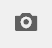

# 3D-elementen weergeven{#viewing-d-assets}

De interactieve 3D-viewer is beschikbaar op de pagina met elementdetails in AEM. De viewer bevat onder andere een verzameling interactieve besturingselementen voor camera waarmee u het 3D-element kunt draaien, zoomen en pannen.

Naast het gebruik van de standaardstadia in AEM 3D, kunt u stadia ook gebruiken die u in een derdetoepassing hebt gecreeerd en in AEM geupload.

Zie [Informatie over het gebruik van fasen in AEM 3D](/help/sites-classic-ui-authoring/classicui-stages-aem3d.md).

>[!NOTE]
>
>Als u een 3D-element wilt weergeven, moet uw apparaat of desktopbrowser WebGL-compatibel zijn. Bovendien moet de onderliggende grafische hardware over voldoende mogelijkheden en geheugen beschikken om modellen van de gewenste grootte te renderen.

## Prestatieaspecten wanneer u 3D-elementen weergeeft {#performance-considerations-when-you-view-d-assets}

De tijd die nodig is om een 3D-element te openen in de paginaweergave met elementdetails, is afhankelijk van verschillende factoren. Deze factoren zijn onder andere:

* Bandbreedte en latentie aan de server.
* Modelgrootte (aantal vlakken).
* Aantal en grootte van kaarten.
* Complexiteit van het werkgebied. Bijvoorbeeld de grootte van de IBL-afbeelding.

Bovendien zijn de mogelijkheden van de clientcomputer, zoals een werkstation, laptop of mobiel aanraakapparaat, ook belangrijk om te overwegen wanneer u de camera interactief manipuleert. Een redelijk krachtig systeem met goede grafische mogelijkheden kan de interactieve 3D-kijkervaring vloeiender en gunstiger maken.

**3D-elementen** weergeven:

1. Zorg ervoor dat u 3D-elementen hebt geüpload naar AEM.

   Zie [Informatie over het uploaden en verwerken van 3D-elementen in AEM](/help/sites-classic-ui-authoring/classicui-upload-proc-3d.md).
1. Tik op **[!UICONTROL Assets]** op de pagina **[!UICONTROL Adobe Experience Manager]** op.**[!UICONTROL Navigation]**
1. Tik in de rechterbovenhoek van de pagina in de vervolgkeuzelijst **[!UICONTROL View]** op **[!UICONTROL Card View]**.

1. Navigeer naar een 3D-element dat u wilt weergeven.
1. Tik op de kaart van het 3D-element om dit te openen op de pagina met elementdetails.

1. Voer een van de volgende handelingen uit:

   * Gebruik in de rechterbenedenhoek van de pagina met elementdetails het palet Camera om verschillende weergaven van het element te wijzigen.

      Als u een niet-aanraakinvoerapparaat gebruikt zonder schuifwiel, zoals een klassieke Apple Single-Button muis, kunt u het zoomen of perspectief van een 3D-element in elke respectievelijke modus nog steeds wijzigen. U kunt de handeling uitvoeren door de `SHIFT`toets ingedrukt te houden terwijl u de muisknop ingedrukt houdt en omhoog of omlaag sleept.

      Wanneer u een aanraakvlak gebruikt op een laptop die doorgaans een laptop is, is het vaak moeilijk om het zoomgedrag of het perspectiefgedrag te bepalen met een beweging met twee vingers. In dergelijke gevallen kunt u `SHIFT`tijdens de handeling ingedrukt houden. Dit soort inspanningen vermindert de snelheid van de knijpbeweging en maakt het eenvoudiger om het gewenste zoomniveau of perspectief te bereiken. U kunt ook met één vinger omhoog of omlaag slepen terwijl de toets `SHIFT`wordt ingedrukt om het zoomgedrag of het perspectiefgedrag te beïnvloeden.
   <table> 
    <tbody> 
      <tr> 
      <td><strong>Naam camerabesturingselement</strong>  </td> 
      <td><strong>Beschrijving</strong></td> 
      </tr> 
      <tr> 
      <td>
In-/uitzoomen
 
or
 
Perp
 </td> 
      <td>
Tik of klik om te schakelen tussen de modi Zoomen en Perspectief.
 
U kunt ook de <code>ALT/OPTION</code>-toets ingedrukt houden tijdens de handeling om tijdelijk over te schakelen op de modus Perspectief . Laat de toets los om terug te keren naar de zoommodus.
 
        <ul> 
        <li><strong>Zoom</strong>-Dolly gedrag in en uit dat de camera dichter of verder weg van het   materiaal beweegt dat u bekijkt. Zoomen is het standaardgedrag voor het schuifwiel op een muis (indien beschikbaar 0, voor knijpbewegingen met twee vingers op mobiele apparaten of wanneer u Shift ingedrukt houdt terwijl u omhoog of omlaag sleept met de linkermuisknop.</li> 
        <li><strong>Perspectief</strong> - Hiermee wijzigt u de brandpuntsafstand (ook wel gezichtsveld genoemd) van de camera terwijl de relatieve grootte van het element in de weergave behouden blijft. Perspectief is het alternatieve gedrag voor het schuifwiel (indien beschikbaar), voor knijpbewegingen met twee vingers op mobiele apparaten of wanneer u Shift ingedrukt houdt terwijl u omhoog of omlaag sleept met de linkermuisknop.</li> 
        </ul> </td> 
      </tr> 
      <tr> 
      <td>
Draaien
 
of
 
Pannen
 </td> 
      <td>
Tik of klik om te schakelen tussen de modi Draaien en Pannen.
 
U kunt ook de <code>ALT/OPTION</code>-toets tijdens de handeling ingedrukt houden om tijdelijk over te schakelen op de panmodus. Laat de toets los om terug te keren naar de draaien modus.
 
        <ul> 
        <li><strong>Draaien</strong> - Verplaatst de weergavecamera op een bol die gecentreerd is op een doelpunt dat zich dichtbij het midden van het 3D-element bevindt, als standaard. Draaien is het standaardgedrag voor het slepen van een knop naar links of het slepen van een knop met één druk op een mobiel apparaat.</li> 
        <li><strong>Pannen</strong> - Verplaatst de camera in het weergavevlak. Het doelpunt wordt dienovereenkomstig verplaatst, zodat de camera bij volgende omloophandelingen om een nieuw doelpunt wordt verplaatst. Pannen is het alternatieve gedrag voor het slepen van de linkerknop en het slepen van één aanraking.</li> 
        </ul> </td> 
      </tr> 
      <tr> 
      <td>
Onderzoek
 
of
 
Doel
 </td> 
      <td>
Tik of klik om te schakelen tussen de modus Onderzoek en de modus Doel.
 
        <ul> 
        <li><strong>Onderzoek</strong>-Tik of klik om de wijze van het Doel in te gaan.</li> 
        <li><strong>Doel</strong>-Tik of klik ergens op een punt in het 3D-element om de weergave op dat deel van het element te centreren.  Orbitacties gebruiken het nieuwe doelpunt.</li> 
        </ul> </td> 
      </tr> 
      <tr> 
      <td>Herstellen</td> 
      <td>Tik of klik om het doelpunt van de weergave te herstellen in het midden van het model. Met Herstellen wordt de camera   ook dichter bij of verder weg geplaatst om het middel volledig en bij een redelijke weergavegrootte weer te geven.</td> 
      </tr> 
    </tbody> 
    </table>

1. Tik in de rechterbovenhoek van de pagina met elementdetails op het pictogram **[!UICONTROL Stage Selector]**. Selecteer een werkgebiednaam met de achtergrond en de belichting die u op het 3D-element wilt toepassen.

   

   De stadia verstrekken milieu-achtergrond, grondvliegtuig, en verlichting-binnen waarin het 3D model wordt bekeken.

   Zie [Informatie over het gebruik van fasen in AEM 3D](/help/sites-classic-ui-authoring/classicui-stages-aem3d.md).

1. Tik in de rechterbovenhoek van de pagina met elementdetails op het pictogram **[!UICONTROL Camera Selector]** en selecteer vervolgens een cameraweergave die u op het 3D-element wilt toepassen.

   

   De stadia verstrekken vaak vooraf bepaalde camera&#39;s. U kunt de huidige camera opnieuw selecteren om de vooraf gedefinieerde instellingen te herstellen.

   Zie [Informatie over het gebruik van fasen in AEM 3D](/help/sites-classic-ui-authoring/classicui-stages-aem3d.md).

1. Tik in de rechterbovenhoek van de pagina op **[!UICONTROL Save]**.
1. Voer een van de volgende handelingen uit:

   * Het 3D-element renderen.

      Zie [3D-elementen renderen](/help/sites-classic-ui-authoring/classicui-rendering-3d.md).

   * Tik in de rechterbovenhoek van de pagina op **[!UICONTROL Close]** om terug te keren naar de pagina Middelen.

