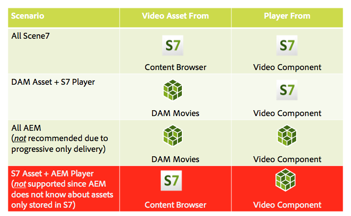

# Video{#video}

>[!CAUTION]
>
>AEM 6.4 heeft het einde van de uitgebreide ondersteuning bereikt en deze documentatie wordt niet meer bijgewerkt. Raadpleeg voor meer informatie onze [technische ondersteuningsperioden](https://helpx.adobe.com/support/programs/eol-matrix.html). Ondersteunde versies zoeken [hier](https://experienceleague.adobe.com/docs/).

Middelen bieden gecentraliseerd beheer van video-elementen waarmee u video&#39;s rechtstreeks kunt uploaden naar Middelen voor automatische codering naar Dynamic Media Classic en rechtstreeks vanuit Middelen toegang kunt krijgen tot Dynamic Media Classic-video&#39;s voor het ontwerpen van pagina&#39;s.

Dynamic Media Classic-videointegratie breidt het bereik van geoptimaliseerde video uit tot alle schermen (automatische apparaat- en bandbreedtedetectie).

* De Dynamic Media Classic (Scene7)-videocomponent voert automatisch apparaat- en bandbreedtedetectie uit om de juiste indeling en video van de juiste kwaliteit af te spelen op desktopcomputers, tablets en mobiele apparaten.
* Elementen - U kunt adaptieve videosets opnemen in plaats van alleen afzonderlijke video-elementen. Een adaptieve videoset is een container voor alle video-uitvoeringen die nodig zijn om video naadloos af te spelen op meerdere schermen. Een adaptieve videoreeks groepeert versies van de zelfde video die bij verschillende beetjetarieven en formaten zoals 400 kbps, 800 kbps, en 1000 kbps worden gecodeerd. U gebruikt een adaptieve videoset, samen met de S7-videocomponent, voor adaptieve videostreaming op meerdere schermen, zoals desktopcomputers, iOS, Android, Blackberry en mobiele Windows-apparaten. Zie [Scene7-documentatie over adaptieve videosets voor meer informatie](https://experienceleague.adobe.com/docs/dynamic-media-classic/using/setup/application-setup.html#video-presets-for-encoding-video-files).

## Info over FFMPEG en Dynamic Media Classic {#about-ffmpeg-and-scene}

Het standaardvideocoderingsproces is gebaseerd op het gebruik van de op FFMPEG gebaseerde integratie met videoprofielen. Daarom bevat de uit-van-de-doos DAM Update Asset-workflow de volgende twee op ffmpeg gebaseerde workflowstappen:

* FMPEG-miniaturen
* FFMPEG-codering

Houd er rekening mee dat het inschakelen en configureren van de Dynamic Media Classic-integratie deze twee workflowstappen niet automatisch verwijdert of deactiveert uit de workflow voor het innemen van middelen in de DAM-update. Als u al in AEM gebruik maakt van de op FFMPEG gebaseerde videocodering, is het waarschijnlijk dat FFMPEG is geïnstalleerd in uw ontwerpomgeving. In dit geval wordt een nieuwe video die met Elementen wordt ingevoerd, twee keer gecodeerd: eenmaal van de FFMPEG-encoder en eenmaal van de Dynamic Media Classic-integratie.

Als u op FFMPEG-Gebaseerde videocodering in AEM gevormd hebt en FFMPEG geïnstalleerd, adviseert Adobe dat u de twee werkschema&#39;s van FFMPEG uit uw werkschema&#39;s van Activa van de Update van DAM verwijdert.

### Ondersteunde indelingen {#supported-formats}

De volgende indelingen worden ondersteund voor de Dynamic Media Classic Video-component:

* F4V H.264
* MP4 H.264

### Bepalen waar uw video moet worden geüpload {#deciding-where-to-upload-your-video}

Bepaal waar u uw video-elementen wilt uploaden afhankelijk van het volgende:

* Hebt u een workflow voor het video-element nodig?
* Hebt u versiebeheer nodig voor het video-element?

Als het antwoord op een van deze vragen &quot;ja&quot; is, uploadt u uw video rechtstreeks naar Adobe DAM. Als het antwoord op beide vragen &quot;nee&quot; is, uploadt u uw video rechtstreeks naar Dynamic Media Classic. Het werkschema voor elk scenario wordt beschreven in de volgende sectie.

#### Als u de video rechtstreeks uploadt naar Adobe Assets {#if-you-are-uploading-your-video-directly-to-adobe-assets}

Als u een workflow of versie voor uw elementen nodig hebt, moet u eerst uploaden naar Adobe Assets. Hieronder vindt u de aanbevolen workflow:

1. Upload het video-element naar Adobe Assets en codeer en publiceer het automatisch naar Dynamic Media Classic.
1. In AEM hebt u toegang tot video-elementen in WCM in de **[!UICONTROL Movies]** van de Inhoudszoeker.
1. Auteur met Dynamic Media Classic video- of stichtingsvideocomponent.

#### Als u uw video uploadt naar Dynamic Media Classic {#if-you-are-uploading-your-video-to-scene}

Als u geen workflow of versie voor uw middelen nodig hebt, moet u uw middelen uploaden naar Dynamic Media Classic. Hieronder vindt u de aanbevolen workflow:

1. In Dynamic Media Classic: [Een geplande FTP-upload en -codering naar Dynamic Media Classic instellen (systeem geautomatiseerd)](https://experienceleague.adobe.com/docs/dynamic-media-classic/using/upload-publish/uploading-files.html#uploading-your-files).
1. In AEM hebt u toegang tot video-elementen in WCM in de **[!UICONTROL Dynamic Media Classic]** van de Inhoudszoeker.
1. Auteur met het Dynamic Media Classic-videoonderdeel.

### Integratie met Dynamic Media Classic Video configureren {#configuring-integration-with-scene-video}

**Universele voorinstellingen configureren**:

1. In **[!UICONTROL Cloud Services]**, navigeert u naar uw **[!UICONTROL Dynamic Media Classic]** configuratie en klik **[!UICONTROL Edit]**.
1. Selecteer **[!UICONTROL Video]** tab.

   >[!NOTE]
   >
   >De **[!UICONTROL Video]** wordt niet weergegeven als de pagina geen cloudconfiguratie heeft. Zie [Dynamic Media Classic inschakelen voor WCM](#enablingscene7forwcm).

1. Selecteer het adaptieve videocoderingsprofiel, een uit-van-de-doos enig videocoderingsprofiel, of een profiel van de douanevideocodering.

   >[!NOTE]
   >
   >Zie voor meer informatie over wat de videovoorinstellingen betekenen de [Dynamic Media Classic-documentatie](https://experienceleague.adobe.com/docs/dynamic-media-classic/using/setup/application-setup.html#video-presets-for-encoding-video-files).
   >
   >Adobe raadt u aan beide adaptieve videosets te selecteren wanneer u de universele voorinstellingen configureert of de optie **[!UICONTROL Adaptive Video Encoding]** optie.

1. De geselecteerde coderingsprofielen worden automatisch toegepast op alle video&#39;s die zijn geüpload naar de CQ DAM-doelmap die u hebt ingesteld voor deze Dynamic Media Classic-cloudconfiguratie. U kunt meerdere Dynamic Media Classic-cloudconfiguraties met verschillende doelmappen instellen om zo nodig verschillende coderingsprofielen toe te passen.

### Voorinstellingen voor viewers en codering bijwerken {#updating-viewer-and-encoding-presets}

Als u de voorinstellingen voor de viewer en codering voor video in AEM moet bijwerken omdat de voorinstellingen in Dynamic Media Classic zijn bijgewerkt, navigeert u naar de Dynamic Media Classic-configuratie in de cloudconfiguratie en klikt u op **De voorinstellingen voor viewer en codering bijwerken**.

### Uw master video uploaden {#uploading-your-master-video}

U kunt als volgt uw master video vanaf Adobe DAM uploaden naar Dynamic Media Classic:

1. Navigeer naar de doelmap CQ DAM waar u de cloudconfiguratie hebt ingesteld met Dynamic Media Classic-coderingsprofielen.
1. Klikken **[!UICONTROL Upload]** om master video te uploaden. Het uploaden en coderen van video is voltooid na het [!UICONTROL DAM Update Asset] de workflow is voltooid en **[!UICONTROL Publish to Dynamic Media Classic]** heeft een vinkje.

   >[!NOTE]
   >
   >Het kan enige tijd duren voordat de videominiaturen zijn gegenereerd.

   De DAM-master video naar de videocomponenttoegang slepen *alles* van de door Dynamic Media Classic gecodeerde proxy-uitvoeringen voor levering.

### Foundation Video Component versus Dynamic Media Classic Video Component {#foundation-video-component-versus-scene-video-component}

Wanneer u AEM gebruikt, hebt u toegang tot zowel de videocomponent Video beschikbaar in Sites als de videocomponent van Dynamic Media Classic (Scene7). Deze componenten zijn niet onderling verwisselbaar.

De Dynamic Media Classic-videocomponent werkt alleen voor Dynamic Media Classic-video&#39;s. De stivingscomponent werkt met video&#39;s die zijn opgeslagen vanuit AEM (met gebruik van mpeg) en Dynamic Media Classic-video&#39;s.

De volgende matrix legt uit wanneer u welke component moet gebruiken:

>[!NOTE]
>
>Het Dynamic Media Classic-videoonderdeel gebruikt het universele videoprofiel buiten het vak. U kunt de op HTML5 gebaseerde videospeler echter verkrijgen voor gebruik door AEM. Kopieer in Dynamic Media Classic de insluitcode van de uit-van-doos HTML5 videospeler en plaats deze in de AEM pagina.

## Videocomponent AEM {#aem-video-component}

Zelfs als het gebruik van de Dynamic Media Classic-video-component wordt aanbevolen voor het weergeven van Dynamic Media Classic-video&#39;s, wordt in deze sectie beschreven hoe u Dynamic Media Classic-video&#39;s gebruikt voor de [!UICONTROL Foundation Video Component] AEM, omwille van de volledigheid.

### Video- en Dynamic Media Classic-videovergelijking AEM {#aem-video-and-scene-video-comparison}

De volgende lijst verstrekt een high level vergelijking van gesteunde mogelijkheden tussen de AEM component van de Video van de Stichting en de videocomponent van Scene7:

|  | AEM | Dynamic Media Classic Video |
|---|---|---|
| Benadering | HTML5 eerste aanpak. Flash wordt alleen gebruikt voor niet-HTML-fallback. | Flash op de meeste desktops. HTML5 wordt gebruikt voor mobiele apparaten en tabletten. |
| Aflevering | Progressief | Adaptieve streaming |
| Tekstspatiëring | Ja | Ja |
| Uitbreidbaarheid | Ja | Ja (met Dynamic Media Classic-viewer-SDK) |
| Mobiele video | Ja | Ja |

### Instellen {#setting-up}

#### Videoprofielen maken {#creating-video-profiles}

De verschillende videocoderingen worden gemaakt volgens de Dynamic Media Classic-coderingsvoorinstellingen die zijn geselecteerd in de Dynamic Media Classic-cloudconfiguratie. Als u deze wilt gebruiken door de stichtingsvideocomponent, moet u een videoprofiel maken voor elke geselecteerde Dynamic Media Classic-coderingsvoorinstelling. Hierdoor kan de video-component de DAM-uitvoeringen dienovereenkomstig selecteren.

>[!NOTE]
>
>Nieuwe videoprofielen en wijzigingen ervan moeten worden geactiveerd om te publiceren.

1. Ga in AEM naar **[!UICONTROL Tools]** selecteert u vervolgens **[!UICONTROL Configuration Console]**. Navigeer in de configuratieconsole naar **[!UICONTROL Tools]** > **[!UICONTROL Assets]** > **[!UICONTROL Video Profiles]** in de navigatiestructuur.
1. Maak een nieuw Dynamic Media Classic-videoprofiel. In de **[!UICONTROL New...]** menu, selecteert u **[!UICONTROL Create Page]** en selecteer vervolgens de Dynamic Media Classic Video Profile-sjabloon. Geef de nieuwe pagina met videoprofielen een naam en klik op **[!UICONTROL Create]**.

   

1. Bewerk het nieuwe videoprofiel. Selecteer eerst de cloud config. Selecteer vervolgens dezelfde coderingsvoorinstelling die u in de cloudconfiguratie hebt geselecteerd.

   

   | Eigenschap | Beschrijving |
   |---|---|
   | Dynamic Media Classic (Scene7) Cloud Config | De cloud config die voor de coderingsvoorinstellingen moet worden gebruikt. |
   | Dynamic Media Classic (Scene7)-coderingsvoorinstelling | De coderingsvoorinstelling waarmee dit videoprofiel wordt toegewezen. |
   | HTML5-videotype | This property allows to set the value of the type property of the HTML5 video source element. Deze informatie wordt niet verschaft door de Dynamic Media Classic-coderingsvoorinstellingen, maar is vereist voor een correcte weergave van de video&#39;s met behulp van HTML5-video-element. Er is een lijst met algemene indelingen beschikbaar, maar deze lijst kan worden overschreven voor andere indelingen. |

   Herhaal deze stap voor alle coderingsvoorinstellingen die zijn geselecteerd in de cloudconfiguratie die u wilt gebruiken in de videocomponent.

#### Ontwerp configureren {#configuring-design}

De basis videocomponent moet weten welke videoprofielen moeten worden gebruikt om de lijst met videobronnen te maken. U moet het dialoogvenster Ontwerp van videocomponenten openen en het componentontwerp configureren voor het gebruik van de nieuwe videoprofielen.

>[!NOTE]
>
>Als u de basis-videocomponent op een mobiele pagina gebruikt, moet u deze stappen mogelijk herhalen bij het ontwerp van de mobiele pagina.

>[!NOTE]
>
>Wijzigingen in het ontwerp vereisen activering van het ontwerp om van kracht te worden bij de publicatie.

1. Open het ontwerpdialoogvenster van de stichtingsvideo-component en wijzig de instelling in **[!UICONTROL Profiles]** tab. Verwijder vervolgens de out-of-the-box profielen en voeg de nieuwe Dynamic Media Classic-videoprofielen toe. De volgorde van de profiellijst in het ontwerpdialoogvenster definieert ook de volgorde van het element videobronnen bij het renderen.
1. Voor browsers die geen HTML5 ondersteunen, kunt u met de videocomponent een flitsfallback configureren. Open het ontwerpdialoogvenster voor videocomponenten en wijzig de instelling in **[!UICONTROL Flash]** tab. Configureer de Flash Player-instellingen en wijs een fallback-profiel toe aan de Flash Player.

#### Checklist {#checklist}

1. Een Dynamic Media Classic (Scene7)-cloudconfiguratie maken. Zorg ervoor dat de voorinstellingen voor videocodering zijn ingesteld en dat de importmodule wordt uitgevoerd.
1. Maak een Dynamic Media Classic-videoprofiel voor elke videocoderingsvoorinstelling die is geselecteerd in de cloudconfiguratie.
1. De videoprofielen moeten worden geactiveerd.
1. Configureer het ontwerp van de basis-videocomponent op de pagina.
1. Activeer het ontwerp nadat u klaar bent met uw ontwerpwijzigingen.
