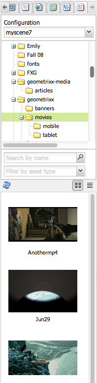

# Dynamic Media Classic-functies toevoegen aan uw pagina{#adding-scene-features-to-your-page}

Adobe Dynamic Media Classic is een gehoste oplossing voor het beheren, verbeteren, publiceren en leveren van rijke media-elementen aan web, mobiele apparaten, e-mail en displays en drukwerk via internet.

U kunt AEM middelen bekijken die in Dynamic Media Classic in diverse kijkers worden gepubliceerd:

* In-/uitzoomen
* Flyout
* Video
* Afbeeldingssjabloon
* Afbeelding

U kunt digitale middelen rechtstreeks van AEM naar Dynamic Media Classic publiceren en u kunt digitale middelen van Dynamic Media Classic naar AEM publiceren.

In deze sectie wordt beschreven hoe u digitale elementen kunt publiceren van AEM naar Dynamic Media Classic en omgekeerd. Viewers worden ook in detail beschreven. Zie [Dynamic Media Classic integreren met AEM](/help/sites-administering/scene7.md) voor informatie over het configureren van AEM voor Dynamic Media Classic.

Zie ook [Afbeeldingskaarten toevoegen](/help/assets/image-maps.md).

Raadpleeg de volgende secties voor meer informatie over het gebruik van videocomponenten met AEM:

* [Video](/help/sites-classic-ui-authoring/manage-assets-classic-s7-video.md)

>[!NOTE]
>
>Als de Klassieke activa van Dynamic Media niet behoorlijk tonen, zorg ervoor dat Dynamische media [gehandicapt ](/help/assets/config-dynamic.md#disabling-dynamic-media) is en vernieuw dan de pagina.

## Handmatig publiceren naar Dynamic Media Classic vanaf middelen {#manually-publishing-to-scene-from-assets}

U kunt digitale middelen naar Dynamic Media Classic publiceren vanuit de middelenconsole in de klassieke gebruikersinterface of rechtstreeks vanuit het element.

>[!NOTE]
>
>AEM publiceert asynchroon naar Dynamic Media Classic. Nadat u op **[!UICONTROL Publish]** hebt geklikt, kan het enkele seconden duren voordat uw element naar Dynamic Media Classic wordt gepubliceerd.

### Publiceren vanaf de middelenconsole {#publishing-from-the-assets-console}

Publiceren naar Dynamic Media Classic vanaf de middelenconsole als de elementen zich in een Classic Dynamic Media-doelmap bevinden:

1. Klik in de AEM klassieke interface op **[!UICONTROL Digital Assets]** om toegang te krijgen tot het beheer van digitale elementen.

1. Selecteer het element (of de elementen) of de map in de doelmap die u naar Dynamic Media Classic wilt publiceren, klik met de rechtermuisknop en selecteer **[!UICONTROL Publish to Dynamic Media Classic]**. U kunt ook **[!UICONTROL Publish to Dynamic Media Classic]** selecteren in het menu **[!UICONTROL Tools]**.

   

1. Ga naar Dynamic Media Classic en bevestig dat de middelen beschikbaar zijn.

   >[!NOTE]
   >
   >Als de elementen zich niet in een gesynchroniseerde Dynamic Media Classic-map bevinden, is **[!UICONTROL Publish to Dynamic Media Classic]** in beide menu&#39;s zichtbaar maar uitgeschakeld.

### Publiceren op basis van een element {#publishing-from-an-asset}

U kunt een element handmatig publiceren zolang dat element zich in de gesynchroniseerde map Dynamic Media Classic bevindt.

>[!NOTE]
>
>Als het element zich niet in de Klassieke map van Dynamic Media bevindt, is de koppeling naar **[!UICONTROL Publish to Dynamic Media Classic]** niet beschikbaar.

**Publiceren naar Dynamic Media Classic rechtstreeks vanaf een digitaal middel**:

1. Klik in AEM op **[!UICONTROL Digital Assets]** om toegang te krijgen tot het beheer van digitale elementen.

1. Dubbelklik om een element te openen.

1. Selecteer **[!UICONTROL Publish to Dynamic Media Classic]** in het deelvenster Elementdetails.

   

1. De koppeling verandert in **[!UICONTROL Publishing ...]** en vervolgens **[!UICONTROL Published]**. Ga naar Dynamic Media Classic en bevestig dat het middel beschikbaar is.

   >[!NOTE]
   >
   >Als het element niet correct wordt gepubliceerd naar Dynamic Media Classic, verandert de koppeling in **[!UICONTROL Publishing Failed]**. Als het element al is gepubliceerd naar Dynamic Media Classic, leest de koppeling **[!UICONTROL Re-Publish to Dynamic Media Classic]**. Met Herpubliceren kunt u wijzigingen aanbrengen in een element in AEM en deze opnieuw publiceren.

### Elementen publiceren van buiten de CQ-doelmap {#publishing-assets-from-outside-the-cq-target-folder}

Adobe raadt u aan om elementen alleen vanuit elementen in de Klassieke Dynamic Media-doelmap naar Dynamic Media Classic te publiceren. Als u echter elementen moet uploaden vanuit een map buiten de doelmap, kunt u dat nog steeds doen door ze te uploaden naar een map *ad-hoc* in Dynamic Media Classic.

U doet dit door de configuratie van de Wolk voor de pagina te vormen waar de activa zullen verschijnen. Vervolgens voegt u een klassieke Dynamic Media-component aan de pagina toe en sleept u een element naar de component. Nadat de pagina-eigenschappen voor die pagina zijn ingesteld, wordt een **[!UICONTROL Publish to Dynamic Media Classic]**-koppeling weergegeven die bij selectie het uploaden naar Dynamic Media Classic activeert.

>[!NOTE]
>
>Elementen in de ad-hocmap worden niet weergegeven in de Dynamic Media Classic-inhoudbrowser.

**Elementen publiceren die zich buiten de CQ-doelmap** bevinden:

1. Klik in AEM klassieke interface op **[!UICONTROL Websites]** en navigeer naar de webpagina die u een digitaal element wilt toevoegen dat nog niet naar Dynamic Media Classic is gepubliceerd. (Normale regels voor paginaovererving zijn van toepassing.)

1. Klik in de assistent op het pictogram **[!UICONTROL Page]** en klik vervolgens op **[!UICONTROL Page Properties]**.

1. Klik op **[!UICONTROL Cloud Services]> [!UICONTROL Add services] >[!UICONTROL Dynamic Media Classic (Scene7)]**.
1. Selecteer in de keuzelijst Klassieke Adobe Dynamic Media de gewenste configuratie en klik vervolgens op **[!UICONTROL OK]**.

   

1. Voeg op de webpagina een Dynamic Media Classic-component (Scene7) toe aan de gewenste locatie op de pagina.
1. Sleep een digitaal element vanuit de zoeker naar de component. Er wordt een koppeling naar **[!UICONTROL Check Dynamic Media Classic Publication Status]** weergegeven.

   >[!NOTE]
   >
   >Als het digitale element zich in de CQ-doelmap bevindt, wordt geen koppeling naar **[!UICONTROL Check Dynamic Media Classic Publication Status]** weergegeven. De elementen worden eenvoudig in de component geplaatst.

   

1. Klik op **[!UICONTROL Check Dynamic Media Classic Publication Status]**. Als het actief niet wordt gepubliceerd, publiceert AEM het middel naar Dynamic Media Classic. Nadat het element is geüpload, bevindt het zich in de ad-hocmap. Standaard bevindt de ad-hocmap zich in de map `name_of_the_company/CQ5_adhoc`. U kunt [dit, indien nodig ](#configuringtheadhocfolder) vormen.

   >[!NOTE]
   >
   >Als het element zich niet in een gesynchroniseerde Dynamic Media Classic-map bevindt en er geen Classic-cloudconfiguratie van Dynamic Media is gekoppeld aan de huidige pagina, mislukt het uploaden.

## Dynamic Media Classic (Scene7)-componenten {#scene-components}

De volgende Klassieke Dynamic Media-componenten zijn beschikbaar in AEM:

* In-/uitzoomen
* Flyout (zoomen)
* Afbeeldingssjabloon
* Afbeelding
* Video

>[!NOTE]
>
>Deze componenten zijn niet standaard beschikbaar en moeten in de modus **[!UICONTROL Design]** worden geselecteerd voordat ze kunnen worden gebruikt.

Nadat de componenten in de modus **[!UICONTROL Design]** beschikbaar zijn gemaakt, kunt u de componenten net als alle andere AEM aan de pagina toevoegen. Elementen die nog niet naar Dynamic Media Classic zijn gepubliceerd, worden naar Dynamic Media Classic gepubliceerd als ze zich in een gesynchroniseerde map of op een pagina bevinden of als ze zich in een Classic-cloudconfiguratie van Dynamic Media bevinden.

### Einde-van-levensduur Flash-viewers {#flash-viewers-end-of-life-notice}

Met ingang van 31 januari 2017 is de officiële ondersteuning voor het Flash-viewerplatform door Adobe Dynamic Media Classic beëindigd.

### Een klassieke Dynamic Media-component toevoegen aan een pagina {#adding-a-scene-component-to-a-page}

Het toevoegen van een klassieke Dynamic Media-component aan een pagina is hetzelfde als het toevoegen van een component aan een pagina. Klassieke Dynamic Media-componenten worden in de volgende secties uitgebreid beschreven.

**Een klassieke Dynamic Media-component/viewer toevoegen aan een pagina in de klassieke UI**:

1. Open in AEM de pagina waaraan u de Klassieke Dynamic Media-component wilt toevoegen.

1. Als er geen Klassieke Dynamic Media-componenten beschikbaar zijn, klikt u op de liniaal in het hulpwerkgebied om de **[!UICONTROL Design]**-modus te activeren, klikt u op **[!UICONTROL Edit]** parsys en selecteert u alle **[!UICONTROL Dynamic Media Classic]**-componenten om deze beschikbaar te maken.

1. Ga terug naar de modus **[!UICONTROL Edit]** door op het potlood in het hulpstuk te klikken.

1. Sleep een component van de **[!UICONTROL Dynamic Media Classic]** groep in het hulpstuk op de pagina in de gewenste plaats.

1. Klik **[!UICONTROL Edit]** om de component te openen.

1. Bewerk de component naar wens en klik op **[!UICONTROL OK]** om de wijzigingen op te slaan.

### Interactieve kijkervaringen toevoegen aan een responsieve website {#adding-interactive-viewing-experiences-to-a-responsive-website}

Het responsieve ontwerp voor uw middelen betekent dat uw middelen worden aangepast afhankelijk van waar ze worden weergegeven. Bij een responsief ontwerp worden dezelfde middelen op meerdere apparaten weergegeven.

**Een interactieve kijkervaring toevoegen aan een responsieve site in de klassieke gebruikersinterface**:

1. Meld u aan bij AEM en zorg ervoor dat u [geconfigureerde Adobe Dynamic Media Classic Cloud Services](/help/sites-administering/scene7.md#configuring-scene-integration) hebt en dat Dynamic Media Classic-componenten beschikbaar zijn.

   >[!NOTE]
   >
   >Als er geen Klassieke WCM-componenten van Dynamic Media beschikbaar zijn, moet u deze inschakelen in de modus **[!UICONTROL Design].

1. In een website waarvoor de klassieke Dynamic Media-componenten zijn ingeschakeld, sleept u een **[!UICONTROL Image]**-viewer naar de pagina.
1. Bewerk de component en pas de onderbrekingspunten aan op het tabblad **[!UICONTROL Dynamic Media Classic Settings]**.

   

1. Controleer of de viewers het formaat responsief wijzigen en of alle interacties zijn geoptimaliseerd voor computers, tablets en mobiele apparaten.

### Gemeenschappelijke instellingen voor alle Dynamic Media Classic-componenten {#settings-common-to-all-scene-components}

Hoewel de configuratieopties variëren, zijn het volgende gemeenschappelijk voor alle Klassieke componenten van Dynamic Media:

* **[!UICONTROL File Reference]** - Blader naar een bestand waarnaar u wilt verwijzen. De verwijzing van het dossier toont de activa URL en niet noodzakelijk de volledige Klassieke URL van Dynamic Media met inbegrip van de bevelen URL en de parameters. U kunt in dit veld geen klassieke URL-opdrachten en -parameters van Dynamic Media toevoegen. Ze moeten worden toegevoegd via de bijbehorende functionaliteit in de component.
* **[!UICONTROL Width]** - Hiermee kunt u de breedte instellen.
* **[!UICONTROL Height]** - Hiermee kunt u de hoogte instellen.

U stelt deze configuratieopties in door te dubbelklikken op een klassieke Dynamic Media-component, bijvoorbeeld wanneer u een **[!UICONTROL Zoom]**-component opent:

### In-/uitzoomen {#zoom}

De component HTML5 Zoom geeft een grotere afbeelding weer wanneer u op de knop + drukt.

Het element heeft onderaan zoomgereedschappen. Klik **[!UICONTROL +]** om te vergroten. Klik **[!UICONTROL -]** om te verminderen. Als u op **[!UICONTROL x]** of de zoompijl opnieuw instellen klikt, wordt de oorspronkelijke grootte van de afbeelding hersteld. Klik op de diagonale pijlen om deze op volledig scherm weer te geven. Klik **[!UICONTROL Edit]** om de component te vormen. Met deze component, kunt u [montages vormen gemeenschappelijk voor alle Klassieke componenten van Dynamic Media](#settings-common-to-all-scene-components).

### Flyout {#flyout}

In de HTML5 Flyout-component wordt het element weergegeven als gesplitst scherm. het element in de opgegeven grootte laten staan; rechts wordt het zoomgedeelte weergegeven. Klik **[!UICONTROL Edit]** om de component te vormen. Met deze component, kunt u [montages vormen gemeenschappelijk voor alle Klassieke componenten van Dynamic Media](/help/sites-administering/scene7.md#settingscommontoalldynamicmediaclassiccomponents).

>[!NOTE]
>
>Als uw Flyout-component een aangepaste grootte gebruikt, wordt die aangepaste grootte gebruikt en wordt de responsieve instelling van de component uitgeschakeld.
>
>Als uw component Flyout de standaardgrootte, zoals die in [!UICONTROL Design] wordt geplaatst gebruikt, dan wordt de standaardgrootte gebruikt en de componentenrek om de grootte van de paginalay-out met ontvankelijke opstelling van de toegelaten component aan te passen. Houd er echter rekening mee dat er een beperking geldt voor de responsieve installatie van de component. Wanneer u de component Flyout met ontvankelijke opstelling gebruikt, zou u het niet met volledige paginalrek moeten gebruiken. Anders kan de Flyout de rechterrand van de pagina overschrijden.

### Afbeelding {#image}

Met de Klassieke Dynamic Media-afbeeldingscomponent kunt u Klassieke Dynamic Media-functionaliteit aan uw afbeeldingen toevoegen, zoals Klassieke Dynamic Media-wijzigingstoetsen, voorinstellingen voor afbeeldingen of viewers en verscherpen. De Klassieke Dynamic Media-afbeeldingscomponent is vergelijkbaar met andere afbeeldingscomponenten in AEM met speciale Dynamic Media Klassieke functionaliteit. In dit voorbeeld is de optie `&op_invert=1` van Dynamic Media Classic URL op de afbeelding toegepast.

**[!UICONTROL Title, Alt Text]** - Voeg op het  [!UICONTROL Advanced] tabblad een titel toe aan de afbeelding en alternatieve tekst voor gebruikers met afbeeldingen uitgeschakeld.

**[!UICONTROL URL, Open in]** - U kunt een element instellen van om een koppeling te openen. Stel de **[!UICONTROL URL]** en **[!UICONTROL Open in]** in om aan te geven of het venster in hetzelfde venster of in een nieuw venster moet worden geopend.

**[!UICONTROL Viewer preset]** - Selecteer een bestaande viewervoorinstelling in het keuzemenu. Als de viewervoorinstelling die u zoekt niet zichtbaar is, moet u deze mogelijk zichtbaar maken. Zie [Viewer-voorinstellingen beheren](/help/assets/managing-viewer-presets.md). U kunt geen viewervoorinstelling selecteren als u een voorinstelling voor afbeeldingen gebruikt en andersom.

**[!UICONTROL Dynamic Media Classic Configuration]** - Selecteer de Klassieke Dynamic Media-configuratie die u wilt gebruiken om actieve voorinstellingen voor afbeeldingen op te halen van het Scene7 Publishing System.

**[!UICONTROL Image preset]** - Selecteer een bestaande voorinstelling voor de afbeelding in het keuzemenu. Als de voorinstelling die u zoekt niet zichtbaar is, moet u deze mogelijk zichtbaar maken. Zie [Voorinstellingen voor afbeeldingen beheren](/help/assets/managing-image-presets.md). U kunt geen viewervoorinstelling selecteren als u een voorinstelling voor afbeeldingen gebruikt en andersom.

**[!UICONTROL Output Format]** - Selecteer de uitvoerindeling van de afbeelding, bijvoorbeeld JPEG. Afhankelijk van de uitvoerindeling die u selecteert, hebt u mogelijk aanvullende configuratieopties. Zie [Voorinstellingen voor afbeeldingen beheren](/help/assets/managing-image-presets.md).

**[!UICONTROL Sharpening]** - Selecteer hoe u de afbeelding wilt verscherpen. Verscherpen wordt gedetailleerd uitgelegd in [*Adobe Dynamic Media Klassieke afbeeldingskwaliteit en Best practices voor verscherpen*](/help/assets/assets/sharpening_images.pdf).

**[!UICONTROL URL Modifiers]** - U kunt afbeeldingseffecten wijzigen door aanvullende opdrachten voor klassieke Dynamic Media-afbeeldingen op te geven. Deze worden beschreven in [Voorinstellingen voor afbeeldingen beheren](/help/assets/managing-image-presets.md) en [Command reference](https://experienceleague.adobe.com/docs/dynamic-media-developer-resources/image-serving-api/image-serving-api/http-protocol-reference/command-reference/c-command-reference.html).

**[!UICONTROL Breakpoints]** - Als uw website reageert, wilt u de onderbrekingspunten aanpassen. Onderbrekingspunten moeten worden gescheiden door komma&#39;s `,`.

### Afbeeldingssjabloon {#image-template}

[Dynamic Media Classic Image ](https://experienceleague.adobe.com/docs/dynamic-media-classic/using/template-basics/quick-start-template-basics.html#template-basics) Templatesare gelaagde Photoshop-inhoud die is geïmporteerd naar Dynamic Media Classic, waar inhoud en eigenschappen zijn geparametriseerd voor variabiliteit. Met de component **[!UICONTROL Image template]** kunt u afbeeldingen importeren en de tekst dynamisch in AEM wijzigen. Bovendien kunt u de **[!UICONTROL Image template]** component vormen om waarden van cliëntcontext te gebruiken, zodat elke gebruiker het beeld op een gepersonaliseerde manier ervaart.

Klik **[!UICONTROL Edit]** om de component te vormen. U kunt [instellingen configureren die hetzelfde zijn voor alle klassieke Dynamic Media-componenten](/help/sites-administering/scene7.md#settingscommontoalldynamicmediaclassicscomponents) en andere instellingen die in deze sectie worden beschreven.

**[!UICONTROL File Reference, Width, Height]** - Zie de instellingen die gelden voor alle klassieke Dynamic Media-componenten.

>[!NOTE]
>
>Klassieke URL-opdrachten en -parameters van Dynamic Media kunnen niet rechtstreeks aan de URL van de bestandsverwijzing worden toegevoegd. Ze kunnen alleen worden gedefinieerd in de interface van de component in het **[!UICONTROL Parameter]**-deelvenster.

**[!UICONTROL Title, Alt Text]** Voeg op het  [!UICONTROL Dynamic Media Classic Image Template] tabblad een titel toe aan de afbeelding en alternatieve tekst voor gebruikers die afbeeldingen hebben uitgeschakeld.

**[!UICONTROL URL, Open in]** U kunt een middel van plaatsen om een verbinding te openen. Stel **[!UICONTROL URL]** in en **[!UICONTROL Open in]** geef aan of u het venster wilt openen in hetzelfde venster of in een nieuw venster.

**[!UICONTROL Parameter Panel]** Wanneer u een afbeelding importeert, worden de parameters vooraf gevuld met informatie uit de afbeelding. Als er geen inhoud is die dynamisch kan worden gewijzigd, is dit venster leeg.

#### Tekst dynamisch wijzigen {#changing-text-dynamically}

Als u de tekst dynamisch wilt wijzigen, voert u nieuwe tekst in de velden in en klikt u op **[!UICONTROL OK]**. In dit voorbeeld is **[!UICONTROL Price]** nu $50 en is de verzending 99 cent.

De tekst in de afbeelding verandert. U kunt de tekst terugzetten naar de oorspronkelijke waarde door op **[!UICONTROL Reset]** naast het veld te klikken.

#### Tekst wijzigen om de waarde van de context van een client weer te geven {#changing-text-to-reflect-the-value-of-a-client-context-value}

Als u een veld aan een clientcontextwaarde wilt koppelen, klikt u op **[!UICONTROL Select]** om het contextmenu van de client te openen, selecteert u de clientcontext en klikt u op **[!UICONTROL OK]**. In dit voorbeeld verandert de naam op basis van de koppeling van de naam met de opgemaakte naam in het profiel.

De tekst geeft de naam weer van de gebruiker die momenteel is aangemeld. U kunt de tekst terugzetten naar de oorspronkelijke waarde door op **[!UICONTROL Reset]** naast het veld te klikken.

#### Van de klassieke Dynamic Media-afbeeldingssjabloon een koppeling {#making-the-scene-image-template-a-link} maken

**Een koppeling** maken van de klassieke Dynamic Media-afbeeldingssjabloon:

1. Klik op **[!UICONTROL Edit]** op de pagina met de klassieke Dynamic Media-afbeeldingssjablooncomponent.
1. Voer in het veld **[!UICONTROL URL]** de URL in waarnaar gebruikers gaan wanneer op de afbeelding wordt geklikt. Selecteer in het veld **[!UICONTROL Open in]** of u het doel wilt openen (een nieuw venster of hetzelfde venster).

   

1. Klik op **[!UICONTROL OK]**.

### Videocomponent {#video-component}

De Klassieke Dynamic Media **[!UICONTROL Video]**-component (beschikbaar in het Klassieke Dynamic Media-gedeelte van het hulpapparaat) gebruikt apparaat- en bandbreedtedetectie om de juiste video voor elk scherm te leveren. Deze component is een HTML5-videospeler; het is één viewer die via meerdere kanalen kan worden gebruikt.

Deze kan worden gebruikt voor adaptieve videosets, één MP4-video of één F4V-video.

Zie [Video](/help/sites-classic-ui-authoring/manage-assets-classic-s7-video.md) voor meer informatie over hoe video&#39;s werken met de Klassieke integratie van Dynamic Media. Zie ook hoe [de **Dynamic Media Klassieke video** component zich verhoudt tot de basis **video** component](/help/sites-classic-ui-authoring/manage-assets-classic-s7-video.md).

### Bekende beperkingen voor de videocomponent {#known-limitations-for-the-video-component}

Adobe DAM en WCM laten zien of een master video is geüpload. Deze proxy-elementen worden niet weergegeven:

* Dynamic Media Classic gecodeerde uitvoeringen
* Dynamic Media Classic adaptieve videosets

Wanneer u een adaptieve videoset gebruikt met de klassieke Dynamic Media-videocomponent, moet u de grootte van de component aanpassen aan de afmetingen van de video.

## Dynamic Media Klassieke inhoudbrowser {#scene-content-browser}

Met de Dynamic Media Classic-inhoudbrowser kunt u inhoud van Dynamic Media Classic rechtstreeks in AEM bekijken. Als u de inhoudbrowser wilt openen, selecteert u **[!UICONTROL Dynamic Media Classic]** in de gebruikersinterface met geoptimaliseerde aanrakingen of het pictogram **[!UICONTROL S7]** in de klassieke gebruikersinterface. De functionaliteit is identiek tussen beide gebruikersinterfaces.

Als u veelvoudige configuraties hebt, AEM door gebrek toont [standaardconfiguratie](/help/sites-administering/scene7.md#configuring-a-default-configuration). U kunt verschillende configuraties rechtstreeks selecteren in de Dynamic Media Klassieke inhoudbrowser in het vervolgkeuzemenu.

>[!NOTE]
>
>* Elementen in de ad-hocmap worden niet weergegeven in de Dynamic Media Classic-inhoudbrowser.
>* Wanneer [Beveiligde voorvertoning is ingeschakeld](/help/sites-administering/scene7.md#configuring-the-state-published-unpublished-of-assets-pushed-to-scene), worden zowel gepubliceerde als niet-gepubliceerde elementen op Dynamic Media Classic wel weergegeven in de Dynamic Media Classic-inhoudbrowser.
>* Als u **[!UICONTROL Dynamic Media Classic]** of het **[!UICONTROL S7]** pictogram niet als optie in inhoudbrowser ziet, moet u [Dynamic Media Klassiek vormen om met AEM](/help/sites-administering/scene7.md) te werken.

   >
   >
* De Dynamic Media Classic-inhoudbrowser ondersteunt voor video:
   >
   >
* Adaptieve videosets: container met alle video-uitvoeringen die nodig zijn voor naadloze weergave op meerdere schermen
>* Eén MP4-video
>* Single F4V-video

### Door inhoud bladeren in de klassieke UI {#browsing-content-in-the-classic-ui}

Blader door inhoud in Dynamic Media Classic door op het tabblad **[!UICONTROL S7]** te klikken.

U kunt de configuratie veranderen u toegang hebt door de configuratie te selecteren. De mappen veranderen, afhankelijk van de configuratie die u selecteert.

Net als bij de zoekfunctie voor inhoud naar Middelen kunt u zoeken naar elementen en resultaten filteren. Nochtans, in tegenstelling tot de Finder van Activa, wanneer het ingaan van een sleutelwoord op het **[!UICONTROL S7]** lusje, begint het dossier - naam *met* het koord dat u inging, eerder dan *bevattend* het sleutelwoord in het dossier - naam.

Elementen worden standaard weergegeven op bestandsnaam. U kunt resultaten ook filteren op type element.

>[!NOTE]
>
>Voor video ondersteunt de Dynamic Media Classic-inhoudbrowser van WCM:
>
>* Adaptieve videosets: container met alle video-uitvoeringen die nodig zijn voor naadloze weergave op meerdere schermen
>* Eén MP4-video
>* Single F4V-video

>

### Dynamic Media Classic-elementen zoeken met de inhoudbrowser {#searching-for-scene-assets-with-the-content-browser}

Het zoeken naar Dynamic Media Classic-middelen lijkt op het zoeken naar AEM, maar wanneer u een zoekopdracht uitvoert, ziet u in feite een externe weergave van de elementen in het Klassieke Dynamic Media-systeem in plaats van deze rechtstreeks in AEM te importeren.

U kunt zowel de klassieke interface als de interface met geoptimaliseerde aanrakingen gebruiken om elementen weer te geven en te zoeken. Afhankelijk van de interface, is hoe u zoekt lichtjes verschillend.

Wanneer u in een van beide UI zoekt, kunt u filteren op de volgende criteria (die hier in de voor aanraking geoptimaliseerde UI worden getoond):

**[!UICONTROL Enter keywords]** - U kunt elementen zoeken op naam. Wanneer u de trefwoorden zoekt die u invoert, begint de bestandsnaam met. Als u bijvoorbeeld het woord &quot;zwemmen&quot; typt, wordt gezocht naar namen van elementbestanden die met die letters in die volgorde beginnen. Vergeet niet op Enter te klikken nadat u de term hebt getypt om het element te zoeken.

**[!UICONTROL Folder/path]** - De naam van de map die wordt weergegeven, is gebaseerd op de configuratie die u hebt geselecteerd. U kunt tot lagere niveaus boor door het omslagpictogram te klikken en een subomslag te selecteren, dan het controleteken te klikken om het te selecteren.

Als u een sleutelwoord ingaat en een omslag selecteert, AEM onderzoeken die omslag en om het even welke subfolders. Als u echter bij het zoeken geen trefwoorden invoert, worden bij het selecteren van de map alleen de elementen in die map weergegeven en worden er geen submappen opgenomen.

AEM zoekt standaard naar de geselecteerde map en naar alle submappen.

**[!UICONTROL Type of Asset]** Selecteer Dynamic Media Classic om door Dynamic Media Classic-inhoud te bladeren. Deze optie is alleen beschikbaar als u Dynamic Media Classic al hebt geconfigureerd.

**[!UICONTROL Configuration]** Als u meer dan één Classic Dynamic Media-configuratie hebt gedefinieerd in,  [!UICONTROL Cloud Services]kunt u deze hier selecteren. Hierdoor wordt de map gewijzigd op basis van de gekozen configuratie.

**[!UICONTROL Asset type]** In de Klassieke browser van Dynamic Media kunt u resultaten filteren om het volgende op te nemen: afbeeldingen, sjablonen, video&#39;s en adaptieve videosets. Als u geen elementtype selecteert, zoekt AEM standaard naar alle elementtypen.

>[!NOTE]
>
>* Bij het zoeken naar video zoekt u op één vertoning. Resultaten retourneren de oorspronkelijke uitvoering (alleen &amp;ast; .mp4) en de gecodeerde uitvoering.
>* Wanneer u in een adaptieve videoset zoekt, zoekt u in de map en in alle submappen, maar alleen als u een trefwoord aan de zoekopdracht hebt toegevoegd. Als u geen trefwoord hebt toegevoegd, zoekt AEM niet in de submappen.

>

**[!UICONTROL Publish Status]** U kunt filteren op elementen die zijn gebaseerd op de publicatiestatus:  [!UICONTROL Published] of  [!UICONTROL Unpublished]. Als u geen [!UICONTROL Publish status] selecteert, AEM standaard alle publicatiestatus doorzoekt.

