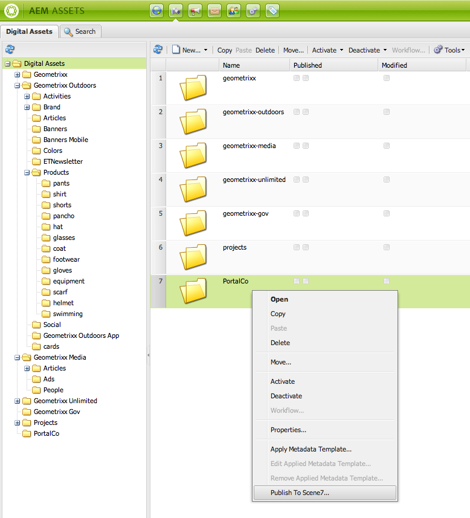

# Klassieke Dynamic Media-functies toevoegen aan uw pagina{#adding-scene-features-to-your-page}

[Adobe Dynamic Media Classic](https://help.adobe.com/en_US/scene7/using/WS26AB0D9A-F51C-464e-88C8-580A5A82F810.html) is een gehoste oplossing voor het beheren, verbeteren, publiceren en leveren van rijke mediabestanden aan webpagina&#39;s, mobiele apparaten, e-mailprogramma&#39;s en displays en drukapparaten met internetverbinding.

U kunt AEM-elementen die zijn gepubliceerd in Dynamic Media Classic, in verschillende viewers weergeven:

* In-/uitzoomen
* Flyout
* Video
* Afbeeldingssjabloon
* Afbeelding

U kunt digitale elementen rechtstreeks van AEM naar Dynamic Media Classic publiceren en u kunt digitale elementen van Dynamic Media Classic naar AEM publiceren.

In deze sectie wordt beschreven hoe u digitale elementen van AEM naar Dynamic Media Classic kunt publiceren en andersom. Viewers worden ook in detail beschreven. Voor informatie bij het vormen van AEM voor Dynamic Media Klassiek, zie het [Integreren van Dynamic Media Klassiek met AEM](/help/sites-administering/scene7.md).

Zie ook Afbeeldingskaarten [toevoegen](/help/assets/image-maps.md).

Raadpleeg de volgende secties voor meer informatie over het gebruik van videocomponenten met AEM:

* [Video](/help/sites-classic-ui-authoring/manage-assets-classic-s7-video.md)

>[!NOTE]
>
>Als de Klassieke elementen van Dynamic Media niet behoorlijk tonen, zorg ervoor dat de Dynamische media wordt [onbruikbaar gemaakt](/help/assets/config-dynamic.md#disabling-dynamic-media) en vernieuw dan de pagina.

## Handmatig publiceren naar Dynamic Media Classic vanaf elementen {#manually-publishing-to-scene-from-assets}

U kunt digitale elementen naar Dynamic Media Klassiek publiceren vanuit de middelenconsole in de klassieke gebruikersinterface of rechtstreeks vanuit het element.

>[!NOTE]
>
>AEM publiceert asynchroon naar Dynamic Media Classic. Nadat u hebt geklikt, kan het enkele seconden duren voordat uw element naar Dynamic Media Classic wordt gepubliceerd. **[!UICONTROL Publish]**

### Publiceren vanaf de middelenconsole {#publishing-from-the-assets-console}

Om aan Dynamic Media te publiceren Klassiek van de console van Activa als de activa in een Klassieke van Dynamic Media doelomslag zijn:

1. Klik in de klassieke interface van AEM op **[!UICONTROL Digital Assets]** om toegang te krijgen tot de manager van digitale elementen.

1. Selecteer het middel (of de activa) of de omslag van binnen de doelomslag u aan Dynamic Media Klassiek wilt publiceren, met de rechtermuisknop klikken en selecteren **[!UICONTROL Publish to Dynamic Media Classic]**. U kunt ook een keuze maken **[!UICONTROL Publish to Dynamic Media Classic]** in het menu **[!UICONTROL Tools] .

   

1. Ga naar Dynamic Media Classic en bevestig dat de elementen beschikbaar zijn.

   >[!NOTE]
   >
   >Als de elementen zich niet in een Classic gesynchroniseerde map met Dynamic Media bevinden, zijn **[!UICONTROL Publish to Dynamic Media Classic]** in beide menu&#39;s zichtbaar maar uitgeschakeld.

### Publiceren vanuit een element {#publishing-from-an-asset}

U kunt een middel manueel publiceren zolang dat middel binnen de gesynchroniseerde omslag van de Klassiek van Dynamic Media wordt gevestigd.

>[!NOTE]
>
>Als het element zich niet in de klassieke gesynchroniseerde map Dynamic Media bevindt, **[!UICONTROL Publish to Dynamic Media Classic]** is de koppeling naar dit element niet beschikbaar.

**Publiceren naar Dynamic Media Klassiek rechtstreeks vanuit een digitaal middel**:

1. Klik in AEM op **[!UICONTROL Digital Assets]** om toegang te krijgen tot het beheer van digitale elementen.

1. Dubbelklik om een element te openen.

1. Selecteer **[!UICONTROL Publish to Dynamic Media Classic]** in het deelvenster Elementdetails.

   

1. De koppeling verandert in **[!UICONTROL Publishing ...]** en dan **[!UICONTROL Published]**. Ga naar Dynamic Media Klassiek en bevestig dat het element beschikbaar is.

   >[!NOTE]
   >
   >Als het element niet correct naar Dynamic Media Classic wordt gepubliceerd, verandert de koppeling in **[!UICONTROL Publishing Failed]**. Als het element al is gepubliceerd naar Dynamic Media Classic, leest de koppeling **[!UICONTROL Re-Publish to Dynamic Media Classic]**. Met Herpubliceren kunt u wijzigingen aanbrengen in een element in AEM en deze opnieuw publiceren.

### Elementen publiceren van buiten de CQ-doelmap {#publishing-assets-from-outside-the-cq-target-folder}

Adobe raadt u aan elementen alleen vanuit elementen in de Classic-doelmap Dynamic Media naar Dynamic Media Classic te publiceren. Als u echter elementen moet uploaden vanuit een map buiten de doelmap, kunt u dat nog steeds doen door ze naar een *ad-hocmap* op Dynamic Media Classic te uploaden.

U doet dit door de configuratie van de Wolk voor de pagina te vormen waar de activa zullen verschijnen. Vervolgens voegt u een Klassieke Dynamic Media-component aan de pagina toe en sleept u een element naar de component. Nadat de pagina-eigenschappen voor die pagina zijn ingesteld, wordt een **[!UICONTROL Publish to Dynamic Media Classic]** koppeling weergegeven die bij selectie het uploaden naar Dynamic Media Classic activeert.

>[!NOTE]
>
>Elementen die zich in de ad-hocmap bevinden, worden niet weergegeven in de browser met klassieke inhoud van Dynamic Media.

**Elementen publiceren die zich buiten de CQ-doelmap** bevinden:

1. In AEM in klassieke UI, klik **[!UICONTROL Websites]** en navigeer aan de Web-pagina die u een digitaal middel aan wilt toevoegen dat nog niet aan Dynamic Media Klassiek wordt gepubliceerd. (Normale regels voor paginaovererving zijn van toepassing.)

1. Klik in de assistent op het **[!UICONTROL Page]** pictogram en klik vervolgens op **[!UICONTROL Page Properties]**.

1. Klik **[!UICONTROL Cloud Servicen > Voeg de diensten > Klassieke Dynamic Media (Scene7)** toe.
1. Selecteer in de vervolgkeuzelijst Adobe Dynamic Media Classic de gewenste configuratie en klik op **[!UICONTROL OK]**.

   

1. Voor de Web-pagina, voeg een Klassieke component van Dynamic Media (Scene7) aan de gewenste plaats op de pagina toe.
1. Sleep een digitaal element vanuit de zoeker naar de component. Je ziet een link naar **[!UICONTROL Check Dynamic Media Classic Publication Status]**.

   >[!NOTE]
   >
   >Als het digitale element zich in de CQ-doelmap bevindt, wordt er geen koppeling naar **[!UICONTROL Check Dynamic Media Classic Publication Status]** weergegeven. De elementen worden eenvoudig in de component geplaatst.

   

1. Klik op **[!UICONTROL Check Dynamic Media Classic Publication Status]**. Als het actief niet wordt gepubliceerd, publiceert AEM het actief naar Dynamic Media Classic. Nadat het element is geüpload, bevindt het zich in de ad-hocmap. Standaard bevindt de ad-hocmap zich in de `name_of_the_company/CQ5_adhoc`map. U kunt dit, indien nodig vormen.

   >[!NOTE]
   >
   >Als het element zich niet in een Classic gesynchroniseerde map met Dynamic Media bevindt en er geen Classic Dynamic Media-cloudconfiguratie is gekoppeld aan de huidige pagina, mislukt het uploaden.

## Dynamic Media Klassieke (Scene7) componenten {#scene-components}

De volgende Dynamic Media Klassieke componenten zijn beschikbaar in AEM:

* In-/uitzoomen
* Flyout (zoomen)
* Afbeeldingssjabloon
* Afbeelding
* Video

>[!NOTE]
>
>Deze componenten zijn niet standaard beschikbaar en moeten in de **[!UICONTROL Design]** modus worden geselecteerd voordat ze kunnen worden gebruikt.

Nadat ze in de **[!UICONTROL Design]** modus beschikbaar zijn gemaakt, kunt u de componenten net als alle andere AEM-componenten aan de pagina toevoegen. Elementen die nog niet zijn gepubliceerd naar Dynamic Media Klassiek worden gepubliceerd naar Dynamic Media Klassiek als deze zich in een gesynchroniseerde map of op een pagina bevinden of met een Classic-cloudconfiguratie van Dynamic Media.

### Flash viewers end-of-life notice {#flash-viewers-end-of-life-notice}

Vanaf 31 januari 2017 is de ondersteuning voor het Flash-viewerplatform door Adobe Dynamic Media Classic officieel beëindigd.

Zie Veelgestelde vragen over eindversies van de [Flash-viewer voor meer informatie over deze belangrijke wijziging](https://docs.adobe.com/content/docs/en/aem/6-1/administer/integration/marketing-cloud/scene7/flash-eol.html).

### Een klassieke Dynamic Media-component toevoegen aan een pagina {#adding-a-scene-component-to-a-page}

Het toevoegen van een Klassieke Dynamic Media-component aan een pagina is hetzelfde als het toevoegen van een component aan een pagina. Dynamic Media Klassieke componenten worden in de volgende secties uitgebreid beschreven.

**Een klassieke Dynamic Media-component/viewer toevoegen aan een pagina in de klassieke gebruikersinterface**:

1. Open in AEM de pagina waaraan u de klassieke Dynamic Media-component wilt toevoegen.

1. Als geen Dynamic Media Klassieke componenten beschikbaar zijn, klik de heerser in sidekick om wijze in te gaan, **[!UICONTROL Design]** parsys te klikken, en alle **[!UICONTROL Edit]** **[!UICONTROL Dynamic Media Classic]** componenten te selecteren om hen beschikbaar te maken.

1. Ga terug naar de **[!UICONTROL Edit]** modus door te klikken op het potlood in het zijpaneel.

1. Sleep een component van de **[!UICONTROL Dynamic Media Classic]** groep in het hulpstuk op de pagina in de gewenste plaats.

1. Klik **[!UICONTROL Edit]** om de component te openen.

1. Bewerk de component naar wens en klik **[!UICONTROL OK]** om de wijzigingen op te slaan.

### Interactieve weergaven toevoegen aan een responsieve website {#adding-interactive-viewing-experiences-to-a-responsive-website}

Het responsieve ontwerp voor uw middelen betekent dat uw middelen worden aangepast afhankelijk van waar ze worden weergegeven. Bij een responsief ontwerp worden dezelfde middelen op meerdere apparaten weergegeven.

**Een interactieve kijkervaring toevoegen aan een responsieve site in de klassieke gebruikersinterface**:

1. Meld u aan bij AEM en controleer of u Adobe Dynamic Media Classic Cloud Servicen [hebt](/help/sites-administering/scene7.md#configuring-scene-integration) geconfigureerd en of Dynamic Media Classic-componenten beschikbaar zijn.

   >[!NOTE]
   >
   >Als de Dynamic Media Klassieke componenten WCM niet beschikbaar zijn, ben zeker om hen door middel van wijze **[!UICONTROL Design] toe te laten.

1. In een website waarvoor de Klassieke componenten van Dynamic Media zijn ingeschakeld, sleept u een **[!UICONTROL Image]** viewer naar de pagina.
1. Bewerk de component en pas de onderbrekingspunten op het **[!UICONTROL Dynamic Media Classic Settings]** tabblad aan.

   

1. Controleer of de viewers het formaat responsief wijzigen en of alle interacties zijn geoptimaliseerd voor computers, tablets en mobiele apparaten.

### Instellingen die worden gebruikt voor alle Dynamic Media Klassieke componenten {#settings-common-to-all-scene-components}

Hoewel de configuratieopties variëren, zijn het volgende gemeenschappelijk voor alle Dynamic Media Klassieke componenten:

* **[!UICONTROL File Reference]** - Blader naar een bestand waarnaar u wilt verwijzen. De verwijzing van het dossier toont activa URL en niet noodzakelijk de volledige Dynamic Media Klassieke URL met inbegrip van de bevelen URL en de parameters. U kunt in dit veld geen klassieke URL-opdrachten en -parameters voor Dynamic Media toevoegen. Ze moeten worden toegevoegd via de bijbehorende functionaliteit in de component.
* **[!UICONTROL Width]** - Hiermee kunt u de breedte instellen.
* **[!UICONTROL Height]** - Hiermee kunt u de hoogte instellen.

U stelt deze configuratieopties in door te dubbelklikken op een klassieke Dynamic Media-component, bijvoorbeeld wanneer u een **[!UICONTROL Zoom]** component opent:

### In-/uitzoomen {#zoom}

De component HTML5 Zoom geeft een grotere afbeelding weer wanneer u op de knop + drukt.

Het element heeft onderaan zoomgereedschappen. Klik **[!UICONTROL +]** om te vergroten. Klik **[!UICONTROL -]** om te reduceren. Als u op de zoompijl opnieuw instellen **[!UICONTROL x]** of klikt, wordt de oorspronkelijke grootte van de afbeelding hersteld. Klik op de diagonale pijlen om deze op volledig scherm weer te geven. Klik **[!UICONTROL Edit]** om de component te vormen. Met deze component, kunt u [montages vormen gemeenschappelijk voor alle Dynamic Media Klassieke componenten](#settings-common-to-all-scene-components).

### Flyout {#flyout}

In de HTML5 Flyout-component wordt het element weergegeven als gesplitst scherm. het element in de opgegeven grootte laten staan; rechts wordt het zoomgedeelte weergegeven. Klik **[!UICONTROL Edit]** om de component te vormen. Met deze component, kunt u [montages vormen gemeenschappelijk voor alle Dynamic Media Klassieke componenten](/help/sites-administering/scene7.md#settingscommontoalldynamicmediaclassiccomponents).

>[!NOTE]
>
>Als uw Flyout-component een aangepaste grootte gebruikt, wordt die aangepaste grootte gebruikt en wordt de responsieve instelling van de component uitgeschakeld.
>
>Als de component Flyout de standaardgrootte gebruikt, zoals die in de [!UICONTROL Design] mening wordt geplaatst, dan wordt de standaardgrootte gebruikt en de componentenrek om de grootte van de paginalay-out met ontvankelijke opstelling van de toegelaten component aan te passen. Houd er echter rekening mee dat er een beperking geldt voor de responsieve instelling van de component. Wanneer u de component Flyout met ontvankelijke opstelling gebruikt, zou u het niet met volledige paginalrek moeten gebruiken. Anders kan de Flyout de rechterrand van de pagina overschrijden.

### Image {#image}

Met de component Dynamic Media Klassieke afbeelding kunt u Klassieke Dynamic Media-functionaliteit toevoegen aan uw afbeeldingen, zoals Dynamic Media Klassieke modifiers, voorinstellingen voor afbeeldingen of viewers en verscherpen. De Klassieke afbeeldingscomponent Dynamic Media is vergelijkbaar met andere afbeeldingscomponenten in AEM met speciale Klassieke functionaliteit voor Dynamic Media. In dit voorbeeld is de optie Klassieke URL van Dynamic Media op de afbeelding `&op_invert=1` toegepast.

**[!UICONTROL Title, Alt Text]** - Voeg op het [!UICONTROL Advanced] tabblad een titel toe aan de afbeelding en alternatieve tekst voor gebruikers met afbeeldingen uitgeschakeld.

**[!UICONTROL URL, Open in]** - U kunt een element instellen van om een koppeling te openen. Stel de opties in **[!UICONTROL URL]** en geef **[!UICONTROL Open in]** aan of u deze wilt openen in hetzelfde venster of in een nieuw venster.

**[!UICONTROL Viewer preset]** - Selecteer een bestaande viewervoorinstelling in het keuzemenu. Als de viewervoorinstelling die u zoekt niet zichtbaar is, moet u deze mogelijk zichtbaar maken. Zie Voorinstellingen [van viewers](/help/assets/managing-viewer-presets.md)beheren. U kunt geen viewervoorinstelling selecteren als u een voorinstelling voor afbeeldingen gebruikt en andersom.

**[!UICONTROL Dynamic Media Classic Configuration]** - Selecteer de Klassieke configuratie van Dynamic Media u wilt gebruiken om actieve beeldvoorinstellingen van het het Publiceren Scene7 Systeem te halen.

**[!UICONTROL Image preset]** - Selecteer een bestaande voorinstelling voor de afbeelding in het keuzemenu. Als de voorinstelling die u zoekt niet zichtbaar is, moet u deze mogelijk zichtbaar maken. Zie [Voorinstellingen](/help/assets/managing-image-presets.md)voor afbeeldingen beheren. U kunt geen viewervoorinstelling selecteren als u een voorinstelling voor afbeeldingen gebruikt en andersom.

**[!UICONTROL Output Format]** - Selecteer de uitvoerindeling van de afbeelding, bijvoorbeeld JPEG. Afhankelijk van de uitvoerindeling die u selecteert, hebt u mogelijk aanvullende configuratieopties. Zie [Voorinstellingen](/help/assets/managing-image-presets.md)voor afbeeldingen beheren.

**[!UICONTROL Sharpening]** - Selecteer hoe u de afbeelding wilt verscherpen. Uitleg over het verscherpen vindt u in detail in [*Adobe Dynamic Media Classic Image Quality en Best practices *](/help/assets/assets/s7_sharpening_images.pdf)voor het verscherpen.

**[!UICONTROL URL Modifiers]** - U kunt afbeeldingseffecten wijzigen door extra opdrachten voor klassieke Dynamic Media op te geven. Deze worden beschreven in Voorinstellingen [van het Beeld](/help/assets/managing-image-presets.md) beheren en de verwijzing [van het](https://docs.adobe.com/content/help/en/dynamic-media-developer-resources/image-serving-api/image-serving-api/http-protocol-reference/command-reference/c-command-reference.html)Bevel.

**[!UICONTROL Breakpoints]** - Als uw website reageert, wilt u de onderbrekingspunten aanpassen. Onderbrekingspunten moeten door komma&#39;s van elkaar worden gescheiden `,`.

### Afbeeldingssjabloon {#image-template}

[Klassieke Dynamic Media-afbeeldingssjablonen](https://help.adobe.com/en_US/scene7/using/WS60B68844-9054-4099-BF69-3DC998A04D3C.html) zijn gelaagde Photoshop-inhoud die is geïmporteerd naar Dynamic Media Classic, waar de parameters voor inhoud en eigenschappen werden bepaald op basis van variabiliteit. Met de **[!UICONTROL Image template]** component kunt u afbeeldingen importeren en de tekst dynamisch wijzigen in AEM. Bovendien kunt u de **[!UICONTROL Image template]** component vormen om waarden van cliëntcontext te gebruiken, zodat elke gebruiker het beeld op een gepersonaliseerde manier ervaart.

Klik **[!UICONTROL Edit]** om de component te vormen. U kunt [montages vormen gemeenschappelijk voor alle Dynamic Media Klassieke componenten](/help/sites-administering/scene7.md#settingscommontoalldynamicmediaclassicscomponents) evenals andere montages die in deze sectie worden beschreven.

**[!UICONTROL File Reference, Width, Height]** - Zie instellingen die gelden voor alle Dynamic Media Klassieke componenten.

>[!NOTE]
>
>Dynamic Media Klassieke URL-opdrachten en -parameters kunnen niet rechtstreeks aan de URL van de bestandsverwijzing worden toegevoegd. Ze kunnen alleen worden gedefinieerd in de gebruikersinterface van de component in het **[!UICONTROL Parameter]** deelvenster.

**[!UICONTROL Title, Alt Text]** Voeg op het [!UICONTROL Dynamic Media Classic Image Template] tabblad een titel toe aan de afbeelding en alternatieve tekst voor gebruikers die afbeeldingen hebben uitgeschakeld.

**[!UICONTROL URL, Open in]** U kunt een middel van plaatsen om een verbinding te openen. Stel de opties in **[!UICONTROL URL]** en geef aan **[!UICONTROL Open in]** of u deze wilt openen in hetzelfde venster of in een nieuw venster.

**[!UICONTROL Parameter Panel]** Wanneer u een afbeelding importeert, worden de parameters vooraf gevuld met informatie uit de afbeelding. Als er geen inhoud is die dynamisch kan worden gewijzigd, is dit venster leeg.

#### Tekst dynamisch wijzigen {#changing-text-dynamically}

Als u de tekst dynamisch wilt wijzigen, voert u nieuwe tekst in de velden in en klikt u op **[!UICONTROL OK]**. In dit voorbeeld **[!UICONTROL Price]** is de verzendkosten nu $50 en de verzendkosten 99 cent.

De tekst in de afbeelding verandert. U kunt de oorspronkelijke waarde van de tekst herstellen door op **[!UICONTROL Reset]** naast het veld te klikken.

#### Tekst wijzigen om de waarde van de context van een client weer te geven {#changing-text-to-reflect-the-value-of-a-client-context-value}

Als u een veld wilt koppelen aan de waarde van de clientcontext, klikt u **[!UICONTROL Select]** om het contextmenu van de client te openen, selecteert u de context van de client en klikt u op **[!UICONTROL OK]**. In dit voorbeeld verandert de naam op basis van de koppeling van de naam met de opgemaakte naam in het profiel.

De tekst geeft de naam weer van de gebruiker die momenteel is aangemeld. U kunt de oorspronkelijke waarde van de tekst herstellen door op **[!UICONTROL Reset]** naast het veld te klikken.

#### Een koppeling maken van de klassieke afbeeldingssjabloon Dynamic Media {#making-the-scene-image-template-a-link}

**Een koppeling** maken van de klassieke afbeeldingssjabloon Dynamic Media:

1. Klik op de pagina met de Dynamic Media Klassieke afbeeldingssjablooncomponent **[!UICONTROL Edit]**.
1. Voer in het **[!UICONTROL URL]** veld de URL in waarnaar gebruikers gaan wanneer op de afbeelding wordt geklikt. Selecteer in het **[!UICONTROL Open in]** veld of u het doel wilt openen (een nieuw venster of hetzelfde venster).

   

1. Klik op **[!UICONTROL OK]**.

### Video-component {#video-component}

De Klassieke **[!UICONTROL Video]** component van Dynamic Media (beschikbaar bij de Klassieke sectie van Dynamic Media van sidekick) gebruikt apparaat en bandbreedteopsporing om de juiste video aan elk scherm te dienen. Deze component is een HTML5-videospeler; het is één viewer die via meerdere kanalen kan worden gebruikt.

Deze kan worden gebruikt voor adaptieve videosets, één MP4-video of één F4V-video.

Zie [Video](/help/sites-classic-ui-authoring/manage-assets-classic-s7-video.md) voor meer informatie over hoe video&#39;s werken met Dynamic Media Classic integratie. Bovendien zie hoe [de Klassieke video **component van** Dynamic Media met de **component** van de stichtingsvideo](/help/sites-classic-ui-authoring/manage-assets-classic-s7-video.md)vergelijkt.

### Bekende beperkingen voor de video-component {#known-limitations-for-the-video-component}

Adobe DAM en WCM tonen of een hoofdvideo wordt geüpload. Deze proxy-elementen worden niet weergegeven:

* Dynamic Media Classic gecodeerde uitvoeringen
* Dynamic Media Klassieke adaptieve videosets

Wanneer u een adaptieve videoset gebruikt met de Dynamic Media Klassieke videocomponent, moet u de grootte van de component aanpassen aan de afmetingen van de video.

## Dynamic Media Klassieke inhoudbrowser {#scene-content-browser}

Met de browser Dynamic Media Classic-inhoud kunt u inhoud van Dynamic Media Classic rechtstreeks in AEM weergeven. Als u de inhoudbrowser wilt openen, selecteert u in de zoekfunctie voor inhoud de optie **[!UICONTROL Dynamic Media Classic]** in de gebruikersinterface met geoptimaliseerde aanrakingen of het **[!UICONTROL S7]** pictogram in de klassieke gebruikersinterface. De functionaliteit is identiek tussen beide gebruikersinterfaces.

Als u veelvoudige configuraties hebt, toont AEM door gebrek de [standaardconfiguratie](/help/sites-administering/scene7.md#configuring-a-default-configuration). U kunt verschillende configuraties direct selecteren in de Klassieke de inhoudbrowser van Dynamic Media in het drop-down menu.

>[!NOTE]
>
>* Elementen in de ad-hocmap worden niet weergegeven in de browser met klassieke inhoud van Dynamic Media.
>* Wanneer [Beveiligde voorvertoning is ingeschakeld](/help/sites-administering/scene7.md#configuring-the-state-published-unpublished-of-assets-pushed-to-scene), worden zowel gepubliceerde als niet-gepubliceerde elementen op Dynamic Media Classic wel weergegeven in de browser met klassieke inhoud van Dynamic Media.
>* Als u **[!UICONTROL Dynamic Media Classic]** of het **[!UICONTROL S7]** pictogram niet als optie in inhoudbrowser ziet, moet u Dynamic Media Klassiek [vormen om met AEM](/help/sites-administering/scene7.md)te werken.
   >
   >
* Voor video ondersteunt de browser Dynamic Media Classic content:
   >
   >
* Adaptieve videosets: container met alle video-uitvoeringen die nodig zijn voor naadloze weergave op meerdere schermen
>* Eén MP4-video
>* Single F4V-video

### Door inhoud bladeren in de klassieke gebruikersinterface {#browsing-content-in-the-classic-ui}

Blader door inhoud in Klassieke Dynamic Media door op het **[!UICONTROL S7]** tabblad te klikken.

U kunt de configuratie veranderen u toegang hebt door de configuratie te selecteren. De mappen veranderen, afhankelijk van de configuratie die u selecteert.

Net als bij de zoekfunctie voor inhoud naar Middelen kunt u zoeken naar elementen en resultaten filteren. In tegenstelling tot de zoeker Elementen, begint de bestandsnaam bij het invoeren van een trefwoord op het **[!UICONTROL S7]** tabblad met *de tekenreeks die u hebt ingevoerd, in plaats van* het trefwoord in de bestandsnaam te bevatten ** .

Elementen worden standaard weergegeven op bestandsnaam. U kunt resultaten ook filteren op type element.

>[!NOTE]
>
>Voor video, steunt de Klassieke de inhoudbrowser van Dynamic Media van WCM:
>
>* Adaptieve videosets: container met alle video-uitvoeringen die nodig zijn voor naadloze weergave op meerdere schermen
>* Eén MP4-video
>* Single F4V-video
>

### Zoeken naar Dynamic Media Klassieke elementen met de inhoudbrowser {#searching-for-scene-assets-with-the-content-browser}

Het zoeken naar Dynamic Media Klassieke activa is gelijkaardig aan het zoeken van activa AEM behalve dat wanneer u zoekt u eigenlijk een verre mening van de activa in het Klassieke systeem van Dynamic Media ziet, eerder dan hen direct in AEM in te voeren.

U kunt zowel de klassieke interface als de interface met geoptimaliseerde aanrakingen gebruiken om elementen weer te geven en te zoeken. Afhankelijk van de interface, is hoe u zoekt lichtjes verschillend.

Wanneer u in een van beide UI zoekt, kunt u filteren op de volgende criteria (die hier in de voor aanraking geoptimaliseerde UI worden getoond):

**[!UICONTROL Enter keywords]** - U kunt elementen zoeken op naam. Wanneer u de trefwoorden zoekt die u invoert, begint de bestandsnaam met. Als u bijvoorbeeld het woord &quot;zwemmen&quot; typt, wordt gezocht naar namen van elementbestanden die met die letters in die volgorde beginnen. Vergeet niet op Enter te klikken nadat u de term hebt getypt om het element te zoeken.

**[!UICONTROL Folder/path]** - De naam van de map die wordt weergegeven, is gebaseerd op de configuratie die u hebt geselecteerd. U kunt tot lagere niveaus boor door het omslagpictogram te klikken en een subomslag te selecteren, dan het controleteken te klikken om het te selecteren.

Als u een trefwoord invoert en een map selecteert, doorzoekt AEM die map en eventuele submappen. Als u echter bij het zoeken geen trefwoorden invoert, worden bij het selecteren van de map alleen de elementen in die map weergegeven en worden er geen submappen opgenomen.

Standaard zoekt AEM naar de geselecteerde map en naar alle submappen.

**[!UICONTROL Type of Asset]** Selecteer Dynamic Media Klassiek om door Dynamic Media Klassieke inhoud te bladeren. Deze optie is alleen beschikbaar als u Dynamic Media Classic al hebt geconfigureerd.

**[!UICONTROL Configuration]** Als u meer dan één Dynamic Media Klassieke configuratie in wordt bepaald [!UICONTROL Cloud Services], kunt u het hier selecteren. Hierdoor wordt de map gewijzigd op basis van de gekozen configuratie.

**[!UICONTROL Asset type]** In de Klassieke browser van Dynamic Media, kunt u resultaten filtreren om het even welke volgend op te nemen: afbeeldingen, sjablonen, video&#39;s en adaptieve videosets. Als u geen elementtype selecteert, worden standaard alle elementtypen doorzocht.

>[!NOTE]
>
>* Bij het zoeken naar video zoekt u op één vertoning. Resultaten retourneren de oorspronkelijke uitvoering (alleen &amp;ast; .mp4) en de gecodeerde uitvoering.
>* Wanneer u in een adaptieve videoset zoekt, zoekt u in de map en in alle submappen, maar alleen als u een trefwoord aan de zoekopdracht hebt toegevoegd. Als u geen trefwoord hebt toegevoegd, doorzoekt AEM de submappen niet.
>

**[!UICONTROL Publish Status]** U kunt filteren op elementen die zijn gebaseerd op de publicatiestatus: [!UICONTROL Published] of [!UICONTROL Unpublished]. Als u niets selecteert [!UICONTROL Publish status], zoekt AEM standaard alle publicatiestatussen.

