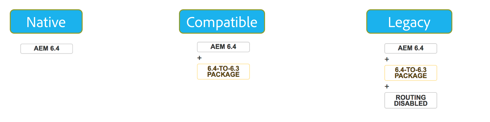

# Achterwaartse Verenigbaarheid in AEM 6.4{#backward-compatibility-in-aem}

## Overzicht {#overview}

>[!NOTE]
>
>Voor een lijst van inhoud en configuratieveranderingen die niet onder het werkingsgebied van het Pakket van de Verenigbaarheid vallen, zie [Herstructurering van de Bewaarplaats in AEM 6.4](/help/sites-deploying/repository-restructuring.md).

In AEM 6.4 zijn alle functies ontwikkeld met achterwaartse compatibiliteit voor ogen.

In de meeste gevallen, zouden de klanten die AEM 6.3 in werking stellen niet de code of aanpassingen moeten veranderen wanneer het doen van de verbetering. Voor AEM 6.1 en 6.2 klanten zijn er geen extra breekveranderingen dan tijdens een verbetering aan 6.3 zouden worden geconfronteerd.

Voor uitzonderingen waar de eigenschappen niet achteruit compatibel konden worden gehouden, kan de achterwaartse verenigbaarheid voor bundels en inhoud worden bereikt door een Pakket van de Verenigbaarheid voor 6.3 te installeren (zie hieronder hoe te opstelling voor details over waar te om te downloaden). Met dit compatibiliteitspakket wordt de compatibiliteit hersteld voor toepassingen die voldoen aan AEM 6.3.

Met het compatibiliteitspakket kunt u AEM uitvoeren in de compatibiliteitsmodus en de aangepaste ontwikkeling uitstellen tegen nieuwe AEM:

>[!NOTE]
>
>Houd er rekening mee dat het compatibiliteitspakket slechts een tijdelijke oplossing is om de ontwikkeling uit te stellen die nodig is om AEM 6.4-compatibel te zijn. De oplossing wordt alleen aanbevolen als laatste optie als u compatibiliteitsproblemen niet direct na de upgrade kunt oplossen via ontwikkeling. Het wordt ten zeerste aanbevolen over te schakelen op de native modus en het compatibiliteitspakket te verwijderen wanneer u besluit verder te gaan met aangepaste ontwikkeling op basis van 6.4 en gebruik te maken van de volledige 6.4-functionaliteit.

Het compatibiliteitspakket heeft twee modi: **Verpletterend Toegelaten** en **Verpletterend Gehandicapten**.

Hierdoor kan AEM 6.4 in drie modi worden uitgevoerd:

**Modus Native:**

De modus Native is bedoeld voor klanten die alle nieuwe functies van AEM 6.4 willen gebruiken en die klaar zijn om enige ontwikkeling uit te voeren om hun aanpassingen met alle nieuwe functies te laten werken.

Dit betekent dat u mogelijk aanpassingen in uw toepassing moet aanbrengen direct na de upgrade.

**Compatibiliteitsmodus: Het Pakket van de verenigbaarheid dat met Toegelaten Verpletteren wordt geïnstalleerd**

De Wijze van de verenigbaarheid is voor klanten die aanpassingen van interfaces hebben die niet achterwaarts compatibel zijn. Dit staat AEM toe om op verenigbaarheidswijze te lopen en douaneontwikkeling uit te stellen die tegen nieuwe AEMEigenschappen wordt vereist die niet met sommige van uw douanecode compatibel zijn.

**Oudere modus: Compatiblity Package Geïnstalleerd met het Verpletteren van Gehandicapten**

De verouderde wijze is voor klanten die douaneinterfaces hebben die op erfenis of verouderde code van AEM worden gebaseerd die uit in het verenigingspakket is bewogen.

## Instellen {#how-to-set-up}

Het AEM 6.3 compatibiliteitspakket kan als een pakket worden geïnstalleerd met de Package Manager. U kunt het [AEM 6.3 compatibiliteitspakket downloaden van de plaats van de Distributie van de Software](https://experience.adobe.com/#/downloads/content/software-distribution/en/aem.html?package=/content/software-distribution/en/details.html/content/dam/aem/public/adobe/packages/cq640/compatpack/aem-compat-cq64-to-cq63).

Zodra het Pakket van de Verenigbaarheid wordt geïnstalleerd, kan het verpletteren worden toegelaten of worden onbruikbaar gemaakt gebruikend een schakelaar in de configuratie OSGI zoals hieronder getoond:

Nadat het compatibiliteitspakket is geïnstalleerd en ingesteld, worden de functies gebruikt op basis van de gekozen compatibiliteitsmodus.
