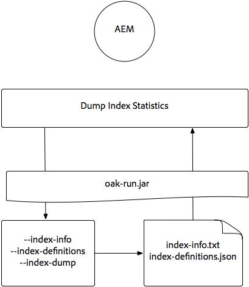
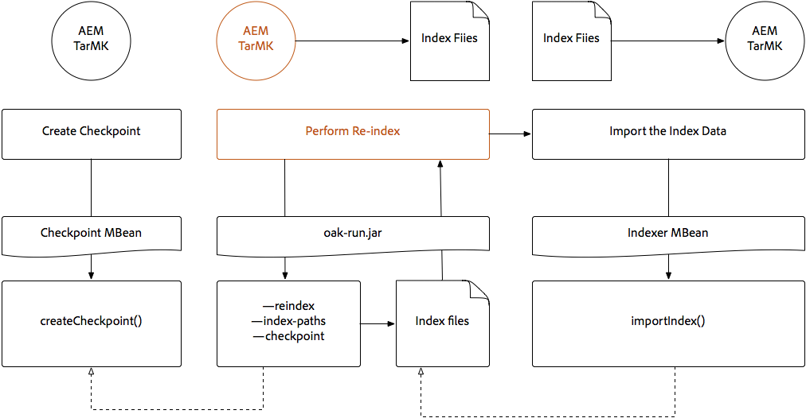

# Indexering via de eiken-run-jar{#indexing-via-the-oak-run-jar}

De eiken-looppas steunt alle indexerende gebruiksgevallen op de bevellijn zonder het moeten van JMX niveau werken. De voordelen van de &quot;eak-run&quot;-aanpak zijn:

1. Het is een nieuwe indexerende toolset voor AEM 6.4
1. Het vermindert tijd-aan-herdex die nuttige gevolgen re-indextijden op grotere bewaarplaatsen heeft
1. Het vermindert hulpmiddelverbruik tijdens het re-indexeren in AEM die in betere systeemprestaties voor andere AEM activiteiten resulteert
1. Oak-run biedt out-of-band ondersteuning: Als de productieomstandigheden het niet toestaan om op productieinstanties opnieuw te indexeren, kan een gekloonde milieu voor re-indexering worden gebruikt om kritieke prestatieseffect te vermijden.

Hieronder vindt u een lijst met gebruiksgevallen die kunnen worden gebruikt bij het uitvoeren van indexeringsbewerkingen via het gereedschap `oak-run`.

## Consistentiecontroles index {#indexconsistencychecks}

>[!NOTE]
>
>Voor meer gedetailleerde informatie betreffende dit scenario, zie [Geval 1 van het Gebruik - de Controle van de Consistentie van de Index](/help/sites-deploying/oak-run-indexing-usecases.md#usercase1indexconsistencycheck).

* `oak-run.jar`bepaalt snel of de indexen van de luik beschadigd zijn.
* Het is veilig om op een in gebruik AEM instantie voor consistentie te lopen controleniveaus 1 en 2.

## Indexstatistieken {#indexstatistics}

>[!NOTE]
>
>Voor meer gedetailleerde informatie betreffende dit scenario, zie [Geval 2 van het Gebruik - de Statistieken van de Index](/help/sites-deploying/oak-run-indexing-usecases.md#usecase2indexstatistics)

* `oak-run.jar` Hiermee plaatst u alle indexdefinities, belangrijke indexstatussen en indexinhoud voor offline analyse.

* Veilig om uit te voeren op een AEM.

## Beslissingsstructuur voor opnieuw indexeren nadering {#reindexingapproachdecisiontree}

Dit diagram is een beslissingsboom voor wanneer om de diverse re-indexerende benaderingen te gebruiken.

## MongoMK/RDMBMK opnieuw indexeren {#reindexingmongomk}

>[!NOTE]
>
>Voor meer gedetailleerde informatie betreffende dit scenario, zie [Geval 3 van het Gebruik - het opnieuw indexeren](/help/sites-deploying/oak-run-indexing-usecases.md#usecase3reindexing).

### Voorvertoning van tekst voor SegmentNodeStore en DocumentNodeStore {#textpre-extraction}

[De preextractie](/help/sites-deploying/best-practices-for-queries-and-indexing.md#how-to-perform-text-pre-extraction)  van de tekst (een eigenschap die met AEM 6.3) heeft bestaan kan worden gebruikt om de tijd aan re-index te verminderen. De preextractie van de tekst kan samen met alle re-indexerende benaderingen worden gebruikt.

Afhankelijk van de `oak-run.jar` indexerende benadering zullen er diverse stappen aan beide kanten van de Voer re-indexeringsstap in het hieronder diagram zijn.

>[!NOTE]
>
>Oranje duidt activiteiten aan waarbij AEM zich in een onderhoudsvenster moeten bevinden.

### Online opnieuw indexeren voor MongoMK of RDBMK met behulp van eak-run.jar {#onlinere-indexingformongomk}

>[!NOTE]
>
>Voor meer gedetailleerde informatie betreffende dit scenario, zie [Reindex - DocumentNodeStore](/help/sites-deploying/oak-run-indexing-usecases.md#reindexdocumentnodestore).

Dit is de aanbevolen methode voor het opnieuw indexeren van MongoMK (en RDBMK) AEM installaties. Er mag geen andere methode worden gebruikt.

Dit proces moet slechts tegen één enkele AEM instantie in de cluster worden uitgevoerd.

## TarMK opnieuw indexeren {#re-indexingtarmk}

>[!NOTE]
>
>Voor meer gedetailleerde informatie betreffende dit scenario, zie [Reindex - SegmentNodeStore](/help/sites-deploying/oak-run-indexing-usecases.md#reindexsegmentnodestore).

* **Koude stand-byoverwegingen (TarMK)**

   * Er wordt geen speciale aandacht besteed aan koude stand-by; De Cold Standby-instanties synchroniseren de wijzigingen op de gebruikelijke manier.

* **AEM-publicatiekoppelingen (publicatiekoppelingen voor AE moeten altijd TarMK zijn)**

   * Voor publicatielandbouwbedrijf moet het voor alle OF de stappen op één enkele uitvoeren publiceren en dan de opstelling voor anderen klonen (het nemen van alle gebruikelijke precaties wanneer het klonen AEM instanties; sling.id - moet hier iets aan koppelen)

### Online opnieuw indexeren voor TarMK {#onlinere-indexingfortarmk}

>[!NOTE]
>
>Voor meer gedetailleerde informatie betreffende dit scenario, zie [Online Reindex - SegmentNodeStore](/help/sites-deploying/oak-run-indexing-usecases.md#onlinereindexsegmentnodestore).

Dit is de methode die vóór de introductie van de nieuwe indexeringsmogelijkheden van eak-run.jar wordt gebruikt. Dit kan worden gedaan door de eigenschap `reindex=true` op de index van de eik in te stellen.

Deze benadering kan worden gebruikt als de tijd en prestatiesgevolgen aan index voor de klant aanvaardbaar zijn. Dit is vaak het geval bij kleine tot middelgrote AEM.

### Online TarMK opnieuw indexeren met behulp van eak-run.jar {#onlinere-indexingtarmkusingoak-run-jar}

>[!NOTE]
>
>Voor meer gedetailleerde informatie betreffende dit scenario, zie [Online Reindex - SegmentNodeStore - de AEM Instantie loopt](/help/sites-deploying/oak-run-indexing-usecases.md#onlinereindexsegmentnodestoretheaeminstanceisrunning).

Het online opnieuw indexeren van TarMK gebruikend oak-run.jar is sneller dan [Online het Opnieuw indexeren voor TarMK](#onlinere-indexingfortarmk) hierboven beschreven. Het vereist echter ook uitvoering tijdens een onderhoudsvenster; met de vermelding dat het venster korter zal zijn, en meer stappen worden vereist om het re-indexeren uit te voeren.

>[!NOTE]
>
>Oranje duidt op transacties waarbij AEM moeten worden uitgevoerd in een reserveperiode.

### Offline opnieuw indexeren TarMK met gebruik van eikenrun.jar {#offlinere-indexingtarmkusingoak-run-jar}

>[!NOTE]
>
>Voor meer gedetailleerde informatie betreffende dit scenario, zie [Online Reindex - SegmentNodeStore - de AEM Instantie is Zwijg](/help/sites-deploying/oak-run-indexing-usecases.md#onlinereindexsegmentnodestoreaeminstanceisdown).

Offline opnieuw indexeren van TarMK is de eenvoudigste `oak-run.jar` gebaseerde re-indexerende benadering voor TarMK aangezien het één enkele `oak-run.jar` commentaar vereist. De AEM instantie moet echter worden afgesloten.

>[!NOTE]
>
>Rood geeft bewerkingen aan waarbij AEM moet worden afgesloten.

### Out-of-band re-Indexing TarMK gebruikend oak-run.jar  {#out-of-bandre-indexingtarmkusingoak-run-jar}

>[!NOTE]
>
>Voor meer gedetailleerde informatie betreffende dit scenario, zie [Uit Band opnieuw indexeren - SegmentNodeStore](/help/sites-deploying/oak-run-indexing-usecases.md#outofbandreindexsegmentnodestore).

Het opnieuw indexeren van out-of-band minimaliseert het effect van het opnieuw indexeren op de instanties van de in-gebruiks AEM.

>[!NOTE]
>
>Rood geeft bewerkingen aan waarbij AEM kan worden afgesloten.

## Indexdefinities bijwerken {#updatingindexingdefinitions}

>[!NOTE]
>
>Voor meer gedetailleerde informatie over dit scenario, zie [Geval 4 gebruiken - het Bijwerken van de Definities van de Index](/help/sites-deploying/oak-run-indexing-usecases.md#usecase4updatingindexdefinitions).

### Indexdefinities maken en bijwerken op TarMK met ACS Zorg voor index {#creatingandupdatingindexdefinitionsontarmkusingacsensureindex}

>[!NOTE]
>
>ACS verzekert Index een communautair gesteund project is, en niet door de Steun van Adobe wordt gesteund.

Zo kan de definitie van de verzendindex worden gedefinieerd via een inhoudspakket, wat later resulteert in een nieuwe indexering door de herindexmarkering in te stellen op `true`. Dit werkt voor kleinere instellingen waarbij het opnieuw indexeren niet lang duurt.

Voor meer informatie, zie [ACS verzeker de documentatie van de Index](https://adobe-consulting-services.github.io/acs-aem-commons/features/ensure-oak-index/index.html) voor details.

### Indexdefinities maken en bijwerken op TarMK met behulp van eak-run.jar {#creatingandupdatingindexdefinitionsontarmkusingoak-run-jar}

Als het tijd- of prestatieeffect van het opnieuw indexeren met niet `oak-run.jar` methodes te hoog is, kan de volgende `oak-run.jar` gebaseerde benadering worden gebruikt om de definities van de Index van Lucene in een TarMK gebaseerde AEM installatie in te voeren en opnieuw te indexeren.

### Indexdefinities maken en bijwerken op MonogMK met behulp van eak-run.jar {#creatingandupdatingindexdefinitionsonmonogmkusingoak-run-jar}

Als het tijd- of prestatieeffect van het opnieuw indexeren met niet `oak-run.jar` methodes te hoog is, kan de volgende `oak-run.jar` gebaseerde benadering worden gebruikt om de definities van de Index van Lucene in MongoMK gebaseerde AEM installaties in te voeren en opnieuw te indexeren.

