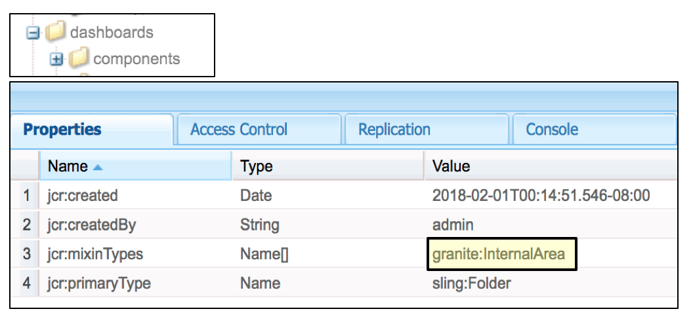

# Duurzame verbeteringen{#sustainable-upgrades}

## Customization Framework {#customization-framework}

### Architectuur (functioneel / infrastructuur / inhoud / toepassing)  {#architecture-functional-infrastructure-content-application}

De functie van het Kader van de Aanpassing wordt ontworpen om de schendingen in niet verlengbare gebieden van de code (zoals APIS) of inhoud (zoals overlays) te helpen verminderen die niet verbeteringsvriendelijk zijn.

Er zijn twee componenten van het aanpassingskader: het **API-oppervlak** en de **inhoudsclassificatie**.

#### API-oppervlak {#api-surface}

In eerdere versies van AEM vele API&#39;s werden deze via Uber Jar weergegeven. Sommige van deze API&#39;s waren niet bedoeld voor gebruik door klanten, maar werden blootgesteld aan ondersteuning voor AEM functionaliteit in verschillende bundels. In de toekomst worden de Java API&#39;s gemarkeerd als Public of Private om aan klanten aan te geven welke API&#39;s veilig kunnen worden gebruikt in de context van upgrades. Andere bijzonderheden zijn:

* Java API&#39;s die zijn gemarkeerd als `Public` kunnen worden gebruikt en waarnaar wordt verwezen door aangepaste implementatiebundels.

* De openbare API&#39;s zijn achterwaarts compatibel met de installatie van een compatibiliteitspakket.
* Het compatibiliteitspakket bevat een compatibiliteitspakket van Uber JAR om achterwaartse compatibiliteit te garanderen
* Java API&#39;s die zijn gemarkeerd als `Private` zijn alleen bedoeld voor gebruik door AEM interne bundels en mogen niet worden gebruikt door aangepaste bundels.

>[!NOTE]
>
>Het concept `Private` en `Public` in deze context mag niet worden verward met Java-noties van publieke en private klassen.

#### Inhoudsclassificaties {#content-classifications}

AEM gebruikt al lang de principal of overlays en Sling Resource Merger om klanten toe te staan AEM functionaliteit uit te breiden en aan te passen. De vooraf bepaalde functionaliteit die de AEM consoles en UI drijft wordt opgeslagen in **/libs**. Klanten mogen niets wijzigen onder **/libs** , maar kunnen aanvullende inhoud onder **/apps** toevoegen om de in **/libs** gedefinieerde functionaliteit te bedekken en uit te breiden (zie Ontwikkelen met overlays voor meer informatie). Dit veroorzaakte nog steeds talrijke problemen bij het upgraden van AEM, aangezien de inhoud in **/libs** kan veranderen, waardoor de overlayfunctie op onverwachte manieren kan worden onderbroken. Klanten kunnen AEM componenten ook uitbreiden via overerving via `sling:resourceSuperType`, of gewoon rechtstreeks via sling:resourceType verwijzen naar een component in **/libs** . Vergelijkbare upgradeproblemen kunnen optreden met verwijzing en gebruikstoepassingen negeren.

Om het voor klanten veiliger en gemakkelijker te maken om te begrijpen welke gebieden van **/libs** veilig kunnen worden gebruikt en om de inhoud in **/libs** te bedekken, is de inhoud ingedeeld met de volgende mengsels:

* **Public (granite:PublicArea)** - Hiermee wordt een knooppunt gedefinieerd als public zodat het kan worden bedekt, overgeërfd ( `sling:resourceSuperType`) of rechtstreeks ( `sling:resourceType`) gebruikt. De knopen onder /libs duidelijk als Openbaar zullen veilig zijn om met de toevoeging van een Pakket van de Verenigbaarheid te bevorderen. In het algemeen moeten klanten alleen knooppunten gebruiken die zijn gemarkeerd als Public.

* **Abstract (granite:AbstractArea)** - Definieert een knooppunt als abstract. Knooppunten kunnen worden bedekt of overgeërfd ( `sling:resourceSupertype`) maar mogen niet rechtstreeks worden gebruikt ( `sling:resourceType`).

* **Final (granite:FinalArea)** - Definieert een knooppunt als definitief. Als definitief geclassificeerde knooppunten kunnen niet worden bedekt of overgeërfd. Uiteindelijke knooppunten kunnen rechtstreeks via `sling:resourceType`de verbinding worden gebruikt. Subknooppunten onder eindknooppunt worden standaard als intern beschouwd

* **Internal (granite:InternalArea)** - Definieert een knooppunt als internal. Als internal geclassificeerde knooppunten kunnen niet worden bedekt, overgeërfd of rechtstreeks worden gebruikt. Deze knooppunten zijn alleen bedoeld voor de interne functionaliteit van AEM

* **Geen annotatie** - knooppunten nemen de classificatie over op basis van de boomhiërarchie. De /-hoofdmap is standaard Openbaar. **Knooppunten met een als intern of definitief ingedeelde ouder moeten ook als intern worden behandeld.**

>[!NOTE]
>
>Dit beleid wordt slechts afgedwongen tegen het Verdelen van onderzoekspad gebaseerde mechanismen. Andere gebieden van **/bibliotheken** zoals een cliënt-zijbibliotheek kunnen als worden gemerkt `Internal`, maar nog kunnen met standaardcliëntlib opneming worden gebruikt. Het is belangrijk dat een klant in deze gevallen de interne classificatie blijft respecteren.

#### Type-indicatoren voor CRXDE Lite-inhoud {#crxde-lite-content-type-indicators}

In CRXDE Lite toegepaste mixen worden knooppunten en bomen weergegeven die zijn gemarkeerd als `INTERNAL` grijs weergegeven. Alleen voor het pictogram wordt grijs weergegeven. `FINAL` De onderliggende knooppunten van deze knooppunten worden ook grijs weergegeven. In beide gevallen is de functie Overlayknooppunt uitgeschakeld.

**Openbaar**

**Definitief**

**Intern**

**Controle van inhoudsstatus**

AEM 6.4 wordt verzonden met een health check om klanten te waarschuwen als overlay of inhoud waarnaar wordt verwezen wordt gebruikt op een manier die niet in overeenstemming is met de inhoudclassificatie.

De **Controle** van de Toegang van de Inhoud van de Verkoop/van Granite is een nieuwe gezondheidscontrole die de bewaarplaats controleert om te zien of heeft de klantencode toegang tot beschermde knopen in AEM onjuist.

Dit gaat scannen **/toepassingen** en duurt meestal enkele seconden.

Voor toegang tot deze nieuwe health check moet u het volgende doen:

1. Navigeer vanuit het AEM naar **Gereedschappen > Bewerkingen > Gezondheidsrapporten**
1. Klik op de **Controle** van de Toegang van de Inhoud van de Verkoop/van de Graniet zoals hieronder getoond:

   

Nadat het aftasten volledig is, zal een lijst van waarschuwingen aan een eind - gebruiker op de hoogte brengen van de beschermde knoop die verkeerd referenced is:

Na het herstellen van de overtredingen keert het terug naar de groene staat:

De gezondheidscontrole toont informatie die door de achtergronddienst wordt verzameld die asynchroon controleert wanneer een bekleding of middeltype over alle Verschuivende onderzoekspaden wordt gebruikt. Als inhoudmix onjuist wordt gebruikt, wordt een schending gerapporteerd.
