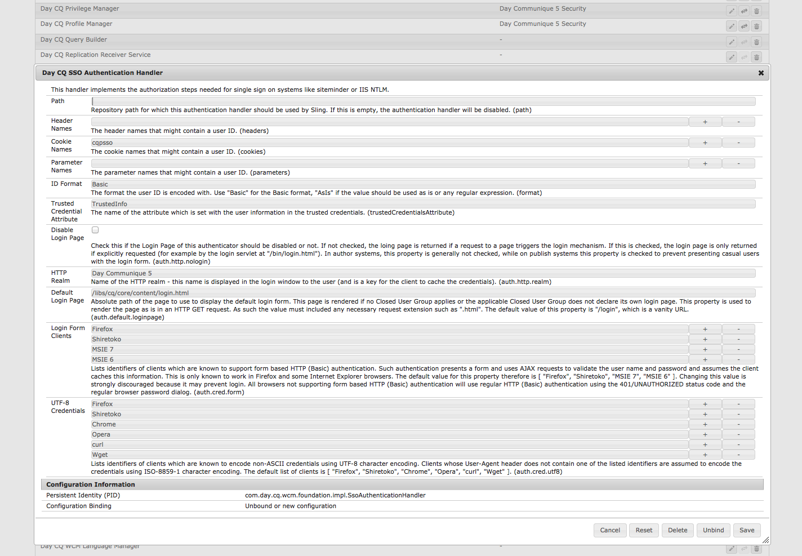

# Webconsole{#web-console}

De webconsole in AEM is gebaseerd op de [Apache Felix Web Management Console](https://felix.apache.org/documentation/subprojects/apache-felix-web-console.html). Apache Felix is een communautaire inspanning om het Platform van de Dienst van OSGi R4 uit te voeren, dat het kader OSGi en de standaarddiensten omvat.

>[!NOTE]
>
>Op de console van het Web om het even welke beschrijvingen die standaardmontages vermelden hebben op het Verschuiven gebreken.
>
>AEM heeft zijn eigen gebreken en zo zouden de geplaatste gebreken van die op de console kunnen verschillen worden gedocumenteerd.

De console van het Web biedt een selectie lusjes voor het handhaven van de bundels OSGi aan, die omvatten:

* [Configuratie](#configuration): gebruikt voor het vormen van de bundels OSGi, en is daarom het onderliggende mechanisme om AEM systeemparameters te vormen
* [Bundels](#bundles): gebruikt voor het installeren van bundels
* [Componenten](#components): gebruikt voor de controle van de status van onderdelen die vereist zijn voor AEM

Alle aangebrachte wijzigingen worden onmiddellijk toegepast op het actieve systeem. U hoeft de computer niet opnieuw op te starten.

De console is toegankelijk vanaf `../system/console`; bijvoorbeeld:

`http://localhost:4502/system/console/components`

## Configuratie {#configuration}

Het **tabblad Configuration** wordt gebruikt voor het configureren van de OSGi-bundels en is daarom het onderliggende mechanisme voor het configureren van AEM systeemparameters.

>[!NOTE]
>
>Zie [OSGi Configuratie met de Console van het Web](/help/sites-deploying/configuring-osgi.md) voor verdere details.

De **tab Configuration** kan worden benaderd door:

* Het vervolgkeuzemenu:

   **OSGi >**

* de URL; bijvoorbeeld:

   `http://localhost:4502/system/console/configMgr`

Er wordt een lijst met configuraties weergegeven:

Er zijn twee soorten configuraties beschikbaar bij de drop-down lijsten op dit scherm:

* ****
ConfigurationsHiermee kunt u de bestaande configuraties bijwerken. Deze hebben een Persistent Identity (PID) en kunnen:

   * standaard en integraal van AEM; deze zijn vereist als de waarden worden verwijderd en de standaardinstellingen worden hersteld.
   * instanties die zijn gemaakt op basis van fabrieksconfiguraties; Deze instanties worden gemaakt door de gebruiker. Verwijderen verwijdert de instantie.

* **Fabrieksconfiguraties**
Hiermee kunt u een instantie van het vereiste functieobject maken.

   Dit krijgt een blijvende identiteit toegewezen en wordt vervolgens vermeld in de vervolgkeuzelijst Configuraties.

Als u een item in de lijst selecteert, worden de parameters met betrekking tot die configuratie weergegeven:

Vervolgens kunt u de parameters naar wens bijwerken en:

* **Opslaan**

   Sla de aangebrachte wijzigingen op.

   Voor een Configuratie van de Fabriek zal dit tot een nieuwe instantie met een Blijvende Identiteit leiden. Het nieuwe exemplaar zal dan onder Configuraties worden vermeld.

* **Herstellen**

   Herstel de parameters die op het scherm worden getoond aan die het laatst worden bewaard.

* **Verwijderen**

   Verwijder de huidige configuratie. Indien standaard, worden de parameters teruggegeven aan de standaardmontages. Indien gecreeerd van een Configuratie van de Fabriek, dan wordt de specifieke instantie geschrapt.

* **Binding ongedaan maken**

   Koppel de huidige configuratie los van de bundel.

* **Annuleren**

   Alle huidige wijzigingen annuleren.

## Bundels {#bundles}

Het tabblad **Bundels** is het mechanisme voor de installatie van de OSGi-bundels die vereist zijn voor AEM. Het tabblad is toegankelijk op een van de volgende manieren:

* Het vervolgkeuzemenu:

   **OSGi >**

* de URL; bijvoorbeeld:

   `http://localhost:4502/system/console/bundles`

Er wordt een lijst met bundels weergegeven:

Met dit tabblad kunt u:

* **Installeren of bijwerken**

   U kunt **Bladeren** om het dossier te vinden die uw bundel bevatten en te specificeren of het **Begin** onmiddellijk en zou moeten **Begin Niveau**.

* **Opnieuw laden**

   Hiermee vernieuwt u de weergegeven lijst.

* **Pakketten vernieuwen**

   Hiermee controleert u de referenties van alle pakketten en vernieuwt u deze waar nodig.

   Na een update kan de oude en de nieuwe versie bijvoorbeeld nog steeds actief zijn vanwege eerdere verwijzingen. Met deze optie worden alle verwijzingen naar de nieuwe versie gecontroleerd en verplaatst, zodat de oude versie stopt.

* **Begin**

   Hiermee wordt een bundel gestart op basis van het opgegeven beginniveau.

* **Stoppen**

   Stopt de bundel.

* **Verwijderen**

   Hiermee wordt de bundel van het systeem verwijderd.

* **zie de status**

   In de lijst wordt de huidige status van de bundel vermeld. klikken op de naam van een specifieke bundel met meer informatie.

>[!NOTE]
>
>Na **Update** wordt het geadviseerd om **Pakketten vernieuwen** uit te voeren.

## Onderdelen {#components}

Met het tabblad **Componenten** kunt u de verschillende componenten in- en/of uitschakelen. Het kan worden benaderd door:

* Het vervolgkeuzemenu:

   **Hoofd >**

* de URL; bijvoorbeeld:

   `http://localhost:4502/system/console/components`

Er wordt een lijst met componenten weergegeven. Er zijn verschillende pictogrammen beschikbaar waarmee u configuratiedetails voor een specifieke component kunt inschakelen, uitschakelen of (waar van toepassing) openen.

Als u op de naam van een bepaalde component klikt, wordt meer informatie over de status weergegeven. Hier kunt u de component ook in-, uitschakelen of opnieuw laden.

>[!NOTE]
>
>Als u een component inschakelt of uitschakelt, wordt deze alleen van toepassing tot AEM/CRX opnieuw wordt gestart.
>
>De begintoestand wordt gedefinieerd binnen de componentdescriptor, die tijdens de ontwikkeling wordt gegenereerd en in de bundel wordt opgeslagen op het moment dat de bundel wordt gemaakt.

