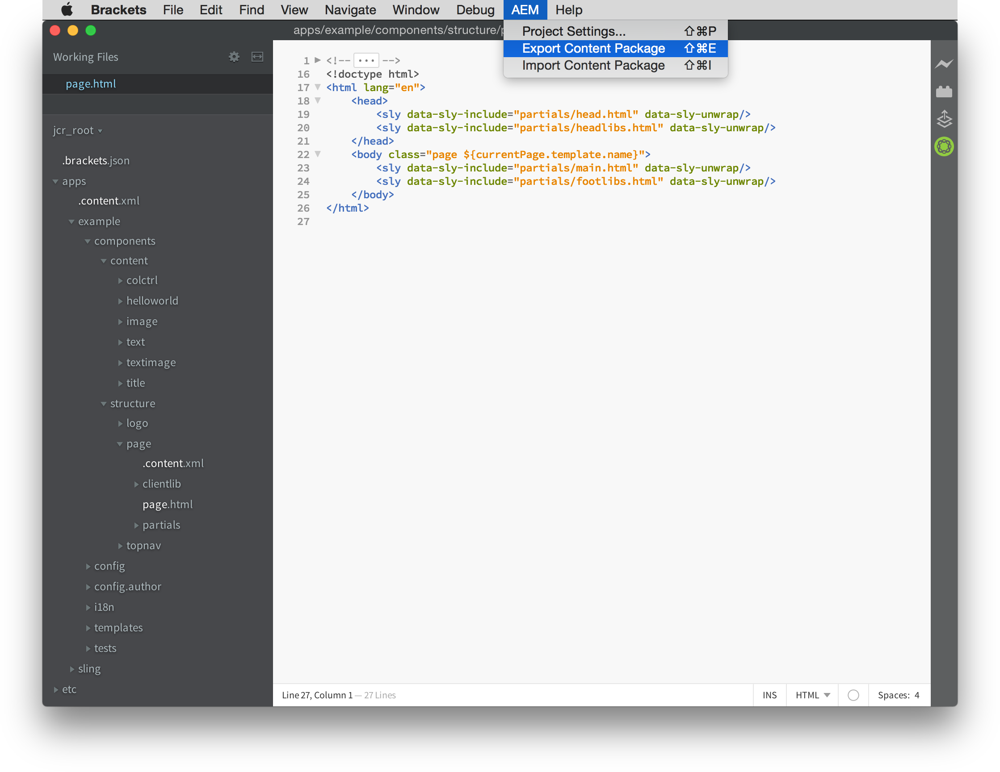
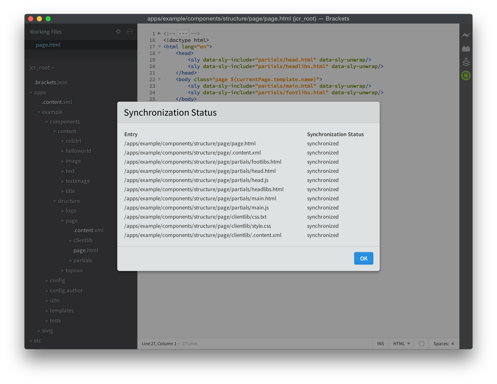

# Extensie AEM{#aem-brackets-extension}

## Overzicht {#overview}

De extensie AEM Brackets biedt een vloeiende workflow voor het bewerken van AEM componenten en clientbibliotheken en maakt gebruik van de kracht van de [Brackets](https://brackets.io/) -code-editor. Hiermee hebt u vanuit de code-editor toegang tot Photoshop-bestanden en -lagen. De eenvoudige synchronisatie die wordt geboden door de extensie (geen Maven of File Vault vereist) verhoogt de efficiëntie van de ontwikkelaar en helpt ontwikkelaars met beperkte AEM kennis ook om aan projecten deel te nemen. Deze extensie biedt ook enige ondersteuning voor de [HTML-sjabloontaal (HTML Template Language)](https://helpx.adobe.com/experience-manager/htl/user-guide.html), die de complexiteit van JSP wegneemt om de ontwikkeling van componenten eenvoudiger en veiliger te maken.

### Features {#features}

De hoofdkenmerken van de extensie AEM Brackets zijn:

* Geautomatiseerde synchronisatie van gewijzigde bestanden naar de AEM-ontwikkelingsinstantie.
* Handmatige tweerichtingssynchronisatie van bestanden en mappen.
* Volledige tevreden-pakket synchronisatie van het project.
* HTML-codevoltooiing voor expressies en `data-sly-*` blokinstructies.

Bovendien zijn er veel handige functies voor AEM ontwikkelaars van lettertypen:

* Photoshop-bestandsondersteuning voor het ophalen van gegevens uit een PSD-bestand, zoals lagen, metingen, kleuren, lettertypen, tekst, enzovoort.
* Coderingstips uit de PSD om deze geëxtraheerde informatie gemakkelijk opnieuw te gebruiken in de code.
* Ondersteuning voor CSS-preprocessor, zoals LESS en SCSS.
* En honderden extra extensies die meer specifieke behoeften dekken.

## Installatie {#installation}

### Haakjes {#brackets}

De extensie AEM Brackets ondersteunt versie 1.0 of hoger.

Download de nieuwste versie Brackets van [vierkante haken.io](https://brackets.io/).

### De extensie {#the-extension}

Ga als volgt te werk om de extensie te installeren:

1. Open haakjes. Selecteer **Extension Manager in het menu Bestand****...**
1. Ga **AEM** in de onderzoeksbar in en zoek **AEM Uitbreiding** van Brackets.

   

1. Klik op **Installeren**.
1. Sluit het dialoogvenster en de Extension Manager nadat de installatie is voltooid.

## Aan de slag {#getting-started}

### Het content-package project {#the-content-package-project}

Nadat de extensie is geïnstalleerd, kunt u beginnen met het ontwikkelen van AEM componenten door een inhoudspakketmap te openen vanuit uw bestandssysteem met haakjes.

Het project moet ten minste het volgende bevatten:

1. een `jcr_root` map (bijvoorbeeld `myproject/jcr_root`)

1. een `filter.xml` bestand (bijvoorbeeld `myproject/META-INF/vault/filter.xml`); Zie de definitie `filter.xml` Werkruimtefilter voor meer informatie over de structuur van het bestand.

Kies in het menu **Bestand** van haakjes de optie **Map openen...** en kies de `jcr_root` map of de bovenliggende projectmap.

>[!NOTE]
>
>Als u geen eigen project met een content-package hebt, kunt u het [HTL TodoMVC-voorbeeld](https://github.com/Adobe-Marketing-Cloud/aem-sightly-sample-todomvc)uitproberen. Voor GitHub, klik **Download ZIP**, haalt de dossiers plaatselijk uit, en zoals hierboven geïnstrueerd, open de `jcr_root` omslag in Brackets. Volg vervolgens de onderstaande stappen om de **projectinstellingen** in te stellen en upload ten slotte het hele pakket naar de AEM ontwikkelingsinstantie door een **Exportinhoudspakket** uit te voeren zoals verder onderaan in de sectie Volledige synchronisatie van het inhoudspakket.
>
>Na deze stappen, zou u tot `/content/todo.html` URL op uw AEM ontwikkelingsinstantie moeten kunnen toegang hebben en u kunt wijzigingen aan de code in Brackets beginnen en zien hoe, nadat doen verfrist zich in Webbrowser, de veranderingen onmiddellijk aan de AEM server werden gesynchroniseerd.

### Projectinstellingen {#project-settings}

Als u de inhoud wilt synchroniseren van en naar een AEM-ontwikkelingsinstantie, moet u de projectinstellingen definiëren. U doet dit door naar het menu **AEM** te gaan en **Projectinstellingen te kiezen..**

Met de projectinstellingen kunt u het volgende definiëren:

1. De server-URL (bijvoorbeeld `http://localhost:4502`)
1. Of servers worden getolereerd die geen geldig HTTPS-certificaat hebben (niet ingeschakeld houden, tenzij vereist)
1. De gebruikersnaam die wordt gebruikt voor het synchroniseren van inhoud (bijvoorbeeld `admin`)
1. Het wachtwoord van de gebruiker (bijvoorbeeld `admin`)

## Inhoud synchroniseren {#synchronizing-content}

De extensie AEM Brackets biedt de volgende typen inhoudssynchronisatie voor bestanden en mappen die zijn toegestaan door de filterregels die zijn gedefinieerd in `filter.xml`:

### Geautomatiseerde synchronisatie van gewijzigde bestanden {#automated-synchronization-of-changed-files}

Hiermee worden wijzigingen alleen gesynchroniseerd van haakjes naar de AEM-instantie, maar nooit andersom.

### Handmatige tweerichtingssynchronisatie {#manual-bidirectional-synchronization}

In de Ontdekkingsreiziger van het Project, open het contextafhankelijke menu door op om het even welk dossier of omslag met de rechtermuisknop te klikken, en de **Uitvoer naar Server** of de **Invoer van de opties van de Server** kan worden betreden.

>[!NOTE]
>
>Als het geselecteerde item zich buiten de `jcr_root` map bevindt, worden de contextafhankelijke menu-items **Exporteren naar server** en **Importeren vanuit server** uitgeschakeld.

### Volledige synchronisatie van inhoudspakketten {#full-content-package-synchronization}

In het **AEM** menu, staan de opties van het Pakket **van de Inhoud van de** Uitvoer of van het Pakket **van de Inhoud van de** Invoer toe om het volledige project met de server te synchroniseren.

### Synchronisatiestatus {#synchronization-status}

De extensie AEM Brackets heeft een waarschuwingspictogram op de werkbalk rechts van het venster Brackets, waarmee de status van de laatste synchronisatie wordt aangegeven:

* groen - alle bestanden zijn gesynchroniseerd
* blauw - een synchronisatiebewerking wordt uitgevoerd
* geel - sommige bestanden zijn niet gesynchroniseerd
* rood - geen van de bestanden is gesynchroniseerd

Als u op het meldingspictogram klikt, wordt het dialoogvenster Synchronisatie-statusrapport geopend met een lijst van alle status voor elk gesynchroniseerd bestand.

>[!NOTE]
>
>Alleen inhoud die is gemarkeerd als opgenomen in de filterregels van `filter.xml` wordt gesynchroniseerd, ongeacht de gebruikte synchronisatiemethode.
>
>Daarnaast worden `.vltignore` bestanden ondersteund voor het uitsluiten van inhoud van en naar de opslagplaats.

## HTML-code bewerken {#editing-htl-code}

De extensie AEM Brackets beschikt ook over enkele automatische aantekeningen waarmee het schrijven van HTML-kenmerken en -expressies wordt vergemakkelijkt.

### Kenmerk automatisch voltooid {#attribute-auto-completion}

1. Typ in een HTML-kenmerk `sly`. Het kenmerk wordt automatisch ingevuld bij `data-sly-`.
1. Selecteer het HTML-kenmerk in de vervolgkeuzelijst.

### Automatische voltooiing van expressie {#expression-auto-completion}

In een expressie `${}`worden veelvoorkomende variabelenamen automatisch aangevuld.

## Meer informatie {#more-information}

De extensie AEM Brackets is een opensource-project dat op GitHub wordt gehost door de [Adobe Marketing Cloud](https://github.com/Adobe-Marketing-Cloud) -organisatie, onder de Apache-licentie, versie 2.0:

* Codeopslagplaats: [https://github.com/Adobe-Marketing-Cloud/aem-sightly-brackets-extension](https://github.com/Adobe-Marketing-Cloud/aem-sightly-brackets-extension)
* Apache-licentie, versie 2.0: [https://www.apache.org/licenses/LICENSE-2.0.html](https://www.apache.org/licenses/LICENSE-2.0.html)

De de coderedacteur van Brackets is ook een open-bronproject, dat op GitHub door de organisatie van [Adobe Systems Incorporated](https://github.com/adobe) wordt ontvangen:

* Codeopslagplaats: [https://github.com/adobe/brackets](https://github.com/adobe/brackets)

Voel je vrij om bij te dragen!
