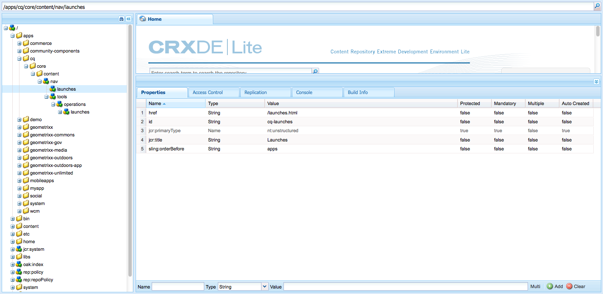

# De consoles{#customizing-the-consoles} aanpassen

>[!CAUTION]
>
>In dit document wordt beschreven hoe consoles in de moderne interface met aanraakbediening kunnen worden aangepast. Dit document is niet van toepassing op de klassieke gebruikersinterface.

AEM verstrekt diverse mechanismen om u toe te laten om de consoles (en [pagina auteursfunctionaliteit](/help/sites-developing/customizing-page-authoring-touch.md)) van uw auteursinstantie aan te passen.

* Clientlibs

   Clientlibs staan u toe om de standaardimplementatie uit te breiden om nieuwe functionaliteit te realiseren, terwijl het hergebruiken van de standaardfuncties, de voorwerpen, en de methodes. Wanneer het aanpassen, kunt u uw eigen clientlib onder `/apps.` tot stand brengen bijvoorbeeld het kan de code houden die voor uw douanecomponent wordt vereist.

* Bedekkingen

   Bedekkingen zijn gebaseerd op knooppuntdefinities en staan u toe om de standaardfunctionaliteit (in `/libs`) met uw eigen aangepaste functionaliteit (in `/apps`) te bedekken. Bij het maken van een overlay is een 1:1-kopie van het origineel niet vereist, omdat de samenvoeging van de tekenbron overerving toestaat.

Deze kunnen op vele manieren worden gebruikt om uw AEM consoles uit te breiden. Een kleine selectie wordt hieronder behandeld (op een hoog niveau).

>[!NOTE]
>
>Zie voor meer informatie:
>
>* Het gebruiken en het creëren van [clientlibs](/help/sites-developing/clientlibs.md).
>* [overlays](/help/sites-developing/overlays.md) gebruiken en maken.
>* [Graniet](https://helpx.adobe.com/experience-manager/6-4/sites/developing/using/reference-materials/granite-ui/api/index.html)

>
>
Dit onderwerp wordt ook behandeld in [AEM Gems](https://docs.adobe.com/content/ddc/en/gems.html) zitting - [Gebruikersinterfaceaanpassing voor AEM 6.0](https://docs.adobe.com/content/ddc/en/gems/user-interface-customization-for-aem-6.html).

>[!CAUTION]
>
>U ***must*** verandert niets in `/libs` weg.
>
>Dit komt doordat de inhoud van `/libs` de volgende keer wordt overschreven dat u uw exemplaar bijwerkt (en dat kan worden overschreven wanneer u een hotfix- of functiepakket toepast).
>
>De aanbevolen methode voor configuratie en andere wijzigingen is:
>
>1. Het vereiste item opnieuw maken (dat wil zeggen zoals het bestaat in `/libs`) onder `/apps`
   >
   >
1. Wijzigingen aanbrengen binnen `/apps`

>

De volgende locaties in de `/libs`-structuur kunnen bijvoorbeeld worden bedekt:

* consoles (consoles op basis van gebruikersinterface-pagina&#39;s van graniet); bijvoorbeeld:

   * `/libs/wcm/core/content`

<!-- Needs a review by Engineering -->
<!--
* secondary (inner) rails; for example:

    * `/libs/wcm/core/content/search`

* toolbar(s) (dependent on console; for example sites):

    * default 

      `/libs/wcm/core/content/sites/jcr:content/body/content/header/items/default`

    * selection mode

      `/libs/wcm/core/content/sites/jcr:content/body/content/header/items/selection`

* help menu options (dependent on console; for example sites):

    * `/libs/wcm/core/content/sites/jcr:content/body/help`

* information shown on the card view (dependent on console; for example sites):

    * `/libs/wcm/core/content/sites/jcr:content/body/content/content/items/childpages`

-->
>[!NOTE]
>
>Zie het artikel in de Knowledge Base, [Problemen oplossen AEM TouchUI-problemen](https://helpx.adobe.com/experience-manager/kb/troubleshooting-aem-touchui-issues.html), voor meer tips en gereedschappen.

<!-- Needs a review by Engineering -->
<!--
## Code Samples {#code-samples}

Various packages have been made available on Github. These provide code samples related to the tasks covered on this page.

### aem-admin-extension-new-console {#aem-admin-extension-new-console}

`aem-admin-extension-new-console` is a sample package showing how to [create a new AEM 6 console](#create-a-custom-console). This package provides a UI for managing [Launches](/help/sites-authoring/launches.md) and adds a link in the navigation:

CODE ON GITHUB

You can find the code of this page on GitHub

* [Open aem-admin-extension-new-console project on GitHub](https://github.com/Adobe-Marketing-Cloud/aem-admin-extension-new-console)
* Download the project as [a ZIP file](https://github.com/Adobe-Marketing-Cloud/aem-admin-extension-new-console/archive/master.zip)

### aem-admin-extension-customize-sites {#aem-admin-extension-customize-sites}

`aem-admin-extension-customize-sites` is a sample package showing how to customize an existing AEM 6 admin console. This package provides updates to Sites administration:

CODE ON GITHUB

You can find the code of this page on GitHub

* [Open aem-admin-extension-customize-sites project on GitHub](https://github.com/Adobe-Marketing-Cloud/aem-admin-extension-customize-sites)
* Download the project as [a ZIP file](https://github.com/Adobe-Marketing-Cloud/aem-admin-extension-customize-sites/archive/master.zip)
-->

<!-- Needs a review by Engineering -->
<!--
## Create a Custom Console {#create-a-custom-console}

1. You can create a custom console with related actions; for example, Launches at the top level (below Sites):

   This involves:

    * creating the root space definition of your new console ``; for example:

        * `/apps/<yourProject>/admin/ext/launches`

    * this can contain (according to requirements):

        * the corresponding [clientlibs](/help/sites-developing/clientlibs.md) for custom actions and `less`/ `css` definitions

            * `/apps/<yourProject>/admin/ext/launches/clientlibs`

        * components that need to be redefined/adjusted; for example, the breadcrumbs, datasource and the launch

            * `/apps/<yourProject>/admin/ext/launches/components`

        * the Granite UI page resource:

            * `/apps/<yourProject>/admin/ext/launches/content/jcr:content`

              property: `sling:resourceType`

        * the page definition of the console

            * `/apps/<yourProject>/admin/ext/launches/content/jcr:content/head`
            * `/apps/<yourProject>/admin/ext/launches/content/jcr:content/body`

   

   To use the new console (for example in the [rail for navigation](#add-new-navigation-option-to-rail)) an ID is used, so that it can be explicitly referenced. The ID is used to connect the console and its navigation definition. The ID is defined in the `rail` node of the page; for example, for the Sites console:

    * the rail node is: 

      `/libs/wcm/core/content/sites/jcr:content/body/rail`

        * here the `currentId` property is defined: 

          `currentId` = `cq-sites`

   For the Launches console example:

    * the node is:

        * `/apps/<yourProject>/admin/ext/launches/content/jcr:content/body/rail`

    * with the following properties:

        * `currentId` = `cq-launches`
        * `sling:resourceType` = `granite/ui/components/endor/navcolumns`
        * `srcPath` = `cq/core/content/nav`
-->

## De standaardweergave voor een console aanpassen {#customizing-the-default-view-for-a-console}

U kunt de standaardweergave (kolom, kaart, lijst) voor een console aanpassen:

1. U kunt de volgorde van de weergaven wijzigen door de vereiste invoer onder te plaatsen:

   `/libs/wcm/core/content/sites/jcr:content/views`

   De eerste vermelding is de standaardinstelling.

   De beschikbare knooppunten zijn gerelateerd aan de beschikbare weergaveopties:

   * `column`
   * `card`
   * `list`

1. Bijvoorbeeld in een overlay voor de lijst:

   `/apps/wcm/core/content/sites/jcr:content/views/list`

   Definieer de volgende eigenschap:

   * **Naam**:  `sling:orderBefore`
   * **Type**:  `String`
   * **Waarde**:  `column`

<!-- Needs a review by Engineering -->
<!--
`aem-admin-extension-customize-sites` is a sample package showing how to customize an existing AEM 6 admin console. This package provides updates to Sites administration:

CODE ON GITHUB

You can find the code of this page on GitHub

* [Open aem-admin-extension-customize-sites project on GitHub](https://github.com/Adobe-Marketing-Cloud/aem-admin-extension-customize-sites)
* Download the project as [a ZIP file](https://github.com/Adobe-Marketing-Cloud/aem-admin-extension-customize-sites/archive/master.zip)
-->

<!-- Needs a review by Engineering -->
<!--
### Add New Navigation Option to Rail {#add-new-navigation-option-to-rail}

1. You can add a navigation entry in the rail (for example, a [custom console](#create-a-custom-console) such as Launches).

   To do this, you create an overlay of:

   `/libs/cq/core/content/nav`

   In the `/apps` overlay:

   `/apps/cq/core/content/nav`

   Create the new nodes and properties:

   

    * Extend navigation:

        * `/apps/cq/core/content/nav/launches`

    * Specify location in the tree:

        * property: `sling:orderBefore`

    * To create the connection, the `id` property references (i.e. must be the same as) the `currentID` property [for the appropriate console](#create-a-custom-console):

        * property: `id`
        * value: same as for your console (e.g. `cq-launches`) 

          for example: the same value as the `currentId` property on:

          `/apps/<yourProject>/admin/ext/launches/content/jcr:content/body/rail`
-->

## Nieuwe handeling toevoegen aan de werkbalk {#add-new-action-to-the-toolbar}

1. U kunt uw eigen componenten bouwen en de overeenkomstige cliëntbibliotheken voor douaneacties omvatten. Bijvoorbeeld een handeling **Promote to Twitter** op:

   `/apps/wcm/core/clientlibs/sites/js/twitter.js`

   Dit kan dan met een toolbarpunt op uw console worden verbonden:

   `/apps/<yourProject>/admin/ext/launches`

   In de selectiemodus bijvoorbeeld:

   `content/jcr:content/body/content/header/items/selection/items/twitter`

## Een werkbalkhandeling beperken tot een specifieke groep {#restrict-a-toolbar-action-to-a-specific-group}

1. U kunt een aangepaste rendervoorwaarde gebruiken om de standaardhandeling te bedekken en specifieke voorwaarden op te leggen waaraan moet worden voldaan voordat deze wordt gerenderd.

   Maak bijvoorbeeld een component om de rendervoorwaarden op basis van groep te beheren:

   `/apps/myapp/components/renderconditions/group`

1. U kunt deze toepassen op de actie Site maken op de Sites-console:

   `/libs/wcm/core/content/sites`

   Maak de bedekking:

   `/apps/wcm/core/content/sites`

1. Voeg vervolgens de rendervoorwaarde voor de actie toe:

   `jcr:content/body/content/header/items/default/items/create/items/createsite/rendercondition`

   Gebruikend eigenschappen op deze knoop kunt u `groups` bepalen toegestaan om de specifieke actie uit te voeren; bijvoorbeeld `administrators`

<!-- Needs a review by Engineering -->
<!--
## Remove Access to Navigation Option on Rail {#remove-access-to-navigation-option-on-rail}

1. You can rename a navigation entry in the rail by overlaying the required entry from under:

   `/libs/cq/core/content/nav`

   The nodes available correlate to the navigation options in the rail:

    * `projects`
    * `sites`
    * `assets`
    * `apps`
    * `forms`
    * `screens`
    * `personalization`
    * `commerce`
    * `tools`
    * `communities`

1. For example, on a overlay at:

   `/apps/cq/core/content/nav/sites`

   Define the following property:

    * **Name**: `sling:hideResource`
    * **Type**: `String` 
    * **Value**: `true`

`aem-admin-extension-customize-sites` is a sample package showing how to customize an existing AEM 6 admin console. This package provides updates to Sites administration:

CODE ON GITHUB

You can find the code of this page on GitHub

* [Open aem-admin-extension-new-console project on GitHub](https://github.com/Adobe-Marketing-Cloud/aem-admin-extension-new-console)
* Download the project as [a ZIP file](https://github.com/Adobe-Marketing-Cloud/aem-admin-extension-new-console/archive/master.zip)
-->

<!-- Needs a review by Engineering -->
<!--
## Restrict Access to Navigation Option on Rail {#restrict-access-to-navigation-option-on-rail}

You can restrict access to a navigation option using ACLs:

1. Open the [user and/or group management](/help/sites-administering/security.md) and select the user/group you want to restrict access for.

   >[!NOTE]
   >
   >Avoid assigning/restricting permissions on a user-by-user basis. It is [recommended to use groups](/help/sites-administering/security.md#best-practices).

1. Remove access [permissions](/help/sites-administering/security.md#permissions) to the appropriate node(s) under `/libs/cq/core/content/nav/sites`. These correlate to the navigation options in the rail:

    * `projects`
    * `sites`
    * `assets`
    * `apps`
    * `forms`
    * `screens`
    * `personalization`
    * `commerce`
    * `tools`
    * `communities`
-->

## Kolommen aanpassen in de lijstweergave {#customizing-columns-in-the-list-view}

>[!NOTE]
>
>Deze functie is geoptimaliseerd voor kolommen met tekstvelden. voor andere gegevenstypen is het mogelijk om `cq/gui/components/siteadmin/admin/listview/columns/analyticscolumnrenderer` in `/apps` te bedekken.

<!-- Needs a review by Engineering -->
<!--
CODE ON GITHUB

You can find the code of this page on GitHub

* [Open aem-sites-extension-listview-columns project on GitHub](https://github.com/Adobe-Marketing-Cloud/aem-sites-extension-listview-columns)
* Download the project as [a ZIP file](https://github.com/Adobe-Marketing-Cloud/aem-sites-extension-listview-columns/archive/master.zip)
-->

U kunt als volgt de kolommen in de lijstweergave aanpassen:

1. Bedek de lijst met beschikbare kolommen.

   * Op het knooppunt:

      `/apps/wcm/core/content/common/availablecolumns`

   * Voeg uw nieuwe kolommen toe - of verwijder bestaande kolommen.
   Zie [Bedekkingen gebruiken (en de Samenvoegen van het Middel van de Verspreiding)](/help/sites-developing/overlays.md) voor meer informatie.

1. Optioneel:

   * Als u extra gegevens wilt stoppen, moet u een ` [PageInforProvider](https://helpx.adobe.com/experience-manager/6-4/sites/developing/using/reference-materials/javadoc/com/day/cq/wcm/api/PageInfoProvider.html)` met een

      `pageInfoProviderType` eigenschap.
   Bijvoorbeeld, zie hieronder de klasse/de bundel in bijlage (van GitHub).

1. U kunt nu de kolom selecteren in de kolomconfigurator van de lijstweergave.

## Bronnen filteren {#filtering-resources}

Wanneer u een console gebruikt, wordt vaak gebruikgemaakt van een array die de gebruiker moet selecteren (pagina&#39;s, componenten, elementen, enzovoort). Dit kan de vorm hebben van een lijst, bijvoorbeeld van waaruit de auteur een punt moet kiezen.

Om de lijst tot een redelijke grootte te houden en ook relevant voor het gebruiksgeval, kan een filter in de vorm van een douane predikaat worden uitgevoerd. Zie [dit artikel](/help/sites-developing/customizing-page-authoring-touch.md#filtering-resources) voor meer informatie.
