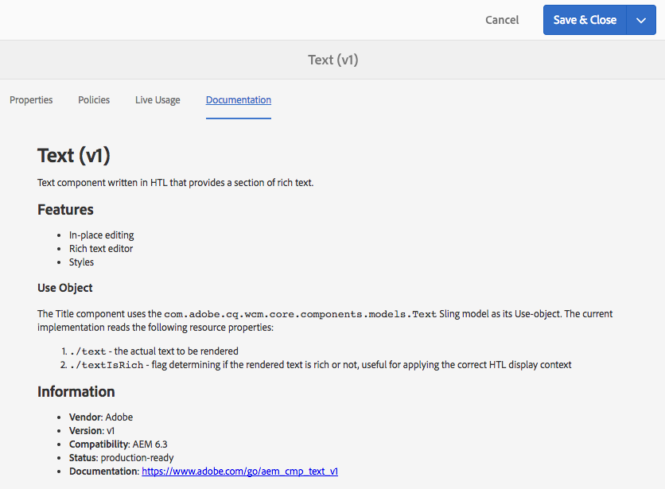

# Kernonderdelen uitproberen in We.Retail{#trying-out-core-components-in-we-retail}

De kerncomponenten zijn moderne, flexibele componenten die eenvoudig uitbreidbaar zijn en eenvoudige integratie in uw projecten mogelijk maken. De kerncomponenten zijn gebouwd rond verscheidene belangrijke ontwerpprincipes zoals HTML, bruikbaarheid out-of-the-box, configureerbaarheid, versioning, en rekbaarheid. We.Retail is gebaseerd op kerncomponenten.

## Uitproberen {#trying-it-out}

1. Start AEM met de voorbeeldinhoud Web.Retail en open de [Componentenconsole](/help/sites-authoring/default-components-console.md).

   **Algemene navigatie -> Gereedschappen -> Componenten**

1. Wanneer u de rail opent in de componentenconsole, kunt u filteren voor een bepaalde componentgroep. De kerncomponenten vindt u in

   * `.core-wcm`: De standaardbasiscomponenten
   * `.core-wcm-form`: De kerncomponenten voor het verzenden van formulieren

   Choose `.core-wcm`.

   

1. Merk op dat alle kerncomponenten **v1** worden genoemd, erop wijzend dat dit de eerste versie van deze kerncomponent is. Regelmatige versies worden uitgebracht, die versiecompatibel zijn met AEM en eenvoudig upgraden mogelijk maken, zodat u kunt profiteren van de nieuwste functies.
1. Klik **Tekst (v1)**.

   Zie dat **Het Type van Middel** van de component `/apps/core/wcm/components/text/v1/text` is. De componenten van de kern worden gevonden onder `/apps/core/wcm/components` en zijn versioned per component.

   

1. Klik op het tabblad **Documentatie** om de documentatie voor ontwikkelaars voor de component te bekijken.

   

1. Ga terug naar de componentconsole. Filter voor de groep **We.Retail** en selecteer de **component Text**.
1. Zie dat **Resourcetype** verwijst naar een component zoals verwacht onder `/apps/weretail`, maar **Resourcesupertype** verwijst naar de kerncomponent `/apps/core/wcm/components/text/v1/text`.

   

1. Klik op het tabblad **Actief gebruik** om te zien op welke pagina&#39;s deze component momenteel wordt gebruikt. Klik op de eerste pagina **Bedankt** om de pagina te bewerken.

   

1. Selecteer op de pagina Hartelijk dank de tekstcomponent en klik in het bewerkingsmenu van de component op het pictogram Overerving annuleren.

   [We.Retail heeft een geglobaliseerde site-](/help/sites-developing/we-retail-globalized-site-structure.md) structuur waarbij content van taalstramienen naar  [live kopieën wordt gestuurd via een mechanisme dat overerving](/help/sites-administering/msm.md) wordt genoemd. Daarom moet overerving worden geannuleerd om een gebruiker in staat te stellen tekst handmatig te bewerken.

   

1. Bevestig de annulering door te klikken **Yes**.

   

1. Nadat de overerving is geannuleerd en u de tekstcomponenten selecteert, zijn er veel meer opties beschikbaar. Klik op** Bewerken**.

   

1. U kunt nu zien welke bewerkingsopties beschikbaar zijn voor de tekstcomponent.

   

1. Selecteer **Sjabloon bewerken** in het menu **Pagina-informatie**.
1. In de Redacteur van het Malplaatje van de pagina, klik op **Beleid** pictogram van de component van de Tekst in **de Container van de Lay-out** van de pagina.

   

1. Met de kerncomponenten kan een sjabloonauteur configureren welke eigenschappen beschikbaar zijn voor de auteurs van de pagina. Het gaat hierbij onder andere om functies zoals toegestane bronnen voor plakken, opmaakopties, beschikbare alineastijlen, enzovoort.

   Dergelijke ontwerpdialoogvensters zijn beschikbaar voor veel kerncomponenten en werken samen met de sjablooneditor. Zodra toegelaten, zijn zij beschikbaar aan de auteur door de componentenredacteurs.

   

## Aanvullende informatie {#further-information}

Raadpleeg voor meer informatie over de kerncomponenten het ontwerpdocument [Core Components](https://docs.adobe.com/content/help/en/experience-manager-core-components/using/introduction.html) voor een overzicht van de mogelijkheden van de kerncomponenten en het ontwikkelaarsdocument [Developing Core Components](https://helpx.adobe.com/experience-manager/core-components/using/developing.html) voor een technisch overzicht.

Ook kunt u [bewerkbare sjablonen](/help/sites-developing/we-retail-editable-templates.md) nader onderzoeken. Raadpleeg het ontwerpdocument [Paginasjablonen maken](/help/sites-authoring/templates.md) of het ontwikkelaarsdocument Pagina [Sjablonen - Bewerkbaar](/help/sites-developing/page-templates-editable.md) voor volledige informatie over bewerkbare sjablonen.
