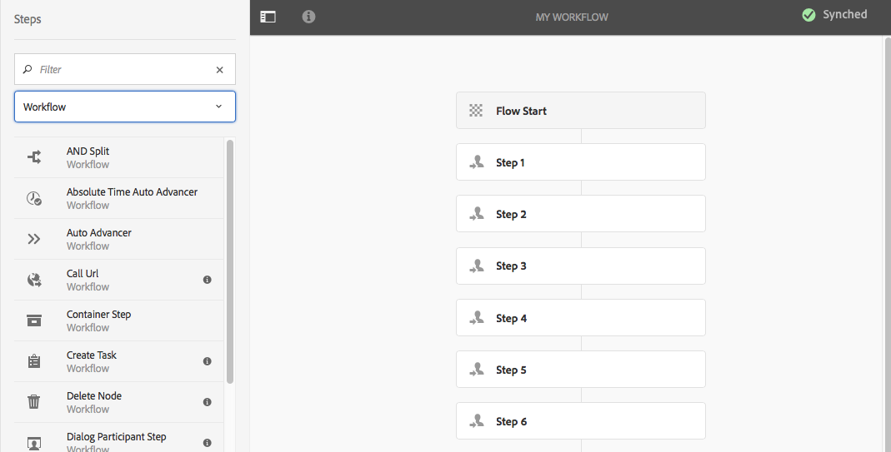
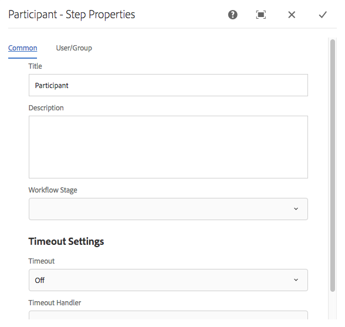
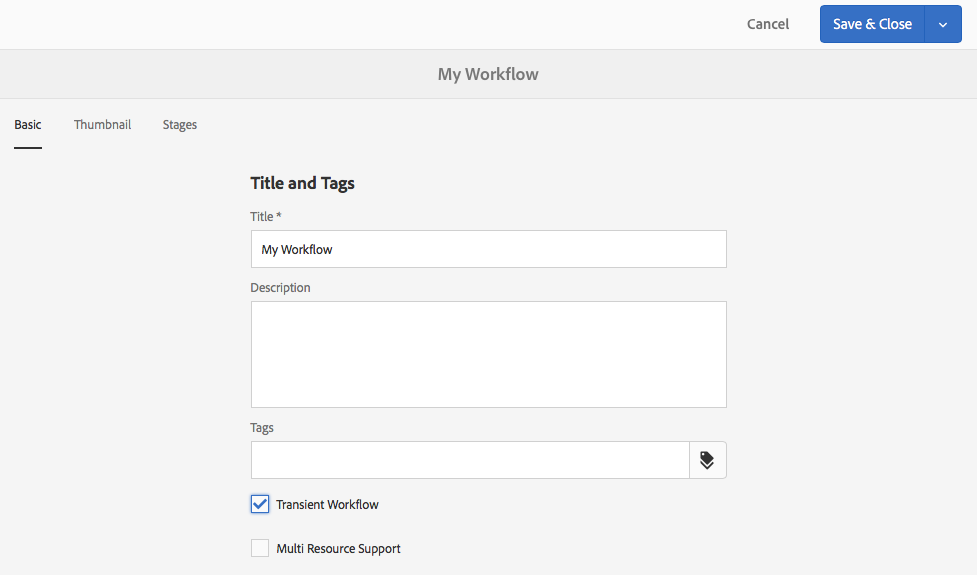
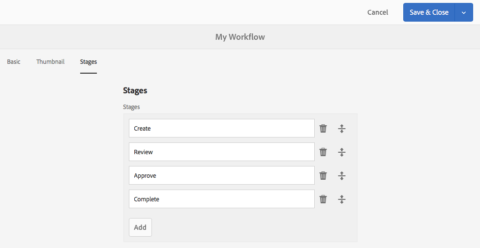

# Workflowmodellen maken{#creating-workflow-models}

>[!CAUTION]
>
>Voor gebruik van de klassieke interface raadpleegt u de [AEM 6.3 documentatie](https://helpx.adobe.com/experience-manager/6-3/sites-developing/workflows-models.html) ter referentie.

U maakt een [workflowmodel](/help/sites-developing/workflows.md#model) om de reeks stappen te definiëren die worden uitgevoerd wanneer een gebruiker de workflow start. U kunt ook modeleigenschappen definiëren, zoals of de workflow van voorbijgaande aard is of meerdere bronnen gebruikt.

Wanneer een gebruiker een workflow start, wordt een instantie gestart; Dit is het corresponderende runtimemodel dat wordt gemaakt wanneer u uw wijzigingen [Sync](#sync-your-workflow-generate-a-runtime-model) wijzigt.

## Een nieuwe workflow maken {#creating-a-new-workflow}

Wanneer u voor het eerst een nieuw workflowmodel maakt, bevat dit model:

* De stappen **[!UICONTROL Flow Start]** en **[!UICONTROL Flow End]**.

   Deze vertegenwoordigen het begin en einde van de workflow. Deze stappen zijn vereist en kunnen niet worden bewerkt of verwijderd.

* Een voorbeeld **Deelnemer** stap genoemd **Stap 1**.

   Deze stap wordt gevormd om een het werkpunt aan de werkschemainitiatiefnemer toe te wijzen. Bewerk of verwijder deze stap en voeg desgewenst stappen toe.

Een nieuwe workflow maken met de editor:

1. Open de **[!UICONTROL Workflow Models]** console; door middel van **[!UICONTROL Tools]**, **[!UICONTROL Workflow]**, **[!UICONTROL Models]** of, bijvoorbeeld:

   [http://localhost:4502/aem/workflow](http://localhost:4502/aem/workflow)

1. Selecteer **[!UICONTROL Create]** en **[!UICONTROL Create Model]**.
1. Het dialoogvenster **[!UICONTROL Add Workflow Model]** wordt weergegeven. Voer **[!UICONTROL Title]** en **[!UICONTROL Name]** (optioneel) in voordat u **[!UICONTROL Done]** selecteert.
1. Het nieuwe model wordt vermeld in de **[!UICONTROL Workflow Models]** console.
1. Selecteer uw nieuwe werkschema, dan gebruik [**[!UICONTROL Edit]**om het voor configuratie](#editing-a-workflow) te openen:

   

>[!NOTE]
>
>Als u met programmacode modellen maakt (met behulp van een crx-pakket), kunt u ook een submap maken binnen:
>
>`/var/workflow/models`
>
>Bijvoorbeeld, `/var/workflow/models/prototypes`
>
>Deze map kan vervolgens worden gebruikt voor [het beheren van de toegang tot de modellen in die map](/help/sites-administering/workflows-managing.md#create-a-subfolder-in-var-workflow-models-and-apply-the-acl-to-that).

## Een workflow bewerken {#editing-a-workflow}

U kunt elk bestaand workflowmodel bewerken in:

* [definiëren van ](#adding-a-step-to-a-model) stappen en hun  [parameters](#configuring-a-workflow-step)

* workfloweigenschappen configureren, waaronder [stage](#configuring-workflow-stages-that-show-workflow-progress), [of de workflow van voorbijgaande aard is](#creating-a-transient-workflow) en/of [meerdere bronnen gebruikt](#configuring-a-workflow-for-multi-resource-support)

Het uitgeven van [**Standaard of Verouderd** (uit-van-de-doos) werkschema](#editing-a-default-or-legacy-workflow-for-the-first-time) heeft een extra stap, om ervoor te zorgen dat een [veilige exemplaar](/help/sites-developing/workflows-best-practices.md#locations-workflow-models) wordt genomen alvorens uw veranderingen wordt aangebracht.

Wanneer updates van uw workflow zijn voltooid, moet u **[!UICONTROL Sync]** tot **[!UICONTROL Generate a Runtime Model]** gebruiken. Zie [Uw workflow synchroniseren](#sync-your-workflow-generate-a-runtime-model) voor meer informatie.

### Synchroniseer uw Workflow - Genereer een Runtime Model {#sync-your-workflow-generate-a-runtime-model}

**Met Sync**  (rechts op de editor-werkbalk) wordt een  [runtimemodel](/help/sites-developing/workflows.md#runtime-model) gegenereerd. Het runtimemodel is het model dat daadwerkelijk wordt gebruikt wanneer een gebruiker een workflow start. Als u uw wijzigingen niet **[!UICONTROL Sync]**, dan zijn de wijzigingen niet beschikbaar bij uitvoering.

Wanneer u (of een andere gebruiker) wijzigingen aanbrengt in de workflow, moet u **[!UICONTROL Sync]** gebruiken om een runtimemodel te genereren, zelfs wanneer afzonderlijke dialoogvensters (bijvoorbeeld voor stappen) hun eigen opslagopties hebben.

Wanneer de wijzigingen worden gesynchroniseerd met het (opgeslagen) runtimemodel, wordt in plaats daarvan **[!UICONTROL Synched]** weergegeven.

Sommige stappen hebben verplichte velden en/of ingebouwde validatie. Wanneer niet aan deze voorwaarden wordt voldaan, wordt een fout weergegeven wanneer u **[!UICONTROL Sync]** het model probeert te vervangen. Wanneer bijvoorbeeld geen deelnemer is gedefinieerd voor een stap **[!UICONTROL Participant]**:


### Een standaard- of verouderde workflow voor het eerst bewerken {#editing-a-default-or-legacy-workflow-for-the-first-time}

Wanneer u een [Standaard en/of Verouderd model](/help/sites-developing/workflows.md#workflow-types) voor het uitgeven opent:

* De browser **[!UICONTROL Steps]** is niet beschikbaar (linkerkant).
* Er is een **[!UICONTROL Edit]** actie beschikbaar in de toolbar (rechterkant).
* In eerste instantie worden het model en de eigenschappen ervan in de modus Alleen-lezen weergegeven als:

   * Standaardworkflows bevinden zich in `/libs`
   * Verouderde workflows bevinden zich in `/etc`

Als u **[!UICONTROL Edit]** selecteert, wordt:

* een kopie van de workflow opnemen in `/conf`
* de **[!UICONTROL Steps]**-browser beschikbaar stellen
* laten u toe om veranderingen aan te brengen

>[!NOTE]
>
>Zie [Locaties van workflowmodellen](/help/sites-developing/workflows-best-practices.md#locations-workflow-models) voor meer informatie.


### Een stap toevoegen aan een model {#adding-a-step-to-a-model}

U moet stappen aan uw model toevoegen om de uit te voeren activiteit te vertegenwoordigen - elke stap voert een specifieke activiteit uit. Een selectie van stapcomponenten is beschikbaar in een standaard AEM instantie.

Wanneer u een model bewerkt, worden de beschikbare stappen weergegeven in de verschillende groepen van de browser **[!UICONTROL Steps]**. Bijvoorbeeld:



>[!NOTE]
>
>Voor informatie over de primaire stapcomponenten die met AEM worden geïnstalleerd, zie [Referentie van de Stappen van het Werkschema](/help/sites-developing/workflows-step-ref.md).

**Een stap toevoegen aan een model**:

1. Open een bestaand workflowmodel voor bewerking. Selecteer in de **[!UICONTROL Workflows Model]**-console het vereiste model en **[!UICONTROL Edit]**.
1. Open de browser **[!UICONTROL Steps]**; met **[!UICONTROL Toggle Side Panel]**, helemaal links van de bovenste werkbalk. Hier kunt u:

   * **[!UICONTROL Filter]** voor specifieke stappen.
   * Gebruik de keuzelijst om de selectie te beperken tot een specifieke groep stappen.
   * Selecteer het pictogram Beschrijving tonen  om meer details over de aangewezen stap te tonen.

   

1. Sleep de desbetreffende stap(en) naar de gewenste locatie in het model.

   Bijvoorbeeld een **[!UICONTROL Participant Step]**.

   Nadat het aan de stroom wordt toegevoegd kunt u [de stap ](#configuring-a-workflow-step) vormen.

   

1. Voeg zo veel stappen, of andere updates toe, zoals vereist.

   Tijdens de uitvoering worden de stappen uitgevoerd in de volgorde waarin ze in het model worden weergegeven. Nadat u de onderdelen met stappen hebt toegevoegd, kunt u deze naar een andere locatie in het model slepen.

   U kunt ook bestaande stappen kopiëren, knippen, plakken, groeperen of verwijderen. zoals met de [paginaredacteur.](/help/sites-authoring/editing-content.md)

   Gesplitste stappen kunnen ook worden samengevouwen/uitgevouwen met de werkbalkoptie: 

1. Bevestig de wijzigingen met **[!UICONTROL Sync]** (editorwerkbalk) om het runtimemodel te genereren.

   Zie [Uw workflow synchroniseren](#sync-your-workflow-generate-a-runtime-model) voor meer informatie.

### Een workflowstap {#configuring-a-workflow-step} configureren

U kunt **Configureren** en het gedrag van een workflowstap aanpassen met de dialoogvensters **[!UICONTROL Step Properties]**.

1. U opent als volgt het dialoogvenster **[!UICONTROL Step Properties]** voor een stap:

   * Tik op de stap in het workflowmodel en selecteer **[!UICONTROL Configure]** in de werkbalk van de component.
   * Dubbelklik op de stap.

   >[!NOTE]
   >
   >Voor informatie over de primaire stapcomponenten die met AEM worden geïnstalleerd, zie [Referentie van de Stappen van het Werkschema](/help/sites-developing/workflows-step-ref.md).

1. Configureer **[!UICONTROL Step Properties]** naar wens; Welke eigenschappen beschikbaar zijn, is afhankelijk van het type stap. Er kunnen ook verschillende tabbladen beschikbaar zijn. Bijvoorbeeld de standaard **[!UICONTROL Participant Step]**, aanwezig in een nieuwe werkstroom als `Step 1`:

   

1. Bevestig uw updates met de tik.
1. Bevestig de wijzigingen met **[!UICONTROL Sync]** (editorwerkbalk) om het runtimemodel te genereren.

   Zie [Uw workflow synchroniseren](#sync-your-workflow-generate-a-runtime-model) voor meer informatie.

### Een tijdelijk werkschema maken {#creating-a-transient-workflow}

U kunt een [transient](/help/sites-developing/workflows.md#transient-workflows) werkschemamodel tot stand brengen wanneer het creëren van een nieuw model, of door bestaande uit te geven:

1. Open het workflowmodel voor [bewerken](#editing-a-workflow).
1. Selecteer **[!UICONTROL Workflow Model Properties]** van de toolbar.
1. Activeer **[!UICONTROL Transient Workflow]** in het dialoogvenster (of deactiveer desgewenst):

   

1. Bevestig de wijziging met **[!UICONTROL Save & Close]**; gevolgd door **[!UICONTROL Sync]** (editor-werkbalk) om het runtimemodel te genereren.

   Zie [Uw workflow synchroniseren](#sync-your-workflow-generate-a-runtime-model) voor meer informatie.

>[!NOTE]
>
>Wanneer u een werkschema in [transient](/help/sites-developing/workflows.md#transient-workflows) wijze in werking stelt AEM slaat geen werkschemageschiedenis op. Daarom geeft [Timeline](/help/sites-authoring/basic-handling.md#timeline) geen informatie weer met betrekking tot die workflow. [](/help/sites-authoring/basic-handling.md#timeline)

### Workflowmodellen beschikbaar maken in Touch UI {#make-workflow-models-available-in-touchui}

Als een workflowmodel aanwezig is in de klassieke gebruikersinterface, maar ontbreekt in het pop-upmenu voor selectie in de **[!UICONTROL Timeline]**-rail van de aanraakinterface, volgt u de configuratie om het beschikbaar te maken. De volgende stappen illustreren het gebruiken van het werkschemamodel genoemd **[!UICONTROL Request for Activation]**.

1. Bevestig dat het model niet beschikbaar is in een interface met aanraakbediening. Benader een element via het pad `/assets.html/content/dam`. Selecteer een element. Open **[!UICONTROL Timeline]** in linkerspoor. Klik **[!UICONTROL Start Workflow]** en bevestig dat het model **[!UICONTROL Request for Activation]** niet aanwezig in popup lijst is.

1. Navigeer door **[!UICONTROL Tools > General > Tagging]**. Selecteer **[!UICONTROL Workflow]**.

1. Selecteer **[!UICONTROL Create > Create Tag]**. Stel **[!UICONTROL Title]** in als `DAM` en **[!UICONTROL Name]** als `dam`. Selecteer **[!UICONTROL Submit]**.
   

1. Ga naar **[!UICONTROL Tools > Workflow > Models]**. Selecteer **[!UICONTROL Request for Activation]** en selecteer **[!UICONTROL Edit]**.

1. Selecteer **[!UICONTROL Edit]** en open **[!UICONTROL Workflow Model Properties]**. Ga naar het tabblad **[!UICONTROL Basic]**.

1. Voeg `Workflow : DAM` aan **[!UICONTROL Tags]** gebied toe. Bevestig de selectie met de controle (kruis).

1. Bevestig de toevoeging van de tag met **[!UICONTROL Save & Close]**.
   

1. Voltooi het proces met **[!UICONTROL Sync]**. De workflow is nu beschikbaar in de interface voor aanraakbediening.

### Een workflow configureren voor ondersteuning van meerdere bronnen {#configuring-a-workflow-for-multi-resource-support}

U kunt een workflowmodel configureren voor [Ondersteuning voor meerdere bronnen](/help/sites-developing/workflows.md#multi-resource-support) bij het maken van een nieuw model of door een bestaand model te bewerken:

1. Open het workflowmodel voor [bewerken](#editing-a-workflow).
1. Selecteer **[!UICONTROL Workflow Model Properties]** van de toolbar.

1. Activeer **[!UICONTROL Multi Resource Support]** in het dialoogvenster (of deactiveer desgewenst):

   

1. Bevestig de wijziging met **[!UICONTROL Save & Close]**; gevolgd door **[!UICONTROL Sync]** (editor-werkbalk) om het runtimemodel te genereren.

   Zie [Uw workflow synchroniseren](#sync-your-workflow-generate-a-runtime-model) voor meer informatie.

### Werkstroomfasen configureren (die de voortgang van het werkschema weergeven) {#configuring-workflow-stages-that-show-workflow-progress}

[Workflowwerkstroomoverzicht ](/help/sites-developing/workflows.md#workflow-stages) visualiseert de voortgang van een workflow bij het uitvoeren van taken.

>[!CAUTION]
>
>Als werkstroomfasen worden gedefinieerd in **[!UICONTROL Page Properties]** maar niet worden gebruikt voor een van de werkstroomstappen, wordt op de voortgangsbalk geen voortgang weergegeven (ongeacht de huidige werkstroomstap).

De stadia die beschikbaar moeten zijn, worden gedefinieerd in de workflowmodellen; bestaande workflowmodellen kunnen worden bijgewerkt met werkgebieddefinities. U kunt een willekeurig aantal fasen voor het workflowmodel definiëren.

**[!UICONTROL Stages]** definiëren voor uw workflow:

1. Open uw workflowmodel voor bewerking.
1. Selecteer **[!UICONTROL Workflow Model Properties]** van de toolbar. Open vervolgens het tabblad **[!UICONTROL Stages]**.
1. Voeg (en plaats) uw vereiste **[!UICONTROL Stages]** toe. U kunt een willekeurig aantal fasen voor het workflowmodel definiëren.

   Bijvoorbeeld:

   

1. Klik **[!UICONTROL Save & Close]** om de eigenschappen op te slaan.
1. Wijs een werkgebied aan elk van de stappen in het werkschemamodel toe. Bijvoorbeeld:

   

   Een werkgebied kan aan meerdere stappen worden toegewezen. Bijvoorbeeld:

   | **Stap** | **Werkgebied** |
   |---|---|
   | Stap 1 | Maken |
   | Stap 2 | Maken |
   | Stap 3 | Controleren |
   | Stap 4 | Goedkeuren |
   | Stap 5 | Goedkeuren |
   | Stap 6 | Voltooid |

1. Bevestig de wijzigingen met **[!UICONTROL Sync]** (editorwerkbalk) om het runtimemodel te genereren.

   Zie [Uw workflow synchroniseren](#sync-your-workflow-generate-a-runtime-model) voor meer informatie.

## Een workflowmodel exporteren in een pakket {#exporting-a-workflow-model-in-a-package}

1. Maak een nieuw pakket met de [Package Manager](/help/sites-administering/package-manager.md#package-manager):

   1. Navigeer naar Pakketbeheer met **[!UICONTROL Tools]**, **[!UICONTROL Deployment]**, **[!UICONTROL Packages]**.
   1. Klik op **[!UICONTROL Create Package]**.
   1. Geef **[!UICONTROL Package Name]** op en geef desgewenst andere gegevens op.
   1. Klik op **[!UICONTROL OK]**.

1. Klik op **[!UICONTROL Edit]** op de werkbalk van het nieuwe pakket.

1. Open het tabblad **[!UICONTROL Filters]**.

1. Selecteer **[!UICONTROL Add Filter]** en geef het pad van uw workflowmodel op *design*:

   `/conf/global/settings/workflow/models/<*your-model-name*>`

   Klik op **[!UICONTROL Done]**.

1. Selecteer **[!UICONTROL Add Filter]** en geef het pad op van uw *runtime*-workflowmodel:

   `/var/workflow/models/<*your-model-name*>`

   Klik op **[!UICONTROL Done]**.

1. Voeg extra filters toe voor om het even welke douanescripts die door uw model worden gebruikt.
1. Klik **[!UICONTROL Save]** om uw filterdefinities te bevestigen.
1. Selecteer **[!UICONTROL Build]** van de toolbar van uw pakketdefinitie.
1. Selecteer **[!UICONTROL Download]** van de pakkettoolbar.

## Workflows gebruiken om formulierverzendingen te verwerken {#using-workflows-to-process-form-submissions}

U kunt een formulier configureren voor verwerking door de geselecteerde workflow. Wanneer gebruikers het formulier verzenden, wordt een nieuwe werkstroominstantie gemaakt met de gegevens van het verzenden van het formulier als lading.

U configureert als volgt de workflow die met het formulier moet worden gebruikt:

1. Maak een nieuwe pagina en open deze voor bewerking.
1. Voeg een **[!UICONTROL Form]** component aan de pagina toe.
1. Configureer de **[!UICONTROL Form Start]**-component die op de pagina werd weergegeven.
1. Gebruik **[!UICONTROL Start Workflow]** om de gewenste workflow te selecteren uit de beschikbare workflows:

   

1. Bevestig de nieuwe formulierconfiguratie met de tik.

## Workflows testen {#testing-workflows}

Het is een goede praktijk wanneer het testen van een werkschema om een verscheidenheid van ladingstypes te gebruiken; met inbegrip van typen die verschillen van de soorten waarvoor zij is ontwikkeld. Als u bijvoorbeeld van plan bent om in uw workflow te werken met Elementen, test u deze door een Pagina in te stellen als een payload en controleer of er geen fouten optreden.

Test bijvoorbeeld de nieuwe workflow als volgt:

1. [Start uw workflowmodel ](/help/sites-administering/workflows-starting.md) vanuit de console.
1. Bepaal **[!UICONTROL Payload]** en bevestig.

1. Voer de vereiste handelingen uit zodat de workflow doorgaat.
1. Controleer de logbestanden terwijl de workflow wordt uitgevoerd.

U kunt ook AEM configureren om **[!UICONTROL DEBUG]**-berichten weer te geven in de logbestanden. Zie [Logging](/help/sites-deploying/configure-logging.md) voor meer informatie en wanneer de ontwikkeling wordt gebeëindigd, plaats **[!UICONTROL Log Level]** terug aan **[!UICONTROL Info]**.

## Voorbeelden {#examples}

### Voorbeeld: Een (eenvoudige) workflow maken om een verzoek om publicatie te accepteren of af te wijzen {#example-creating-a-simple-workflow-to-accept-or-reject-a-request-for-publication}

Om enkele mogelijkheden te illustreren om een werkschema tot stand te brengen, leidt het volgende voorbeeld tot een variatie van de `Publish Example` werkschema.

1. [Maak een nieuw workflowmodel](#creating-a-new-workflow).

   De nieuwe workflow bevat:

   * **[!UICONTROL Flow Start]**
   * `Step 1`
   * **[!UICONTROL Flow End]**

1. `Step 1` verwijderen (omdat dit het verkeerde staptype is voor dit voorbeeld):

   * Klik op de stap en selecteer **[!UICONTROL Delete]** in de werkbalk van de component. Bevestig de handeling.

1. Sleep een **[!UICONTROL Participant Step]** naar de werkstroom en plaats deze tussen **[!UICONTROL Flow Start]** en **[!UICONTROL Flow End*]* vanuit de selectie van de stappen-browser.**[!UICONTROL Workflow]**
1. U opent als volgt het dialoogvenster Eigenschappen:

   * Klik op de deelnemersstap en selecteer **[!UICONTROL Configure]** van de componententoolbar.
   * Dubbelklik op de stap voor deelnemers.

1. Typ op het tabblad **[!UICONTROL Common]** `Validate Content` voor zowel **[!UICONTROL Title]** als **[!UICONTROL Description]**.
1. Open het tabblad **[!UICONTROL User/Group]**:

   * Activeer **[!UICONTROL Notify user via email]**.
   * Selecteer `Administrator` ( `admin`) voor het **[!UICONTROL User/Group]** gebied.

   >[!NOTE]
   >
   >Voor het verzenden van e-mails moeten [de mailservice en gegevens van de gebruikersaccount worden geconfigureerd](/help/sites-administering/notification.md).

1. Bevestig de updates met de tik.

   U wordt teruggestuurd naar het overzicht van het workflowmodel, waar de naam van de deelnemer is gewijzigd in `Validate Content`.

1. Sleep een **[!UICONTROL Or Split]** op het werkschema en plaats het tussen `Validate Content` en **[!UICONTROL Flow End]**.
1. Open **[!UICONTROL Or Split]** voor configuratie.
1. Configureren:

   * **[!UICONTROL Common]**: select **[!UICONTROL 2 Branches]**
   * **[!UICONTROL Branch 1]**: select **[!UICONTROL Default Route]**.
   * **[!UICONTROL Branch 2]**: ervoor zorgen dat  **[!UICONTROL Default Route]** deze niet is geselecteerd.

1. Bevestig uw updates aan **[!UICONTROL OR Split]**.
1. Sleep een **[!UICONTROL Participant Step]** naar de linkervertakking, open de eigenschappen, specificeer de volgende waarden, dan bevestig de veranderingen:

   * **[!UICONTROL Title]**: `Reject Publish Request`
   * **[!UICONTROL User/Group]**: bijvoorbeeld:  `projects-administrators`
   * **[!UICONTROL Notify user via email]**: Activeer deze functie om de gebruiker per e-mail op de hoogte te stellen.

1. Sleep een **[!UICONTROL Process Step]** naar de rechtervertakking, open de eigenschappen, geef de volgende waarden op en bevestig de wijzigingen:

   * **[!UICONTROL Title]**:  `Publish Page as Requested`
   * **[!UICONTROL Process]**: select `Activate Page`. Dit proces publiceert de geselecteerde pagina naar de uitgeversinstanties.

1. Klik **[!UICONTROL Sync]** (redacteurstoolbar) om het runtime model te produceren.

   Zie [Uw workflow synchroniseren](#sync-your-workflow-generate-a-runtime-model) voor meer informatie.

   Uw nieuwe workflowmodel ziet er als volgt uit:

   

1. Pas deze workflow toe op de pagina, zodat de gebruiker **[!UICONTROL Complete]** de stap **[!UICONTROL Validate Content]** kan plaatsen en kan kiezen of hij of zij **[!UICONTROL Publish Page as Requested]** of **[!UICONTROL Reject Publish Request]** wenst.

   

### Voorbeeld: Een regel definiëren voor een OF-splitsing {#example-defining-a-rule-for-an-or-split}

**[!UICONTROL OR Split]** Met de stappen kunt u voorwaardelijke verwerkingspaden in uw workflow opnemen.

Een OR-regel definiëren:

1. Maak twee scripts en sla deze op in de repository, bijvoorbeeld onder:

   `/apps/myapp/workflow/scripts`

   >[!NOTE]
   >
   >De scripts moeten een [functie `check()`](#function-check) hebben die een booleaanse waarde retourneert.

1. Bewerk de workflow en voeg de **[!UICONTROL OR Split]** toe aan het model.
1. Bewerk de eigenschappen van **[!UICONTROL Branch 1]** van **[!UICONTROL OR Split]**:

   * Definieer dit als **[!UICONTROL Default Route]** door **[!UICONTROL Value]** aan `true` te plaatsen.
   * Als **[!UICONTROL Rule]**, plaats de weg aan het manuscript. Bijvoorbeeld:

      `/apps/myapp/workflow/scripts/myscript1.ecma`
   >[!NOTE]
   >
   >U kunt de vertakkingsvolgorde desgewenst wijzigen.

1. Bewerk de eigenschappen van **[!UICONTROL Branch 2]** van **[!UICONTROL OR Split]**.

   * Als **[!UICONTROL Rule]**, plaats de weg aan het andere manuscript. Bijvoorbeeld:

      `/apps/myapp/workflow/scripts/myscript2.ecma`

1. Stel de eigenschappen van de afzonderlijke stappen in elke vertakking in. Zorg ervoor **[!UICONTROL User/Group]** wordt geplaatst.
1. Klik **Sync** (redacteurstoolbar) om uw veranderingen in het runtime model voort te zetten.

   Zie [Uw workflow synchroniseren](#sync-your-workflow-generate-a-runtime-model) voor meer informatie.

#### Functiecontrole() {#function-check}

>[!NOTE]
>
>Zie [ECMAScript](/help/sites-developing/workflows-customizing-extending.md#using-ecmascript) gebruiken.

Het volgende voorbeeldscript retourneert `true` als het knooppunt een `JCR_PATH` onder `/content/we-retail/us/en` is:

```
function check() {
    if (workflowData.getPayloadType() == "JCR_PATH") {
      var path = workflowData.getPayload().toString();
      var node = jcrSession.getItem(path);

      if (node.getPath().indexOf("/content/we-retail/us/en") >= 0) {
       return true;
      } else {
       return false;
      } 
     } else {
      return false;
     }
}
```

### Voorbeeld: Aangepast verzoek om activering {#example-customized-request-for-activation}

U kunt om het even welke uit-van-de-doos workflows aanpassen. Voor aangepast gedrag bedekt u de details van de juiste workflow.

Bijvoorbeeld, **[!UICONTROL Request for Activation]**. Deze workflow wordt gebruikt voor het publiceren van pagina&#39;s binnen **[!UICONTROL Sites]** en wordt automatisch geactiveerd wanneer een auteur van inhoud niet de juiste replicatierechten heeft. Zie [Paginaontwerp aanpassen - Het verzoek om activeringsworkflow aanpassen](/help/sites-developing/customizing-page-authoring-touch.md#customizing-the-request-for-activation-workflow) voor meer informatie.
