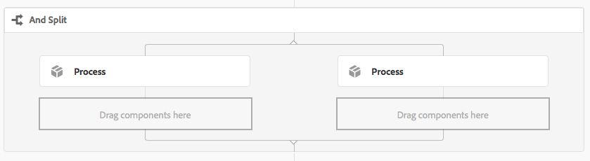
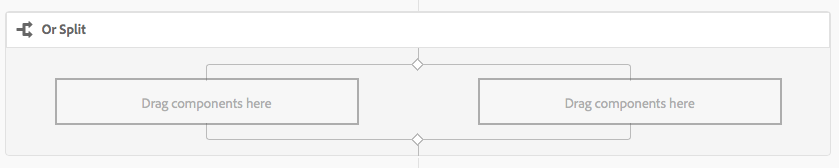

# Referentie workflowstap{#workflow-step-reference}

>[!CAUTION]
>
>AEM 6.4 heeft het einde van de uitgebreide ondersteuning bereikt en deze documentatie wordt niet meer bijgewerkt. Raadpleeg voor meer informatie onze [technische ondersteuningsperioden](https://helpx.adobe.com/support/programs/eol-matrix.html). Ondersteunde versies zoeken [hier](https://experienceleague.adobe.com/docs/).

De modellen van het werkschema bestaan uit een reeks stappen van diverse types. Volgens het type, kunnen deze stappen met parameters en manuscripten worden gevormd en worden uitgebreid om de functionaliteit te verstrekken en de controle u vereist.

>[!NOTE]
>
>In deze sectie worden de standaardworkflowstappen beschreven.
>
>Zie ook voor modulespecifieke stappen:
>
>* [AEM Forms Workflow Step Reference](/help/forms/using/aem-forms-workflow-step-reference.md)
>* [Middelen verwerken met behulp van mediafuncties en workflows](/help/assets/media-handlers.md)
>


## Step Properties {#step-properties}

Elke stapcomponent heeft een **[!UICONTROL Step Properties]** een dialoogvenster waarin u de vereiste eigenschappen kunt definiëren en bewerken.

### Step Properties - Common tab {#step-properties-common-tab}

Voor de meeste workflowstapcomponenten is een combinatie van de volgende eigenschappen beschikbaar: **[!UICONTROL Common]** tabblad van het dialoogvenster Eigenschappen:

* **[!UICONTROL Title]**

   De titel voor de stap.

* **[!UICONTROL Description]**

   Een beschrijving van de stap.

* **[!UICONTROL Workflow Stage]**

   Een vervolgkeuzelijst voor het toepassen van een [Werkgebied](/help/sites-developing/workflows.md#workflow-stages) naar de stap.

* **[!UICONTROL Timeout]**

   De periode waarna de stap wordt &quot;uitgezet&quot;.

   U kunt kiezen tussen: **[!UICONTROL Off]**, **[!UICONTROL Immediate]**, **[!UICONTROL 1h]**, **[!UICONTROL 6h]**, **[!UICONTROL 12h]**, **[!UICONTROL 24h]**.

* **[!UICONTROL Timeout Handler]**

   De manager die het werkschema zal controleren wanneer de staptijden uit; bijvoorbeeld:

   `Auto Advancer`

* **[!UICONTROL Handler Advance]**

   Selecteer deze optie als u de workflow na de uitvoering automatisch wilt laten doorlopen naar de volgende stap. Als deze optie niet is geselecteerd, moet het implementatiescript de voortgang van de workflow afhandelen.

#### Step Properties - User/Group tab {#step-properties-user-group-tab}

De volgende eigenschappen zijn beschikbaar voor veel workflowstapcomponenten op de **[!UICONTROL User/Group]** tabblad van het dialoogvenster Eigenschappen:

* **[!UICONTROL Notify user via email]**

   * U kunt deelnemers op de hoogte stellen door hen een e-mail te sturen wanneer de werkstroom de stap bereikt.
   * Indien ingeschakeld, wordt een e-mail verzonden naar de gebruiker die door de eigenschap wordt gedefinieerd **[!UICONTROL User/Group]** of aan elk lid van de groep indien een groep is gedefinieerd.

* **[!UICONTROL User/Group]**

   * In een keuzelijst kunt u navigeren en een gebruiker of groep selecteren.
   * Als u de stap toewijst aan een specifieke gebruiker, kan alleen deze gebruiker actie ondernemen voor de stap.
   * Als u de stap toewijst aan een hele groep, hebben alle gebruikers in deze groep de actie in hun **[!UICONTROL Workflow Inbox]**.
   * Zie [Deelnemen aan workflows](/help/sites-authoring/workflows-participating.md) voor meer informatie .

## EN splitsen {#and-split}

De **[!UICONTROL AND Split]** maakt een splitsing in de workflow, waarna beide vertakkingen actief zijn. U voegt workflowstappen naar wens toe aan elke vertakking. Met deze stap kunt u meerdere verwerkingspaden in de workflow opnemen. U kunt bijvoorbeeld toestaan dat bepaalde stappen van de revisie parallel worden uitgevoerd, zodat u tijd bespaart.


### EN splitsen - Configuratie {#and-split-configuration}

* Bewerk de **[!UICONTROL AND Split]** eigenschappen:

   * **[!UICONTROL Split Name]**: een naam voor verklarende doeleinden toewijzen.
   * Selecteer het aantal vereiste vertakkingen; 2, 3, 4 of 5.

* Voeg zo nodig workflowstappen toe aan de vertakkingen.

   

## Containerstap {#container-step}

A **[!UICONTROL Container]** stap start een ander workflowmodel dat wordt uitgevoerd als een onderliggende workflow.

Dit **[!UICONTROL Container]** Hiermee kunt u workflowmodellen opnieuw gebruiken om algemene stappen te implementeren. Een workflowmodel voor vertaling kan bijvoorbeeld worden gebruikt in meerdere bewerkingsworkflows.


### Containerstap - Configuratie {#container-step-configuration}

Om de stap te vormen, geef en gebruik de volgende lusjes uit:

* [**[!UICONTROL Common]**](#step-properties-common-tab)
* **[!UICONTROL Container]**

   * **[!UICONTROL Sub Workflow]**: Selecteer de workflow die u wilt starten.

## Ga naar stap {#goto-step}

De **[!UICONTROL Goto Step]** Hiermee kunt u de volgende stap in het workflowmodel opgeven die moet worden uitgevoerd, afhankelijk van het resultaat van een ECMAScript:

* `true`: De **[!UICONTROL Goto Step]** wordt voltooid en de workflow-engine voert de opgegeven stap uit.

* `false`: De **[!UICONTROL Goto Step]** voltooit en de normale verpletterende logica bepaalt de volgende stap uit te voeren.

De **[!UICONTROL Goto Step]** laat u toe om geavanceerde verpletterende structuren in uw werkschemamodellen uit te voeren. Als u bijvoorbeeld een lus wilt implementeren, **[!UICONTROL Goto Step]** kan worden bepaald om een vroegere stap in het werkschema uit te voeren, met het manuscript evaluerend een lusvoorwaarde.

### Ga naar stap - Configuratie {#goto-step-configuration}

Om de stap te vormen, geef en gebruik de volgende lusjes uit:

* [**[!UICONTROL Common]**](#step-properties-common-tab)
* **[!UICONTROL Process]**

   * **[!UICONTROL The step to go to]**: Selecteer de uit te voeren stap.
   * **[!UICONTROL Script Path]**: Het pad naar het ECMAScript dat bepaalt of het **[!UICONTROL Goto Step]**.
   * **[!UICONTROL Script]**: Het ECMAScript dat bepaalt of om uit te voeren **[!UICONTROL Goto Step]**.

>[!CAUTION]
>
>Geef een van de **[!UICONTROL Script Path]** of **[!UICONTROL Script]**. Beide opties kunnen niet tegelijkertijd worden gebruikt. Als u waarden voor beide eigenschappen opgeeft, wordt in de stap de optie **[!UICONTROL Script Path]**.

#### Een lus voor lus simuleren {#simulating-a-for-loop}

Wanneer u een lus for simuleert, moet u een telling bijhouden van het aantal herhalingen van lus dat is opgetreden:

* De telling vertegenwoordigt typisch een index van punten die op in het werkschema worden gehandeld.
* De telling wordt geëvalueerd als uitgangscriteria van de lijn.

Als u bijvoorbeeld een workflow wilt implementeren die een handeling uitvoert op verschillende JCR-knooppunten, kunt u een lusteller gebruiken als index voor de knooppunten. Als u het aantal wilt behouden, slaat u een `integer` waarde in de gegevenskaart van de werkschemainstantie. Het script van het **[!UICONTROL Goto Step]** de telling verhogen en de telling vergelijken met de uitstapcriteria.

```
function check(){
   var count=0;
   var keyname="loopcount"
   try{
      if (workflowData.getMetaDataMap().containsKey(keyname)){ 
        log.info("goto script: found loopcount key");
        count= parseInt(workflowData.getMetaDataMap().get(keyname))+1;
      } 
 
     workflowData.getMetaDataMap().put(keyname,count);
 
     }catch(err) {
         log.info(err.message);
         return false;
    }
   if (parseInt(count) <7){
       return true;
   } else {
      return false;
   }
}
```

## OF Splitsen {#or-split}

De **[!UICONTROL OR Split]** maakt een splitsing in de workflow, waarna slechts één vertakking actief is. Met deze stap kunt u voorwaardelijke verwerkingspaden in uw workflow introduceren. U voegt workflowstappen naar wens toe aan elke vertakking.

>[!NOTE]
>
>Zie voor meer informatie over het maken van een OF-splitsing: [https://helpx.adobe.com/experience-manager/using/aem64_workflow_servlet.html](https://helpx.adobe.com/experience-manager/using/aem64_workflow_servlet.html)



### OF Splitsen - Configuratie {#or-split-configuration}

* Bewerk de **[!UICONTROL OR Split]** eigenschappen:

   * **[!UICONTROL Common]**

      * Selecteer het aantal vereiste vertakkingen; 2, 3, 4 of 5.
   * **[!UICONTROL Branch : *x *>]**

      * **[!UICONTROL Script Path]**: Het pad naar een bestand dat het script bevat.
      * **[!UICONTROL Script]**: Voeg het script toe in het vak.
      * **[!UICONTROL Default Route]**: De standaardvertakking wordt gevolgd wanneer meerdere vertakkingen true opleveren. U kunt slechts één vertakking als standaard opgeven.

   >[!NOTE]
   >
   >Er is een apart tabblad voor elke vertakking:
   >
   >* Het script van elke vertakking wordt één voor één geëvalueerd.
   >* De vertakkingen worden van links naar rechts geëvalueerd.
   >* Het eerste script dat true oplevert, wordt uitgevoerd.
   >* Als geen tak aan waar evalueert, dan gaat het werkschema niet vooruit.


   >[!CAUTION]
   >
   >Geef een van de **[!UICONTROL Script Path]** of **[!UICONTROL Script]**. Beide opties kunnen niet tegelijkertijd worden gebruikt. Als u waarden voor beide eigenschappen opgeeft, wordt in de stap de optie **[!UICONTROL Script Path]**.

   >[!NOTE]
   >
   >Zie [Een regel definiëren voor een OR-splitsing](/help/sites-developing/workflows-models.md#example-defining-a-rule-for-an-or-split).

* Voeg zo nodig workflowstappen toe aan de vertakkingen.

## Stappen en keuzen van deelnemers {#participant-steps-and-choosers}

### Stap deelnemer {#participant-step}

A **[!UICONTROL Participant Step]** kunt u de eigendom van een bepaalde handeling toewijzen. De workflow wordt alleen uitgevoerd wanneer de gebruiker de stap handmatig heeft bevestigd. Dit wordt gebruikt wanneer u iemand een actie op het werkschema wilt nemen; bijvoorbeeld een revisiestap.

Hoewel dit niet rechtstreeks verband houdt, moet bij de toewijzing van een actie rekening worden gehouden met de autorisatie van de gebruiker; de gebruiker moet toegang hebben tot de pagina die de nuttige werkstroom is.

#### Stap van de deelnemer - Configuratie {#participant-step-configuration}

Om de stap te vormen, geef en gebruik de volgende lusjes uit:

* [**[!UICONTROL Common]**](#step-properties-common-tab)
* [**[!UICONTROL User/Group]**](#step-properties-user-group-tab)

>[!NOTE]
>
>De aanvrager van de workflow wordt altijd op de hoogte gesteld wanneer:
>
>* De workflow is voltooid (voltooid).
>* De workflow is afgebroken (beëindigd).
>


>[!NOTE]
>
>Sommige eigenschappen moeten worden geconfigureerd om e-mailmeldingen in te schakelen. U kunt de e-mailsjabloon ook aanpassen of een e-mailsjabloon voor een nieuwe taal toevoegen. Zie [E-mailmelding configureren](/help/sites-administering/notification.md) om e-mailberichten in AEM te configureren.

### Stap deelnemer van dialoogvenster {#dialog-participant-step}

Een **[!UICONTROL Dialog Participant Step]** om informatie te verzamelen van de gebruiker aan wie het werkitem is toegewezen. Deze stap is nuttig om kleine hoeveelheden gegevens te verzamelen die later in het werkschema worden gebruikt.

Als u de stap hebt voltooid, **[!UICONTROL Complete Work Item]** bevat de velden die u in het dialoogvenster definieert. De gegevens die in de velden worden verzameld, worden opgeslagen in knooppunten van de werkstroomlading. De volgende workflowstappen kunnen vervolgens de waarde van de repository lezen.

Om de stap te vormen, specificeert u de groep of de gebruiker om het het werkpunt aan toe te wijzen, en de weg aan de dialoog.

#### Stap van de Deelnemer van de dialoog - Configuratie {#dialog-participant-step-configuration}

Om de stap te vormen, geef en gebruik de volgende lusjes uit:

* [**[!UICONTROL Common]**](#step-properties-common-tab)
* [**[!UICONTROL User/Group]**](#step-properties-user-group-tab)
* **[!UICONTROL Dialog]**

   * **[!UICONTROL Dialog Path**]: Het pad naar het dialoogvenster van het dialoogvenster [dialoogvenster dat u maakt](#dialog-participant-step-creating-a-dialog).

#### Stap deelnemer van dialoogvenster - Een dialoogvenster maken{#dialog-participant-step-creating-a-dialog}

Een dialoogvenster maken:

* Bepalen waar de resulterende gegevens worden [opgeslagen in de lading](#dialog-participant-step-storing-data-in-the-payload).
* [De dialoog definiëren; dit omvat het definiëren van de velden die worden gebruikt om de gegevens te verzamelen (en op te slaan)](#dialog-participant-step-dialog-definition).

#### Stap van de Deelnemer van de dialoog - het Opslaan van Gegevens in de Lading {#dialog-participant-step-storing-data-in-the-payload}

U kunt widgetgegevens opslaan in de werkstroomlading of in de meta-gegevens van het werkpunt. Het formaat van de `name` De eigenschap van het widgetknooppunt bepaalt waar de gegevens worden opgeslagen.

* **[!UICONTROL Store Data with the Payload]**

   * Als u widgetgegevens wilt opslaan als een eigenschap van de payload van de workflow, gebruikt u de volgende indeling voor de waarde van de eigenschap name van het widgetknooppunt:

      `./jcr:content/nodename`

   * De gegevens worden opgeslagen in de `nodename` eigenschap van het payload-knooppunt. Als het knooppunt die eigenschap niet bevat, wordt de eigenschap gemaakt.
   * Wanneer opgeslagen met de lading, het verdere gebruik van de dialoog met de zelfde lading overschrijft de waarde van het bezit.

* **[!UICONTROL Store Data with the Work Item]**

   * Als u widgetgegevens wilt opslaan als een eigenschap van de metagegevens van het werkitem, gebruikt u de volgende indeling voor de waarde van de eigenschap name:

      `nodename`

   * De gegevens worden opgeslagen in de `nodename` eigenschap van het werkitem `metadata`. De gegevens blijven behouden als het dialoogvenster vervolgens wordt gebruikt met dezelfde payload.

#### Stap deelnemer van dialoogvenster - Dialoogdefinitie {#dialog-participant-step-dialog-definition}

1. **[!UICONTROL Dialog Structure]**

   De dialoogvensters voor de Stappen van de Deelnemer van de Dialoog zijn gelijkaardig aan dialogen die u voor auteurscomponenten creeert. Zij worden opgeslagen onder:

   `/apps/myapp/workflow/dialogs`

   Dialoogvensters voor de standaardinterface met aanraakbediening hebben de volgende knooppuntstructuur:

   ```xml
   newComponent (cq:Component)
     |- cq:dialog (nt:unstructured)
       |- content 
         |- layout 
           |- items 
             |- column 
               |- items 
                 |- component0
                 |- component1
                 |- ...
   ```

   >[!NOTE]
   >
   >Zie voor meer informatie [Een dialoogvenster maken en configureren](/help/sites-developing/developing-components.md#creating-and-configuring-a-dialog).

1. **[!UICONTROL Dialog Path Property]**

   De **[!UICONTROL Dialog Participant Step]** de **[!UICONTROL Dialog Path]** eigenschap (samen met de eigenschappen van een [Stap deelnemer](#participant-step)). De waarde van de **[!UICONTROL Dialog Path]** eigenschap is het pad naar de `dialog` van uw dialoogvenster.

   Het dialoogvenster bevindt zich bijvoorbeeld in een component met de naam `EmailWatch` dat in de knoop wordt opgeslagen:

   `/apps/myapp/workflows/dialogs`

   Voor de interface met aanraakbediening wordt de volgende waarde gebruikt voor de **[!UICONTROL Dialog Path]** eigenschap:

   `/apps/myapp/workflow/dialogs/EmailWatch/cq:dialog`

   

1. **Voorbeeld Dialoogdefinitie**

   Het volgende XML-codefragment vertegenwoordigt een dialoogvenster waarin een `String` in de `watchEmail` knooppunt van de ladingsinhoud. Het titelknooppunt vertegenwoordigt de [TextField](https://helpx.adobe.com/experience-manager/6-4/sites/developing/using/reference-materials/granite-ui/api/jcr_root/libs/granite/ui/components/coral/foundation/form/textfield/index.html) component:

   ```xml
   jcr:primaryType="nt:unstructured" 
       jcr:title="Watcher Email Address Dialog" 
       sling:resourceType="cq/gui/components/authoring/dialog">
       <content jcr:primaryType="nt:unstructured"
           sling:resourceType="granite/ui/components/foundation/container">
           <layout jcr:primaryType="nt:unstructured" 
               margin="false" 
               sling:resourceType="granite/ui/components/foundation/layouts/fixedcolumns"
           />
           <items jcr:primaryType="nt:unstructured">
               <column jcr:primaryType="nt:unstructured"
                   sling:resourceType="granite/ui/components/foundation/container">
                   <items jcr:primaryType="nt:unstructured">
                       <title jcr:primaryType="nt:unstructured" 
                           fieldLabel="Notification Email Address" 
                           name="./jcr:content/watchEmails"
                           sling:resourceType="granite/ui/components/foundation/form/textfield"
                       />
                   </items>
               </column>
           </items>
       </content>
   </cq:dialog>
   ```

   In het geval van de interface met aanraakbediening resulteert dit voorbeeld in een dialoogvenster zoals:

   

### Stap dynamische deelnemer {#dynamic-participant-step}

De **[!UICONTROL Dynamic Participant Step]** component is vergelijkbaar met **[!UICONTROL Participant Step]** met het verschil dat de deelnemer automatisch bij runtime wordt geselecteerd.

Om de stap te vormen, selecteert u **[!UICONTROL Participant Chooser]** die de deelnemer aangeeft waaraan het werkitem moet worden toegewezen, samen met een dialoogvenster.

#### Dynamische deelnemersstap - Configuratie {#dynamic-participant-step-configuration}

Om de stap te vormen, geef en gebruik de volgende lusjes uit:

* [**[!UICONTROL Common]**](#step-properties-common-tab)
* **[!UICONTROL Participant Chooser]**

   * **[!UICONTROL Participant Chooser]**: De naam van de [deelnemerenkiezer die u maakt](#dynamic-participant-step-developing-the-participant-chooser).
   * **[!UICONTROL Arguments]**: Alle vereiste argumenten.
   * **[!UICONTROL Email]**: Of een e-mailbericht naar de gebruiker moet worden verzonden.

* **[!UICONTROL Dialog]**

   * **[!UICONTROL Dialog Path]**: Het pad naar het dialoogvenster van het dialoogvenster [dialoogvenster dat u maakt (net als met het dialoogvenster **Stap deelnemer van dialoogvenster**)](#dialog-participant-step-creating-a-dialog).

#### De dynamische Stap van de Deelnemer - ontwikkelt de deelnemerverkiezer {#dynamic-participant-step-developing-the-participant-chooser}

U maakt de deelnemerkiezer. Daarom kunt u om het even welke selectielogica of criteria gebruiken. Uw deelnemerkiezer kan bijvoorbeeld de gebruiker (binnen een groep) selecteren die de minste werkitems heeft. U kunt een willekeurig aantal keuzemogelijkheden voor deelnemers maken voor gebruik met verschillende exemplaren van de **Stap dynamische deelnemer** in uw workflowmodellen.

Creeer de dienst OSGi of een ECMAScript die een gebruiker selecteert om het het werkpunt aan toe te wijzen.

* **[!UICONTROL ECMAscript]**

   Scripts moeten een functie met de naam getParticipant bevatten die een gebruikers-id als een `String` waarde. Sla uw aangepaste scripts op in bijvoorbeeld de `/apps/myapp/workflow/scripts` of een submap.

   Een voorbeeldscript is opgenomen in een standaard AEM-instantie:

   `/libs/workflow/scripts/initiator-participant-chooser.ecma`

   >[!CAUTION]
   >
   >U *moet* niets wijzigen in de `/libs` pad.
   >
   >
   >Dit komt omdat de inhoud van `/libs` wordt de volgende keer overschreven dat u een upgrade uitvoert van uw exemplaar (en kan worden overschreven wanneer u een hotfix- of functiepakket toepast).

   Met dit script wordt de aanvrager van de workflow geselecteerd als de deelnemer:

   ```
   function getParticipant() {
       return workItem.getWorkflow().getInitiator();
   }
   ```

   >[!NOTE]
   >
   >De **[!UICONTROL Workflow Initiator Participant Chooser]** component breidt de **[!UICONTROL Dynamic Participant Step]** en gebruikt dit script als de stapimplementatie.

* **[!UICONTROL OSGi service]**

   De diensten moeten uitvoeren [com.day.cq.workflow.exec.ParticipantStepChooser](https://helpx.adobe.com/experience-manager/6-4/sites/developing/using/reference-materials/javadoc/com/day/cq/workflow/exec/ParticipantStepChooser.html) interface. De interface definieert de volgende leden:

   * `SERVICE_PROPERTY_LABEL` veld: Gebruik dit veld om de naam van de deelnemerkiezer op te geven. De naam wordt weergegeven in een lijst met beschikbare deelnemerskiezers in het dialoogvenster **[!UICONTROL Dynamic Participant Step]** eigenschappen.
   * `getParticipant` methode: Hiermee wordt de dynamisch opgeloste Principal-id geretourneerd als een `String` waarde.

   >[!CAUTION]
   >
   >De `getParticipant` De methode keert dynamisch gevormde Belangrijkste identiteitskaart terug. Dit kan een groep-id of een gebruikers-id zijn.
   >
   >
   >Een groep-id kan echter alleen worden gebruikt voor een **[!UICONTROL Participant Step]**, wanneer een lijst met deelnemers wordt geretourneerd. Voor een **[!UICONTROL Dynamic Participant Step]** er wordt een lege lijst geretourneerd en deze kan niet worden gebruikt voor delegatie.

   Om uw implementatie beschikbaar te maken aan **[!UICONTROL Dynamic Participant Step]** componenten, voeg uw klasse van Java aan een bundel OSGi toe die de dienst uitvoert, en stel de bundel aan de AEM server op.

   >[!NOTE]
   >
   >**[!UICONTROL Random Participant Chooser]** is een voorbeeldservice waarmee een willekeurige gebruiker wordt geselecteerd ( `com.day.cq.workflow.impl.process.RandomParticipantChooser`). De **[!UICONTROL Random Participant Chooser]** voorbeeldformulier voor de step-component breidt het **[!UICONTROL Dynamic Participant Step]** en gebruikt deze service als de stapimplementatie.

#### Stap voor dynamische deelnemer - Voorbeeld van Kiezerservice voor deelnemers {#dynamic-participant-step-example-participant-chooser-service}

De volgende Java-klasse implementeert de `ParticipantStepChooser` interface. De klasse retourneert de naam van de deelnemer die de workflow heeft gestart. De code gebruikt de zelfde logica die het steekproefmanuscript ( `initator-participant-chooser.ecma`) gebruikt.

De `@Property` annotatie stelt de waarde van de `SERVICE_PROPERTY_LABEL` veld naar `Workflow Initiator Participant Chooser`.

```java
package com.adobe.example;

import org.apache.felix.scr.annotations.Component;
import org.apache.felix.scr.annotations.Properties;
import org.apache.felix.scr.annotations.Property;
import org.apache.felix.scr.annotations.Service;
import org.osgi.framework.Constants;
import org.slf4j.Logger;
import org.slf4j.LoggerFactory;

import com.adobe.granite.workflow.WorkflowException;
import com.adobe.granite.workflow.WorkflowSession;
import com.adobe.granite.workflow.exec.ParticipantStepChooser;
import com.adobe.granite.workflow.exec.WorkItem;
import com.adobe.granite.workflow.metadata.MetaDataMap;

@Component
@Service
@Properties({
        @Property(name = Constants.SERVICE_DESCRIPTION, value = "An example implementation of a dynamic participant chooser."),
        @Property(name = ParticipantStepChooser.SERVICE_PROPERTY_LABEL, value = "Workflow Initiator Participant Chooser (service)") })
public class InitiatorParticipantChooser implements ParticipantStepChooser {

 private Logger logger = LoggerFactory.getLogger(this.getClass());

 public String getParticipant(WorkItem arg0, WorkflowSession arg1,
   MetaDataMap arg2) throws WorkflowException {

  String initiator = arg0.getWorkflow().getInitiator();
  logger.info("Assigning Dynamic Participant Step work item to {}",initiator);

  return initiator;
 }
}
```

In de **[!UICONTROL Dynamic Participant Step]** eigenschappen, dialoogvenster **[!UICONTROL Participant Chooser]** list include the item `Workflow Initiator Participant Chooser (script)`, die deze dienst vertegenwoordigt.

&quot;Wanneer het werkschemamodel is begonnen, wijst het logboek op identiteitskaart van de gebruiker die het werkschema in werking stelde en wie het het werkpunt wordt toegewezen. In dit voorbeeld wordt `admin` de gebruiker heeft de workflow gestart.

`13.09.2015 15:48:53.037 *INFO* [10.176.129.223 [1347565733037] POST /etc/workflow/instances HTTP/1.1] com.adobe.example.InitiatorParticipantChooser Assigning Dynamic Participant Step work item to admin`

### Stap voor deelnemer aan formulier {#form-participant-step}

De **[!UICONTROL Form Participant Step]** presenteert een formulier wanneer het werkitem wordt geopend. Wanneer de gebruiker het formulier invult en verzendt, worden de veldgegevens opgeslagen in de knooppunten van het taakvenster van de werkstroom.

Als u de stap wilt configureren, geeft u de groep of gebruiker op waaraan het werkitem moet worden toegewezen en het pad naar het formulier.

>[!CAUTION]
>
>In dit gedeelte worden de [Forms sectie of Foundation Components for Page Authoring](/help/sites-authoring/default-components-foundation.md#form).

#### Stap van de deelnemer van de vorm - Configuratie {#form-participant-step-configuration}

Om de stap te vormen, geef en gebruik de volgende lusjes uit:

* [**[!UICONTROL Common]**](#step-properties-common-tab)
* [**[!UICONTROL User/Group]**](#step-properties-user-group-tab)
* **[!UICONTROL Form]**

   * **[!UICONTROL Form Path]**: Het pad naar de [formulier dat u maakt](#form-participant-step-creating-the-form).

#### Stap deelnemer aan formulier - Het formulier maken {#form-participant-step-creating-the-form}

Een formulier maken voor gebruik met een **[!UICONTROL Form Participant Step]** zoals normaal. Formulieren voor een stap Formulierdeelnemer moeten echter de volgende configuraties hebben:

* De **[!UICONTROL Start of Form]** de component moet **[!UICONTROL Action Type]** eigenschap ingesteld op `Edit Workflow Controlled Resource(s)`.

* De **[!UICONTROL Start of Form]** component moet een waarde voor de component hebben `Form Identifier` eigenschap.

* De formuliercomponenten moeten beschikken over de **Elementnaam** eigenschap ingesteld op het pad van het knooppunt waar de veldgegevens zijn opgeslagen. Het pad moet een knooppunt in de ladingsinhoud van de workflow vinden. De waarde gebruikt de volgende indeling:

   `./jcr:content/path_to_node`

* Het formulier moet een **[!UICONTROL Workflow Submit Button(s)]** component. U vormt geen eigenschappen van de component.

De vereisten van uw workflow bepalen waar u veldgegevens moet opslaan. U kunt bijvoorbeeld veldgegevens gebruiken om de eigenschappen van pagina-inhoud te configureren. De volgende waarde van een **[!UICONTROL Element Name]** eigenschap slaat veldgegevens op als de waarde van `redirectTarget` eigendom van de `jcr:content` knooppunt:

`./jcr:content/redirectTarget`

In het volgende voorbeeld worden de veldgegevens gebruikt als de inhoud van een **[!UICONTROL Text]** component op de ladingspagina:

`./jcr:content/par/text_3/text`

&quot;Het eerste voorbeeld kan worden gebruikt voor elke pagina die `cq:Page` wordt weergegeven. Het tweede voorbeeld kan alleen worden gebruikt wanneer de ladingspagina een **Tekst** component met een id van `text_3`.

Het formulier kan overal in de gegevensopslagruimte worden gevonden, maar workflowgebruikers moeten worden gemachtigd om het formulier te lezen.

### Kiezer voor willekeurige deelnemers {#random-participant-chooser}

De **[!UICONTROL Random Participant Chooser]** De stap is een deelnemer verkiesster die het geproduceerde het werkpunt aan een gebruiker toewijst die willekeurig uit een lijst wordt geselecteerd.


#### Kiezer voor willekeurige deelnemers - Configuratie {#random-participant-chooser-configuration}

Om de stap te vormen, geef en gebruik de volgende lusjes uit:

* [**[!UICONTROL Common]**](#step-properties-common-tab)
* **[!UICONTROL Arguments]**

   * **[!UICONTROL Participants]**: Hier geeft u de lijst op met gebruikers die kunnen worden geselecteerd. Als u een gebruiker aan de lijst wilt toevoegen, klikt u op **[!UICONTROL Add Item]** en typ het homepad van het gebruikersknooppunt of de gebruikers-id. De volgorde van de gebruikers heeft geen invloed op de waarschijnlijkheid dat een werkitem wordt toegewezen.

### Deelnemerkiezer voor workflow-initiator {#workflow-initiator-participant-chooser}

De **[!UICONTROL Workflow Initiator Participant Chooser]** De stap is een deelnemer verkiest die het geproduceerde het werkpunt aan de gebruiker toewijst die de werkschema begon. Er zijn geen andere eigenschappen om te configureren dan de **[!UICONTROL Common]** eigenschappen.

#### Deelnemerkiezer voor workflow-initiator - Configuratie {#workflow-initiator-participant-chooser-configuration}

Om de stap te vormen, geef het gebruiken van de volgende lusjes uit:

* [**[!UICONTROL Common]**](#step-properties-common-tab)

## Processtap {#process-step}

A **[!UICONTROL Process Step]** stelt een ECMAScript in werking of roept de dienst OSGi om automatische verwerking uit te voeren.


### Processtap - Configuratie {#process-step-configuration}

Om de stap te vormen, geef en gebruik de volgende lusjes uit:

* [**[!UICONTROL Common]**](#step-properties-common-tab)
* **[!UICONTROL Process]**

   * **[!UICONTROL Process]**: De uit te voeren procesimplementatie. Gebruik het drop-down menu om de dienst te selecteren ECMAScript of OSGi. Voor informatie over:

      * De standaard ECMAScripts en OSGi diensten, zie [Ingebouwde processen voor processtappen](/help/sites-developing/workflows-process-ref.md).
      * ECMAScripts maken voor een **[!UICONTROL Process]** stap, zie [Een processtap implementeren met een ECMAScript](/help/sites-developing/workflows-customizing-extending.md#using-ecmascript).
      * OSGi-services maken voor een **[!UICONTROL Process]** stap, zie [Een processtap implementeren met een Java-klasse](/help/sites-developing/workflows-customizing-extending.md#implementing-a-process-step-with-a-java-class).
   * **[!UICONTROL Handler Advance]**: Selecteer deze optie als u de workflow na de uitvoering automatisch wilt laten doorlopen naar de volgende stap. Als deze optie niet is geselecteerd, moet het implementatiescript de voortgang van de workflow afhandelen.
   * **[!UICONTROL Arguments]**: Argumenten die aan het proces moeten worden doorgegeven.
